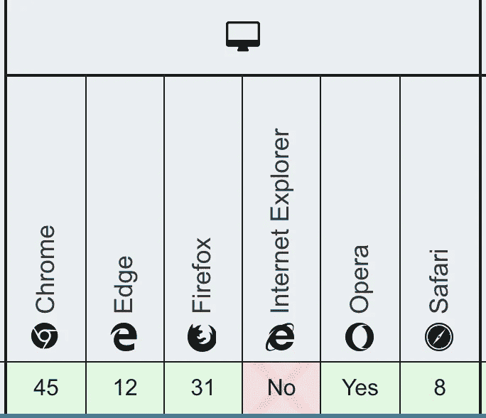
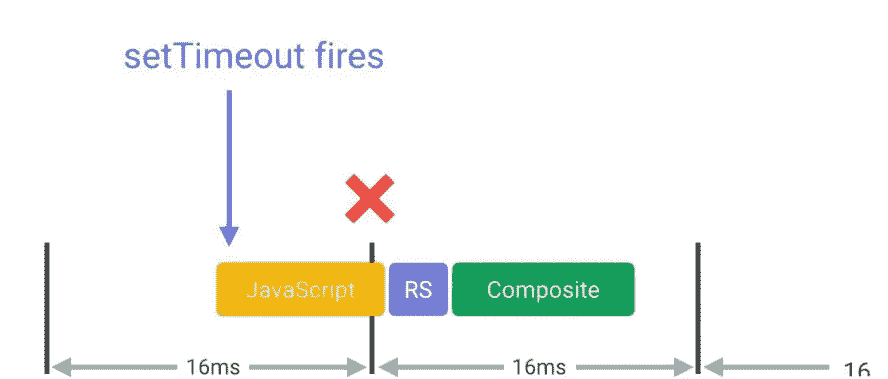

# 更好地理解 JavaScript 中的计时器:SetTimeout 与 RequestAnimationFrame

> 原文：<https://javascript.plainenglish.io/better-understanding-of-timers-in-javascript-settimeout-vs-requestanimationframe-bf7f99b9ff9b?source=collection_archive---------0----------------------->


Photo by [photo-nic.co.uk nic](https://unsplash.com/@chiro?utm_source=medium&utm_medium=referral) on [Unsplash](https://unsplash.com?utm_source=medium&utm_medium=referral)

T 如今，JavaScript 计时器功能被许多项目广泛使用。当您想要将一些函数延迟到其他函数执行之后，它们尤其有用。

在本文中，我将讨论 JavaScript 中的每个计时器函数，以及如何或何时使用它们。最后，当您使用它们时，我会提醒您。

# 目录

*   定时器简介
    -设置定时器超时
    -设置间隔
    -请求动画帧
*   深入探讨
    -set time out vs set interval vs request animationframe
*   事情要小心

# 定时器简介

JavaScript 中有四个计时器函数。

> setTimeout —在指定的毫秒数后调用函数或计算表达式的函数。
> 
> set interval——以指定的时间间隔调用函数或计算表达式的函数。setInterval 将继续调用该函数，直到调用 clearInterval。
> 
> requestAnimationFrame——一个类似 setTimeout 的函数，但是被 Mozilla 改进了。

## 设置超时

假设您有一个客户想每秒打印 1 分钟。他给了你一个包含[1…60]的数组。现在，您必须每秒打印一次。

在这种情况下，我们不能像往常一样在数组上循环，因为它会一次打印出所有的数字。 *setTimeout* 将一个函数作为它的第一个参数，并在 *x* 毫秒内执行它，您已经将此时间传递给了 *setTimeout* 作为第二个参数。

想象一下*循环*功能会打印出什么。

*填充*是初始化某个值的数组的好方法。在该示例中，数组将被填充零，因为默认情况下`new Array(60)`返回*未定义*。



Browser compatibility of Array.prototype.fill. Check out [here](https://developer.mozilla.org/en-US/docs/Web/JavaScript/Reference/Global_Objects/Array/fill#Browser_compatibility)

> 注意:并非所有浏览器都完全支持填充。工业工程不支持它。如果你也应该考虑在各种浏览器中使用填充方法，你应该为 IE 的填充方法想出一个不同的算法。

这是 *setTimeout* 可以使用的地方。

价值[1…60]会按照我们的预期每秒打印一次，我们的客户也会很高兴！:D

## 设置间隔

上次他让我们打印[1…60]时，他对我们为他所做的一切非常满意。所以他让我们再帮他一次。但这次，他想重复打印每秒[1…60]次的整个任务。我们做什么呢

好吧，我认为我们可以在这个任务中重用第一个产品。所以，问题是，我们知道如何每秒打印[1…60]，但我们怎么能重复呢？

```
function task1(array) {
  printPerSecond(array);
}setTimeout(() => task1([1...60]), 0);
setTimeout(() => task1([1...60]), 1000);
setTimeout(() => task1([1...60]), 2000);
setTimeout(() => task1([1...60]), 3000);
setTimeout(() => task1([1...60]), 4000);
...
```

嗯，这种方式看起来不太优雅。因为我们应该按照他让我们重复的次数来重复`setTimeout(() => {}, ...)`部分。

在这种情况下，您可以使用 *setInterval，*非常适合这种情况。

> 注意:setInterval 的使用方法和 setTimeout 完全一样。这意味着即使你调用 setInterval，它也不会马上开始。

## requestAnimationFrame

几个月后，他早上打电话给我们。

“我想改变算法。我想快速打印[1…]。对，连续打印数字，永远不要停！”

现在他想要不同的东西。所以它不再打印[1…60],我们应该打印从 1 开始的数字。那么我们如何做到这一点呢？

我们可以用 *setTimeout* 通过执行一个函数来打印给定的数字并再次递归调用它自己。但是这种方式有一个性能问题。我会在这篇文章的后面向你解释原因。

*requestAnimationFrame* 每当浏览器准备开始下一个重画任务时，执行一个回调函数。

> 注意:这种用法不是最佳实践！我们将在这篇文章的后面对此进行更多的讨论。

复制代码并在浏览器控制台或 IDE 上运行。你可以看到数字打印得非常快。


Photo by [Marco Sartori](https://unsplash.com/@marcosartorinet?utm_source=medium&utm_medium=referral) on [Unsplash](https://unsplash.com?utm_source=medium&utm_medium=referral)

# 深潜

现在，我想你已经理解了 *setTimeout* 、 *setInterval* 和 *requestAnimationFrame* 的基本概念。

所有的 JavaScript 计时器在创建时都会返回时间戳*。这个*时间戳*是在一个名为*活动超时列表*的列表中找到回调函数的关键。例如，一旦你用 100 毫秒生成了 *setTimeout* ，JavaScript 将你的回调函数存储在*活动超时列表*中后，返回*时间戳*，并在上面写一个备忘录，“在 100 毫秒内执行”。*

你应该知道 JavaScript 是基于单线程的语言，这意味着一次只能运行一个任务。那你在 *setTimeout* 里的回调函数呢？

检查此代码并在您的浏览器控制台中运行它。尽管有 *setTimeout，*应该在 100 毫秒内执行，但它似乎不会这么快运行。打印出`'print'`好像至少要几秒钟吧？是的。因为 JavaScript 是基于单线程的。所以，由于`cnt`被 *for-loop 增加，*你的 *setTimeout* 必须等到它完成*。*

这意味着您在 *setTimeout* 中设置的 100 毫秒并不意味着回调函数将在 100 毫秒内的准确时间被调用。

使用 *setTimeout(也叫 setInterval)* 的另一个问题是，有时，甚至有时会导致浏览器丢失一帧。这是什么意思？

# 为什么我的网站这么慢？是因为你没有尊重 16ms！

你可能听说过什么是 FPS，*帧每秒*。这就是让用户觉得你的浏览器不慢的价值的重要性。这实际上不仅仅是关于网络。动画、电影或任何其他应该连续向用户展示某些东西的材料，理想的每秒帧数是 60。这样用户就不会觉得慢或者有延迟。

60FPS 意味着每秒 60 帧。有了这个事实，我们就可以得出那个计算。

```
60FPS = 60 frames per second = 16 ms per frame
```

一帧的最佳时间是 16ms，它不会让用户厌烦等待你的页面。而我们上面讲的 *setTimeout* 就不能满足这个条件。



setTimeout can cause the browser to miss a frame

[*点击这里查看更多关于这个*](https://developers.google.com/web/fundamentals/performance/rendering/optimize-javascript-execution) 。

## 结论

如果你用 JS 定时器运行动画，我建议你只使用 *requestAnimationFrames* ，除非有特殊原因要使用 *setTimeout* 。

# 要小心的事情


Photo by [Rodion Kutsaev](https://unsplash.com/@frostroomhead?utm_source=medium&utm_medium=referral) on [Unsplash](https://unsplash.com?utm_source=medium&utm_medium=referral)

当你在 JavaScript 中使用定时器函数时，有一件事你必须知道。是时候停止定时器功能了。

我前面说过，JavaScript 定时器函数在生成时返回*时间戳*，它是找到回调函数的关键。另一个与生成和执行定时器功能同样重要的问题是如何停止定时器功能。

可以看到，以*时间戳*为参数调用 *clearTimeout* 和 *clearInterval* 可以停止 *setTimeout* 和 *setInterval* 。当你使用完定时器功能后，清除它总是好的。

事情是 *requestAnimationFrame* 。下面是关于[*requestAnimationFrame 如何工作*](https://html.spec.whatwg.org/multipage/imagebitmap-and-animations.html#dom-animationframeprovider-requestanimationframe) 的链接。如果你想了解更多信息，你可以点击它。

> …
> 3。将目标的[动画帧回调标识符](https://html.spec.whatwg.org/multipage/imagebitmap-and-animations.html#animation-frame-callback-identifier)加 1，结果为 handle。
> 4。让回调成为目标的[动画帧回调的映射](https://html.spec.whatwg.org/multipage/imagebitmap-and-animations.html#list-of-animation-frame-callbacks)。
> …

当 *setTimeout* 在 *x 毫秒*(技术上来说， *x + y 毫秒*正如我在本文前面解释的那样)被执行时， *requestAnimationFrame* 保持在名为*动画帧请求回调列表*的列表中。

**创建的 *requestAnimationFrame* 越多，列表中的处理程序就越多。并且每次调用回调函数后，都必须将它从列表中删除。**

注意 *cancelAnimationFrame* ，它从列表中去掉了回调函数，每次在生成新的 *requestAnimationFrame* 之前都会被调用。

当我使用*画布*在仪表板上工作时，我没有调用 *cancelAnimationFrame* 。后来怎么样了？由于网络浏览器几天没有关闭，计时器标识符在 2M 上空出现。页面完全停了，让我在那个问题上困了五天多才解决。

谢谢你看我的帖子！希望你理解 JavaScript 定时器函数。