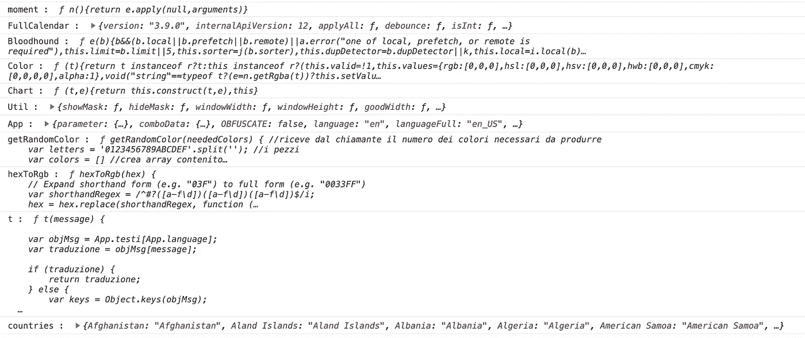

# 注意 JavaScript 中不安全的隐式全局变量

> 原文：<https://javascript.plainenglish.io/beware-of-unsafe-implicit-globals-in-javascript-f370ccca8fdb?source=collection_archive---------3----------------------->

## 未声明变量的潜在危险以及如何消除它们


original image by [Becky Lai](https://www.flickr.com/photos/fattytuna/) [https://www.flickr.com/photos/fattytuna/2157627278](https://www.flickr.com/photos/fattytuna/2157627278)

如果你给一个没有明确声明的变量赋值(用 ***var*** 、 ***让*** 、 ***const*** 或者作为当前函数的一个参数)，JavaScript 会隐式地把它创建为一个全局变量。在 web 应用程序中，“全局”意味着它是 ***窗口*** 对象的属性。

例如，这是这样一个“被遗忘的”声明的典型案例:

```
for (**i**=0; i<list.length; i++) {
    // do something
}
```

当循环开始时，一个 ***窗口. i*** 被自动定义，因为开发者忘记了包含一个 ***让*** (或 ***var*** 关键字，如下所示:

```
for (**let** i=0; i<list.length; i++) {
...
```

这个不需要的全局变量会一直存在，直到网页被卸载。这是一种在复杂的 web 应用程序中很容易发生的错误，更常见的情况是，它们是在没有严格标准的情况下，在任何结构良好的框架之外开发的。

# 附带损害赔偿

为什么这会很危险？

首先，任何未声明的变量都可能无意中覆盖 ***窗口*** 对象的同名属性。例如，以下代码覆盖了标准的 ***alert*** 函数，因为它为一个同名的未声明变量赋值:

```
if (!somecheck()) {
    alert = 'Check failed';
} else {
    alert = '';
}
if (alert) console.log(alert);
```

考虑到 ***窗口*** 对象有 200 多个属性，这并不像看起来那么不可能。在被粗心的程序员意外覆盖的属性或函数中，我们可以找到看似无害的东西，比如*关闭、获取、名称、位置、顶部、停止、图像、事件、*等。

其次，程序员假设变量是*局部的*可能会产生奇怪的行为。例如，以下代码块在外部和内部函数中都包含相同的错误:

由于 ***i*** (未声明的)变量在外部和内部循环中都被用作迭代器，对内部函数的调用会无意中损害外部循环，不会产生预期的结果。事实上，这个变量并不像程序员想象的那样是*局部变量，但它确实是两个函数中的*同一个变量(window.i)。现实生活中的例子比这复杂得多，也更微妙。**

# *如何将它们冲洗掉*

*在将 web 应用程序部署到生产环境之前，最好识别并修复此类未声明的变量。三个简单的步骤就足够了:*

1.  *在执行任何脚本之前保存 ***窗口*** 对象的属性列表*
2.  *在加载所有脚本后，将初始属性与现有属性进行匹配，以识别在初始页面加载期间创建的变量*
3.  *在对应用程序的所有功能进行有意义的导航之后，执行相同的比较，以找出在标准使用期间产生的其他变量。*

*有了不需要的属性列表，最后一步是在代码中搜索变量隐式声明并修复它们。*

*我写了一些非常简单的代码，可以帮助完成这些任务。*

## *初始化*

*在一个典型的设置中，我将这段代码作为初始的 *<脚本>* 包含在应用程序主页中(index.html，index.html 或类似的):*

*它在 ***glob.initial*** 中保存一个包含所有属性名的数组，并定义了 ***showDiff*** 函数，用于显示给定时刻的新变量列表。请注意，只有在进行这种检查和清洁时，才应包含此代码，并在之后删除。*

## *装载后检查*

*其次，我通常会放一个小脚本，在网页加载完成后立即执行第一次检查(如果使用 jQuery，我会把它放在$。就绪功能):*

*典型的输出(到浏览器控制台)如下所示:*

**

*Output showing a list of new properties (Chrome console)*

*在上面的例子中，从一个真实的应用程序来看，一些函数被无意中定义在“根”级别( *getRandomColor* 和 *hexToRgb* )以及 *countries* 数组。我可以很容易地修好它们。*

## *在飞行检查中*

*在大量使用应用程序后，我们可以进行最详尽的分析，揭示用户工作过程中产生的变量。*

*最简单的方法是使用浏览器调试工具对我们的 *showDiff* 函数执行适当的调用。换句话说，用户停止其操作，打开调试器窗口，并在*手表*面板中输入以下表达式:*

```
*glob.showDiff(glob.afterLoad, Object.keys(window));*
```

*这意味着显示 ***窗口*** 对象在加载时保存的属性和现在的属性之间的差异。同样在控制台上，结果将是操作时创建的变量列表。*

# *结论*

*我认为在赋值时自动创建全局变量是 JavaScript 环境中的一个缺陷。以我的经验来看，我曾经历过一段艰难的时间，从奇怪的症状开始调试代码，结果发现原因是一个未声明的变量。我几乎看不出拥有这样一个隐含的全局*作用域有什么好处。**

*希望我小小的贡献能对很多人有所帮助。*

## ***简单英语的 JavaScript***

*喜欢这篇文章吗？如果有，通过 [**订阅我们的 YouTube 频道**](https://www.youtube.com/channel/UCtipWUghju290NWcn8jhyAw) **获取更多类似内容！***