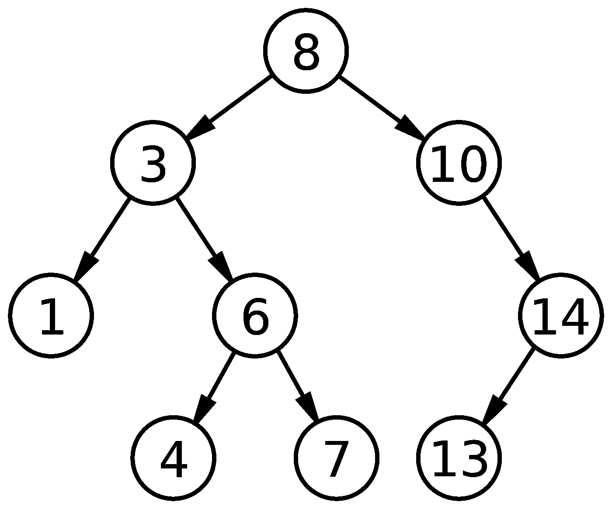

# 二分搜索法树在 JavaScript 中是如何工作的

> 原文：<https://javascript.plainenglish.io/binary-search-tree-in-javascript-ca5aa7ba05de?source=collection_archive---------4----------------------->

让我们看看二叉查找树是如何工作的，以及它们是如何在 Javascript 中实现的。

Image src: [https://en.wikipedia.org/wiki/Binary_search_tree](https://en.wikipedia.org/wiki/Binary_search_tree)

## 树形结构的基础

在二叉树中，首先要知道三件事:

1.  **根**:这是一个树形结构的顶层节点，它没有父节点。在上面的示例图像中，8 是根节点。
2.  **父节点:**它是一个节点的前任节点。在上面的例子中，3，10，6，14 是父节点。
3.  **子节点:**是父节点的继承者。在上面的例子中，1 和 6 是 3 的孩子，依此类推。

## 二叉树

在二叉树结构中，每个节点最多可以有两个子节点。左子树上的孩子称为*左子树，右子树上的孩子称为*右子树*。*

## 二叉查找树

BST 是一个二叉树，但有几个条件:

1.  所有的键(节点中的数据)都是不同的。
2.  在每个父节点中，左侧子键值小于父节点键值。
3.  在每个父节点中，右子键值大于父节点键值。

## 节点的插入

对于插入带有键值的新节点，程序会找到正确的位置，并为数据创建一个新的空节点。如果键值已经存在，插入将被拒绝，插入操作会立即终止而不插入——因为 BST 不允许有重复的键。

## Javascript 中的二叉查找树实现

# 就是这样！🎉

如果你喜欢这篇文章，请在评论中告诉我，或者留下一些掌声或推文。