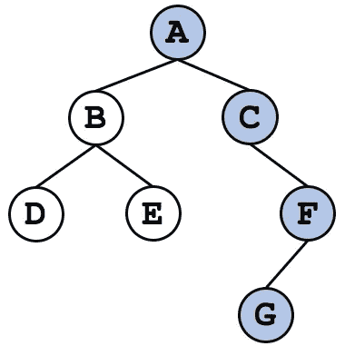
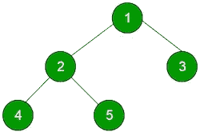
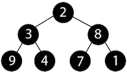
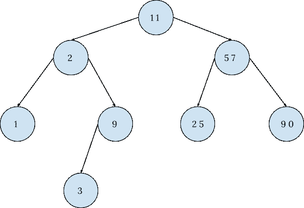

# 二分搜索法树:它们是如何工作的

> 原文：<https://javascript.plainenglish.io/binary-search-trees-how-they-work-9c64029eedb7?source=collection_archive---------3----------------------->

Photo by [veeterzy](https://unsplash.com/@veeterzy?utm_source=unsplash&utm_medium=referral&utm_content=creditCopyText) on [Unsplash](https://unsplash.com/s/photos/tree?utm_source=unsplash&utm_medium=referral&utm_content=creditCopyText)

# 什么是二叉树？

一棵**二叉树**是计算机科学中一种重要的树形数据结构，其中每个节点最多只能有两个子节点。子节点通常被称为左节点和右节点。这种类型的二叉树有时也被称为**根二叉树。**

Rooted Binary Tree

Full Binary Tree

Perfect Binary Tree

如果一棵二叉树的每个节点都有 0 或 2 个孩子，但是没有一个节点只有 1 个孩子，那么它被认为是一棵**完全二叉树**。左边的绿色树是完全二叉树的一个例子。

一棵**完美的二叉树**，比如左边的黑树，除了最后一层的节点之外，每个节点都有两个子节点，并且所有的叶子都延伸到同一层。二叉树通常用于两个不同的目的，但是在本文中我们只看其中一个用例。以特定方式排序的二叉树被称为**二分搜索法树**。

# 什么是二叉查找树？

一个**二叉查找树**是一种特定类型的二叉树，其中节点按照它们在树中的排列进行排序。每个节点仍然最多只能有两个子节点，但是在二叉查找树中，**左边的子节点*总是比根节点的值*小，右边的子节点**总是比根节点的值大。****

Binary Search Tree

遍历二分搜索法树很容易，也很有效，因为每个被访问和探索的节点，至少还有一个我们永远不会处理的节点。

例如，上面的树有 8 个节点。假设我们需要找到值为 90 的节点。让我们也说，我们不知道这是一个二叉查找树，所以不遍历它。使用深度优先搜索，我们必须首先访问 11，然后是 2、1、9、3、57 和 25，最后到达 90。这是 8 个不同的步骤，或者说是 *n.* 的大 O

使用广度优先搜索，我们仍然会先访问 11 个，然后是 2、57、1、9 和 25 个，最后到达 90 个。这个搜索有 7 个不同的步骤，也是一个大 O 的 *n* 。

事实上，它是一个二叉查找树，使我们能够大幅降低运行时间。不用遍历每个节点直到找到 90，我们可以简单地从根节点 11 开始，然后问，90 是大于还是小于 11？它大于，所以我们将移动到右边的子节点，并立即从搜索中删除 11 左边的 4 个节点。右边的孩子是 57，所以我们再问一次，90 是大于还是小于 57？它大于，所以我们向右切去 25。正确的孩子是 90 岁，所以我们的搜索接近尾声。

如您所见，我们只需 3 步就能找到我们的节点，而不是 7 或 8 步。效率提高了 50%以上，这是大规模的重大改进。同样令人惊讶的是，即使在穿越二叉查找树的最坏情况下，运行时间也不会超过树的高度。

下周，我们将深入探讨如何使用 JavaScript 来表示和遍历二叉查找树。