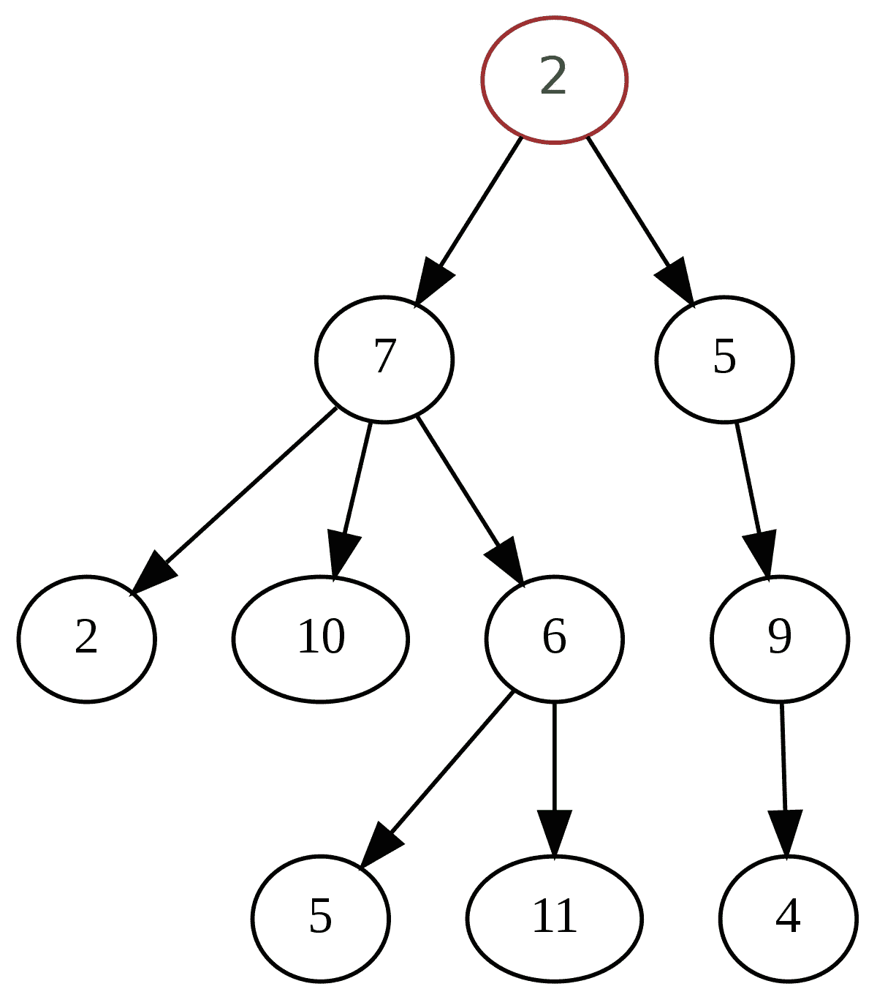
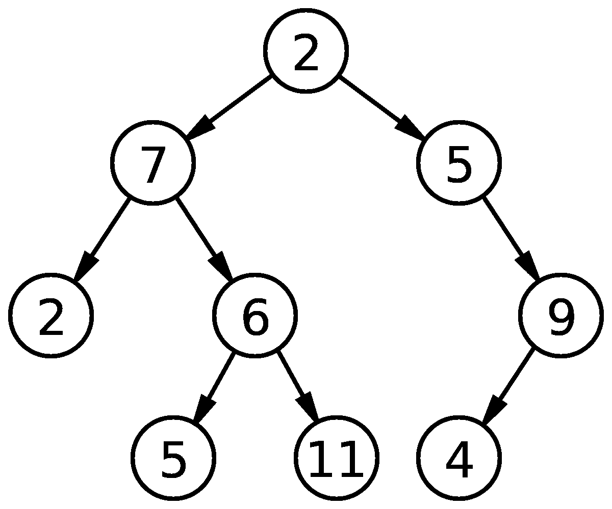
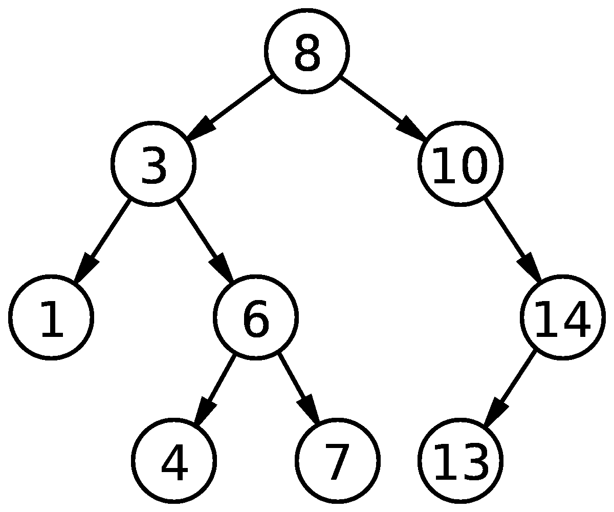

# 带有 JavaScript 的二分搜索法树

> 原文：<https://javascript.plainenglish.io/binary-search-trees-with-javascript-715df954b33?source=collection_archive---------8----------------------->

## 使用 JavaScript 的数据结构系列的第 5 部分


Photo by [Gilly Stewart](https://unsplash.com/@gillystewart?utm_source=medium&utm_medium=referral) on [Unsplash](https://unsplash.com?utm_source=medium&utm_medium=referral)

在本文中，我们将介绍使用 JavaScript 的二分搜索法树。如果您错过了我们构建双链表并将其与单链表进行比较的系列文章的第 4 部分，请查看下面的文章。

[](https://medium.com/javascript-in-plain-english/doubly-linked-lists-with-javascript-9c20a9dc4fb3) [## 带有 JavaScript 的双链表

### 使用 JavaScript 的数据结构系列的第 4 部分

medium.com](https://medium.com/javascript-in-plain-english/doubly-linked-lists-with-javascript-9c20a9dc4fb3) 

# 树、二叉树和二分搜索法树

在我们深入研究二分搜索法树之前，让我们先了解一下树和二叉树。

树是由具有父子关系的节点组成的数据结构。每个树只能有一个根节点(即最上面的节点)。每个节点可以有任意数量的子节点。但是请记住，每个节点只能有一个父节点(没有父节点的根节点除外)。在下图中，值为 2 的节点是我们的根节点。2 岁，然后有两个孩子，7 岁和 5 岁。7，然后有 3 个孩子，2，10，6 等。



[https://en.wikipedia.org/wiki/Tree_(data_structure)](https://en.wikipedia.org/wiki/Tree_(data_structure))

二叉树是一种树，其中每个节点最多可以有两个子节点。在下图中，您可以看到每个节点都有 0 个、1 个或 2 个子节点。



[https://en.wikipedia.org/wiki/Binary_tree](https://en.wikipedia.org/wiki/Binary_tree)

二分搜索法树是一种对数据进行排序的二叉树。这些可用于搜索或插入。二分搜索法树的规则是，对于每个父节点，左侧的每个值必须小于父节点，右侧的每个值必须大于父节点。在下图中，我们可以看到 8(我们的根节点)有两个子节点，3 和 10。在左侧，3 小于 8，在右侧，10 大于 8。然后，我们可以查看每个节点，并沿着树向下执行相同的检查。



[https://en.wikipedia.org/wiki/Binary_search_tree](https://en.wikipedia.org/wiki/Binary_search_tree)

对于二分搜索法树，请记住左边的每个值必须小于父值，右边的每个值必须大于父值。例如，在上面的图像中，如果我们将值为 7 的节点更改为 9，这将不是有效的二叉查找树，因为 9 将大于 8。请记住，左侧的每个节点值都必须小于 8，右侧的每个节点值都必须大于 8。

# 建设二叉查找树

首先，让我们创建节点类和二叉查找树类。我们的节点类构造函数将接受一个值，并将它设置为节点的值。然后，我们将左和右值设置为空。我们的二叉查找树类将有一个根值，我们将设置为 null。

```
class Node {
  constructor(value) {
    this.value = value;
    this.left = null;
    this.right = null;
  }
}class BinarySearchTree {
  constructor() {
    this.root = null;
  }
}
```

## 插入节点

现在让我们来处理如何将节点插入到树中。我们将为我们的二叉查找树类创建一个插入方法，它将接受一个值。首先，我们将使用该值创建一个新节点。有一个边缘情况，即如果树是空的(没有根)，那么我们将把树的根设置为新节点，返回树，我们就完成了。

```
insert(value) {
  const newNode = new Node(value);
  if (!this.root) {
    this.root = newNode;
    return this;
  }
```

否则，我们需要将新节点的值与根节点的值进行比较。让我们首先创建一个当前变量来跟踪我们正在比较的节点。然后，我们将首先处理左侧，在这种情况下，新节点的值小于当前节点的值。

我们将设置一个 while 循环，继续将新节点值与当前节点值进行比较。一旦我们将节点插入到树中的正确位置，我们就可以通过返回树来打破循环。如果当前节点没有左值，我们会将该值设置为新节点并返回树。否则，我们需要将当前节点更新为左侧节点(记住，当前节点是我们要比较的节点)。

```
insert(value) {
  const newNode = new Node(value);
  if (!this.root) {
    this.root = newNode;
    return this;
  } else {
    let current = this.root;
    while(true) {
      if (value < current.value) {
        if (!current.left) {
          current.left = newNode;
          return this;
        } else {
          current = current.left
        }
```

然后我们需要处理右侧，在新节点大于当前节点的情况下。除右侧外，我们将进行与上述相同的检查。如果没有正确的节点，我们将正确的节点设置为新节点，并返回树。否则，我们将更新当前节点为正确的节点。

```
insert(value) {
  const newNode = new Node(value);
  if (!this.root) {
    this.root = newNode;
    return this;
  } else {
    let current = this.root;
    while(true) {
      if (value < current.value) {
        if (!current.left) {
          current.left = newNode;
          return this;
        } else {
          current = current.left;
        }
      } else if (value > current.value) {
        if (!current.right) {
          current.right = newNode;
          return this;
        } else {
          current = current.right;
        }
      }
    }
  }
}
```

在上面的示例中，我们正在检查新节点值是否小于当前值，以及新节点值是否大于当前值。但是，如果新的节点值等于树中已经存在的值呢？有不同的方法来处理这个问题，但是在我们的例子中，我们将简单地返回未定义的。让我们在下面添加这一行代码，作为 while 循环的第一个检查。

```
if (value === current.value) return undefined;
```

最终的代码应该是这样的。

## 查找节点

我们将添加到二叉查找树类中的第二个方法是如何检查树中是否存在值。让我们命名这个方法 find，它将接受一个值作为参数。这个值将是我们在树中寻找的值。类似于插入方法，我们将首先检查我们的树是否是空的(没有根)。如果是这样，那么我们将简单地返回 undefined。

```
find(value) {
  if (!this.root) return undefined;
}
```

否则，我们将使用 while 循环来处理这个问题。首先，我们将创建两个变量，current 和 find。当前变量将帮助我们跟踪我们在树中的位置，找到的变量将告诉我们是否找到值。

只要有电流值，我们的 while 循环就会运行，而且我们还没有找到节点。我们将在两种情况下打破循环:

1.  如果我们找到了节点，我们将设置发现为真。
2.  如果没有当前值，这意味着我们的树不包含该节点。

让我们首先检查我们正在搜索的值是否小于当前值。如果是这样，我们将通过将当前值设置为 current.left，移动到树的左边。然后我们将对右边做同样的事情。如果我们正在搜索的值大于当前值，我们将把当前值设置为当前值。最后，如果值等于当前值，我们找到了我们的节点，我们将把 find 设置为 true。

在 while 循环之后，我们将做最后一次检查。如果 found 仍然等于 false，这意味着该值不在我们的树中，我们将返回 undefined。否则，我们将通过返回 current 返回带有我们正在搜索的值的节点。

```
find(value) {
  if (!this.root) return undefined;
  let current = this.root;
  let found = false;
  while(current && !found) {
    if (value < current.value) {
      current = current.left;
    } else if (value > current.value) {
      current = current.right;
    } else {
      found = true;
    }
  }
  if (!found) return undefined;
  return current;
}
```

我们的最终代码，包括插入和查找方法，如下所示。在代码的最后一行，我们创建了一个新的二叉查找树作为变量 Tree。现在，您可以使用 tree.insert(value)将值插入到树中，并使用 tree.find(value)检查树是否包含值。

# 包扎

树木在很多地方都被广泛使用。例如，您的计算机文件系统、HTML DOM 和 JSON 都是使用树的例子。二叉树是树的一种，二分搜索法树是二叉树的一种。二分搜索法树可以有一个根节点，每个节点最多可以有两个子节点。父节点左边的值必须小于父节点的值，父节点右边的值必须大于父节点的值。

如果树是平衡的，那么二分搜索法树的大 O 对于插入和搜索都是 O(log n)。然而，在最坏的情况下，大 O 可以变成 O(n)。如果树不平衡，就会发生这种情况，因为我们可能必须遍历所有元素。

*感谢阅读！如果您错过了我们比较堆栈和队列的系列文章的第 3 部分，请查看下面的文章。*

[](https://medium.com/javascript-in-plain-english/stacks-vs-queues-with-javascript-eeb33ae4c93c) [## 使用 JavaScript 的堆栈与队列

### JavaScript 数据结构系列的第 3 部分

medium.com](https://medium.com/javascript-in-plain-english/stacks-vs-queues-with-javascript-eeb33ae4c93c) 

*请关注本系列的第 6 部分，在那里我们将了解树遍历。*