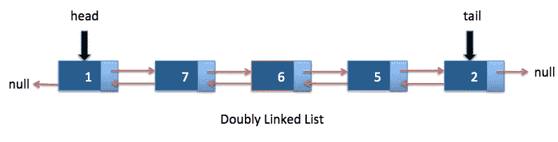

# 在彭博面试——2020 年网络开发者电话筛选问题

> 原文：<https://javascript.plainenglish.io/bloomberg-phone-screen-question-in-2020-45ba376927d5?source=collection_archive---------7----------------------->



Source: java2blog

本周，我决定发布一个来自金融服务公司的初步电话筛选问题。在进入 web 开发之前，我的背景是金融，所以我认为这很合适。

这是另一个链表问题，这些问题似乎在科技公司和金融服务公司中非常流行。

这个特别的问题是一个**中等**水平的问题，其他人在谷歌和亚马逊的面试中也遇到过。

## 问题

给你一个双向链表，除了前一个和后一个指针，它可能有一个子指针，这个子指针可能指向也可能不指向一个单独的双向链表。这些子列表可能有一个或多个自己的子列表，以此类推，以产生多级数据结构，如下例所示。

展平列表，使所有节点出现在一个单级双向链表中。您将获得列表第一级的标题。

*约束:*

*   节点数不会超过 1000。
*   `1 <= Node.val <= 10^5`

以下是伪代码中的一些情况:

```
1\. null - no need to flatten, just return it
2\. no child, no next - no need to flatten, it is the last element, just return it
3\. no child, next - no need to flatten, go next
4\. child, no next - flatten the child and done
5\. child, next - flatten the child, connect it with the next, go next
```

这个问题可以用 O(n)的时间复杂度和 O(n)的空间复杂度来解决。

这个问题可能很难回答，尤其是在电话面试的现场。然而，链表是非常常见的算法问题，你对它们练习得越多，你就会越得心应手。在许多不同的公司中，许多这类问题会重复出现或非常相似(至少在初级/入门级)。

请在评论中留下你的答案，我会在一些回复后发布一个解决方案。

祝你好运！