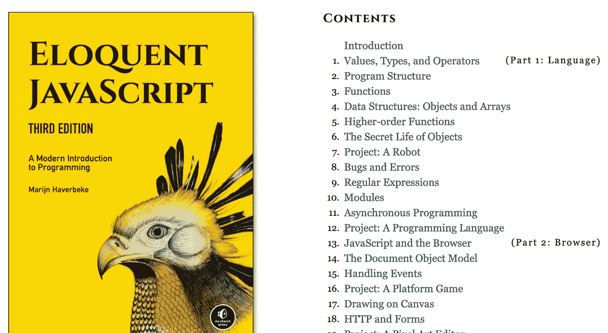
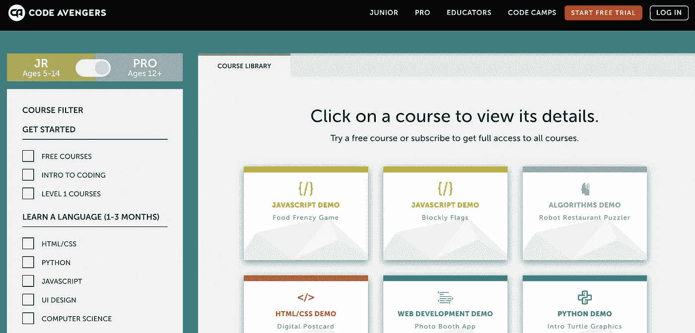
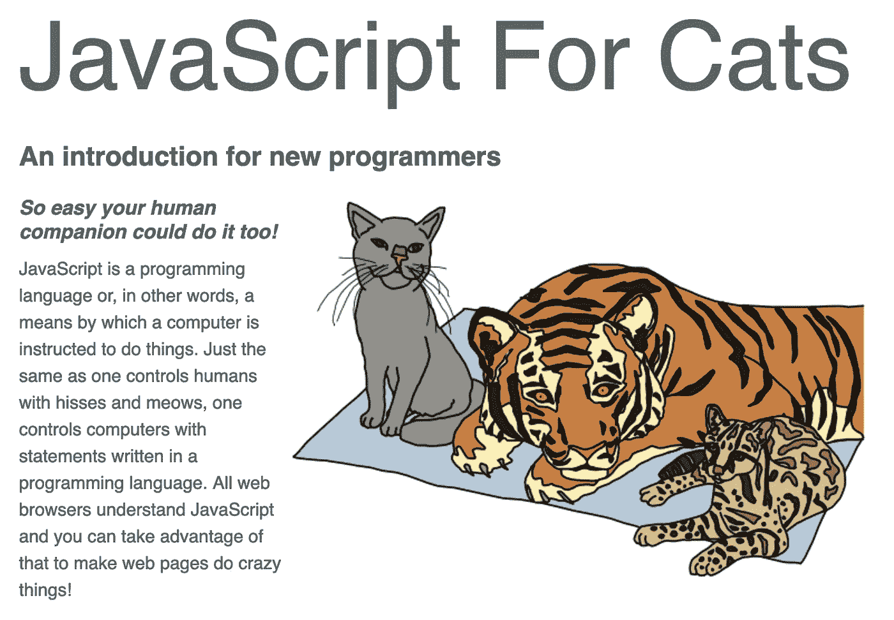
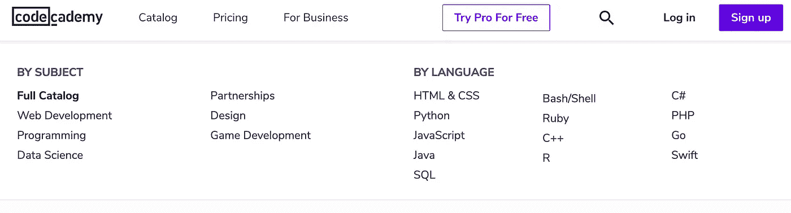

# 通过这 5 个网站提升你的 JavaScript 技能

> 原文：<https://javascript.plainenglish.io/boost-your-javascript-skills-with-these-5-websites-8559a498ca33?source=collection_archive---------3----------------------->

## 您将掌握 JavaScript 的基础知识。

Photo by [Artem Sapegin](https://unsplash.com/@sapegin?utm_source=medium&utm_medium=referral) on [Unsplash](https://unsplash.com?utm_source=medium&utm_medium=referral)

你想提升你的 JavaScript 技能，嗯？

如果你想掌握这门语言，下面是一个学习 JavaScript 的有用列表。

# 1.[雄辩的 JavaScript](https://eloquentjavascript.net/)

如果你需要找一些关于 JavaScript 初学者的读物，那么你不应该错过雄辩的 JavaScript。

它不是一套教你如何编写 Javascript 代码的文档，但是它将帮助你更好地理解计算机科学的学术范围，特别是 JavaScript。

我认为无论你是一个新手还是已经熟悉 JavaScript 的人，雄辩的 JavaScript 都非常有帮助，它将帮助你发现这种语言的新事物。

# 2. [Programmr](http://www.programmr.com)

Programmr 就像 Cloud9 或 JSFiddle 这样的云编辑器，但它专注于学习 JavaScript。每一课他们都会向你展示一个样本代码，如何使用它由你决定。

# 3.[代号复仇者联盟](https://www.codeavengers.com)

Code Avengers 是一个从基础到高级的 JavaScript 和 HTML / CSS 学习网站，通过学习和实践。

目前，如果你免费学习，你只能学习基本的课程，如果你想提高更多像使用 JavaScript 编写游戏或构建应用程序，你需要为每门课程支付 29 美元。

# 4.[猫用 JavaScript】](http://jsforcats.com/)

如果你喜欢猫，并且你是一名程序员，你可能会对这个网站感兴趣。

# 5.[代码学院](https://www.codecademy.com)

学习编程的时候最本质的就是需要大量的练习。

今天大多数编程电子书都没有很多练习供你练习。

但是，您可以使用 Codecademy 来解决这个问题。不仅仅是 JavaScript，你还有很多机会练习其他语言，比如 Python，PHP，Ruby 等等。

不是解释这个函数的意思，每节课他们会给你一堆样本代码，你看到这些代码，运行它，看看它是如何工作的，然后解决伴随的练习。

你不仅对理论的理解更加深入，还锻炼了你的解题技巧。

JavaScript 的世界是巨大的。

掌握基本的 JavaScript 只需要几天时间，但成为专家却是一个漫长的旅程。

# 进一步阅读

 [## Visual Studio 代码的 9 大 JavaScript 扩展加速您的开发

### 谁想更快更容易地编码？

medium.com](https://medium.com/javascript-in-plain-english/9-great-javascript-extensions-for-visual-studio-code-to-speed-up-your-development-8b3275248718)