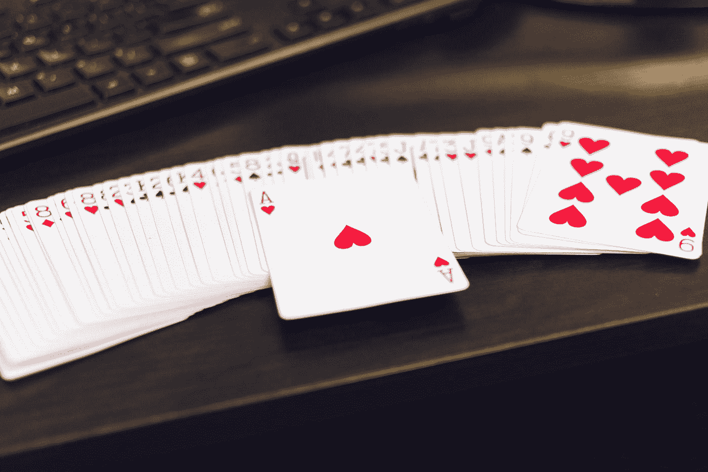

# 引导程序 5 —卡片布局

> 原文：<https://javascript.plainenglish.io/bootstrap-5-card-layouts-86bab92fef27?source=collection_archive---------7----------------------->



Photo by [Erik Lucatero](https://unsplash.com/@erik_lucatero?utm_source=medium&utm_medium=referral) on [Unsplash](https://unsplash.com?utm_source=medium&utm_medium=referral)

**写这篇文章时，Bootstrap 5 处于 alpha 状态，可能会更改。**

Bootstrap 是任何 JavaScript 应用程序的流行 UI 库。

在本文中，我们将了解如何使用 Bootstrap 5 添加卡片布局。

# Mixins 实用程序

我们可以用`.bg-transparent`类去掉页眉和页脚的背景。

例如，我们可以写:

```
<div class="card border-success mb-3" style="max-width: 18rem;">
  <div class="card-header bg-transparent border-success">Header</div>
  <div class="card-body text-success">
    <h5 class="card-title">Success card title</h5>
    <p class="card-text">Lorem ipsum dolor sit amet, consectetur adipiscing elit. Pellentesque magna dui, .</p>
  </div>
  <div class="card-footer bg-transparent border-success">Footer</div>
</div>
```

我们让`.card-header` div 和`.card-footer` div 上的`.bg-transparent`类移除它们的背景颜色。

# 卡片布局

卡片可以按组排列。

为此，我们可以用`.card-group`类将卡片放在 div 中。

例如，我们可以写:

```
<div class="card-group">
  <div class="card">
    
    <div class="card-body">
      <h5 class="card-title">Card title</h5>
      <p class="card-text">
        Lorem ipsum dolor sit amet, consectetur adipiscing elit. Pellentesque magna dui, mattis ornare massa a, dapibus iaculis est. Lorem ipsum dolor sit amet, consectetur adipiscing elit. </p>
      <p class="card-text"><small class="text-muted">Last updated 3 mins ago</small></p>
    </div>
  </div> <div class="card">
    
    <div class="card-body">
      <h5 class="card-title">Card title</h5>
      <p class="card-text">
        Lorem ipsum dolor sit amet, consectetur adipiscing elit. Pellentesque magna dui, mattis ornare massa a, dapibus iaculis est. Lorem ipsum dolor sit amet, consectetur adipiscing elit. </p>
      <p class="card-text"><small class="text-muted">Last updated 3 mins ago</small></p>
    </div>
  </div> <div class="card">
    
    <div class="card-body">
      <h5 class="card-title">Card title</h5>
      <p class="card-text">
        Lorem ipsum dolor sit amet, consectetur adipiscing elit. Pellentesque magna dui, mattis ornare massa a, dapibus iaculis est. Lorem ipsum dolor sit amet, consectetur adipiscing elit. </p>
      <p class="card-text"><small class="text-muted">Last updated 3 mins ago</small></p>
    </div>
  </div>
</div>
```

我们有 3 张卡片放在一个容器 div 里，把它们并排放在一起。

它们是按照一定的顺序排列的。

# 网格卡

我们也可以将它们放在带有`.row`和`.col`类的网格中。

例如，我们可以写:

```
<div class="row row-cols-1 row-cols-md-2 g-4">
  <div class="col">
    <div class="card">
      
      <div class="card-body">
        <h5 class="card-title">Card title</h5>
        <p class="card-text">
          Lorem ipsum dolor sit amet, consectetur adipiscing elit. Pellentesque magna dui, mattis ornare massa a, dapibus iaculis est. Lorem ipsum dolor sit amet, consectetur adipiscing elit. .</p>
      </div>
    </div>
  </div> <div class="col">
    <div class="card">
      
      <div class="card-body">
        <h5 class="card-title">Card title</h5>
        <p class="card-text">This is a longer card with supporting text below as a natural lead-in to additional content. This content is a little bit longer.</p>
      </div>
    </div>
  </div> <div class="col">
    <div class="card">
      
      <div class="card-body">
        <h5 class="card-title">Card title</h5>
        <p class="card-text">
          Lorem ipsum dolor sit amet, consectetur adipiscing elit. Pellentesque magna dui, mattis ornare massa a, dapibus iaculis est. Lorem ipsum dolor sit amet, consectetur adipiscing elit. </p>
      </div>
    </div>
  </div> <div class="col">
    <div class="card">
      
      <div class="card-body">
        <h5 class="card-title">Card title</h5>
        <p class="card-text">
          Lorem ipsum dolor sit amet, consectetur adipiscing elit. Pellentesque magna dui, mattis ornare massa a, dapibus iaculis est. Lorem ipsum dolor sit amet, consectetur adipiscing elit. .</p>
      </div>
    </div>
  </div>
</div>
```

带有卡的容器 div 有`.row`和`.row-col-1`类来将它们保存在容器中。

然后，如果断点是`md`或更宽，我们添加`.row-cols-md-2`类来并排显示其中两个。

`g-4`有装订线，为卡片增加一些页边距。

我们可以通过用`.h-*`类设置高度来使它们高度相等。

例如，我们可以在卡片上使用`.h-100`类:

```
<div class="row row-cols-1 row-cols-md-2 g-4">
  <div class="col">
    <div class="card h-100">
      
      <div class="card-body">
        <h5 class="card-title">Card title</h5>
        <p class="card-text">
          Lorem ipsum dolor sit amet, consectetur adipiscing elit. Pellentesque magna dui, mattis ornare massa a, dapibus iaculis est. Lorem ipsum dolor sit amet, consectetur adipiscing elit. .</p>
      </div>
    </div>
  </div> <div class="col">
    <div class="card h-100">
      
      <div class="card-body">
        <h5 class="card-title">Card title</h5>
        <p class="card-text">This is a longer card with supporting text below as a natural lead-in to additional content. This content is a little bit longer.</p>
      </div>
    </div>
  </div> <div class="col">
    <div class="card h-100">
      
      <div class="card-body">
        <h5 class="card-title">Card title</h5>
        <p class="card-text">
          Lorem ipsum dolor sit amet, consectetur adipiscing elit. Pellentesque magna dui, mattis ornare massa a, dapibus iaculis est. Lorem ipsum dolor sit amet, consectetur adipiscing elit. </p>
      </div>
    </div>
  </div> <div class="col">
    <div class="card h-100">
      
      <div class="card-body">
        <h5 class="card-title">Card title</h5>
        <p class="card-text">
          Lorem ipsum dolor sit amet, consectetur adipiscing elit. Pellentesque magna dui, mattis ornare massa a, dapibus iaculis est. Lorem ipsum dolor sit amet, consectetur adipiscing elit. .</p>
      </div>
    </div>
  </div>
</div>
```

我们将`.h-100`类添加到卡片中，以设置相同的高度。


Photo by [Chris Liverani](https://unsplash.com/@chrisliverani?utm_source=medium&utm_medium=referral) on [Unsplash](https://unsplash.com?utm_source=medium&utm_medium=referral)

# 结论

我们可以去掉页眉和页脚的背景。

此外，我们为卡片添加布局并设置高度。

# 简单英语的 JavaScript

喜欢这篇文章吗？如果有，通过 [**订阅获取更多类似内容解码，我们的 YouTube 频道**](https://www.youtube.com/channel/UCtipWUghju290NWcn8jhyAw) **！**