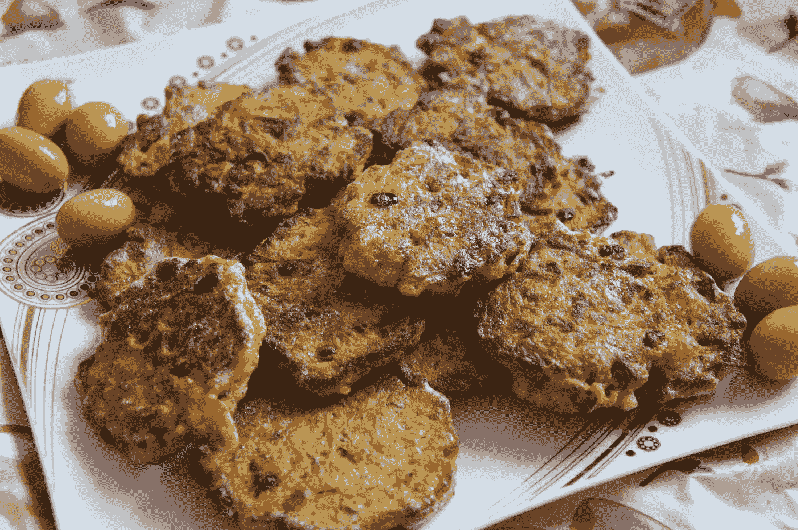
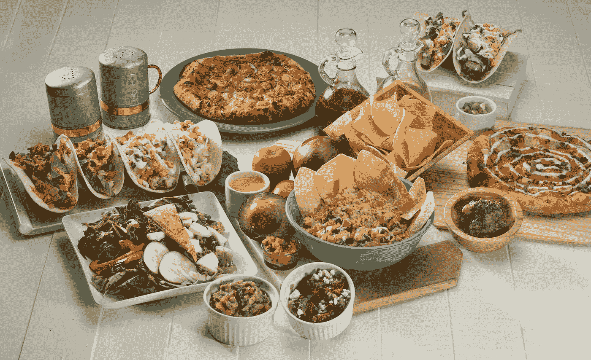

# 自举 5-卡片

> 原文：<https://javascript.plainenglish.io/bootstrap-5-cards-7dc9c774bf8d?source=collection_archive---------14----------------------->



Photo by [Amir Tavas](https://unsplash.com/@amirtvs?utm_source=medium&utm_medium=referral) on [Unsplash](https://unsplash.com?utm_source=medium&utm_medium=referral)

**写这篇文章时，Bootstrap 5 处于 alpha 状态，可能会发生变化。**

Bootstrap 是任何 JavaScript 应用程序的流行 UI 库。

在本文中，我们将了解如何使用 Bootstrap 5 添加卡。

# 卡片

卡片是可以容纳各种内容的容器。

它可以包括页眉和页脚。

背景颜色和其他显示选项也可以更改。

它们取代了 Bootstrap 3 中的面板、孔和缩略图。

例如，我们可以通过编写以下内容来添加卡片:

```
<div class="card" style="width: 18rem;">
  
  <div class="card-body">
    <h5 class="card-title">Card title</h5>
    <p class="card-text">Phasellus iaculis sed orci sit amet tempus. In odio ipsum, porttitor vel odio id, pulvinar lacinia risus. Donec a fringilla lectus. Aenean vitae ante erat. Vestibulum pharetra tellus sit amet tortor eleifend rhoncus. Aliquam sagittis sem justo, vitae convallis erat facilisis eget. Nunc id viverra neque, ac bibendum nisl.</p>
    <a href="#" class="btn btn-primary">Go somewhere</a>
  </div>
</div>
```

我们有一个带有`img-top`类的图像，用于将图像放置在顶部，并使其与边缘齐平。

然后我们有了 div 中带有`card-body`类的内容。

在底部，我们有一个看起来像按钮的链接。

# 内容类型

我们可以在卡片上放置各种各样的内容。

# 身体

主要内容在卡体中，由`.card-body`类表示。

例如，我们可以写:

```
<div class="card">
  <div class="card-body">
    Lorem ipsum dolor sit amet, consectetur adipiscing elit. Ut ac ante enim. Donec ullamcorper feugiat dignissim. Vestibulum ante ipsum primis in faucibus orci luctus et ultrices posuere cubilia curae; Curabitur eget diam vulputate, commodo lectus non, luctus tortor. Nam rhoncus porta rutrum. Sed non leo at lorem vehicula aliquam id a libero. Aliquam aliquet augue suscipit vulputate vulputate. Aliquam suscipit mauris eu lectus porta fringilla id quis nulla.
  </div>
</div>
```

给我们的卡片添加一些正文。

# 标题、文本和链接

可以通过在`h*`标签上添加一个带有`.card-title`的元素来添加卡片标题。

可以通过将`.card-subtitle`类添加到`h*`标签来添加字幕。

例如，我们可以写:

```
<div class="card">
  <div class="card-body">
    <h5 class="card-title">Card title</h5>
    <h6 class="card-subtitle mb-2 text-muted">Card subtitle</h6>
    <div class="card-text">
      Lorem ipsum dolor sit amet, consectetur adipiscing elit. Ut ac ante enim. Donec ullamcorper feugiat dignissim. Vestibulum ante ipsum primis in faucibus orci luctus et ultrices posuere cubilia curae; Curabitur eget diam vulputate, commodo lectus non, luctus tortor. Nam rhoncus porta rutrum. Sed non leo at lorem vehicula aliquam id a libero. Aliquam aliquet augue suscipit vulputate vulputate. Aliquam suscipit mauris eu lectus porta fringilla id quis nulla.
    </div>
  </div>
</div>
```

我们在这些类中添加了 h5 和 h6 标签来添加标题和副标题。

`.card-text`有正文。

# 形象

图像可以添加到卡片上。

`.card-img-top`将图像放在卡片的顶部。

例如，我们可以写:

```
<div class="card" style="width: 18rem;">
  
  <div class="card-body">
    <p class="card-text">Phasellus iaculis sed orci sit amet tempus. In odio ipsum, porttitor vel odio id, pulvinar lacinia risus. Donec a fringilla lectus. Aenean vitae ante erat. Vestibulum pharetra tellus sit amet tortor eleifend rhoncus. Aliquam sagittis sem justo, vitae convallis erat facilisis eget. Nunc id viverra neque, ac bibendum nisl.</p>
  </div>
</div>
```

在文本上方添加图像。

# 列表组

列表组可以添加到卡片中。

会和边缘齐平的。

例如，我们可以写:

```
<div class="card" style="width: 18rem;">
  <ul class="list-group list-group-flush">
    <li class="list-group-item">Lorem ipsum dolor sit amet,</li>
    <li class="list-group-item">Ut ac ante enim</li>
    <li class="list-group-item">Phasellus ullamcorper tellus vitae magna vulputate egestas.</li>
  </ul>
</div>
```

我们有一个带有`.list-group`和`.list-group-flush`类的`ul`来添加列表组，并使其与卡片的边缘齐平。

同样，我们可以用`.card-header`类给它添加一个头:

```
<div class="card" style="width: 18rem;">
  <div class="card-header">
    Featured
  </div>
  <ul class="list-group list-group-flush">
    <li class="list-group-item">Lorem ipsum dolor sit amet,</li>
    <li class="list-group-item">Ut ac ante enim</li>
    <li class="list-group-item">Phasellus ullamcorper tellus vitae magna vulputate egestas.</li>
  </ul>
</div>
```

这个`.card-header`类将会有一个灰色的背景色，这样我们就可以很容易地看到它。



Photo by [Randy Fath](https://unsplash.com/@randyfath?utm_source=medium&utm_medium=referral) on [Unsplash](https://unsplash.com?utm_source=medium&utm_medium=referral)

# 结论

我们可以添加卡片来保存内容，包括列表组、按钮和图像。

# 简单英语的 JavaScript

喜欢这篇文章吗？如果有，通过 [**订阅获取更多类似内容解码，我们的 YouTube 频道**](https://www.youtube.com/channel/UCtipWUghju290NWcn8jhyAw) **！**