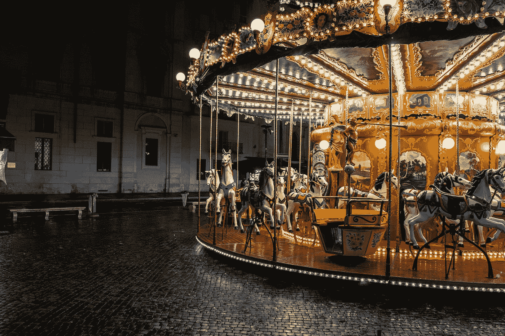

# 引导程序 5 —转盘定制

> 原文：<https://javascript.plainenglish.io/bootstrap-5-carousel-customization-34427e5cd7ce?source=collection_archive---------2----------------------->



Photo by [Ran Berkovich](https://unsplash.com/@berko?utm_source=medium&utm_medium=referral) on [Unsplash](https://unsplash.com?utm_source=medium&utm_medium=referral)

**写这篇文章时，Bootstrap 5 处于 alpha 状态，可能会更改。**

Bootstrap 是任何 JavaScript 应用程序的流行 UI 库。

在本文中，我们将看看如何用 Bootstrap 5 定制传送带。

# 交叉渐变

我们可以添加`.carousel-fade`类来为幻灯片添加渐变动画。

例如，我们可以写:

```
<div id="carousel" class="carousel slide carousel-fade" data-ride="carousel">
  <div class="carousel-inner">
    <div class="carousel-item active">
      
    </div> <div class="carousel-item">
      
    </div> <div class="carousel-item">
      
    </div>
  </div> <a class="carousel-control-prev" href="#carousel" data-slide="prev">
    <span class="carousel-control-prev-icon"></span>
    <span class="sr-only">Previous</span>
  </a> <a class="carousel-control-next" href="#carousel" data-slide="next">
    <span class="carousel-control-next-icon"></span>
    <span class="sr-only">Next</span>
  </a>
</div>
```

我们添加了`.carousel-fade`类来添加渐变效果。

它还不能在 Bootstrap 5 的 alpha 版本中工作。

# 个人`.carousel-item`区间

我们可以使用`data-interval`属性更改每张幻灯片的幻灯片更换持续时间。

例如，我们可以写:

```
<div id="carousel" class="carousel slide" data-ride="carousel">
  <div class="carousel-inner">
    <div class="carousel-item active" data-interval="2000">
      
    </div> <div class="carousel-item" data-interval="3000">
      
    </div> <div class="carousel-item" data-interval="4000">
      
    </div>
  </div> <a class="carousel-control-prev" href="#carousel" data-slide="prev">
    <span class="carousel-control-prev-icon"></span>
    <span class="sr-only">Previous</span>
  </a> <a class="carousel-control-next" href="#carousel" data-slide="next">
    <span class="carousel-control-next-icon"></span>
    <span class="sr-only">Next</span>
  </a>
</div>
```

我们有`data-interval`属性来设置每张幻灯片显示的持续时间，单位是毫秒。

# Java Script 语言

我们可以用 JavaScript 创建 carousel 对象，然后用它做我们想做的事情。

例如，我们可以写:

```
const carouselEl = document.querySelector('#carousel')
const carousel = new bootstrap.Carousel(carouselEl)
```

从我们的转盘创建转盘对象。

`bootstrap.Carousel`构造函数使用我们在 HTML 中创建的 carousel 获取一个 DOM 对象。

要添加选项，我们可以传入第二个参数:

```
const carouselEl = document.querySelector('#carousel')
const carousel = new bootstrap.Carousel(carouselEl, {
  interval: 2000,
  wrap: false
})
```

我们设置幻灯片持续时间来更换幻灯片。

# 事件

旋转式传送带也会发出一些事件。

当调用`slide`实例时，它们发出`slide.bs.carousel`事件。

`slid.bs.carousel`在转盘完成载玻片转换后发出。

事件对象有`direction`属性来指示滑动方向。

`relatedTarget`将 DOM 元素放入适当的位置。

`from`有当前项的索引。

`to`有下一项的索引。

要监听一个事件，我们可以使用`addEventListener`:

```
const carouselEl = document.querySelector('#carousel')carouselEl.addEventListener('slide.bs.carousel', () => {
  // ...
})
```

我们获取 carousel 元素并对其调用`addEventListener`。

# 更改过渡持续时间

转换的持续时间可以用`$carousel-transition` SASS 变量改变。

例如，我们可以写:

```
transform 2s ease, opacity 1s ease-out
```

作为它的价值。


Photo by [Eugene Neviarouski](https://unsplash.com/@eugenenes?utm_source=medium&utm_medium=referral) on [Unsplash](https://unsplash.com?utm_source=medium&utm_medium=referral)

# 结论

我们可以自定义旋转木马的过渡效果。

此外，我们可以用各种方法改变过渡间隔。

# 简单英语的 JavaScript

喜欢这篇文章吗？如果有，通过 [**订阅获取更多类似内容解码，我们的 YouTube 频道**](https://www.youtube.com/channel/UCtipWUghju290NWcn8jhyAw) **！**