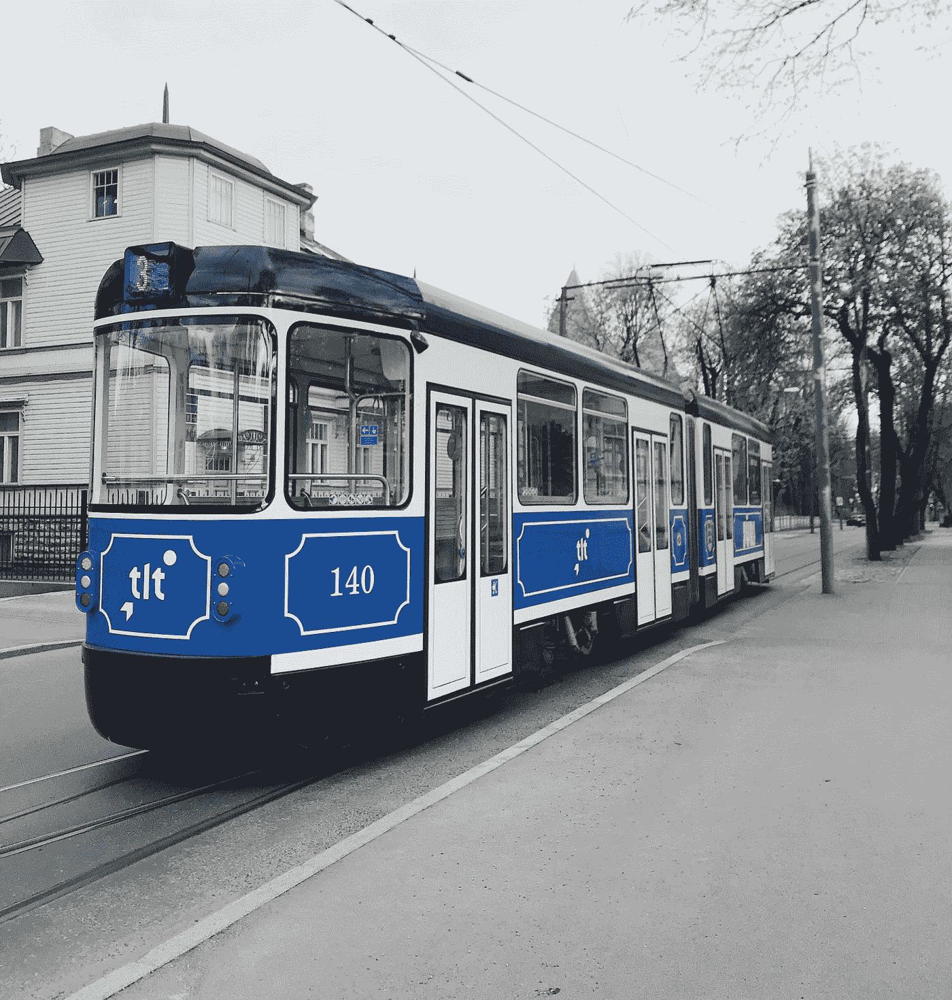

# 自举 5-模态

> 原文：<https://javascript.plainenglish.io/bootstrap-5-modals-64673a8f698e?source=collection_archive---------3----------------------->


Photo by [Hermes Rivera](https://unsplash.com/@hermez777?utm_source=medium&utm_medium=referral) on [Unsplash](https://unsplash.com?utm_source=medium&utm_medium=referral)

**写这篇文章时，Bootstrap 5 处于 alpha 状态，可能会发生变化。**

Bootstrap 是任何 JavaScript 应用程序的流行 UI 库。

在本文中，我们将看看如何在 Bootstrap 5 中用 JavaScript 添加模态。

# 情态的

模态是显示通知和其他内容的弹出窗口。

它被放置在文档中的所有内容之上，并从正文中移除滚动。

点击背景将自动关闭模式。

Bootstrap 5 一次只支持一个模态窗口。

情态动词用`position: fixed`。

`autofocus`属性在引导模式中不起作用。

通过在发出`show.bs.modal`事件时聚焦元素，我们可以用 JavaScript 代码达到同样的效果:

```
const myModal = document.getElementById('myModal');
const myInput = document.getElementById('myInput');

myModal.addEventListener('shown.bs.modal', () => {
  myInput.focus()
})
```

# 模态分量

我们可以通过向容器元素添加几个类来添加一个模态:

```
<button type="button" class="btn btn-primary" data-toggle="modal" data-target="#modal">
  Launch modal
</button><div class="modal" tabindex="-1" id='modal'>
  <div class="modal-dialog">
    <div class="modal-content">
      <div class="modal-header">
        <h5 class="modal-title">Modal title</h5>
        <button type="button" class="close" data-dismiss="modal" aria-label="Close">
          <span aria-hidden="true">&times;</span>
        </button>
      </div>
      <div class="modal-body">
        <p>Lorem ipsum dolor sit amet, consectetur adipiscing elit. Nam at neque orci. In vehicula metus eu euismod rhoncus.</p>
      </div>
      <div class="modal-footer">
        <button type="button" class="btn btn-secondary" data-dismiss="modal">Close</button>
        <button type="button" class="btn btn-primary">Save changes</button>
      </div>
    </div>
  </div>
</div>
```

我们添加一个按钮来打开模态。

按钮有`data-toggle`属性，用给定的选择器打开模态。

然后在我们的模态中，我们有与`data-toggle`值相同的 ID。

然后我们有了模态内容。

它包括定义模态的`modal-dialog`类。

`modal-content`包含内容。

`modal-header`有表头。

`modal-title`有标题。

`modal-body`有身体。

`modal-footer`有页脚。

# 静态背景

背景可以设置为静态，这样当我们在它外面点击时它不会关闭。

例如，我们可以写:

```
<button type="button" class="btn btn-primary" data-toggle="modal" data-target="#modal">
  Launch modal
</button><div class="modal" tabindex="-1" id='modal' data-backdrop="static">
  <div class="modal-dialog">
    <div class="modal-content">
      <div class="modal-header">
        <h5 class="modal-title">Modal title</h5>
        <button type="button" class="close" data-dismiss="modal" aria-label="Close">
          <span aria-hidden="true">&times;</span>
        </button>
      </div>
      <div class="modal-body">
        <p>Lorem ipsum dolor sit amet, consectetur adipiscing elit. Nam at neque orci. In vehicula metus eu euismod rhoncus.</p>
      </div>
      <div class="modal-footer">
        <button type="button" class="btn btn-secondary" data-dismiss="modal">Close</button>
        <button type="button" class="btn btn-primary">Save changes</button>
      </div>
    </div>
  </div>
</div>
```

我们只是添加了`data-backdrop='static'`属性来禁止在外部点击时关闭。

# 滚动长内容

当我们有很长的内容时，滚动依赖于模态而不是页面:

```
<button type="button" class="btn btn-primary" data-toggle="modal" data-target="#modal">
  Launch modal
</button><div class="modal" tabindex="-1" id='modal' data-backdrop="static">
  <div class="modal-dialog">
    <div class="modal-content">
      <div class="modal-header">
        <h5 class="modal-title">Modal title</h5>
        <button type="button" class="close" data-dismiss="modal" aria-label="Close">
          <span aria-hidden="true">&times;</span>
        </button>
      </div>
      <div class="modal-body">
        <p>Lorem ipsum dolor sit amet, consectetur adipiscing elit. Nam at neque orci. In vehicula metus eu euismod rhoncus. Pellentesque pharetra ligula sed efficitur ultricies. Quisque et congue metus, id rutrum purus. Maecenas finibus efficitur mauris, quis varius enim elementum a. Phasellus vel aliquet diam. Proin tincidunt eros pellentesque mauris laoreet, nec ullamcorper magna vulputate. Suspendisse potenti. Nullam lobortis ultricies nunc id vulputate. Curabitur pulvinar, lorem ac tempus lobortis, tortor tortor dignissim enim, quis tempor est lacus ut augue. Sed tincidunt lectus urna, ac aliquet velit suscipit a. Nullam tempus sem id nibh vulputate, nec ultricies lorem porttitor. Sed pharetra lacinia odio non sodales.
        </p>
        <p>
          Mauris ullamcorper ornare dui at bibendum. Duis sed quam ac purus tincidunt aliquet. Suspendisse potenti. Praesent vitae turpis dui. Fusce ut tincidunt est, ut sagittis mi. Sed euismod pharetra pulvinar. Morbi at facilisis quam. Vestibulum sagittis arcu sit amet scelerisque vestibulum. Nulla nisl libero, ornare et facilisis et, tempus sagittis massa. Sed tincidunt metus non ex ornare, eu elementum lorem sagittis. Nam a sapien eleifend, dignissim purus sit amet, ultrices neque. Suspendisse imperdiet purus eu posuere pellentesque. Nulla facilisi.
        </p>
      </div>
      <div class="modal-footer">
        <button type="button" class="btn btn-secondary" data-dismiss="modal">Close</button>
        <button type="button" class="btn btn-primary">Save changes</button>
      </div>
    </div>
  </div>
</div>
```

因为我们有很长的内容，滚动条将滚动模态而不是页面。



Photo by [Matheus Frade](https://unsplash.com/@matheusfrade?utm_source=medium&utm_medium=referral) on [Unsplash](https://unsplash.com?utm_source=medium&utm_medium=referral)

# 结论

我们可以添加情态动词来显示我们想要的。

背景可以关闭或模式化，也可以禁用。

## 简单英语的 JavaScript

喜欢这篇文章吗？如果有，通过 [**订阅解码，我们的 YouTube 频道**](https://www.youtube.com/channel/UCtipWUghju290NWcn8jhyAw) **获取更多类似内容！**