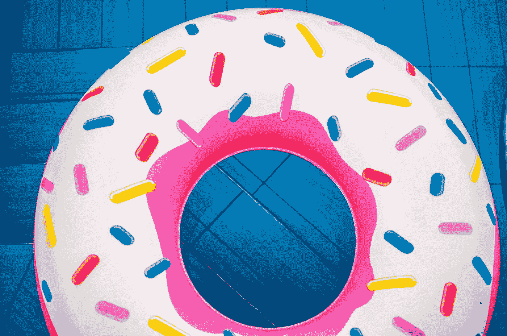

# BootstrapVue —更多选项卡自定义

> 原文：<https://javascript.plainenglish.io/bootstrapvue-more-tabs-customizations-99189fd6092b?source=collection_archive---------5----------------------->



Photo by [Constantinos Panagopoulos](https://unsplash.com/@dinpanag?utm_source=medium&utm_medium=referral) on [Unsplash](https://unsplash.com?utm_source=medium&utm_medium=referral)

为了制作好看的 Vue 应用，我们需要设计组件的样式。

为了使我们的生活更容易，我们可以使用内置样式的组件。

我们看看如何定制我们添加的选项卡，包括如何通过`v-model`和 refs 方法用代码导航选项卡。

# 向导航标签或药丸添加自定义类别

我们可以用`title-link-class`道具设置自己的类。

例如，我们可以写:

```
<template>
  <div id="app">
    <b-tabs>
      <b-tab title="Tab 1" title-link-class="tab">Tab 1</b-tab>
      <b-tab title="Tab 2" title-link-class="tab">Tab 2</b-tab>      
    </b-tabs>
  </div>
</template>
<script>
export default {
  name: "App"  
};
</script>
<style>
.tab {
  color: red
}
</style>
```

我们添加了`tab`类，我们将其设置为`title-link-class`的值。

由于这个类的风格，当我们将鼠标悬停在它上面时，我们会看到导航文本是红色的。

# 惰性加载选项卡内容

我们可以添加`lazy`道具到懒加载标签页内容。

这意味着内容只有在显示时才被加载。

例如，我们可以写:

```
<template>
  <div id="app">
    <b-tabs>
      <b-tab title="Tab 1">Tab 1</b-tab>
      <b-tab title="Tab 2" lazy>Tab 2</b-tab>
    </b-tabs>
  </div>
</template>
<script>
export default {
  name: "App"
};
</script>
```

现在第二个标签的内容只在显示时才加载。

我们可以通过将`lazy`放在`b-tabs`中来使所有标签变懒:

```
<template>
  <div id="app">
    <b-tabs lazy>
      <b-tab title="Tab 1">Tab 1</b-tab>
      <b-tab title="Tab 2">Tab 2</b-tab>
    </b-tabs>
  </div>
</template>
<script>
export default {
  name: "App"
};
</script>
```

# 键盘导航

我们可以用键盘浏览标签。

向左或向上激活上一个未禁用的选项卡。

向右或向下激活下一个未禁用的选项卡。

Shift+Left 或 Shift+Up 激活第一个未禁用的选项卡。

主页激活第一个非禁用选项卡。

Shift+Rigbt 或 Shift+Down 激活最后一个未禁用的 tav。

结束激活最后一个未禁用的选项卡。

Tab 将焦点移动到活动的选项卡组件。

Shift+Tab 将焦点移动到页面上的上一个控件。

我们可以用`no-key-nav`道具禁用键盘导航。

则该行为将与 Tab 键的常规行为相同。

选项卡将移动到页面上的下一个按钮或控件。

Shift+tab 移动到页面上的上一个按钮或控件。

Enter 或空格键激活当前获得焦点的按钮的选项卡。

# 以编程方式激活和停用选项卡

我们可以添加`active`道具来激活选项卡。

此外，我们可以使用`activate`来激活选项卡。

和停用选项卡的`deactivate`方法。

例如，我们可以写:

```
<template>
  <div id="app">
    <b-tabs>
      <b-tab title="Tab 1">Tab 1</b-tab>
      <b-tab ref="tab2" title="Tab 2">Tab 2</b-tab>
    </b-tabs>
  </div>
</template>
<script>
export default {
  name: "App",
  mounted() {
    this.$refs.tab2.activate();
  }
};
</script>
```

我们在第二个选项卡中添加了一个引用。

然后在组件加载时运行的`mounted`钩子中，我们调用了它的`activate`方法。

加载组件时，选项卡 2 将成为活动选项卡。

# v 型车

我们可以把`v-model`加到`b-tabs`上。该值将是当前活动的选项卡。

第一个选项卡为 0，第二个选项卡为 1，依此类推。

例如，我们可以写:

```
<template>
  <div id="app">
    <b-tabs v-model="tab">
      <b-tab title="Tab 1">Tab 1</b-tab>
      <b-tab title="Tab 2">Tab 2</b-tab>
    </b-tabs>
    <b-button @click="next">Next</b-button>
  </div>
</template>
<script>
export default {
  name: "App",
  data() {
    return {
      tab: 0
    };
  },
  methods: {
    next() {
      this.tab = (this.tab + 1) % 2;
    }
  }
};
</script>
```

我们添加了下一个按钮，点击后会调用`next`。

在`next`中，我们用下一个标签的索引更新了`this.tabs`。

当显示第二个选项卡时，当我们单击“下一步”时，将返回到第一个选项卡。

使用`v-model`指令将`this.tab`绑定到`b-tabs`组件的标签索引。

因此，当我们单击“下一步”时，我们将在选项卡间循环。


Photo by [Christiana Rivers](https://unsplash.com/@christiana?utm_source=medium&utm_medium=referral) on [Unsplash](https://unsplash.com?utm_source=medium&utm_medium=referral)

# 结论

我们可以控制选项卡如何以编程方式显示。

此外，键盘导航由 BootstrapVue 选项卡支持。

我们还可以向选项卡控件添加自定义类。