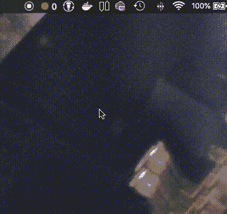

# 用空气和电子轻松呼吸

> 原文：<https://javascript.plainenglish.io/breathing-easy-with-awair-and-electron-a6a87bc5a513?source=collection_archive---------1----------------------->

Photo by [Sid Leigh](https://unsplash.com/@sidbobs?utm_source=medium&utm_medium=referral) on [Unsplash](https://unsplash.com?utm_source=medium&utm_medium=referral)

我最近买了一个 [Awair，一个漂亮的小盒子](https://getawair.com/),可以读取它所在房间的温度、湿度、二氧化碳、化学物质和灰尘含量。

我买它是因为我和我的女朋友在我们的卧室里有一些不通风的问题，并且会气喘吁吁地醒来，所以我想知道我们的空气质量是怎么回事。

它真的帮了我们，我们打开它的第一个晚上就发现了问题，我们的二氧化碳水平是晚上应有水平的六倍，这是因为窗户被关闭以保持房间安静，门也被关闭。

如果你的空气质量由于某种特殊原因而下降，比如你刚刚在房间里喷洒了一些刺激性化学物质，它会通过设备上的蜂鸣声和手机上的警报来提醒你(尽管当我知道我的女朋友因为我收到的警报而一直在除尘时，她会吓坏的)。

通过在一个标尺上显示不同的传感器读数，Awair 可以更容易地了解空气质量，我现在一看就知道房间是否需要打开窗户或打开暖气才能让事情变得更好。

此外，Awair 会读取所有传感器读数及其在天平上的位置，并创建一个分数，只要该分数高于 80，通常就意味着一切正常。

除了让我呼吸的事实之外，我喜欢 Awair 的一点是，它有一个 API，所以你可以建立自己的应用程序来分析你的数据，这就是我所做的。

我在[的 Monzo](https://monzo.com/) 银行存款，发现了一个非常棒的[工具栏应用程序，叫做 BankBar，由 John Easton](https://github.com/johneas10/bankBar) 开发，它允许你查看你的余额，并使用 Mac OSX 的工具栏管理你的账户，这是电子版的，所以我想做一些类似的东西(*阅读:我抄袭了这个想法*)。

A demo of my toolbar app

# 使用 Awair API 构建应用程序

Awair 的 API 曾经是私有的，有一系列对来自 iOS 应用程序的调用进行逆向工程的库，但他们已经开放了一些东西，你可以通过他们的开发者门户注册一个 API 密钥。

Awair API 可以通过访问令牌用于个人用途，或者如果您希望其他人登录并访问他们的数据，您可以注册一个 OAuth2 应用程序。我正在构建的应用程序需要使用 OAuth2，因为我希望人们能够下载它，登录并查看他们的数据。

## OAuth2 随电子流动

标准的 OAuth2 流程如下:

*   你将用户发送到一个他们可以登录的页面，该页面包含你的应用的凭据和一个重定向 URL，用户通过身份验证后，该页面会将用户发送到该 URL
*   当请求访问令牌或刷新令牌时，会向重定向 URL 发送授权码，供您的应用程序使用
*   然后你用你的授权码调用 API 来获得一个访问令牌，你用它来授权你的应用程序对用户数据的请求
*   当调用 API 时，您可以将访问令牌包含在头中或作为参数，如果访问令牌过期，您可以请求刷新令牌以继续通过 API 访问用户数据

桌面和移动设备上的现代操作系统都能够将协议与应用程序相关联，这意味着对`awairbar://`的调用将与 [my app AwairBar 相关联。](https://gitlab.com/colinfwren/AwairBar)

Electron 允许你使用`app.setAsDefaultProtocolClient()`功能将你的应用程序设置为协议的默认处理器(这里你不需要包含`://`部分)。

然后使用`app.on('open-url', (event, url))`，它将接收协议使用的 URL。对于来自 OAuth2 应用程序的重定向，您可以使用(假设它发送的数据在请求参数中)这个来获得授权码请求的响应。

## 访问和刷新令牌

Awair 在处理 OAuth2 生命周期方面有一个非常好的指南，但它的基础是，一旦你从重定向中获得了授权码，你就可以启动它以及你的应用程序的客户端 id、客户端密码和你所请求的令牌类型。

这将返回一个包含访问令牌的对象，您将使用该对象进行后续的 API 调用。

## 从 Awair API 获取数据

[Awair API 文档非常全面](https://docs.developer.getawair.com/)，包含常用的 OpenAPI 功能，因此很容易获取和使用。

我的应用程序需要的主要端点是:

[http://developer-apis.awair.is/v1/users/self/devices](http://developer-apis.awair.is/v1/users/self/devices)返回与用户账户相关的所有 Awair 设备列表。您将需要这个列表来从设备获取读数，因为这些端点需要`deviceType`和`deviceId`属性。

[http://developer-APIs . awair . is/v1/users/self/devices/:device _ type/:device _ id/air-data/latest](http://developer-apis.awair.is/v1/users/self/devices/:device_type/:device_id/air-data/latest)在调用时返回设备的最新读数。这将返回一个对象，其中包含读数的时间、读数的空气分数以及来自不同传感器的原始值，原始值的范围为 1-5(1 表示良好)。

# 用电子构建工具栏应用程序

正如我之前提到的，我受 BankBar 的“启发”开发了一个工具栏应用程序，因为我认为这是一个很好的数据访问方式，并且生命周期更容易管理。

幸运的是，对我来说，构建一个工具栏(或者用电子术语来说是`Tray`)应用程序非常简单。

## 创建托盘应用程序

要构建一个托盘应用程序，你只需[创建一个新的](https://electronjs.org/docs/api/tray) `[Tray](https://electronjs.org/docs/api/tray)` [实例](https://electronjs.org/docs/api/tray)，它会获取一个指向托盘应用程序图标的路径(在 Mac OS X 上，你可以提供`icon.png`，但如果你在同一个目录中有`icon@2x.png`，它会将该路径用于 retina 显示屏)。

托盘将仅在工具栏上显示一个图标，因此您需要[将该图标与](https://electronjs.org/docs/api/menu) `[Menu](https://electronjs.org/docs/api/menu)` 相结合，并使用`tray.setContextMenu()`将该菜单与托盘相关联。

由于`Menu.buildFromTemplate()`接受一个对象数组，创建菜单非常简单，每个对象充当一个菜单项，也可以有自己的子菜单。

您定义的每个菜单项都有一个`label`，您可以定义一个`click()`函数来处理单击该菜单项。还有一些[你可以让菜单项扮演的角色](https://electronjs.org/docs/api/menu-item#roles)来管理这些动作，而不需要额外的代码。

分别使用`tray.setTitle()`和`tray.setImage()`可以动态更新托盘的图像和标题。只要你有访问托盘实例的权限，你就可以在应用生命周期的任何时候调用它们。

## 持久数据

我使用`electron-store`来保存我的应用程序使用的数据。它提供了一个简单的 API 来获取和设置存储中的值，并且可以存储任何 JavaScript 文字，所以不需要使用`stringify`和`parse`JSON 对象来存储复杂的值。

关于`electron-store`,我发现一件棘手的事情是，当编写代码的单元测试时，如果代码导入了一个创建了`Store`实例的依赖项，这是因为构造函数要求代码在 Electron app 生命周期内运行，而我的测试并没有这样做。

为了绕过这个问题，我利用 Jest 强大的模仿功能来模仿:

Mocking the electron-store constructor

然后我可以从`electron-store`导入`setMock`和`getMock`来访问我提供的模拟函数，并断言它们被调用，或者设置它们在我的测试中返回的值。

## 为菜单栏重新创建 Awair 乐谱图形

Awair 分数在应用程序中通过一个圆圈周围的环来可视化，该环根据分数有不同的完成程度。

为了将这个构建到我的工具栏应用程序中，我决定只为 10 的每一个倍数创建图形，因为屏幕很小，我想大多数人不会在细粒度上看到太多的差异。

我使用 Sketch 来创建我的图形(如果你不使用它，并且你在 Mac 上，我强烈推荐它，它很便宜，对于制作模型来说真的很棒)并且[通过 InVision](https://www.invisionapp.com/inside-design/sketch-tutorial-radial-progress-bars/) 找到了这个教程，尽管本质上它归结为使用间隙和破折号作为边界以及一些 Pi 相关的数学来使破折号只扩展到所需的百分比。

# 摘要

我真的很高兴 Electron 用 JavaScript 轻松地创建了一个桌面应用程序。我能够在一个晚上内让这个应用程序处于一个粗略的工作状态，棘手的部分是处理`electron-store`以及如何测试它。

我想[用 Spectron](https://electronjs.org/spectron) 为应用程序编写一些测试，Spectron 是基于 Chromedriver 的电子 UI 自动化框架，但我还没有研究这将如何容易地与基于`Tray`和`Menu`的应用程序一起工作。

如果你想尝试一下，这个应用的代码是 [my Gitlab](https://gitlab.com/colinfwren/AwairBar) (你需要在 Awair 的开发者门户注册你自己的 OAuth2 应用，以便在本地运行它)。