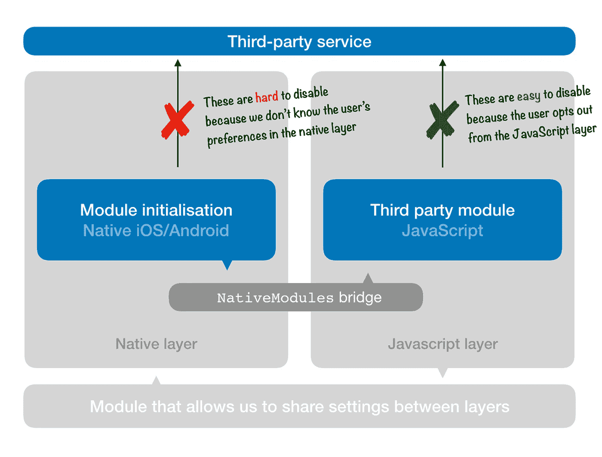
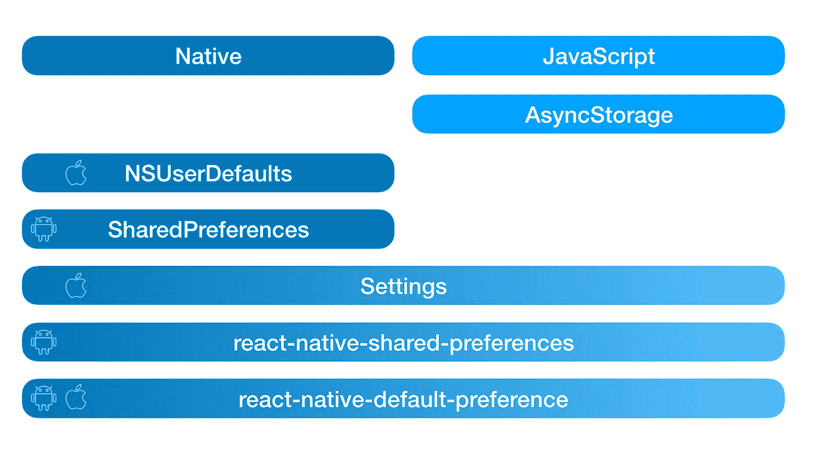
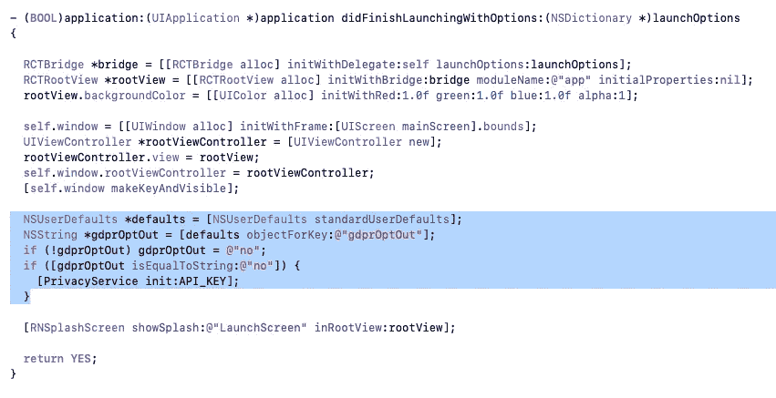
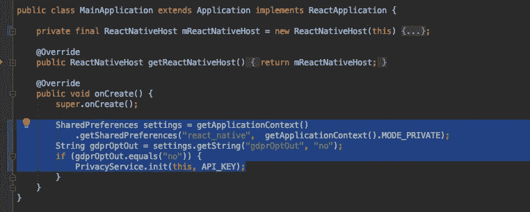
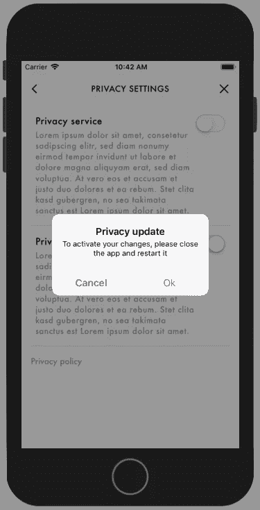

# 在 React Native 中弥合 JavaScript 与本地用户偏好之间的差距

> 原文：<https://javascript.plainenglish.io/bridging-the-gap-from-javascript-to-native-user-preferences-in-react-native-c7e03891a10f?source=collection_archive---------0----------------------->


Photo by [Andras Kovacs](https://unsplash.com/@akovacsa?utm_source=medium&utm_medium=referral) on [Unsplash](https://unsplash.com?utm_source=medium&utm_medium=referral)

最近，我一直在努力将 GDPR 的退出功能集成到一个应用程序中。该功能允许用户扳动开关，决定他们是否希望我们的应用程序或其任何第三方依赖项跟踪任何隐私相关数据。

从法律角度来看，这是一个有趣的挑战，因为如果你可以在任何时候使用任何被跟踪的数据来重新识别数据所涉及的人，这意味着它没有被有效地匿名化，因此你没有遵守 GDPR 准则。

从技术角度来看，这意味着您必须完全禁用任何可能与第三方服务建立连接的逻辑，这些第三方服务会向服务器发送用户特定的信息，如他们的 IP 地址、位置、操作系统等…

# 让我们缩小问题的范围

在我们的 React Native 项目中，我们一直在使用一些常用的第三方库来完成分析、日志记录和崩溃报告等任务。对开发者来说，坏消息是这些插件大部分都是在 GDPR 出现之前开发的。

尽管其中一些提供了通过 JavaScript 层的方法调用退出服务的简单方法，但其他一些则需要你深入研究本地代码，并在启动之前禁用插件*。*

如果你查看这些第三方工具的安装说明，通常他们会要求你在应用中加入一段本地代码。这个 snipped 初始化了本地库，然后您就可以通过 React 本地桥从 JS 代码与它进行通信。

问题是:当用户从用 JavaScript 编写的 UI 的一部分选择退出 GDPR 时，我们如何将该设置带到原生层，以便用户下次启动应用程序时，我们可以确保它不再加载第三方库。



The problem we’re facing: how do we carry over settings made in the JS layer to the native side?

# React Native 中的本机键值存储

React Native 提供了一个现成的`Settings`模块。它允许我们从 iOS 的`[NSUserDefaults](https://developer.apple.com/documentation/foundation/nsuserdefaults)`中读取和写入值。我们可以在本机代码中使用它来读取已经在 JS 层中设置的参数。不错！😎

不幸的是，没有安卓的替代品，所以我们需要使用开源库来填补这个空白。其中之一是[反应-本地-共享-偏好](https://www.google.com/search?q=react-native-shared-preferences&oq=react-native-shared-prefe&aqs=chrome.0.35i39j69i57j0l4.3871j0j0&sourceid=chrome&ie=UTF-8)。它充当了安卓关键价值商店`[SharedPreferences](https://developer.android.com/reference/android/content/SharedPreferences)`的包装。它让我们(或多或少)做与`Settings` API 对 iOS 做的完全相同的事情。

## 把它全部抽象掉

但有一个更好的库，我只是在实施了准系统解决方案后偶然发现的，这是基于我最初的发现。库[反应-本机-默认-首选项](https://github.com/kevinresol/react-native-default-preference#readme)是*和*平台的抽象，让我们以统一的方式读写数据，在 JavaScript 和本机之间交换信息。呜哇🎉

下面是不同的关键价值商店及其涵盖的平台的概述。在左侧，您可以看到两个本机库，在右侧是带有反应本机现成的一个。在底部，我添加了三个解决方案，可以帮助您覆盖两个世界。



An overview of key-value store solutions in React Native (left: native, right: JavaScript)

## JavaScript 实现

有了这个插件，我们现在可以继续实现一些简单的逻辑来读取和写入数据到本地层，而本地和 JavaScript 都可以读取这些数据。

```
import **DefaultPreference** from 'react-native-default-preference'

DefaultPreference.set('**gdprOptOut**', '*yes*').then(() => ...)
```

我正在这里获取/设置`gdprOptOut`参数的值，稍后我将在本机代码示例中重复使用。它是一个简单的字符串(`yes`)，告诉我们用户是否在我们的应用程序中启用了隐私选择退出。请注意，它不能是布尔值，因为每个值都必须先转换为字符串。

这个插件的另一个好处是，它通过在来自`NSUserDefaults`的结果周围包装一个承诺(默认情况下是同步的),使得抽象以异步的方式可用。

# 访问本机键值存储

到目前为止，一切都很好！但是我们现在如何在本地访问这些变量呢？🤷‍♂ 🤷‍♀

对于那些不熟悉本机 iOS 和安卓的人来说，这个简单的挑战可能会成为一项非常艰巨的任务，因为:

*   您不知道要导入哪些库以及导入的位置
*   您需要弄清楚在代码中的何处插入这些语句
*   …而且您不知道如何用 Java 或 Objective-C 编写条件语句

## **获取和设置 iOS 中的首选项**

在 Objective-C 中，我们可以通过调用`NSUserDefaults`对象上的`standardUserDefaults`方法来读取设备的用户默认值。然后，我们可以对返回的`defaults`值使用`objectForKey`方法提取所需的参数。

```
NSUserDefaults *defaults = [NSUserDefaults **standardUserDefaults**];
NSString *gdprOptOut = [defaults **objectForKey**:@"gdprOptOut"];
```

值得注意的是，`gdprOptOut`的返回值也将是一个字符串，所以我们必须为后续条件使用的方法调用必须是`isEqualToString`:

```
if ([gdprOptOut **isEqualToString**:@"no"]) {
  [PrivacyService initWith:API_KEY];
}
```

在这种情况下，当参数是*而不是* `no`(意味着用户没有选择退出 GDPR)时，我们可以安全地初始化我们将用于跟踪隐私数据的任何服务。

**在哪里插入这段代码？**

在你的`AppDelegate.m`中，你现在可以用上面的条件逻辑包装插件的初始化方法。通常，这可以在`didFinishLaunchingWithOptions`方法中找到，它负责你的应用程序的所有设置逻辑。



Initialization logic for our privacy service in iOS’s **AppDelegate.m**

我在这里添加了一个额外的语句，如果还没有设置值，就将值设置为`no`:`if (!gdprOptOut) gdprOptOut = @"no";`(在 Objective-C 中可能有一个更好的方法来完成这个任务😊).

## 在 Android 中获取和设置首选项

要从 Java 的`SharedPreferences`键值存储中检索结果，您需要像这样获取整个键值存储:

```
SharedPreferences settings = getApplicationContext().**getSharedPreferences**("KEY_VALUE_STORE_NAME", getApplicationContext().MODE_PRIVATE);
```

这里还有一个你可能不知道的参数，常量`KEY_VALUE_STORE_NAME`。这是你正在工作的商店的名字。

如果你使用`react-native-default-preference`，这个商店的默认名称是`**react-native**`(如[文件](https://github.com/kevinresol/react-native-default-preference/blob/master/android/src/main/java/com/kevinresol/react_native_default_preference/RNDefaultPreferenceModule.java#L22)中所定义)。但是，如果您使用的是`react-native-shared-preferences`，那么默认情况下名称是`wit_player_shared_preferences`😕。这是因为库作者显然是为了一个非常具体的目的而构建了这个库，但是忘记了使默认名称更通用。然而，最近的一个[拉请求](https://github.com/sriraman/react-native-shared-preferences/pull/13)也使得这可以从外部进行配置。

> 我建议始终用 JavaScript 设置商店名称，以避免依赖这些默认值。您可以在这两个插件中使用`setName`方法

现在我们已经可以访问商店了，让我们看看如何从中读取实际值:

```
String gdprOptOut = settings.**getString**("gdprOptOut", "no");
```

哦，那很简单。如果您想知道`"no"`位是什么意思，这是默认值，以防它找不到您传入的键的任何存储项。

接下来，我们想要运行一个简单的比较来决定我们是否应该初始化我们的隐私服务。在 Java 中，这很简单:

```
if (**gdprOptOut**.equals("no")) {
  PrivacyService.init(this, API_KEY);
}
```

这里，我们只是检查存储的值是否是`no`(用户已经*而不是*选择退出)，所以我们可以安全地初始化任何将要跟踪用户数据的服务。

**在哪里插入这段代码？**

在 Java 中，所有初始化逻辑所在的文件通常是`MainApplication.java`。你可以用上面的条件逻辑包装插件的初始化方法(很可能在`onCreate`方法中)。



Initialization logic for our privacy service in Android’s **MainApplication.java**

# 但是有一个警告😱

好了，我们已经成功地将设置转移到了原生 iOS/Android 代码中。但是本地初始化逻辑只运行*一次*，当用户打开应用程序时，在 JavaScript 开始之前。

这意味着，如果不重启整个应用程序，基本上没有办法退出。哎哟！🙇‍♂️:这个问题的解决方案(我承认这不是最优雅的)是让用户在选择退出后关闭并重启应用程序。



# 让我们回顾一下

现在，您应该具备了在 JavaScript 应用层中读写用户偏好的知识，并且能够从原生 iOS 和 Android 层读取这些值。如果您的用例还需要写入 *native* 中的存储，请查看我们讨论的两个本机库的文档:

*   [Android 上的 SharedPreferences](https://developer.android.com/reference/android/content/SharedPreferences)
*   iOS 上的 [NSUserDefaults](https://developer.apple.com/documentation/foundation/nsuserdefaults)

JavaScript 中有两个可用的库:

*   [反应-本地-共享-偏好](https://github.com/sriraman/react-native-shared-preferences)
*   [反应-本地-默认-偏好](https://github.com/kevinresol/react-native-default-preference)

我最近成为了后者的维护者，所以如果你对如何改进这个库有任何建议，请随时提交[期](https://github.com/kevinresol/react-native-default-preference/issues)或提交 PR。

希望你喜欢这篇博文。如果你有任何问题或意见，请在评论中联系我们。非常感谢你的阅读！