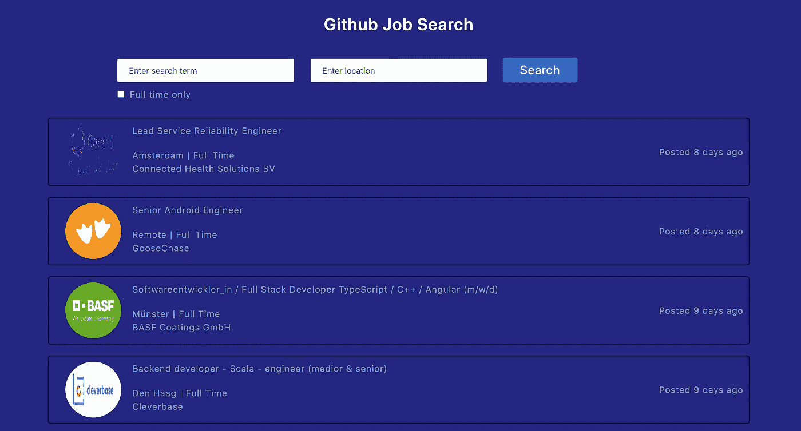

# 使用 React 创建一个漂亮的求职应用程序

> 原文：<https://javascript.plainenglish.io/build-a-beautiful-job-search-app-using-react-7325c4d232c2?source=collection_archive---------1----------------------->

## 了解如何使用延迟加载、上下文 API、添加加载更多功能、创建自定义挂钩等等



GitHub Job Search App

## 在本文中，我们将使用 [Github Jobs API](https://jobs.github.com/api) 构建一个漂亮的求职应用程序

通过构建此应用程序，您将了解到:

1.如何在 React
2 中懒加载图片？如何使用 React 上下文 API 在组件之间共享数据
3。为什么 React 不会呈现 JSX 表达式中使用的 HTML 以及如何在需要时正确显示它
4。如何在实际图像正在下载时显示替代加载图像
5。如何使用 React Portal
6 创建自己版本的加载程序。如何添加加载更多功能

还有更多。

> 你可以在这里看到应用[的现场演示](https://github-jobs-react-app.netlify.app/)

## 我们开始吧

使用`create-react-app`创建一个新项目

```
create-react-app github-jobs-react-app
```

项目创建完成后，删除`src`文件夹中的所有文件，并在`src`文件夹中创建`index.js`文件。同时在`src`文件夹中创建`actions`、`components,`、`context`、`css`、`custom-hooks`、`images`、`reducers`、`router`、`store`和`utils`文件夹。

安装必要的依赖项

```
yarn add axios@0.19.2 bootstrap@4.5.0 lodash@4.17.15 moment@2.27.0 node-sass@4.14.1 prop-types@15.7.2 react-bootstrap@1.0.1 react-redux@7.2.0 redux@4.0.5 redux-thunk@2.3.0
```

在`src`文件夹外新建一个名为`server`的文件夹，并从`server`文件夹执行以下命令

```
yarn init -y
```

这将在`server`文件夹中创建一个`package.json`文件。

从`server`文件夹安装所需的依赖项

```
yarn add axios@0.19.2 express@4.17.1 cors@2.8.5 nodemon@2.0.4
```

在`server`文件夹中创建一个名为`.gitignore`的新文件，并在其中添加下面一行，这样`node_modules`文件夹将不受版本控制

```
node_modules
```

现在，在`src/css`文件夹中创建一个新文件`styles.scss`，并将[中的内容添加到](https://gist.github.com/myogeshchavan97/f288ebcb5f2cc53398e44eb780f5628b)中。

在`src/reducers`文件夹中创建一个新文件`jobs.js`,内容如下

```
const jobsReducer = (state = [], action) => {
  switch (action.type) {
    case 'SET_JOBS':
      return action.jobs;
    case 'LOAD_MORE_JOBS':
      return [...state, ...action.jobs];
    default:
      return state;
  }
};export default jobsReducer;
```

在该文件中，我们使用`SET_JOBS`动作在 redux 中添加来自 API 的新作业数据，并使用`LOAD_MORE_JOBS`动作获取更多作业，并使用 spread 操作符将其添加到现有的作业数组中。

```
[...state, ...action.jobs]
```

在`src/reducers`文件夹下创建一个新文件`errors.js`，内容如下

```
const errorsReducer = (state = {}, action) => {
  switch (action.type) {
    case 'SET_ERRORS':
      return {
        error: action.error
      };
    case 'RESET_ERRORS':
      return {};
    default:
      return state;
  }
};export default errorsReducer;
```

在这个文件中，我们通过调度`SET_ERRORS`动作将 API 错误(如果有)添加到 redux 存储中，如果通过调度`RESET_ERRORS`动作从 API 获得响应时没有错误，则从 redux 存储中删除错误对象。

在`src`文件夹中创建一个新文件`store.js`，内容如下

```
import { createStore, combineReducers, applyMiddleware, compose } from 'redux';
import thunk from 'redux-thunk';
import jobsReducer from '../reducers/jobs';
import errorsReducer from '../reducers/errors';const composeEnhancers = window.__REDUX_DEVTOOLS_EXTENSION_COMPOSE__ || compose;
const store = createStore(
  combineReducers({
    jobs: jobsReducer,
    errors: errorsReducer
  }),
  composeEnhancers(applyMiddleware(thunk))
);console.log(store.getState());export default store;
```

在这个文件中，我们创建了一个 redux store，它使用了`combineReducers`并添加了来自`redux-thunk`的`thunk`作为管理异步 API 处理的中间件。

我们还使用`composeEnhandlers.`添加了 redux devtool 配置

如果您是 redux-thunk 和 redux devtool 配置的新手，请查看我以前的文章[这里的](https://medium.com/javascript-in-plain-english/how-to-integrate-redux-thunk-into-your-react-application-cd92b87c1629)以了解如何使用它。

现在，在`src/index.js`文件内添加以下内容

```
import React from 'react';
import ReactDOM from 'react-dom';
import { Provider } from 'react-redux';
import store from './store/store';
import HomePage from './components/HomePage';
import 'bootstrap/dist/css/bootstrap.min.css';
import './css/styles.scss';ReactDOM.render(
  <Provider store={store}>
    <HomePage />
  </Provider>,
  document.getElementById('root')
);
```

在该文件中，我们使用来自`react-redux`的`Provider`组件，这将允许我们将商店数据共享给`HomePage`及其所有子组件。

现在，在`src/components`文件夹中创建一个新文件`HomePage.js`，内容如下。

```
import React from 'react';const HomePage = () => {
  return <div className="container">Home Page</div>;
};export default HomePage;
```

现在，打开`public/index.html`并更换

```
<title>React App</title>
```

到

```
<title>Github Job Search</title>
```

现在从`github-jobs-react-app`文件夹运行下面的命令启动 React 应用程序

```
yarn start
```

您将看到显示主页文本的应用程序


Initial screen

现在，在`components`文件夹中创建一个新文件`Header.js`，内容如下

```
import React from 'react';const Header = () => (
  <header className="header">
    <div className="title">Github Job Search</div>
  </header>
);export default Header;
```

在`components`文件夹中创建一个新文件`Search.js`，内容如下

在这个文件中，我们添加了两个输入文本字段来获取用户的描述和位置，并添加了一个复选框来仅获取全职工作。

我们还为每个输入字段添加了一个`onChange`处理程序来更新状态值。

现在，打开`HomePage.js`并用以下内容替换它

```
import React from 'react';
import Header from './Header';
import Search from './Search';const HomePage = () => {
  return (
    <div>
      <Header />
      <Search />
    </div>
  );
};export default HomePage;
```

现在，如果您在输入字段中输入数值并点击`Search`按钮，您将看到输入的数据显示在控制台中


Search Page

现在，在`src/actions`文件夹中创建`errors.js`，内容如下:

```
export const setErrors = (error) => ({
  type: 'SET_ERRORS',
  error
});export const resetErrors = () => ({
  type: 'RESET_ERRORS'
});
```

在这个文件中，我们添加了 action creator 函数，我们将调用这些函数向 reducer 发送动作。

在`utils`文件夹中创建一个新文件`constants.js`，内容如下

```
export const BASE_API_URL = 'http://localhost:5000';
```

在`src/actions`文件夹中创建一个新文件`jobs.js`，内容如下

在该文件中，我们添加了一个`initiateGetJobs`函数，该函数将通过对 Node.js 中的`Express`服务器进行 API 调用来获取 JSON 数据，一旦接收到数据，就会调度`SET_JOBS`动作，该动作将通过执行`reducers/jobs.js`文件中的`SET_JOBS`切换用例来将所有作业数据添加到 redux 存储中。

现在，在`server`文件夹中创建一个新文件`server.js`,内容如下

在这个文件中，我们使用`Express`服务器创建了一个`/jobs` get API。

这里，我们调用 [Github 作业 API](https://jobs.github.com/api) ，通过传递`description`和`location`来获取可用作业的列表。默认情况下，API 只给出最新的`50`作业列表，但是我们可以通过发送值为 1、2、3 等的页面查询参数来获得更多的作业。

因此，我们通过下面的代码来验证页面查询参数

```
if (page) {
  page = parseInt(page);
  page = isNaN(page) ? '' : `&page=${page}`;
}
```

如果我们只想要全职工作，那么我们需要添加一个额外的`full_time`参数来查询值为`true`的字符串

```
full_time = full_time === 'true' ? '&full_time=true' : '';
```

最后，我们通过组合所有参数值来创建 API URL。

```
`https://jobs.github.com/positions.json?description=${description}&location=${location}${full_time}${page}`;
```

为每个输入字段添加`encodeURIComponent`的原因是为了将特殊字符(如有)转换为`%20`。

如果你注意到了，我们已经在`actions/jobs.js`文件中的`initiateGetJobs`函数中添加了相同的解析代码。将它包含在服务器代码中的原因还在于，我们还可以直接访问`/jobs` get API，而不需要任何应用程序，只需进行我们添加的附加检查条件。

现在，在`components`文件夹中创建一个新文件`JobItem.js`，内容如下

在这个文件中，我们显示了来自 API 的数据

在`components`文件夹中创建一个新文件`Results.js`，内容如下

```
import React from 'react';
import JobItem from './JobItem';const Results = ({ results }) => {
  return (
    <div className="search-results">
      {results.map((job, index) => (
        <JobItem key={job.id} {...job} index={index} />
      ))}
    </div>
  );
};export default Results;
```

在这个文件中，我们循环通过来自`results`数组的每个作业对象，并且我们传递单个作业数据以显示在先前创建的`JobItem`组件中。

现在，打开`components/HomePage.js`文件并用以下内容替换它

在这个文件中，我们现在开始使用 React 钩子。如果你是第一次接触 React 钩子，请点击这里查看我以前的一篇关于钩子的介绍文章

让我们来理解来自`HomePage`组件的代码。

最初，我们使用`useState`钩子来声明状态变量，以将来自 API 的结果存储在一个数组中，并声明一个标志来显示错误指示的加载和对象。

```
const [results, setResults] = useState([]);
const [errors, setErrors] = useState(null);
const [isLoading, setIsLoading] = useState(false);
```

然后我们调用`useEffect`钩子来获取作业和错误(如果有的话)的列表

```
useEffect(() => {
  setResults(props.jobs);
}, [props.jobs]);useEffect(() => {
  setErrors(props.errors);
}, [props.errors]);
```

我们使用`useEffect`钩子通过传递依赖数组作为第二个参数来实现类组件的`componentDidUpdate`生命周期方法。所以这些 useEffect 钩子只有在它们的依赖关系改变时才会被执行。当`props.jobs`改变或`props.errors`改变时。props 中的数据是可用的，因为我们在文件的末尾添加了一个`mapStateToProps`方法

```
const mapStateToProps = (state) => ({
  jobs: state.jobs,
  errors: state.errors
});
```

并传递给连接`react-redux`库的方法。

```
export default connect(mapStateToProps)(HomePage);
```

然后，我们将`onSearch`属性传递给`Search`组件，其值是`handleSearch`函数。

```
<Search onSearch={handleSearch} />
```

从这个函数内部，我们调用了`loadJobs`函数，该函数调用了`initiateGetJobs`动作创建器函数来对`Express`服务器进行 API 调用。

我们正在将`onSearch`道具传递给`Search`组件，但是我们还没有使用它，所以让我们先使用它。

打开`Search.js`组件并更换

```
const handleSearch = (event) => {
  event.preventDefault();
  console.log(state);
};
```

到

```
const handleSearch = (event) => {
  event.preventDefault();
  console.log(state);
  **props.onSearch(state);**
};
```

所以现在，当我们单击搜索按钮时，我们正在调用作为道具从`HomePage`组件传递给`Search`组件的`onSearch`函数。

现在，让我们运行应用程序。在运行它之前，我们需要做一些更改。

打开`server/package.json`文件并在其中添加`start`脚本

```
"start": "nodemon server.js"
```

因此`server`文件夹中的`package.json`将如下所示

```
{
  "name": "server",
  "version": "1.0.0",
  "main": "index.js",
  "license": "MIT",
  "scripts": {
    "start": "nodemon server.js"
  },
  "dependencies": {
    "axios": "0.19.2",
    "cors": "2.8.5",
    "express": "4.17.1",
    "nodemon": "^2.0.4",
  }
}
```

现在，从`server`文件夹执行开始命令

```
yarn run start
```

这将启动`Express`服务器。

打开另一个终端，从`github-jobs-react-app`文件夹执行`yarn run start`命令。这将启动您的 React 应用程序。

`description`和`location`是 Github Jobs API 的可选参数，因此如果您不输入任何值并单击 search 按钮，您将在屏幕上显示所有按发布日期排序的可用工作


Result Page


Working search functionality

数据按`actions/jobs.js`文件中`initiateGetJobs`函数的创建日期排序

```
const sortedJobs = jobs.data.sort(
  (a, b) =>
    moment(new Date(b.created_at)) - moment(new Date(a.created_at))
);
```

您可以在这里找到到此为止的源代码

现在，当我们从结果中单击任何作业时，我们将获得作业的详细信息

在`components`文件夹下创建一个新文件`JobDetails.js`，内容如下

这里，我们显示的是作业详细信息的`description`。

现在，我们需要一个标志来决定何时显示细节页面，何时显示作业列表。因此，在`HomePage.js`文件中创建一个新的状态变量，默认值为`home`，还有一个变量用来跟踪被点击的作业的 id

```
const [jobId, setJobId] = useState(-1);
const [page, setPage] = useState('home');
```

打开`HomePage.js`文件，替换为以下内容

在这个文件中，我们添加了`handleItemClick`和`handleResetPage`函数。

同样，当我们单击详细信息页面时，我们从`results`数组中过滤出作业

```
let jobDetails = {};
if (page === 'details') {
  jobDetails = results.find((job) => job.id === jobId);
}
```

并将其传递给`JobDetails`组件

```
<JobDetails details={jobDetails} onResetPage={handleResetPage} />
```

如果页面值为`home`，我们将显示`header`、`search`和`results`页面，如果页面值为`details`，我们将显示`JobDetails`页面，因为我们添加了`hide` CSS 类来显示各自的组件

注意，我们还将`onItemClick` prop 传递给了`Results`组件。

```
<Results results={results} onItemClick={handleItemClick} />
```

从`Results`组件，我们将它向下传递给`JobItem`组件，在该组件中，我们将该处理程序添加到最顶层的 div

```
<div className="job-item" index={index + 1} onClick={() => onItemClick(id)}>
```

我们从 props 中析构 id，并将其传递给`onItemClick`函数

现在，通过运行`yarn run start`命令重启 React 应用程序和服务器，并验证更改


Details page with HTML not rendered correctly

现在，当我们单击任何作业时，我们可以看到该作业的详细信息，但是如果您注意到了详细信息页面，您可以看到详细信息页面的 HTML 按原样显示，这意味着

标记显示为静态文本，而不是呈现段落。

> 这是因为在默认情况下，React 在 JSX 表达式中使用时不会直接显示 HTML 内容，以避免跨站脚本(XSS)攻击。React 对 JSX 表达式中提供的所有 html 内容进行转义，这些内容写在花括号中，因此将按原样打印出来。


API response

如果您检查上面的 API 响应，您可以看到`description`字段包含 HTML 内容，我们在`JobDetails.js`文件中打印描述如下

```
<div className="job-description">{description}</div>
```

此外，在`how to apply`部分

```
<div>{how_to_apply}</div>
```

在我们的例子中，如果需要显示 HTML 内容，我们需要使用一个名为`dangerouslySetInnerHTML`的特殊道具，并在`__html`字段中传递 HTML，如下所示

```
<div className="job-description" dangerouslySetInnerHTML={{ __html: description }}></div>
```

和

```
<div dangerouslySetInnerHTML={{ __html: how_to_apply }}></div>
```

因此，在`JobDetails.js`文件中进行这些更改，现在检查应用程序，您将看到正确呈现的 HTML


Details page with HTML rendered correctly

厉害！

还有一件事，在构建应用程序时，每次测试都向实际的服务器发送请求是不好的，所以在`public`文件夹中创建一个新文件`jobs.json`，保存来自[的 API 的响应](https://gist.github.com/myogeshchavan97/08fdb2c7a070283f752a174ff52f6cf8)，并在`actions/jobs.js`文件中为下面一行添加注释

```
const jobs = await axios.get(
  `${BASE_API_URL}/jobs?description=${description}&location=${location}${full_time}${page}`
);
```

并在它下面添加以下代码。

```
const jobs = await axios.get('./jobs.json');
```


Jobs action file

所以现在，每当我们点击`Search`按钮时，我们将从存储在`public`文件夹中的 JSON 文件中获取数据，这将提供更快的响应，并且也不会增加对实际 Github API 的请求数量。

如果您正在使用其他一些 API，它们可能会被限制在一个特定的请求数内，如果您超出了这个限制，它们可能会向您收费。
**注意:** Github Jobs API 是免费的，不会对请求数量收费，但使用缓存响应还是不错的，只有当你需要处理适当的场景时，才使用实际的 API，而不是缓存的。

你可以在这里找到代码直到这个点

现在，如果你检查`HomePage`组件，我们将`onItemClick`函数传递给`Results`组件，而`Results`组件将其传递给`JobItem`组件而不使用它，因此为了避免这种道具钻取，并使从`HomePage`组件返回的 JSX 更简单，我们可以在这里使用`React Context` API。

如果你不熟悉`React Context` API，请点击这里查看我之前的文章

在`src/context`文件夹中，创建一个新文件`jobs.js`,内容如下

```
import React from 'react';const JobsContext = React.createContext();export default JobsContext;
```

这里，我们只是创建了一个`Context`,我们可以用它来访问其他组件中的数据

在`HomePage.js`文件中，在文件顶部导入该上下文

```
import JobsContext from '../context/jobs';
```

在返回 JSX 之前，用我们希望在其他组件中访问的数据创建一个值对象

```
const value = {
  results,
  details: jobDetails,
  onSearch: handleSearch,
  onItemClick: handleItemClick,
  onResetPage: handleResetPage
};
```

将返回的 JSX 从

```
return (
  <div>
    <div className={`${page === 'details' && 'hide'}`}>
      <Header />
      <Search onSearch={handleSearch} />
      {!_.isEmpty(errors) && (
        <div className="errorMsg">
          <p>{errors.error}</p>
        </div>
      )}
      {isLoading && <p className="loading">Loading...</p>}
      <Results results={results} onItemClick={handleItemClick} />
    </div>
    <div className={`${page === 'home' && 'hide'}`}>
      <JobDetails details={jobDetails} onResetPage={handleResetPage} />
    </div>
  </div>
);
```

到

```
return (
  <JobsContext.Provider value={value}>
    <div className={`${page === 'details' && 'hide'}`}>
      <Header /> 
      <Search />
      {!_.isEmpty(errors) && (
        <div className="errorMsg">
          <p>{errors.error}</p>
        </div>
      )}
      {isLoading && <p className="loading">Loading...</p>} 
      <Results />
    </div>
    <div className={`${page === 'home' && 'hide'}`}>
      <JobDetails />
    </div>
  </JobsContext.Provider>
);
```

正如你所看到的，我们已经移除了所有传递给`Search`、`Results`和`JobDetails`组件的`props`，并且我们正在使用

```
<JobsContext.Provider value={value}>
```

来传递所有这些值，因为`Provider`组件需要一个`value`属性，现在开始和结束`JobsContext.Provider`标记之间的所有组件都可以从作为属性传递的`value`对象中访问任何值。

现在，打开`Search.js`文件并在顶部添加上下文的导入。同样在顶部导入`useContext`挂钩

```
import React, { useState, useContext } from 'react';
```

现在，要访问来自`value`对象的数据，请在`Search`组件中添加以下代码

```
const { onSearch } = useContext(JobsContext);
```

现在，你可以删除传递给组件的 props 参数，并在`handleSearch`函数内部，改变

```
props.onSearch(state);
```

只是为了

```
onSearch(state);
```

现在，您的`Search`组件将如下所示

现在，让我们使用`Results`组件中的上下文

移除传递给组件的两个属性

在文件顶部导入上下文

```
import JobsContext from '../context/jobs';
```

从上下文中取出所需的值

```
const { results } = useContext(JobsContext);
```

现在，您可以移除传递给`JobItem`组件的`onItemClick`道具

```
import React, { useContext } from 'react';
import JobItem from './JobItem';
import JobsContext from '../context/jobs';const Results = () => {
  const { results } = useContext(JobsContext);
  return (
    <div className="search-results">
      {results.map((job, index) => (
        <JobItem key={job.id} {...job} index={index} />
      ))}
    </div>
  );
};export default Results;
```

现在，让我们重构`JobDetails`组件

在文件顶部导入上下文

```
import JobsContext from '../context/jobs';
```

从上下文中取出所需的值

```
const { details, onResetPage } = useContext(JobsContext);
```

现在，您的`JobDetails.js`文件将如下所示

现在，让我们重构`JobItem`组件

在文件顶部导入上下文

```
import JobsContext from '../context/jobs';
```

从上下文中取出所需的值

```
const { onItemClick } = useContext(JobsContext);
```

现在，你的`JobItem.js`文件看起来会像这样

现在，检查您的应用程序，您可以看到应用程序的工作方式与以前相同，但现在我们已经避免了不必要的适当演练，并使代码更容易理解

你可以在这里找到代码直到这个点

您可能已经注意到，当我们在工作列表上向下滚动一点并单击任何工作时，页面滚动保持在同一位置，我们看到的是页面的底部而不是顶部


detail page automatically scrolled if details page content is larger

这是因为我们只是将`hide`类添加到我们点击任何作业时不需要的组件中，所以滚动位置不会改变。

要解决这个问题，打开`JobDetail.js`文件并添加以下代码

```
useEffect(() => {
 window.scrollTo(0, 0);
}, []);
```

所以现在，当显示`JobDetails`组件时，我们会自动显示在页面顶部。

空数组指定这段代码应该只在组件被挂载时执行(类似于`componentDidMount`生命周期方法),并且不再执行。

我们还需要确保，`JobDetails`组件仅在我们点击任何作业时加载，因此打开`HomePage.js`文件并进行更改

```
<div className={`${page === 'home' && 'hide'}`}>
 <JobDetails />
</div>
```

到

```
<div className={`${page === 'home' && 'hide'}`}>
 {page === 'details' && <JobDetails />}
</div>
```

现在，如果您检查应用程序，您可以看到当单击任何作业时，页面的顶部都会显示出来。

正如我们已经知道的，当我们点击 Github Jobs API 时，我们只获得最新的`50`作业，为了获得更多的作业，我们需要传递带有递增数字的`page`查询参数，因此让我们在应用程序中实现 load more 功能。

让我们用初始值`1`和`selection`状态变量在`HomePage.js`中创建一个`pageNumber`状态变量

```
const [pageNumber, setPageNumber] = useState(1);
const [selection, setSelection] = useState(null);
```

添加代码以在`HomePage.js`文件中显示加载更多按钮

```
{results.length > 0 && _.isEmpty(errors) && (
  <div
    className="load-more"
    onClick={isLoading ? null : handleLoadMore}
  >
    <button
      disabled={isLoading}
      className={`${isLoading ? 'disabled' : ''}`}
    >
      Load More Jobs
    </button>
  </div>
)}
```

此外，将装载条件从`<Results />`之前移到之后

因此，您的 JSX 返回的表单`HomePage.js`将如下所示

```
return (
  <JobsContext.Provider value={value}>
    <div className={`${page === 'details' && 'hide'}`}>
      <Header /> <Search />
      {!_.isEmpty(errors) && (
        <div className="errorMsg">
          <p>{errors.error}</p>
        </div>
      )}
      <Results /> 
      {isLoading && <p className="loading">Loading...</p>}
      {results.length > 0 && _.isEmpty(errors) && (
        <div
          className="load-more"
          onClick={isLoading ? null : handleLoadMore}
        >
          <button
            disabled={isLoading}
            className={`${isLoading ? 'disabled' : ''}`}
          >
            Load More Jobs
          </button>
        </div>
      )}
    </div>
    <div className={`${page === 'home' && 'hide'}`}>
      {page === 'details' && <JobDetails />}
    </div>
  </JobsContext.Provider>
);
```

在上面的添加更多按钮 div 中，我们通过添加禁用的`class`和禁用的`attribute`来禁用用户点击的按钮

```
className={`${isLoading ? 'disabled' : ''}`}
```

我们还确保按钮被禁用时不会执行`handleLoadMore`功能，因此通过从`onClick`处理程序返回`null`来禁用按钮。这在用户通过在开发工具中编辑来移除禁用的`attribute`的情况下很有用。

现在在`HomePage`组件中添加`handleLoadMore`功能

```
const handleLoadMore = () => {
  loadJobs({ ...selection, page: pageNumber + 1 });
  setPageNumber(pageNumber + 1);
};
```

现在，我们将递增的页码传递给`loadJobs`函数，但是我们需要进一步将它传递给我们的动作分派器函数，所以在`loadJobs`函数中，就在`dispatch(resetErrors());`之前添加以下代码

```
let isLoadMore = false;
if (selection.hasOwnProperty('page')) {
  isLoadMore = true;
}
```

并将`isLoadMore`作为最后一个参数传递给`initiateGetJobs`函数。

所以你的`loadJobs`函数看起来像这样

```
const loadJobs = (selection) => {
  const { dispatch } = props;
  const { description, location, full_time, page = 1 } = selection;
  let isLoadMore = false;
  if (selection.hasOwnProperty('page')) {
    isLoadMore = true;
  }
  dispatch(resetErrors());
  setIsLoading(true);
  dispatch(
    initiateGetJobs({ description, location, full_time, page }, isLoadMore)
  )
    .then(() => {
      setIsLoading(false);
    })
    .catch(() => setIsLoading(false));
};
```

在函数`handleSearchction`中，调用`setSelection`函数来设置状态

```
const handleSearch = (selection) => {
  loadJobs(selection);
  setSelection(selection);
};
```

现在，打开`actions/jobs.js`文件，接受`isLoadMore`作为第二个参数

```
export const initiateGetJobs = (data, isLoadMore) => {
```

和改变

```
return dispatch(setJobs(sortedJobs));
```

到

```
if (isLoadMore) {
  return dispatch(setLoadMoreJobs(sortedJobs));
} else {
  return dispatch(setJobs(sortedJobs));
}
```

在这段代码中，如果点击了 load more 按钮，那么我们将调用`setLoadMoreJobs`函数向现有的结果数组中添加新的任务。
如果`isLoadMore`为假意味着我们点击了页面上的搜索按钮，那么我们调用`setJobs`函数将结果添加到一个新的数组中。

现在，通过运行`yarn run start`命令重启 React 应用程序，您可以看到 load more 功能正在按预期工作。


Load More functionality

你可以找到代码，直到这一点[这里](https://github.com/myogeshchavan97/github-jobs-react-app/tree/added_load_more_functionality)

但是您会注意到，我们已经将加载消息移到了“加载更多”按钮的上方，因此，如果我们在结果已经显示的情况下在“描述”和“位置”字段中输入一些值，并且我们单击`Search`按钮，我们将看不到加载消息，因为为此，我们需要滚动页面。这不是好的用户体验。此外，即使显示加载消息，用户也可以点击任何作业，即使加载正在进行，这也是不期望的。

因此，让我们使用`React Portal`创建我们自己的加载器来显示覆盖图，这样用户在加载时将不能点击任何作业，我们也将看到加载的清晰指示。

如果你不知道`React Portal`，请点击这里查看我之前的文章

在`components`文件夹中创建一个新文件`Loader.js`,内容如下

现在打开`public/index.html`，在 id 为`root`的 div 旁边添加另一个 id 为`loader`的 div

```
<div id="root"></div>
<div id="loader"></div>
```

我们在`Loader.js`中使用的`ReactDOM.createPortal`方法将在 id 为`loader`的 div 中创建一个加载器，因此它将在 React 应用程序 DOM 层次结构之外，因此我们可以使用它为整个应用程序提供一个覆盖。这是使用 React 门户创建加载器的主要原因。

因此，即使我们将`Loader`组件包含在`HomePage.js`文件中，它也将呈现在所有 div 之外，但在 id 为`loader`的 div 之内。

在`Loader.js`文件中，我们首先创建了一个 div，其中将添加一个加载器消息

```
const [node] = useState(document.createElement('div'));
```

然后，我们将`message`类添加到该 div 中，并将该 div 添加到在`index.html`中添加的 div 中

```
document.querySelector('#loader').appendChild(node).classList
 .add('message');
```

基于从`HomePage`组件传递来的`show`属性，我们将`add`或`remove`生成`hide`类，最后我们将使用

```
ReactDOM.createPortal(props.children, node)
```

然后，我们向页面的`body`标签添加或移除`loader-open`类，这将禁用或启用页面的滚动

```
document.body.classList.add('loader-open');
document.body.classList.remove('loader-open');
```

在这里，我们将在开始和结束标记`Loader`之间传递的数据将在`props.children`中可用，因此我们可以显示一个简单的加载消息，或者我们可以包含一个作为加载器显示的图像。

现在，让我们使用这个组件

打开`HomePage.js`文件并在`<JobsContext.Provider value={value}>`后

线添加`Loader`组件

```
<Loader show={isLoading}>Loading...</Loader>
```

同样，导入文件顶部的`Loader`

```
import Loader from './Loader';
```

现在，您可以删除以前使用的 below 线

```
{isLoading && <p className="loading">Loading...</p>}
```

现在，我们什么时候停止装载更多的物品？
显然没有更多的项目时。

当没有更多的作业时，Github jobs API 返回一个空数组`[]`作为响应，您可以通过将更大的页码传递给 API [来检查](https://jobs.github.com/positions.json?page=10)

因此，为了处理打开`HomePage.js`文件，在`loadJobs`函数中，在`.then`处理程序中添加以下代码

```
if (response && response.jobs.length === 0) {
 setHideLoadMore(true);
} else {
 setHideLoadMore(false);
}
setIsLoading(false);
```

所以你的`loadJobs`函数看起来像这样

添加另一个状态变量

```
const [hideLoadMore, setHideLoadMore] = useState(false);
```

对于加载更多按钮代码，请更改

```
{results.length > 0 && _.isEmpty(errors) && (
```

到

```
{results.length > 0 && _.isEmpty(errors) && !hideLoadMore && (
```

所以我们只是添加了一个额外的`!hideLoadMore`条件，现在，如果响应中没有更多的作业，我们将隐藏 load more jobs 按钮。

现在，如果您检查您的应用程序，您可以看到，如果我们单击`Load More Jobs`按钮时没有更多要加载的作业，它将不会显示。在开始和结束的`Loader`标记之间包含数据的好处是

```
<Loader show={isLoading}>Loading...</Loader>
```

我们可以在标签之间包含任何东西，甚至是一个图像，这个图像将代替`Loading`文本显示出来，因为我们使用了`props.children`在 loader div 中显示

```
ReactDOM.createPortal(props.children, node)
```

你可以在这里找到代码直到这个点

正如你现在所知道的，当我们从 Jobs API 请求时，我们最初会得到一个`50`职位的列表，当我们在列表页面上显示公司徽标时，浏览器必须下载这 50 个图像，这可能需要一些时间，所以有时在图像完全加载之前，你可能会看到空白区域。


Blank area for the image on initial load

此外，如果您在移动设备上浏览应用程序，并且使用慢速网络连接，下载图像可能需要更多时间，即使您没有滚动页面来查看其他工作列表，浏览器也可能会下载大量不必要的图像，这不是很好的用户体验。

如果您检查当前功能，直到我们点击`Search`按钮而没有输入任何值，对我来说，总共有`99`个请求占用了大约`2MB`个数据。


Requests information

我们可以通过延迟加载图像来解决这个问题。因此，在用户没有滚动到列表中的作业之前，不会下载图像，这样效率更高。

那么就从它开始吧。

在`custom-hooks`文件夹中创建一个新文件`observer.js`，内容如下

在这个文件中，我们使用`Intersection Observer API`来标识页面的哪个区域当前正在显示，并且只有该区域中的图像将被下载。

如果你不知道`Intersection Observer`，看看我以前的文章[这里](https://levelup.gitconnected.com/what-is-so-special-about-intersection-observer-api-in-javascript-f2430a159fa7)详细解释了如何用 JavaScript 在卷轴上做延迟加载、滑动动画和`play/pause`视频。

因此，在`observer.js`文件中，我们获取一个`ref`并将要观察的`ref`添加到观察者中

```
observer.observe(current);
```

如果添加了`ref`的图像显示在屏幕上，那么我们调用`setIsVisible(true);`并从这个自定义钩子返回`isVisible`值，根据`isVisible`标志我们可以决定是否要显示图像。

所以打开`JobItem.js`文件，为我们刚刚创建的定制钩子添加一个导入

```
import useObserver from '../custom-hooks/observer';
```

导入文件顶部的`useRef`钩子

```
import React, { useRef } from 'react';
```

创建一个我们可以分配给图像的`ref`

```
const imageRef = useRef();
```

调用自定义钩子并获取`isVisible`值

```
const [isVisible] = useObserver(imageRef);
```

变化

```
<div className="company-logo">
 
</div>
```

到

```
<div className="company-logo" ref={imageRef}>
 {isVisible && (
 
 )}
</div>
```

现在，通过运行`yarn run start`重启 React 应用程序，并检查延迟加载功能。


Lazy loading images

如您所见，最初仅发送了 5 个请求，仅下载了两个徽标图像，当您滚动页面时，将下载下一个显示的图像。

这比以前一次下载所有图片的体验好多了。这也将更快地加载页面并节省互联网带宽。

你可以在这里找到代码直到这个点

如果你注意到了，即使我们缓慢地加载图像，最初你会看到空白区域而不是图像，直到图像被完全加载。


我们可以通过提供替代图像来解决这个问题，并在下载完成后用原始图像替换它。

这种方式我们可以避免空白空间，并且是一种广泛使用的不显示空白图像区域的方式。

从[这里](https://github.com/myogeshchavan97/github-jobs-react-app/blob/master/src/images/loading.png)下载加载器图像，并将其添加到`src/images`文件夹中

用于创建图像的网站是 [THIS](https://placeholder.com/) 。

您可以指定所需图像的`width`、`height`和`text`。

用于生成加载图像的 URL 如下

```
https://via.placeholder.com/100x100?text=Loading
```

在`components`文件夹中创建一个新文件`Image.js`,内容如下

在这个文件中，我们最初显示的是加载图像，而不是实际的图像。

`img`标签添加了`onLoad`处理程序，当图像被完全加载时将被触发，我们将`isVisible`标志设置为`true`，一旦为真，我们将显示该图像并使用 display CSS 属性隐藏先前加载的图像。

现在打开`JobItem.js`文件，改一下

```
{isVisible && (
 
)}
```

到

```
{isVisible && (
 <Image src={company_logo} alt={company} width="100" height="100" />
)}
```

同样，在文件顶部导入`Image`组件

```
import Image from './Image';
```

请注意，我们刚刚将`img`更改为`Image`，并且我们正在访问`Image`组件中的附加道具

```
const Image = ({ src, alt, ...props }) => {
```

因此，除了`src`和`alt`之外，所有其他道具，如`width`、`height`都将存储在名为`props`的数组中，然后我们通过扩展道具数组`{...props}` 将这些道具传递给实际图像，我们可以在详细信息页面上为公司徽标添加相同的功能。

打开`JobDetails.js`文件并更改

```

```

到

```
<Image src={company_logo} alt={company} className="company-logo" />
```

此外，导入文件顶部的`Image`组件

```
import Image from './Image';
```

现在，通过运行`yarn run start` 重启 React 应用程序并检查它


displaying Loading image until the image is completely loaded

您可以在这里找到到此为止的源代码

厉害！我们已经完成了对应用程序的更改。

你可以在这里找到完整的 Github 源代码，在这里找到现场演示

今天到此为止。我希望你学到了新东西。

不要忘记订阅我的每周简讯，里面有惊人的技巧、窍门和文章，直接在这里的收件箱里。