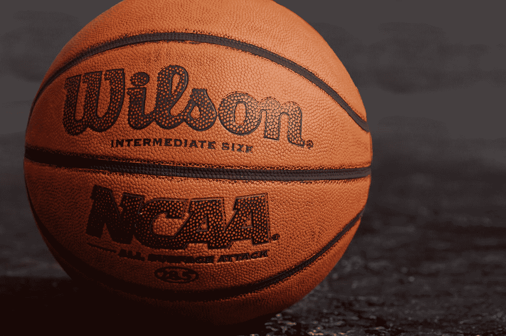
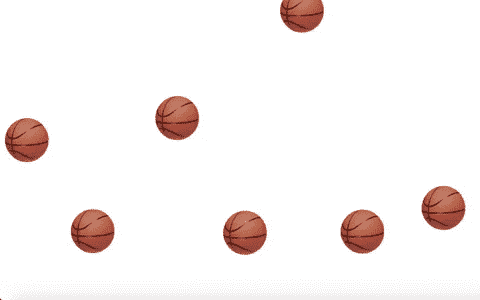
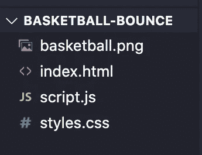
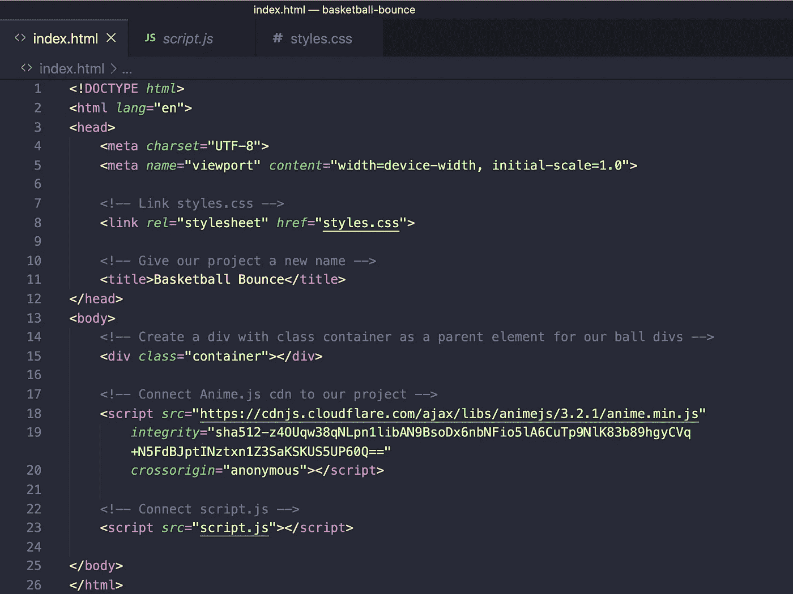
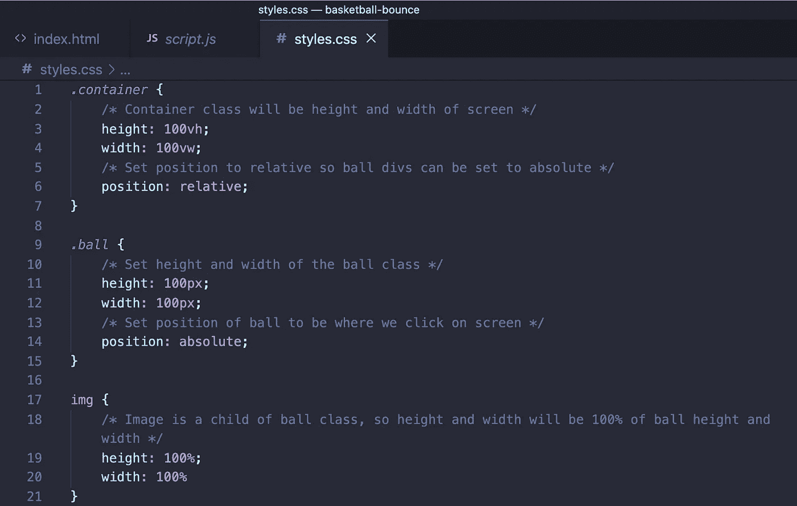
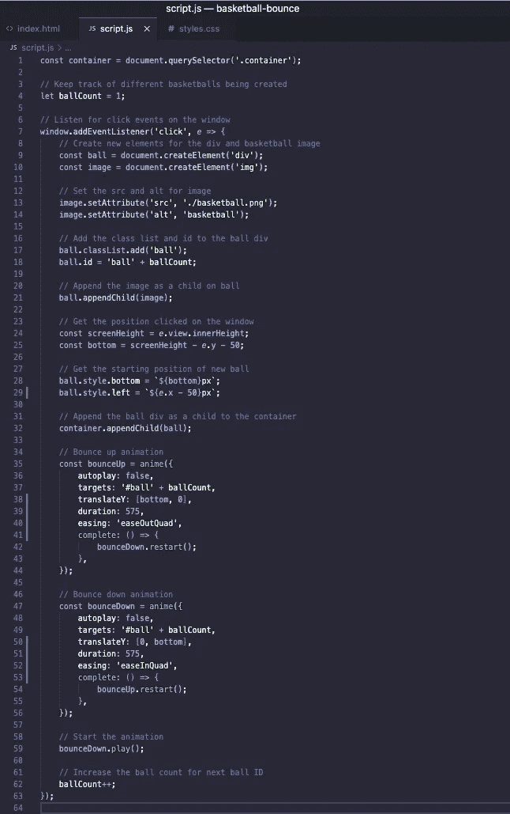
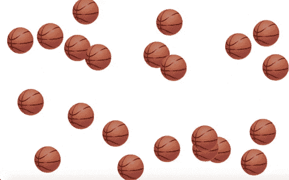

# 用 Anime.js 搭建弹跳篮球 App

> 原文：<https://javascript.plainenglish.io/build-a-bouncing-basketball-app-with-anime-js-90eb5b4630d1?source=collection_archive---------8----------------------->

## 用 Anime.js 创建弹跳效果



Photo by [Ben Hershey](https://unsplash.com/@benhershey?utm_source=medium&utm_medium=referral) on [Unsplash](https://unsplash.com?utm_source=medium&utm_medium=referral)

我最近一直在玩一些 JavaScript 库，偶然发现了 Anime.js. Anime.js 是一个轻量级的 JavaScript 动画库，可以处理 CSS 属性、SVG、DOM 属性和 JavaScript 对象。在本文中，我们通过创建一个弹跳效果和构建一个弹跳篮球 app 来看看这个库。



Preview of what we will build

# 入门指南

让我们首先创建一个新的项目目录。我将使用 [Visual Studio 代码](https://code.visualstudio.com/)作为我的代码编辑器和一个名为 [Live Server](https://marketplace.visualstudio.com/items?itemName=ritwickdey.LiveServer) 的扩展，我们可以用它在浏览器中查看我们的应用程序。在我们的项目目录中，我们将创建 3 个文件，index.html、styles.css 和 script.js，我们将有一个篮球图像。你可以看看下面我的 GitHub repo，获取篮球图片。

[](https://github.com/chadmuro/basketball-bounce) [## chadmuro/篮球-弹跳

### 用 Anime.js GitHub 创建的 Bounce effect 是超过 5000 万开发者的家园，他们一起工作来主持和审查…

github.com](https://github.com/chadmuro/basketball-bounce) 

我们的起始文件结构应该是这样的。



File structure

## 设置我们的 HTML 文件

让我们首先建立 index.html 文件。在 Emmet 的帮助下，我们可以通过键入一个感叹号，后跟一个制表符来创建一个 HTML 框架。让我们首先链接 styles.css 并将 script.js 添加到我们的 index.html 文件中。要访问 Anime.js 库，我们可以添加 [cdn](https://cdnjs.com/libraries/animejs) 脚本。在主体中，我们需要的只是一个 div，我们将为它指定一个容器的类名。这个容器 div 将作为我们将在 JavaScript 中创建的 ball divs 的父容器。我们最终的 index.html 文件将是这样的。



index.html

## 设置我们的 CSS 文件

接下来让我们处理 styles.css 文件。首先，我们将通过添加 100vh 的高度和 100vw 的宽度来设置容器类的样式。这将使应用程序的视图与我们的屏幕保持相同的大小。我们还将添加相对位置，因为我们将球定位为绝对位置。

我们将有一个 ball 类用于我们稍后创建的 ball divs，我们将赋予它 100px 的高度和宽度，以及绝对位置。

最后，我们将给出我们的图像高度和宽度为 100%。该图像将是我们的球分区的子。



styles.css

# 用 Anime.js 创建弹跳效果

在开始使用 script.js 文件之前，我们先来看看 Anime.js 库，并创建我们的 bounce 函数。你可以用这个库做很多动画，我喜欢在 [CodePen](https://codepen.io/collection/XLebem/) 上浏览它们的一些例子。

为了创建一个反弹效果，我们将创建两个函数，bounceUp 和 bounceDown。这两个函数都将调用 anime 函数，并具有下面我将解释的属性。

*   **自动播放**:如果您希望动画自动播放，设置为 true 或 false。
*   **目标**:对我们想要制作动画的部分的引用(可以是 HTML 标签、类、id 等)。例如，要制作一个 id 为 ball 的元素的动画，它将是' #ball '。
*   **translateY** :一个数组，沿 Y 轴有开始点和结束点，动画将在这里出现。
*   **时长**:动画的时长(毫秒)。
*   **缓动**:动画移动的方式。您可以在这里查看不同的缓动选项。
*   **完成**:动画完成时运行的功能。

```
const bounceUp = anime({
  autoplay: false,
  targets: '#ball' + ballCount,
  translateY: [bottom, 0],
  duration: 575,
  easing: 'easeOutQuad',
  complete: () => {
    bounceDown.restart();
  }
}):const bounceDown = anime({
  autoplay: false,
  targets: '#ball' + ballCount,
  translateY: [0, bottom],
  duration: 575,
  easing: 'easeInQuad',
  complete: () => {
    bounceUp.restart();
  }
});
```

bounceUp 和 bouceDown 函数是相同的，只是我们反转了 translateY 值，更改了缓动值，并在完成时重新启动了相反的函数。

# 设置我们的 JavaScript 文件

现在我们已经了解了如何使用 Anime.js 创建反弹效果，让我们开始处理我们的 script.js 文件。我们将首先创建一个对我们在 index.html 文件中创建的容器 div 的引用，并将它存储在一个名为 container 的变量中。我们还将创建一个名为 ballCount 的变量，它将帮助我们跟踪球的数量，并为每个球分配一个不同的 id。

```
const container = document.querySelector('.container');
let ballCount = 1;
```

在我们的应用程序中，我们将在每次单击窗口时创建一个新的弹跳篮球。首先，向窗口添加一个 click 事件侦听器。这个点击事件将运行以下步骤。

```
window.addEventListener('click', e => {})
```

## 1.创造球

我们首先使用 document.createElement 创建一个 div 和一个图像。对于图像元素，我们将设置 src 的属性为篮球图像的路由，并设置一个 alt 为 basketball。

对于 div，我们将把类设置为 ball，并给它一个 ball 的 id 加上我们前面声明的 ballCount 数。这是为了跟踪这个球元素，并在以后制作动画。

最后，我们将把图像作为子元素添加到 ball div 中。

```
const ball = document.createElement('div');
const image = document.createElement('img');image.setAttribute('src', './basketball.png');
image.setAttribute('alt', 'basketball');ball.classList.add('ball');
ball.id = 'ball' + ballCount;ball.appendChild(image);
```

## 2.设置球的位置

然后，我们将球的起始位置设置为我们在屏幕上单击的位置。使用 e.view.innerHeight，我们可以得到屏幕的高度。记住，我们的 ball div 将处于绝对位置，所以我们将在 ball div 上设置 bottom 和 left 属性。bottom 属性将被设置为屏幕高度减去 e.y .的值减去 50。我们减去额外的 50，因为我们的球图像的高度是 100，所以我们想得到它的中心。然后，我们用 e.x 减 50 设置球的 left 属性。

```
const screenHeight = e.view.innerHeight;
const bottom = screenHeight - e.y - 50;ball.style.bottom = `${bottom}px`;
ball.style.left = `${e.x - 50}px`;
```

## 3.将球附加到容器中

现在我们已经创建并设置好了球，我们将把它作为子对象添加到容器 div 中。

```
container.appendChild(ball);
```

## 4.添加 Anime.js 函数

接下来，我们将添加前面解释过的 bounceUp 和 bounceDown 函数。如您所见，动画的目标将是我们创建的球的 id。对于 translateY 值，我们使用屏幕底部作为一个点，我们单击的点作为另一个点。

```
const bounceUp = anime({
  autoplay: false,
  targets: '#ball' + ballCount,
  translateY: [bottom, 0],
  duration: 575,
  easing: 'easeOutQuad',
  complete: () => {
    bounceDown.restart();
  }
}):const bounceDown = anime({
  autoplay: false,
  targets: '#ball' + ballCount,
  translateY: [0, bottom],
  duration: 575,
  easing: 'easeInQuad',
  complete: () => {
    bounceUp.restart();
  }
});bounceDown.play();
```

在上面代码片段的最后，我们通过调用 bounceDown 上的 play 来启动弹跳动画。然后循环运行，因为一旦一个函数完成，它就会调用另一个函数。

## 5.增加球数

最后，我们将增加 ballCount 变量，这样我们可以在下一次单击时创建一个新的 ball id。

```
ballCount++;
```

最终的 script.js 文件应该如下所示。



script.js

# 包扎

要预览您的应用程序，您可以使用 Live Server 扩展。在您的 index.html 文件中，右键单击编辑器并选择“用 Live Server 打开”。这将在连接到本地主机的浏览器中打开一个新的选项卡。现在，您可以在窗口中单击鼠标，创建任意数量的弹跳篮球。



感谢阅读！你可以点击这里查看我的最终应用[或者点击这里](https://chadmuro.github.io/basketball-bounce/)在我的 GitHub [上找到完整的代码。](https://github.com/chadmuro/basketball-bounce)