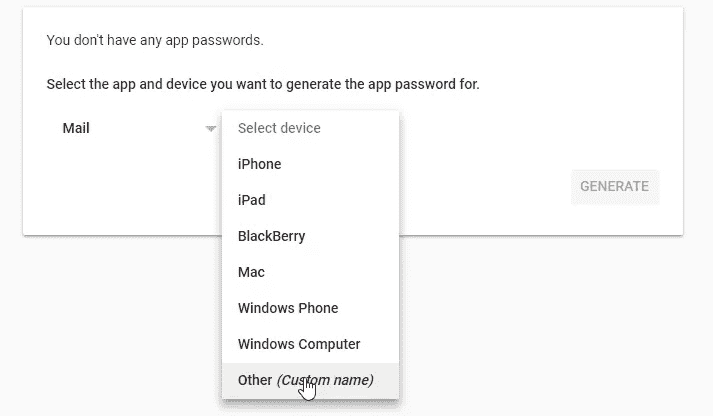

# 如何使用 Node.js 开发一个自动化的邮件发送引擎

> 原文：<https://javascript.plainenglish.io/build-a-clock-face-with-svg-in-react-native-e0611d41eec5?source=collection_archive---------5----------------------->

## 只需从您的 Web 应用程序发送电子邮件


Photo by [pixpoetry](https://unsplash.com/@blackpoetry?utm_source=medium&utm_medium=referral) on [Unsplash](https://unsplash.com?utm_source=medium&utm_medium=referral)

今天我将展示如何通过集成 Nodejs 从您的 web 应用程序发送电子邮件。你可以使用任何前端技术，这没有问题。通过向使用 Nodejs 构建的 API 发送电子邮件发送请求，您可以在任何情况下自动发送电子邮件。

这个电子邮件发送引擎支持所有类型的电子邮件提供商(gmail，雅虎，outlook 等)，但对于这篇文章，我将使用 Gmail。

要开始，您需要在电子邮件提供商内部创建电子邮件实例。

**对于 GMAIL 用户:**


Photo by [Solen Feyissa](https://unsplash.com/@solenfeyissa?utm_source=medium&utm_medium=referral) on [Unsplash](https://unsplash.com?utm_source=medium&utm_medium=referral)

a.去 https://security.google.com/settings/security/apppasswords 的[T3](https://security.google.com/settings/security/apppasswords)。可能会要求您登录您的 Google 帐户。请确保登录正确的帐户。

b.从可用应用列表中选择**邮件**

c.从设备列表中选择**其他**

d.输入您的自定义名称。你可以把“简单邮件”放进去。



e.点击**生成**按钮

f.将密码复制并保存到您的计算机上。

g.点击**完成**按钮，完成。

您需要保存密码以备将来使用。否则，你必须重新生成一个新的密码，因为一旦你点击完成按钮，谷歌不允许你查看密码。

***希望你已经准备好了申请&的密码！***

# 让我们开始编码吧


Photo by [Lala Azizli](https://unsplash.com/@lazizli?utm_source=medium&utm_medium=referral) on [Unsplash](https://unsplash.com?utm_source=medium&utm_medium=referral)

项目结构:

```
**>> GMAIL-SENDER**→ config
  |- web-server.js→ controllers
  |- sender.js→ services
  |- web-server.js
  |- router.js
  |- mailsender.jsindex.js
```

让我们创建所需的项目文件！

1.  **在配置文件夹内**

web-server.js

```
module.exports = {port: process.env.HTTP_PORT || 3000};
```

**2。在服务文件夹内**

web-server.js

```
const http = require('http');const express = require('express');const webServerConfig = require('../config/web-server.js');const morgan = require('morgan');const router = require('./router.js');let httpServer;function initialize() {return new Promise((resolve, reject) => {const app = express();httpServer = http.createServer(app);app.use(morgan('combined'));// Parse incoming JSON requests and revive JSON.app.use(express.json({reviver: reviveJson}));app.use(function(req, res, next) {res.header("Access-Control-Allow-Origin", "http://localhost:4401");res.header("Access-Control-Allow-Headers", "Origin, X-Requested-With, Content-Type, Accept");res.header('Access-Control-Allow-Methods', 'GET,PUT,POST,DELETE');res.setHeader('Access-Control-Allow-Credentials', true);next();});app.use('/api', router);httpServer.listen(webServerConfig.port).on('listening', () => {console.log(`Web server listening on localhost:${webServerConfig.port}`);resolve();}).on('error', err => {reject(err);});});}module.exports.initialize = initialize;function close() {return new Promise((resolve, reject) => {httpServer.close((err) => {if (err) {reject(err);return;}resolve();});});}module.exports.close = close;const iso8601RegExp = /^\d{4}-\d{2}-\d{2}T\d{2}:\d{2}:\d{2}(\.\d{3})?Z$/;function reviveJson(key, value) {if (typeof value === 'string' && iso8601RegExp.test(value)) {return new Date(value);} else {return value;}}
```

router.js

```
const express = require('express');const router = new express.Router();const sender = require('../controllers/sender.js');router.route('/sender/').post(sender.post);module.exports = router;
```

mailsender.js

```
const nodemailer = require('nodemailer');var transport = nodemailer.createTransport({host: "smtp.googlemail.com",port: 465,auth: {user: "YOUR EMAIL ADDRESS",pass: "YOUR GENERATED PASSWORD INISDE EMAIL"}});async function sendMail(mailText, subject, toSend, fromWho){const message = {from: fromWho, // Sender addressto: toSend,         // List of recipientssubject: subject, // Subject linehtml: mailText // Plain text body};transport.sendMail(message, function(err, info) {if (err) {console.log(err)} else {console.log(info);}});}module.exports.sendMail=sendMail;
```

**3。控制器文件夹内**

sender.js

```
const mailSender = require('../services/mailsender.js');async function post(req, res, next) {const stringWithPlaceholders = `<!DOCTYPE html PUBLIC "-//W3C//DTD XHTML 1.0 Transitional//EN" "http://www.w3.org/TR/xhtml1/DTD/xhtml1-transitional.dtd"><html ><head><meta http-equiv="Content-Type" content="text/html; charset=UTF-8" /><title>Email Sender Design</title><meta name="viewport" content="width=device-width, initial-scale=1.0"/><style>body {text-align: left;font-family: sans-serif;}</style></head><body><p>Hi Sir/ Madam,</p><p>We would like to invite you to the community.</p><p>Please click on below link for registration.</p>##link##<br>Best Regards,<br>Your Name</P></body></html>`;let url='<p><a href="http://localhost:4200/invite'>Click here</a></p>';let message = stringWithPlaceholders.replace(/{\w+}/g, placeholder =>replacements[placeholder.substring(1, placeholder.length - 1)] || placeholder,);message = message.replace("##link##", url);mailSender.sendMail(message, 'Invite Community Member', req.email,'youremail@gmail.com');console.log("email sent");} catch (err) {next(err);}}module.exports.post = post;
```

**4。根目录内**

索引. js

```
const webServer = require('./services/web-server.js');async function startup() {console.log('Starting application');try {} catch (err) {console.error(err);process.exit(1); // Non-zero failure code}try {console.log('Initializing web server module');await webServer.initialize();} catch (err) {console.error(err);process.exit(1); // Non-zero failure code}}startup();async function shutdown(e) {let err = e;console.log('Shutting down');try {console.log('Closing web server module');await webServer.close();} catch (e) {console.log('Encountered error', e);err = err || e;}console.log('Exiting process');if (err) {process.exit(1); // Non-zero failure code} else {process.exit(0);}}process.on('SIGTERM', () => {console.log('Received SIGTERM');shutdown();});process.on('SIGINT', () => {console.log('Received SIGINT');shutdown();});process.on('uncaughtException', err => {console.log('Uncaught exception');console.error(err);shutdown(err);});
```

希望你现在已经开发了需要的文件。现在，电子邮件发送引擎已经准备好了！

让我们运行程序:

打开一个终端，在项目文件夹中运行这个命令

```
node index.js
```

在浏览器中输入以下 URL:

```
[http://localhost:3000/api/sender](http://localhost:3000/api/sender)
```

# 摘要


Photo by [Jason Pofahl](https://unsplash.com/@jasonpofahlphotography?utm_source=medium&utm_medium=referral) on [Unsplash](https://unsplash.com?utm_source=medium&utm_medium=referral)

要从您的前端应用程序传递值，只需向 api url 发送一个 HTTP POST 请求—[HTTP://localhost:3000/API/sender](http://localhost:3000/api/sender)，然后电子邮件将立即被触发并发送。

希望这个有帮助。如果您对指定的步骤有任何疑问，请在评论部分告诉我。谢谢你&再见！！！