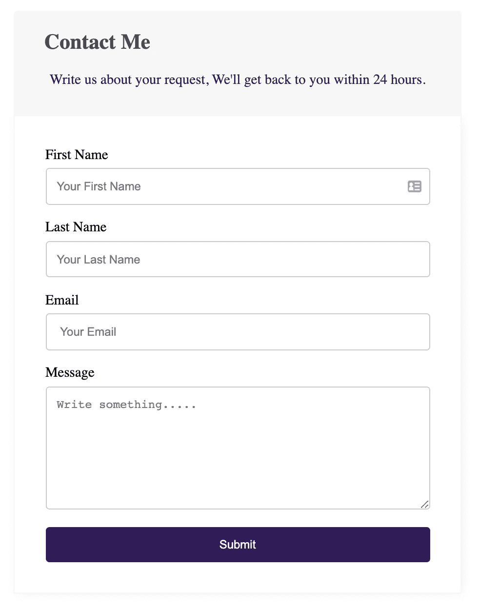

# 用 React 钩子和 PHP 创建一个联系表单

> 原文：<https://javascript.plainenglish.io/build-a-contact-form-with-react-hooks-and-php-47bc27927e54?source=collection_archive---------1----------------------->

## 用 React 钩子创建一个联系表单，并在你的 PHP 或 WordPress 网站中使用它！


Photo by [Joshua Aragon](https://unsplash.com/@goshua13?utm_source=medium&utm_medium=referral) on [Unsplash](https://unsplash.com?utm_source=medium&utm_medium=referral)

不久前，我写了一篇关于使用 [React 和 PHP](https://blog.bitsrc.io/how-to-build-a-contact-form-with-react-js-and-php-d5977c17fec0) 创建联系人表单的文章。许多人觉得这很有趣。所以，在这里我写了那篇文章的更新版本。

查看关于使用 React 和 PHP 创建联系人表单的文章:

[](https://blog.bitsrc.io/how-to-build-a-contact-form-with-react-js-and-php-d5977c17fec0) [## 用 React 和 PHP 建立一个联系表单

### 用 React 创建一个联系表单，并在你的 PHP 或 WordPress 网站中使用！

blog.bitsrc.io](https://blog.bitsrc.io/how-to-build-a-contact-form-with-react-js-and-php-d5977c17fec0) 

钩子是 React 中的新特性，我们将使用 React 钩子重新创建联系人表单。

## 先决条件？不尽然！

与[之前的项目相同。本教程对初学者很友好。您不需要成为 Javascript、React 或 PHP 方面的专家，但我不会深入介绍像安装 React 和设置项目这样的基本细节。](https://blog.bitsrc.io/how-to-build-a-contact-form-with-react-js-and-php-d5977c17fec0)

我假设您已经有了一个正在运行的 React 项目。我们将专注于创建组件。

> 在你开始之前:
> **如果你正在寻找一个简单的方法来创建你的表单并且不担心你的表单后端，试试**[**contact form . dev**](http://contactform.dev)

## 创建组件

如果您的项目中有一个组件文件夹，请在其中创建一个“Form”文件夹。由您来决定组件应该放在哪里。创建文件夹后，让我们创建“index.js”文件。

如果您已经看过上一篇文章，我们创建了一个类组件，但这次我们不需要它。相反，我们需要创建一个这样的函数:

为了使用 React 钩子，我们必须从 React 导入 useState。在你的文件的顶部，现在你可以导入 useState 和所有其他必要的包/文件。

如你所见，我们将使用“axios”包来获取数据。如果您的项目中没有这个包，请使用 Npm 或 Yarn 安装它:

```
npm install axios
```

## 状态

我们将使用 useState 来存储本地状态的数据。例如，我们将表单数据存储在一个状态中，错误和成功消息将存储在不同的状态中。在这些状态下，您的函数将如下所示:

此外，我们将有一个名为“config”的属性来获取表单标题和表单的其他配置。

## 视角

本质上，我使用了我上一篇文章中的代码，但是设计得到了改进。



标题和描述来自“配置”属性。为了创建灵活的字段，我们需要传递一个名为‘fields config’的属性

这是一个具有某些属性的对象。例如:

*id: 1，
标签:'名字'，
字段名:'名字'，
类型:'文本'，
占位符:'你的名字'，必填:true，类名:'名字-字段'*

您的函数在表单中将如下所示:

## 事件

在这种形式下我们有两个重要的事件。一个是处理表单提交，另一个是处理表单更改。

让我们创建一个函数来处理提交事件。我们将调用函数:“handleFormSubmit”。该函数将如下所示。

基本上，这个函数负责向 PHP API 发送数据。我将很快解释更多关于 API 的内容。当我们从 API 获得一个成功的响应时，我们将响应和错误状态设置为 false。如果我们从响应中得到一个错误，我们将用响应更新错误状态。

如果你需要关于这个函数的更好的解释，请查看我以前的文章:

[](https://blog.bitsrc.io/how-to-build-a-contact-form-with-react-js-and-php-d5977c17fec0) [## 用 React 和 PHP 建立一个联系表单

### 用 React 创建一个联系表单，并在你的 PHP 或 Wordpress 网站中使用！

blog.bitsrc.io](https://blog.bitsrc.io/how-to-build-a-contact-form-with-react-js-and-php-d5977c17fec0) 

我们将需要另一个函数来处理输入字段的任何变化。每当用户在文本字段中键入内容时，handleChange 将触发并更新 formData 状态。

handleChange 函数将如下所示:

最后，这是表单组件的完整概述:

我创建了一个 GitHub repo 来使它更容易跟踪。请随意克隆它并使用它:

[](https://github.com/malithmcr/react-php-contact-form) [## malithmcr/react-PHP-contact-form

### 这是我的博客文章《用 react 和 php 创建联系人表单》中的教程的报告。请复制此回购并在…

github.com](https://github.com/malithmcr/react-php-contact-form) 

关于 PHP 部分，我在之前的文章中有更好的解释。你也可以跟随[这个文件夹](https://github.com/malithmcr/react-php-contact-form/tree/master/api)从 GitHub repo 来设置它。

如果你仍然错过了这些文章中的任何东西，我还在这里发布了一个视频:

感谢阅读！我希望这篇文章能帮助你理解 ReactHooks 的实际工作方式。

干杯！

[](https://www.craftcode.design/) [## Craft Code | Next.js 和 React 文章

### 学习 Next.js，用我每周的内容来反应。

www.craftcode.design](https://www.craftcode.design/) [](https://malith-dev.medium.com/subscribe) [## 订阅以增长您的 javascript 知识

### 通过注册来增长你的 javascript 知识，你将创建一个中型帐户，如果你还没有…

malith-dev.medium.com](https://malith-dev.medium.com/subscribe) 

为你的下一个项目获得优质的 WordPress 托管服务:

[](https://kinsta.com/?kaid=WZRKJQSDWLDY) [## Kinsta 管理的 WordPress 主机，面向所有人，无论规模大小

### 由谷歌云支持的优质托管 WordPress 主机。闪电般的加载速度、24/7 专家支持，以及…

kinsta.com](https://kinsta.com/?kaid=WZRKJQSDWLDY)