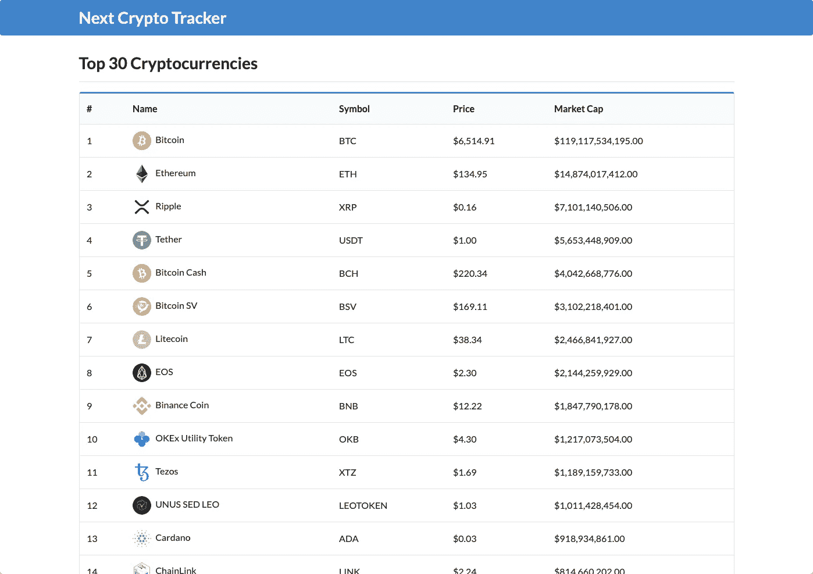
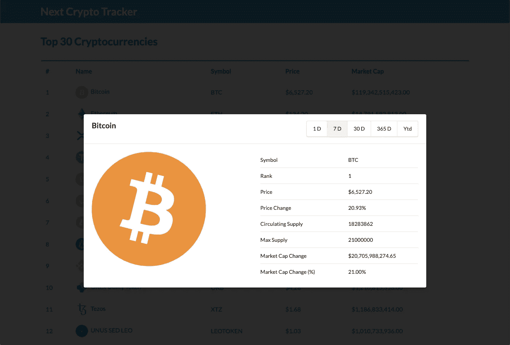
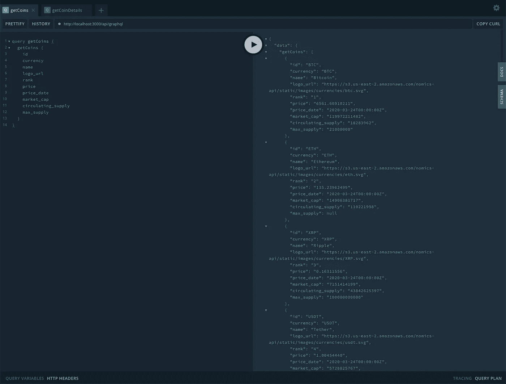
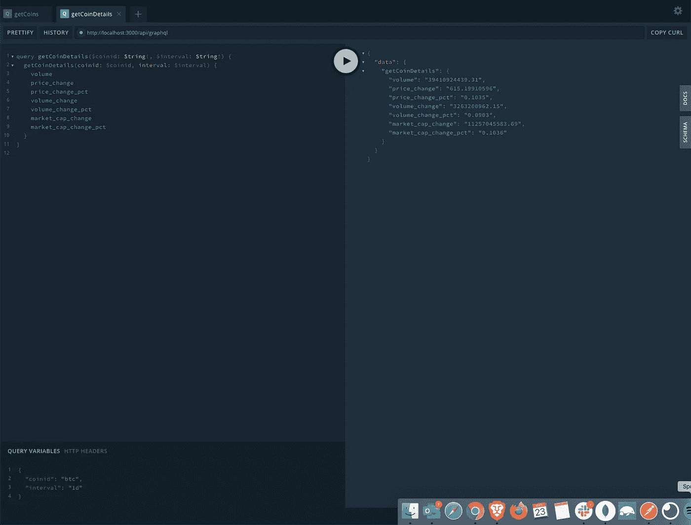
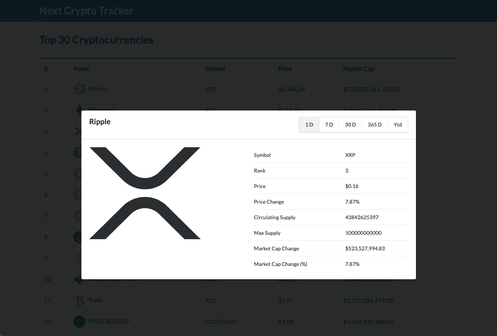
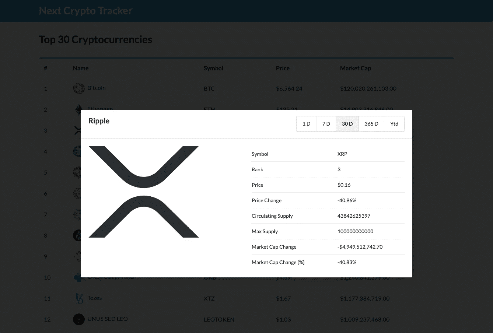

# 用 Next.js 和 Apollo GraphQL 构建加密货币追踪器

> 原文：<https://javascript.plainenglish.io/build-a-cryptocurrency-tracker-with-next-js-and-apollo-graphql-c776cff6b8bf?source=collection_archive---------6----------------------->

## 跟踪比特币、以太币、莱特币和其他加密货币的价格！


Photo by [Austin Distel](https://unsplash.com/@austindistel?utm_source=medium&utm_medium=referral) on [Unsplash](https://unsplash.com?utm_source=medium&utm_medium=referral)

# 介绍

凭借在 [Github](https://github.com/zeit/next.js/) 上超过 *45，000* 位明星和超过 *300，000* [npm](https://www.npmjs.com/package/next) 周下载量， [Next.js](https://nextjs.org/) 是目前该领域最热门的 React 框架之一。它提供了开箱即用的服务器端渲染，针对速度进行了优化，并且相对快速且易于启动和运行。我现在不会深入探讨 [Next.js](https://nextjs.org/) 的所有好处，因此我们可以专注于构建我们的加密货币跟踪应用程序！

# 我们正在建造的东西

在本文中，我们将使用 [Next.js](https://nextjs.org/) 和 [Apollo GraphQL](https://www.apollographql.com/) 构建一个加密货币追踪应用程序。该应用程序将通过轮询间隔从 [Nomics API](https://p.nomics.com/cryptocurrency-bitcoin-api) 获取数据来显示前 30 种加密货币的价格。让我们快速浏览一下特性。

*   在主页上，我们将在一个格式精美的表格中显示前 30 种加密货币的列表。
*   每一行都是可选择的——当选择时，会弹出一个模式，显示硬币在过去一天的详细数据。
*   在模式弹出窗口中—用户可以将日期范围从 1 天更改为 7 天、30 天、365 天和年初至今。



Home Page — Displays the top 30 cryptocurrencies



Coin Details Modal — Displays detailed information on selected coin

您可以在我的 github 上找到完整的项目:

[](https://github.com/kluu1/next-crypto-tracker) [## kluu1/下一个加密跟踪器

### 用 Apollo graph QL-kluu 1/next-crypto-tracker 在 Next.js 中构建一个加密货币跟踪器

github.com](https://github.com/kluu1/next-crypto-tracker) 

# 先决条件

在开始之前，让我们先了解一下本教程的一些先决条件。

*   节点版本 10.x —对于 [Next.js](https://nextjs.org/) 是必需的
*   经济学家 AP(T21)I key——用于获取加密货币价格
*   [React.js](https://reactjs.org/) 知识
*   [Node.js](https://nodejs.org/) 知识
*   [GraphQL](https://graphql.org/) 的知识
*   [Next.js](https://nextjs.org/) 的一些知识

# 项目设置

我假设你已经安装了 [Next.js](https://nextjs.org/) 。在撰写本文时， [Next.js](https://nextjs.org/) 的最新版本是 9.3.0。

让我们开始创建一个新的 [Next.js](https://nextjs.org/) 项目，在终端中运行`**npm init next-app**` ，并将该项目命名为***next-crypto-tracker****。*

```
*npm init next-app*
```

# *构建 GraphQL 服务器*

*首先，我们将使用 [Apollo GraphQL](https://www.apollographql.com/) 构建后端，从 [Nomics](https://nomics.com/) 获取加密货币数据。然后我们可以将数据返回到前端进行渲染。让我们在您最喜欢的源代码编辑器中打开项目，并创建一些新文件。*

*   *`/pages/api/index.js`*
*   *`/pages/api/resolvers.js`*
*   *`/pages/api/typeDefs.js`*

## *设置 TypeDefs*

*让我们打开`/pages/api/typeDefs.js`并定义 GraphQL 模式和查询。这个文件描述了我们的数据的外观和类型。我们将公开两个查询，一个用于获取前 30 个硬币的列表，另一个用于按时间间隔(1d、7d、30d、365d、ytd)获取特定硬币及其详细数据。*

*typeDef defines the data structure and queries*

## *设置解析器*

*接下来，我们构建解析器来获取和返回数据。打开`/pages/api/resolvers.js`，修改成如下图。*

*resolvers tells us how to handle our queries*

*这里，我们有解析器来处理我们的查询，`getCoins`和`getCoinDetails`。*

*我们使用`getCoins`来获取加密货币的列表。默认情况下， [Nomics](https://nomics.com/) 将返回所有加密货币——这比我们想要的数据要多。我们使用 slice 方法返回前 30 个加密货币，因此我们不会返回大量数据。*

*`getCoinDetails`解析器将获取特定硬币的数据，并在一个时间间隔(1d、7d、30d、365d、ytd)内返回其数据。*

## *设置 GraphQL 服务器*

*最后，打开`/api/graphql/index.js`并添加以下代码:*

*我们导入 typeDefs 和解析器来创建我们的 Apollo 服务器。然后我们在`/api/graphql`路径上创建了处理程序。*

## *测试我们的 GraphQL 服务器*

*在我们深入前端之前，让我们测试一下我们的后端是否设置好并正常运行。从您的终端，运行项目根目录下的`npm run dev`来启动应用程序。一旦应用程序编译完成并准备就绪，请在浏览器中访问[http://localhost:3000/API/graph QL](http://localhost:3000/api/graphql)。让我们测试我们的查询。*

**

*Testing the getCoins query*

**

*Testing the getCoinDetails query*

*这就是设置 Apollo GraphQL 服务器的基本内容。我们现在可以开始构建前端了。*

# *构建前端*

*现在我们可以将注意力转移到构建应用程序的前端。我们将从在我们的应用程序中配置和设置 Apollo 客户端开始。然后，我们将设置组件和页面。在我们开始之前，让我们为我们将在整个应用程序中使用的过滤器和查询创建一些文件。*

*在根目录下创建一个新文件夹`utils`和一个新文件`/utils/filters.js`。这里，我们有一个用于格式化货币并将十进制值转换为百分比的过滤器。*

*/utils/filters.js*

*接下来，创建一个新文件来存储我们的 GraphQL 查询，`/utils/queries.js`。`getCoinDetails`查询有两个参数，`coinid`和`interval`，这两个参数都是字符串类型，并且是必需的。*

*/utils/queries.js*

## *配置 Apollo 客户端*

*在`utils`文件夹中创建一个新文件`apollo-client.js`，并添加以下代码。这个文件将创建一个新的 Apollo 客户机。我们导出它，以便在我们的入口点`_app.js`中使用它。*

*/utils/apollo-client.js*

## *_app.js 页面*

*创建一个新文件`/pages/_app.js`。这将是我们所有页面的入口点。这是我们从刚刚创建的`apollo-client.js`文件中导入 Apollo 客户端并将其传递给 Apollo Provider 的地方。然后，我们将整个应用程序包装在 Apollo 提供程序中。*

*/pages/_app.js*

## *布局组件*

*接下来，让我们着手构建布局。该布局是一个包装组件，将在其中呈现我们的所有页面。这是我们设置标题内容和标题的地方。让我们在`/components/_App/Layout.js`中创建该文件。*

*/components/_App/Layout.js*

## *标题组件*

*现在来看标题组件。创建一个新文件`/components/_App/Header.js`并复制以下代码。这是我们的标题，将显示在我们的应用程序的顶部。*

*/components/_App/Header.js*

## *可共溶成分*

*现在我们有了布局，让我们构建一些核心组件。硬币表组件将为传递到该组件的硬币列表呈现一个格式化的表。创建一个新文件`/components/Index/CoinsTable.js`。*

*每一行都是可选的。当您选择该行时，会弹出一个模态，显示关于该硬币的详细信息。注意，在第 45 行，我们将选择的硬币传递给模型，这样模型就可以获取选择的硬币的详细数据。*

*`/components/Index/CoinsTable.js`*

## *硬币细节模型*

*好吧，让我们处理硬币细节模型。创建一个新文件`/components/Index/CoinDetailsModal.js`并粘贴下面的代码。注意，在第 7 行，我们从将从 CoinsTable 传入的 props 中析构了 coinDetails。有了这些数据，我们就能获取硬币的详细信息。*

*当一个模态第一次弹出时，它显示过去一天所选硬币的详细信息。用户可以选择其他时间间隔，如 7 天、30 天、365 天和年初至今。*

*请注意第 57 行，我决定将表格组件化，将硬币细节显示到一个单独的文件中，因为这个文件变得相当大。*

*`/components/Index/CoinDetailsModaljs`*

## *硬币细节模型表*

*创建一个新文件`/components/Index/CoinDetailsModalTable.js`。如上所述，该组件以模态显示表格，其中包含所选硬币的详细数据。*

*`/components/Index/CoinDetailsModalTable.js`*

## *主页*

*转到主页，创建一个新文件`/pages/index.js`。在页面加载时，我们将获取排名前 30 位的加密货币的列表，并将它们传递到我们在前面几节中构建的 CoinsTable 组件中。*

*由于硬币数据不断变化，我已经将`fetchPolicy`设置为`network-only`，所以我们不会缓存任何结果。我还设置了 5000 毫秒的轮询间隔，即 5 秒。你可以随意改变这个时间间隔！*

*/pages/index.js*

## *测试我们的应用*

*现在让我们运行并测试我们的应用程序！打开您的终端并导航到项目的根目录，然后运行`npm run dev`。一旦应用程序编译完毕，在浏览器中打开 [http://localhost:3000](http://localhost:3000) 。如果一切正常，您应该会看到类似下面的截图！*

**

*Home Page — Displays the top 30 cryptocurrencies*

*现在选择一枚硬币，并检查模态！*

**

*Coin Details Modal for XRP*

*最后，选择不同的时间间隔，并验证数据是否反映了这种变化。*

**

*Selected 30 D for XRP*

*就这样结束了！*

# *摘要*

*让我们回顾一下。我们首先关注用 Apollo GraphQL 服务器设置我们的后端。然后，我们将重点转移到前端，在那里我们连接了 Apollo 客户端并构建了我们的组件和页面。多亏了 Next.js，这一切只需要一点点配置就能实现。如果你有兴趣将这个项目展示给全世界，可以看看我的文章“[如何将 Next.js 应用程序部署到 Heroku](https://medium.com/javascript-in-plain-english/how-to-deploy-a-next-js-app-to-heroku-d33bd86c2a2b) ”。*

*[](https://medium.com/javascript-in-plain-english/how-to-deploy-a-next-js-app-to-heroku-d33bd86c2a2b) [## 如何将 Next.js 应用程序部署到 Heroku

### 在几分钟内将带有 Apollo GraphQL API 的 Next.js 应用程序快速部署到 Heroku

medium.com](https://medium.com/javascript-in-plain-english/how-to-deploy-a-next-js-app-to-heroku-d33bd86c2a2b) 

我希望你喜欢这篇文章，它或者有趣或者对你有帮助。给我所有的密码朋友..继续拥抱我的朋友！2020 快乐！🚀

我在业余时间写这些文章是为了娱乐。如果你喜欢这篇文章，请在下面留下你的喜欢和评论！可以关注我上 [*中*](https://medium.com/@this.kevinluu) *和* [*推特*](https://twitter.com/kluu_10) *。感谢支持！**