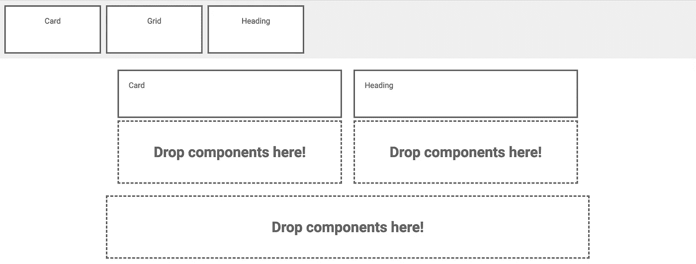
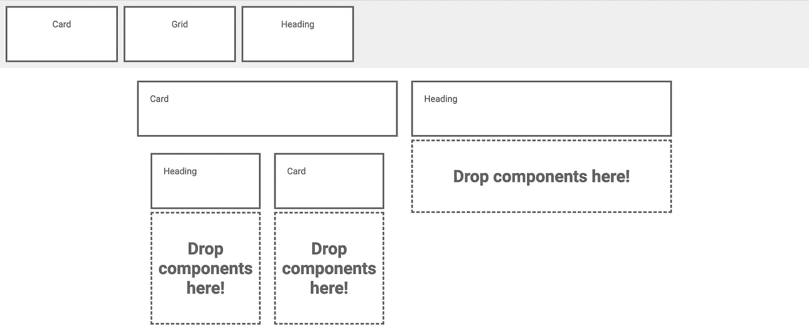

# 用 React 和 ImmutableJS 构建一个拖放(DnD)布局生成器

> 原文：<https://javascript.plainenglish.io/build-a-drag-and-drop-dnd-layout-builder-with-react-and-immutablejs-78a0797259a6?source=collection_archive---------0----------------------->


Drag and Drop in React!

对于“*拖放*”类型的行为，比如建立网站( *Wix* )或交互式应用( *Trello* )有着巨大的用户需求。毫无疑问，这种类型的交互创造了非常酷的用户体验。再加上一些最新的用户界面技术，我们可以创造出一些非常好的软件。

# 这篇文章的最终目标是什么？

我想创建一个拖放布局生成器，让用户能够从一系列可定制的用户界面组件构建布局，最终组成是一个网站或 web 应用程序。

# **我们将使用哪些工具？**

1.  **反应**
2.  **不变的**

让我们花一点时间来解释他们在构建这个过程中的角色。

# **反应**

[React](https://reactjs.org/) 是基于声明式编程的，这意味着它从状态中导出它的呈现。State 实际上只是一个 JSON 对象，它包含的属性告诉 React 事物应该是什么样子和行为。不像 jQuery 这样的 DOM 操作库，我们不直接改变 DOM，我们改变状态并由 React 处理 DOM(我们稍后将讨论这个问题)。

在这个项目中，我设想我们将有一个父组件，它将保存我们的布局(JSON)的状态，这个状态将被传递给我们的每个组件，这些组件将是无状态的 React 组件。

组件的作用是从父组件获取状态，并根据属性呈现自身。

下面是一个包含三个链接对象的状态的快速示例:

```
{
  links:  [{
    name: "Link 1",
    url: "http://link.one",
    selected: false
  }, {
    name: "Link 2",
    url: "http://link.two",
    selected: true
  }, {
    name: "Link 3",
    url: "http://link.three",
    selected: false
  }]
}
```

在上面的例子中，我们可以遍历 links 数组，并为每个链接创建一个无状态的 React 组件:

```
interface ILink {
  name: string;
  url: string;
  selected: boolean;
}const LinkComponent = ({ name, url, selected }: ILink) =>
<a href={url} className={selected ? 'selected': ''}>{name}</a>;
```

您可以看到我们是如何基于 state 中保存的选定属性将 css 类“selected”应用于链接组件的。这是将呈现给浏览器的内容:

```
<a href="http://link.two" class="selected">Link 2</a>
```

# 不变的

我们已经了解了状态在我们的项目中的重要性，它是关于应该如何使用 React 组件呈现事物的*唯一真实来源*。React 中的状态保存在不可变的数据结构中。

简单地说，这意味着一旦数据对象被创建，它**就不能被直接**改变。相反，我们必须用更改后的状态创建一个新对象。

让我用另一个简单的例子来说明不变性:

```
interface ILink {
  name: string;
  url: string;
  selected: boolean;
}const link: ILink = {
    name: "Link 1",
    url: "http://link.one",
    selected: false
}
```

传统上，在 Javascript 中，您可以执行如下操作来更新链接对象:

```
link.name = 'New name';
```

如果我们的状态是不可变的，这是不可能的，相反，我们必须创建一个新的对象，并更改其名称:

```
link = {...link, name: 'New name' };
```

*注意:为了支持不变性，React 提供了一个名为* `*this.setState()*` *的方法，我们可以用它来告诉组件状态已经改变，如果有任何改变，就重新呈现它自己。*

上面的例子很简单，但是如果我们想改变一个嵌套在复杂 JSON 状态结构中几层的属性，会发生什么呢？

ECMA 脚本 6 给了我们一些方便的操作符和方法来改变对象，但是它们对于复杂的结构来说并不是很好，这就是为什么我们需要 [ImmutableJS](https://github.com/immutable-js/immutable-js) 来简化任务。

我们稍后会用到 ImmutableJS，但是现在你只需要知道它在给我们提供奇特的方法来改变复杂状态中的作用。


# HTML5 拖放(DnD)

我们知道我们的状态是一个不可变的 JSON 对象，React 负责组件，但是我们需要有趣的用户交互，对吗？

多亏了 HTML5，这实际上非常简单，因为它公开了我们可以用来检测组件何时被拖动以及被放到何处的方法。由于 React 向浏览器公开了原生 HTML 元素，我们可以只使用原生事件，从而使我们的生活更加简单。

*注意:我知道使用 DnD 的 HTML5 实现可能会有些奇怪，但如果没有别的，这可能是一个发现课程，如果证明有问题，我们可以稍后将其切换。*

在这个项目中，我将有组件(HTML divs)用户可以拖动。我将把它们称为**拖后腿的东西**。

我们还将有一些区域允许用户放置组件，我将把它们称为**dropboables**。

使用本机 HTML5 事件，即`onDragStart`、`onDragOver`和`onDragDrop`，我们应该有了根据 DnD 交互改变应用程序状态所需的东西。

*这里有一个可拖动组件的例子:*

```
export interface IDraggableComponent {
  name: string;
  type: string;
  draggable?: boolean;
  onDragStart: (ev: React.DragEvent<HTMLDivElement>, name: string, type: string) => void;
}export const DraggableComponent = ({
  name,
  type,
  onDragStart,
  draggable = true
}: IDraggableComponent) =>
<div className='draggable-component' draggable={draggable} onDragStart={(ev) => onDragStart(ev, name, type)}>{name}</div>;
```

在上面的代码片段中，我们呈现了一个 React 组件，它使用`onDragStart`事件告诉我们的父组件我们开始拖动该组件了。我们也可以通过传递`draggable`道具来切换拖动它的能力。

*这里有一个可丢弃组件的例子:*

```
export interface IDroppableComponent {
  name: string;
  onDragOver: (ev: React.DragEvent<HTMLDivElement>) => void;
  onDrop: (ev: React.DragEvent<HTMLDivElement>, componentName: string) => void;
}export const DroppableComponent = ({
  name,
  onDragOver,
  onDrop
}: IDroppableComponent) =>
<div className='droppable-component'
  onDragOver={(ev: React.DragEvent<HTMLDivElement>) => onDragOver(ev)}
  onDrop={(ev: React.DragEvent<HTMLDivElement>) => onDrop(ev, name)}>
  <span>Drop components here!</span>
</div>;
```

在上面的组件中，我们正在监听`onDrop`事件，因此我们可以基于新组件被放入可放下组件来更新状态。

*好了，在把所有这些放在一起之前，是时候快速回顾一下了:*

*我们将使用 React 来渲染整个布局，使用一些基于状态对象的解耦无状态组件。用户交互将由 HTML5 DnD 事件处理，该事件将通过使用 ImmutableJS 触发对状态对象的更改。*


# 一起拖动它

现在我们已经对我们要做什么以及如何实现它有了一个坚实的理解，让我们来考虑这个难题的一些最重要的部分:

1.  布局状态
2.  拖放构建器组件
3.  在网格中呈现嵌套组件

# 1.布局状态

为了使用我们的组件表示无限的布局组合，状态需要是灵活的和可伸缩的。我们还需要记住，我们本质上想要表示任何给定布局的 DOM 树，这意味着许多可爱的递归来支持嵌套结构！


我们的状态需要存储大量组件，这些组件可以由以下接口表示:

*如果你不熟悉 JavaScript 中的接口，你应该看看*[*TypeScript*](https://www.typescriptlang.org/)*——你可能会说我是个粉丝。它与 React 一起工作也很好。*

```
export interface IComponent {
  name: string;
  type: string;
  renderProps?: {
    size?: 1 | 2 | 3 | 4 | 5 | 6 | 7 | 8 | 9 | 10 | 11 | 12
  };
  children?: IComponent[];
}
```

我保持了组件定义的最小化，但是您可以根据需要扩展它。我在这里定义了一个`renderProps`对象，这样我们就可以为组件提供道具来告诉它们如何渲染。这里的`children`属性给了我们递归。

在更高的层次上，我想创建一个对象数组来保存组件，这些组件将出现在状态的根中。

为了说明这一点，让我们提出以下用 HTML 标记的有效布局:

```
<div class="content-panel-1">
  <div class="component">
    Component 1
  </div>
  <div class="component">
    Component 2
  </div>
</div>
<div class="content-panel-2">
  <div class="component">
    Component 3
  </div>
</div>
```

为了在状态中表示这一点，我们可以为内容面板定义如下所示的接口:

```
export interface IContent {
  id: string;
  cssClass: string;
  components: IComponent[];
}
```

我们的状态于是变成了一个像这样的`IContent`阵列:

```
const state: IContent[] = [
  {
    id: 'content-panel-1',
    cssClass: 'content-panel-1',
    components: [{
      type: 'component1',
      renderProps: {},
      children: []
    },
    {
      type: 'component2',
      renderProps: {},
      children: []
    }]
  },
  {
    id: 'content-panel-2',
    cssClass: 'content-panel-2',
    components: [{
      type: 'component3',
      renderProps: {},
      children: []
    }]
  }
];
```

通过在`children`数组属性中加入额外的组件，我们可以定义额外的组件来创建嵌套的类似 DOM 的树结构:

```
[0]
  components:
    [0]
      children:
        [0]
          children:
            [0]
               ...
```


# 2.拖放布局生成器

布局生成器组件将执行一系列功能，例如:

*   保持和更新组件状态
*   渲染*可拖拉物*和*可掉落物*
*   呈现我们的嵌套布局结构
*   触发 DaD HTML5 事件

让我们看看它可能是什么样子:

```
export class BuilderLayout extends React.Component { public state: IBuilderState = {
    dashboardState: []
  }; constructor(props: {}) {
    super(props); this.onDragStart = this.onDragStart.bind(this);
    this.onDragDrop = this.onDragDrop.bind(this);
  } public render() { } private onDragStart(event: React.DragEvent <HTMLDivElement>, name: string, type: string): void {
    event.dataTransfer.setData('id', name);
    event.dataTransfer.setData('type', type);
  } private onDragOver(event: React.DragEvent<HTMLDivElement>): void {
    event.preventDefault();
  } private onDragDrop(event: React.DragEvent <HTMLDivElement>, containerId: string): void { } }
```

让我们暂时忽略`render()`,因为我们很快就会看到它。

我们有三个事件，我们将绑定到我们的 draggables 和 droppables。

`onDragStart()` —这里我们设置一些关于`event`对象中组件的细节，即`name`和`type`。

`onDragOver()` —我们现在没有对此事件做任何事情，事实上我们正在使用`.preventDefault()`禁用默认的浏览器行为。

这就剩下`onDragDrop()`了，这就是改变不可变状态对象的神奇之处。为了改变状态，我们需要几条信息:

*   在`event`对象`onDragStart()`中设置的要删除的组件名称`name`。
*   要删除的组件的类型—`event`对象`onDragStart()`中设置的`type`。
*   它被放入的地方— `containerId`从 droppable 传递到这个方法。

`containerId`必须告诉我们必须在状态中的什么地方添加新组件。可能有一种更简洁的方法，但是为了描述这个位置，我将使用一个由下划线分隔的索引列表。

回到我们的状态模型:

```
[index]
  components:
    [index]
      children:
        [index]
          children:
            [index]
               ...
```

这可以用字符串格式`cb_index_index_index_index`来表示。

这里的索引数量描述了组件在嵌套结构中应该被删除多少层。

现在我们需要调用[**immutableejs**](https://github.com/immutable-js/immutable-js)的力量来帮助我们改变应用程序的状态。我们将在我们的`onDragDrop()`方法中这样做，它可能看起来像这样:

```
private onDragDrop(event: React.DragEvent <HTMLDivElement>, containerId: string) {
  const name = event.dataTransfer.getData('id');
  const type = event.dataTransfer.getData('type'); const newComponent: IComponent =  this.generateComponent(name, type); const containerArray: string[] = containerId.split('_');
  containerArray.shift(); // ignore first param, it is string prefix const componentsPath: Array<number | string> = []   containerArray.forEach((id: string, index: number) => {
  componentsPath.push(parseInt(id, INT_LENGTH));
  componentsPath.push(index === 0 ? 'components' : 'children');
}); const { dashboardState } = this.state;
  let componentState = fromJS(dashboardState); componentState = componentState.setIn(componentsPath,       componentState.getIn(componentsPath).push(newComponent)); this.setState({ dashboardState: componentState.toJS() });}
```

这里的力量来自 ImmutableJS 给我们的`.setIn()`和`.getIn()`方法。

它们接受一个字符串/值数组来标识您想要在嵌套状态模型中的何处获取或设置值。这非常符合我们生成可丢弃 id 的方式。是不是很酷？

`fromJS()`和`toJS()`方法将我们的 JSON 转换成一个 ImmutableJS 对象，然后再转换回来。

*有太多不可改变的事情，所以将来我可能会专门写一篇关于它的文章。抱歉，这只是一次短暂的拜访！*

# 3.在网格中呈现嵌套组件

最后让我们快速看一下我们之前提到的渲染方法。我想支持一个 CSS 网格系统，如[材料响应网格](https://material.io/design/layout/responsive-layout-grid.html#breakpoints)使我们的布局灵活。它规定了使用 12 列网格的 HTML 布局，如下所示:

```
<div class="mdc-layout-grid">
  <div class="mdc-layout-grid__inner">
    <div class="mdc-layout-grid__cell mdc-layout-grid__cell--span-6">
      Left column
    </div>
    <div class="mdc-layout-grid__cell mdc-layout-grid__cell--span-6">
      Right column
    </div>
  </div>
</div>
```

将它与由状态表示的嵌套结构结合起来，我们应该拥有一个非常强大的布局生成器。

现在，我只是将网格的大小固定为两列布局(即两列在一个递归的 droppable 中)。

为了实现这一点，我想有一个网格可拖动，将包含两个下拉(每列一个)。

*这是我之前做的一个:*



上面我有一个**网格**组件，第一列中有一个**卡**，第二列中有一个**标题**。



现在我已经在第一列中放置了另一个**网格**，第一列中有一个**标题**，第二列中有一个**卡片**。

你明白了吗？

*让我举例说明如何使用伪 React 代码实现这一点:*

1.  遍历内容项(我们状态的根)并呈现一个`ContentBuilderDraggableComponen`和一个`DroppableComponent`。
2.  确定组件是否属于网格类型，然后渲染`ContentBuilderGridComponent`，否则渲染正常`DraggableComponent`。
3.  呈现带有 X 个子元素的网格标记，每个子元素中有一个`ContentBuilderDraggableComponen`和一个`DroppableComponent`。

```
class ContentBuilderComponent... {
  render() {
    return (
      <ContentComponent>
        components.map(...) {
          <ContentBuilderDraggableComponent... />
        }
        <DroppableComponent... />
      </ContentComponent>
    )
  }
}class ContentBuilderDraggableComponent... {
  render() {
    if (type === GRID) {
      return <ContentBuilderGridComponent... />
    } else {
      return <DraggableComponent ... />
    }
  }
}class ContentBuilderGridComponent... {
  render() {
    <GridComponent...>
      children.map(...) {
        <GridItemComponent...>
          gridItemChildren.map(...) {
            <ContentBuilderDraggableComponent... />
            <DroppableComponent... />
          }
        </GridItemComponent>
      }
    </GridComponent>
  }
}
```

# 下一步是什么？

我们已经完成了这篇文章，但是我会在以后继续阐述。以下是一些想法:

*   为组件配置渲染属性
*   使网格组件可配置
*   使用服务器端呈现从保存的状态对象生成 HTML 布局

希望你能够跟上，但是如果不能，这里有一个我的 GitHub 的工作示例，请欣赏！！

[](https://github.com/chriskitson/react-drag-drop-layout-builder) [## chriskitson/react-拖放-布局-生成器

### 使用 React 和 immutable ejs-chriskitson/React-drag-drop-layout-builder 的拖放(DnD) UI 布局生成器

github.com](https://github.com/chriskitson/react-drag-drop-layout-builder) 

> 感谢您花时间阅读我的文章。