# 用 Strapi 和 Angular 构建动态 Web 应用程序

> 原文：<https://javascript.plainenglish.io/build-a-dynamic-web-app-with-strapi-and-angular-2a187d3800bb?source=collection_archive---------0----------------------->

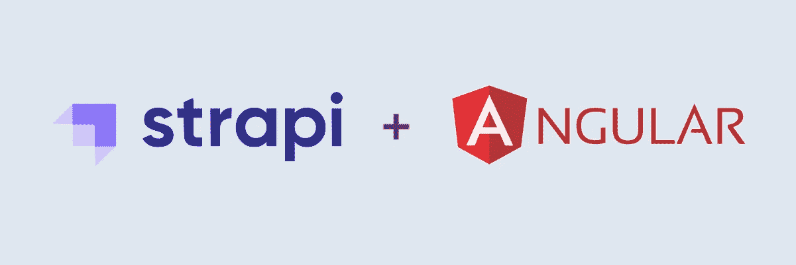

你想用动态的东西创建一个小的网络应用程序吗？对于文章和博客，你可以使用 [WordPress](https://wordpress.org/) 。而对于其他东西，比如一个简单的求职招聘平台或者手机 app 动态内容呢？今天，我们将通过 Strapi 在几分钟内学会如何做到这一点。🤯

**什么是 Strapi？**这是一个*无头内容管理框架*，为开发者节省了数周的 API 开发时间😉它有一套令人印象深刻的功能(包括一个管理面板，强大的命令行界面，快速&安全)和有用的插件。

**“无头”？！**这意味着它通过强大的 API，连接到你选择的前端框架，以及移动应用，甚至物联网(Internet-of-Things)。

本教程的目标是创建一个小型的招聘平台，有一个简单的角度前端和一个管理面板。**这一切都在几分钟内完成**。令人兴奋，不是吗？就这么办吧！✈️

# 先决条件

对于本教程，您需要在您的计算机上安装:
[Yarn](https://yarnpkg.com/getting-started/install)和[node . js](https://nodejs.org/en/download/)；
·对 Javascript、HTML 和 CSS 有很好的理解；
·对角度框架的基本理解。

***注:*** *GitHub 上有项目源代码:
后端(Strapi):*[*http://bit.ly/tutorial-strapi-angular-api*](http://bit.ly/tutorial-strapi-angular-api) *前端(Angular):*[*http://bit.ly/tutorial-strapi-angular-front*](http://bit.ly/tutorial-strapi-angular-front)

# 步骤 1:使用 Strapi 的后端

## 设置

这是容易的部分。在终端中，为您的项目创建一个文件夹，并运行此命令来设置 Strapi 后端。项目是自动创建的，然后 Strapi 服务器会立即启动。

```
yarn create strapi-app jobs-api --quickstart
```

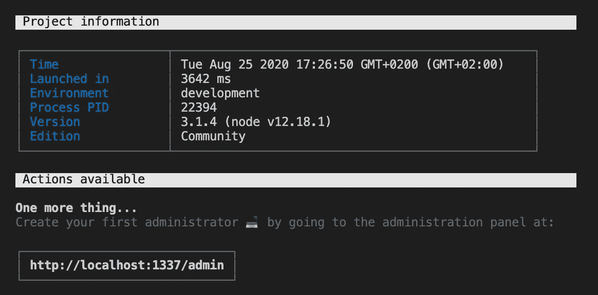

导航到[http://localhost:1337/admin](http://localhost:1337/admin/)，创建您的管理员帐户
…就这样！🙃

## 设计数据结构

Strapi 使用内容类型来定义动态数据的结构。我们现在将构建我们的工作机会和相关公司的数据形状。进入你的 Strapi 管理面板，点击左边栏中的`Content-Types Builder`。有三种不同的集合类型可供选择:

*   **集合:**为标准动态模型，有多个条目；
    *例如工作、公司……*
*   **单:**针对单入车型；
    *例如 App 版本、静态页面内容、…*
*   **组件:**用于将可重用的数据结构转换成其他类型。
    *例如，如果您稍后创建工作请求，明智的做法是为* `*title*` *和* `*description*` *创建一个组件，该组件可用于工作邀请和工作请求。*

**让我们创建** `**Company**` **集合类型。**
点击`+ Create new collection type`并创建一个`company`模型。

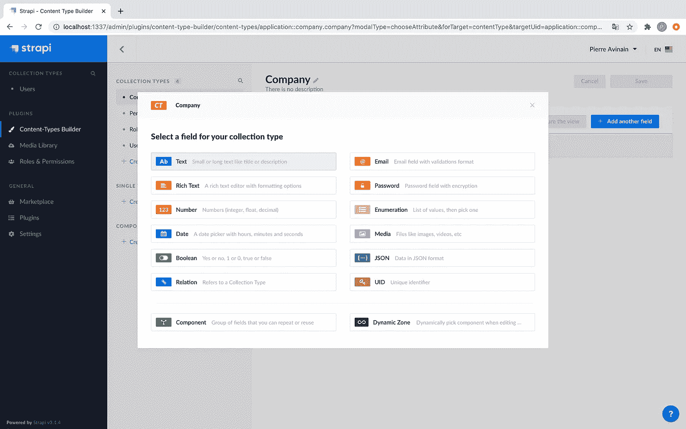

然后，我们将向这个集合类型添加一些字段。让我们为`name`添加一个`Text`字段。要定义验证，点击**高级设置**选项卡，勾选`Required field`并设置 255 个字符的最大长度。

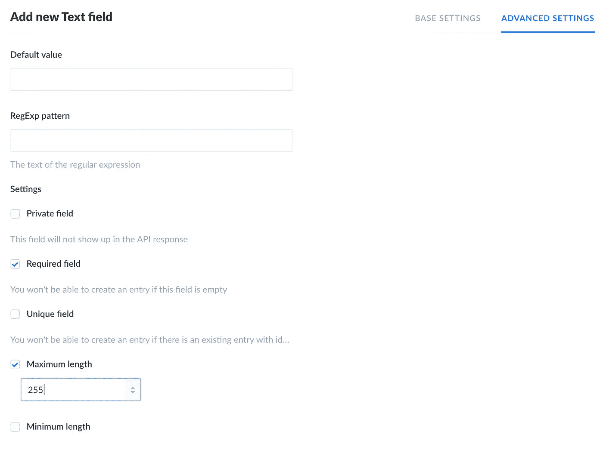

***重要提示:*** *始终为文本字段定义一个最大长度，以避免有人试图添加 1，000，000，000 字符的值时数据库崩溃🔥。*

让我们对其他字段也这样做:

*   名为`size`的枚举(必需)，具有以下值:

```
small_1_to_50
medium_51_to_250
large_251_and_more
```

*   名为`website_url`的文本(最多 255 个字符)，包含以下正则表达式:

```
https?:\/\/(www\.)?[-a-zA-Z0-9@:%._\+~#=]{1,256}\.[a-zA-Z0-9()]{1,6}\b([-a-zA-Z0-9()@:%_\+.~#?&//=]*)
```

*   名为`contact_email`的电子邮件(必填，最多 255 个字符)
*   名为`logo`的媒体(单一媒体，仅图像)

按保存！给你！👌您的第一个内容类型已创建。它应该包含以下字段:

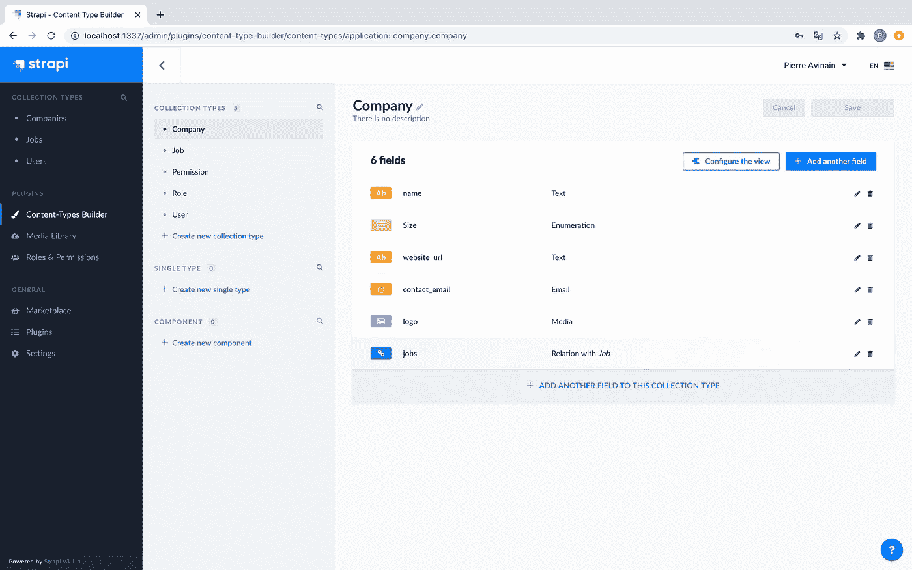

现在，用以下字段创建一个新的`job`集合类型:

*   名为`title`的文本(必填，最多 255 个字符)
*   名为`description`的富文本(必需，最多 65，535 个字符)
*   将`job`模型链接到给定`company`的关系。
    选择**公司有很多岗位**关系(第 4 个)。

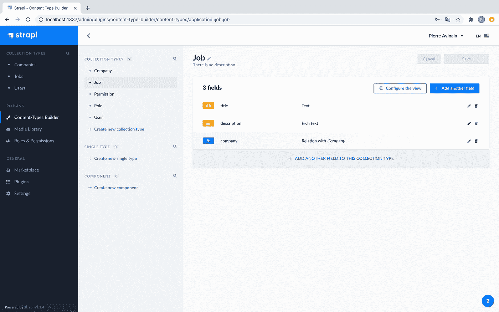

数据结构都设置好了！

## 授予数据访问权限

最后一件事是提供对数据的只读公共访问，供以后在 Angular 项目中使用。导航至`Roles & Permissions`左侧标签。您将看到两个角色:

*   **已认证:**已认证用户的权限；
    *例如，您和您的代理将更新工作机会*
*   **Public:** 对世界其他地方和你的 Angular 前端的权限。

让我们编辑`Public`角色，并转到`Permissions`部分。授予作业显示所需的所有权限:

*   公司`findOne`(我们不想一次给所有公司权限)；
*   工作`count`、`find`和`findOne`。

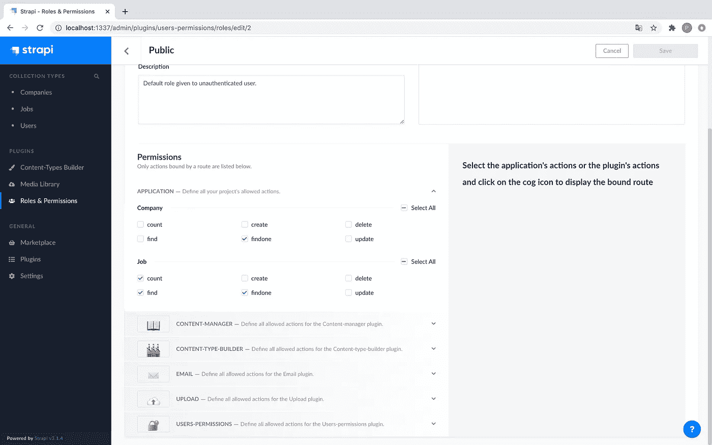

**按保存，太好了！**👍您定义了所有的 API 逻辑！

## 添加示例数据

点击左侧栏中的`Companies`(在收藏类型下)，并点击
`+ Add New Company`。填写一些数据，上传一个 logo，然后点击保存。让我们为第一个`Job`做同样的事情。

> **注意:**Strapi 富文本字段是 Markdown 格式。我们将在后面看到如何在角度前端渲染它。

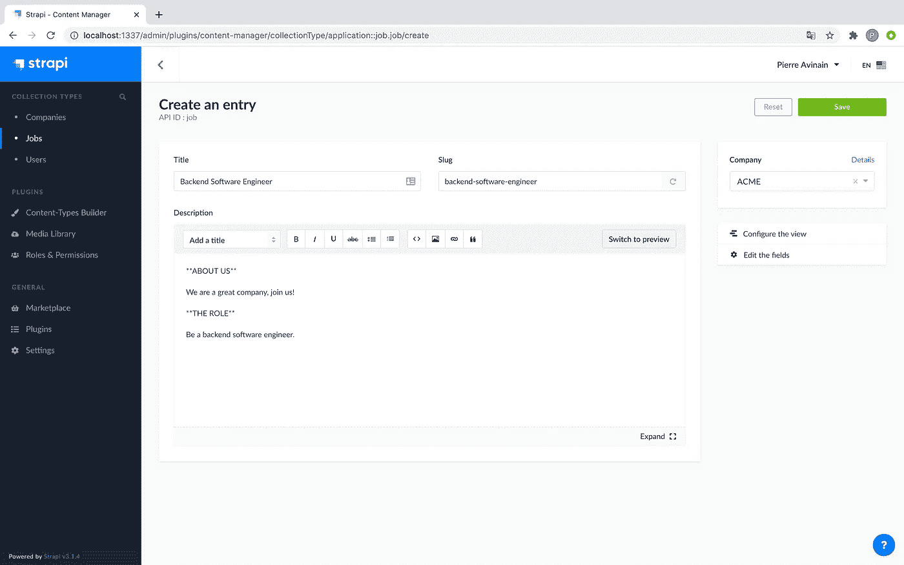

**之后尝试导航到**[**http://localhost:1337/jobs**](http://localhost:1337/jobs)
你的第一份工作来了！🎉开心吗？

现在我们已经设置好了 Strapi，让我们开始前端部分的工作吧！

# 步骤 2:带角度的前端

## 设置

首先，在机器上安装[角度控制器](https://cli.angular.io/):

```
yarn global add @angular/cli
OR
npm install -g @angular/cli
```

导航到您的项目目录(在 Strapi `jobs-api`文件夹之上)，并创建一个新的 Angular 项目:

```
ng new jobs-front
```

回答以下问题:

*   您想要添加角度路由吗？`y`
    *用于以后通过 URL 显示特定作业*
*   您想使用哪种样式表格式？`Sass`

然后，让我们安装 [Bootstrap](https://getbootstrap.com/) (默认样式套件) [jQuery](https://jquery.com/) 和 [ngx-markdown](https://www.npmjs.com/package/ngx-markdown) (将富文本工作描述呈现为 HTML):

```
npm install --save bootstrap jquery ngx-markdown
```

打开项目`angular.json`文件，并包含以下依赖项:

```
**projects->architect->build->styles:**
  "./node_modules/bootstrap/dist/css/bootstrap.css"**projects->architect->build->scripts:**
  "./node_modules/jquery/dist/jquery.js"
  "./node_modules/bootstrap/dist/js/bootstrap.js"
  "./node_modules/marked/lib/marked.js"
```

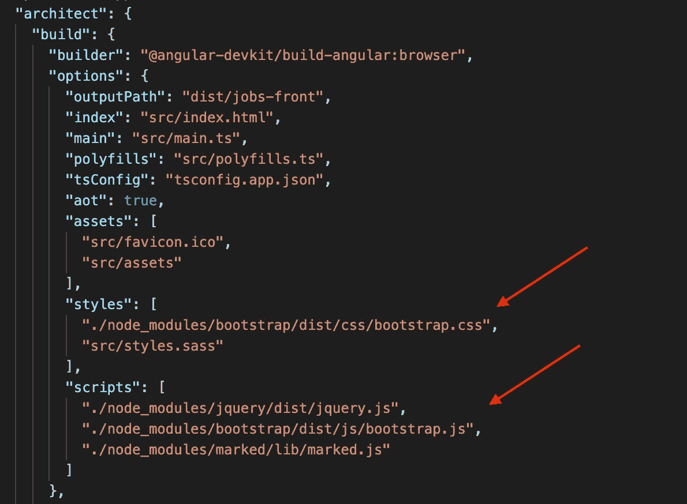

**完美！👌** 用`ng serve`命令服务 Angular，确保项目在 [http://localhost:4200/](http://localhost:4200/) 可用

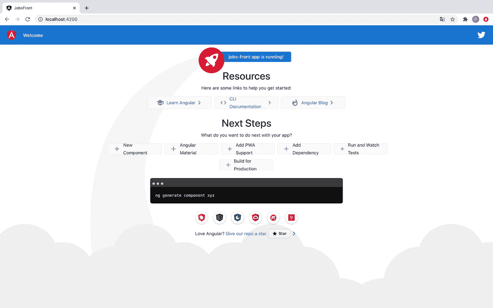

## 定义 API 位置

为了给前端提供 API 位置，向包含 Strapi 开发 URL 的`src/environments/environment.ts`文件添加`api_base_url`属性。

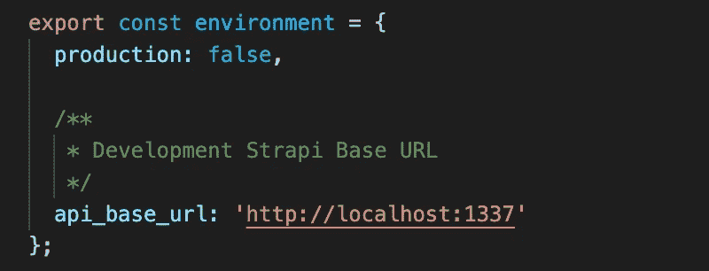

让我们对生产文件 one `src/environments/environment.prod.ts`做同样的事情，使用一个空的 URL(前端和后端将在同一个项目中合并在一起，所以它们将使用相同的基本 URL)。

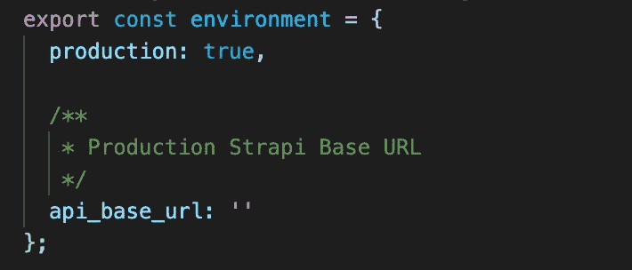

## 创建模型

创建`src/models`文件夹，并创建第一个模型`Company.ts`:

***注:*** `*logo*` *提供了许多* `*url*` *以外的其他属性，如可选文字、尺寸、扩展名、缩略图等。*

然后，创建第二个模型`Job.ts`:

这些模型用于构建来自 Strapi 的数据。

## 创建工作服务

在`src`目录下，创建一个`services`文件夹，并创建`jobs.service.ts`:

该服务用于从您的 Strapi API 中列出和获取作业。

## 构建应用布局

在`src/app/app.module.ts`中，导入以下模块，并将 JobsService 声明为提供者:

在`src/app/app.component.ts`中，注入`JobsService`依赖关系，放置作业搜索和分页逻辑:

在`src/app/app.component.html`中，创建简单工作搜索视图:

## 创建`Job`组件

最后一件事是创建一个新组件来显示作业，使用:

```
ng g c JobComponent
```

之后，更新`src/app/app-routing.module.ts`以更改路由:

***重要:*** *在* `*imports*` *部分，将走线模式改为* `*useHash: true*` *。
这将生成哈希导航(* `*/#/job/12*` *)而不是经典导航(* `*/job/12*` *)。这需要在生产中的同一个项目中同时使用前端和后端。*

打开`src/app/job/job.component.ts`文件，粘贴以下代码:

然后，填充`src/app/job/job.component.html`视图:

**现在好了！你应该看到这个:**

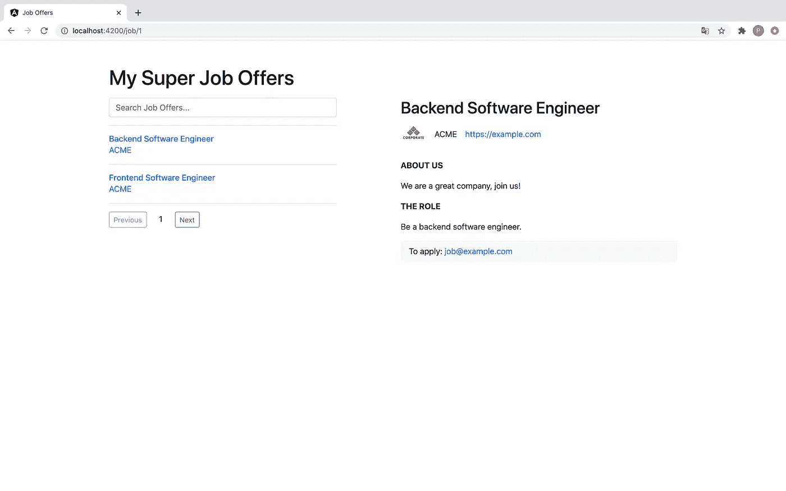

# 第三步:上网

## 构建角度前端

一旦前端准备就绪，就在生产模式下构建它:

```
ng build --prod=true
```

前端构建在`dist/jobs-front`目录下。

要在您的 Strapi 项目中使用 frontend，请复制所有生成的文件到`dist/jobs-front`目录(index.html，*。js 文件、favicon 等……)到后台项目公共目录`jobs-api/public`。后端项目结构应该是这样的:

```
jobs-api/
├── README.md
├── api
├── build
├── config
├── extensions
├── favicon.ico
├── node_modules
├── package.json
├── public
│   ├── index.html
│   ├── main-es2015.xxx.js
│   ├── main-es5.xxx.js
│   ├── polyfills-es2015.xxx.js
│   ├── polyfills-es5.xxx.js
│   ├── robots.txt
│   ├── runtime-es2015.xxx.js
│   ├── runtime-es5.xxx.js
│   ├── scripts.xxx.js
│   ├── styles.xxx.css
│   └── uploads
└── yarn.lock
```

测试前端通过访问 [http://localhost:1337/](http://localhost:1337/) ，你应该会看到你的工作机会！🎉(如果之前停止了 Strapi 服务器，不要忘记用`yarn develop`启动它)。

## 部署 Strapi

您的 web 应用程序现在可以部署了！您可以遵循其中一个 Strapi 文档教程，将项目部署到您喜欢的云提供商(AWS、Azure、DigitalOcean、Heroku…)。

 [## 部署— Strapi 文档

### Strapi 为您的项目或应用程序提供了许多可能的部署选项。

strapi.io](https://strapi.io/documentation/v3.x/getting-started/deployment.html) 

# 结论

厉害了，你成功实现了这个教程！创建您的动态应用程序需要多长时间？


请随意添加额外的功能，使这个项目适应您自己的需要，并在评论部分给出您的反馈。

如果你对改进本教程感兴趣，请随时联系我。😊