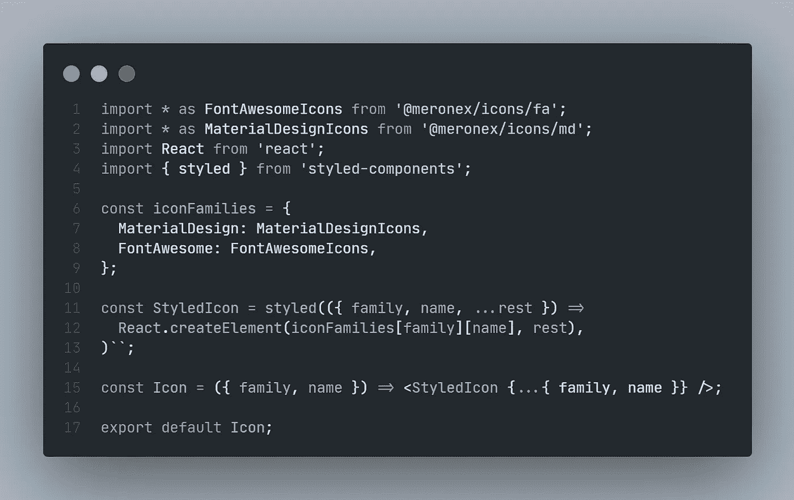
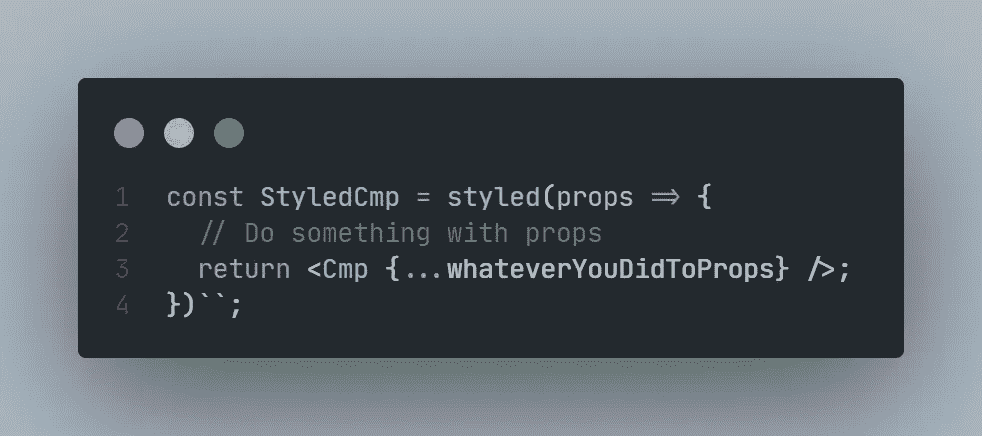

# 构建灵活的 React 图标组件

> 原文：<https://javascript.plainenglish.io/build-a-flexible-react-icon-component-6fb00cdf89b7?source=collection_archive---------6----------------------->

图标对于每个项目都是必不可少的。并且有多种方法可以导入它们。很长一段时间以来，我们一直使用链接通过 CSS 导入它们，或者添加到 HTML 头或者 CSS 导入函数。根据开发人员的经验，我们有 npm 包，带有大量图标，我们可以毫不费力地安装和使用。

今天，我将向您展示如何构建一个灵活的 React 图标组件，利用这些包和样式化组件。


Photo by [Balázs Kétyi](https://unsplash.com/@balazsketyi?utm_source=medium&utm_medium=referral) on [Unsplash](https://unsplash.com?utm_source=medium&utm_medium=referral)

# 开始吧！

在你的 React 项目中，你可以选择安装 [react-icons](https://github.com/react-icons/react-icons) 或者 [meronex-icons](https://github.com/meronex/meronex-icons) 。我将使用后者，它是一个反应图标的分支，可以摇动树。这些包的伟大之处在于它们提供了 SVG 图标。

```
yarn add @meronex/iconsnpm install @meronex/icons
```

在您的项目中创建一个新的`Icon`组件，

```
import React from 'react';const Icon = () => {};export default Icon;
```

例如，这两个软件包会教你在需要时直接导入图标

```
import { FaBeer } from '@meronex/icons/fa';const Beer = () => <h3><FaBeer /> for life.</h3>;
```

我觉得这不实际，因为我们通常希望集中组件的行为和显示方式。当使用样式组件时，当你想设计你的图标的样式时，你不想到处导入你的主题。尽管有大量的 import 语句。

# 我们能做什么



这里我们使用了两个不常用的特性。

## 1.样式化组件中的工厂函数

它允许我们传入一个返回组件的函数。它通常用于在传递给组件之前改变道具。



郑重声明，

```
const StyledCmp = styled((props) => <Cmp {...props} />)``// is the same asconst StyledCmp = styled(Cmp)``
```

## 2.React.createElement 方法

当我们想要动态创建组件时，这尤其有用。

`iconFamilies`是一个映射器对象，每个键引用一个家族的图标。我们可以通过传递道具`family`和`name`来选择我们想要的任何图标。React 将帮助我们快速创建图标。

```
<Icon family="MaterialDesign" name="MdAlarm" />React.createElement(iconFamilies['MaterialDesign']['MdAlarm'])// is the same as <MaterialDesignIcons.MdAlarm />
```

假设你有一个主题，你想设置颜色和大小，最终的版本可以是这样的。

如果你不喜欢样式组件，你可以像往常一样简单地用样式对象来实现。

# 警告

这个解决方案要求我们一次导入所有图标。如果你真的关心稍微增加的包大小，我会建议你计划好你将使用的所有图标。然后创建一个包括系列和名称的映射器。这也意味着你需要维护图标列表。

```
import { MdAlarm, MdDelete, ... } from '@meronex/icons/md';
import React from 'react';const iconFamilies = {
  MaterialDesign: {
   MdAlarm,
   MdDelete,
   ...
  }
}const Icon = ({ family, name, ...rest}) => (
  React.createElement(iconFamilies[family][name]), rest)
)export default Icon;
```

希望这对你的项目有用。如果发现这个实现有什么异常，请告诉我。我也很想向你们学习。

干杯！