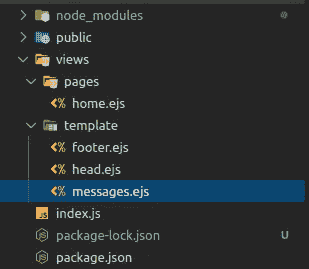
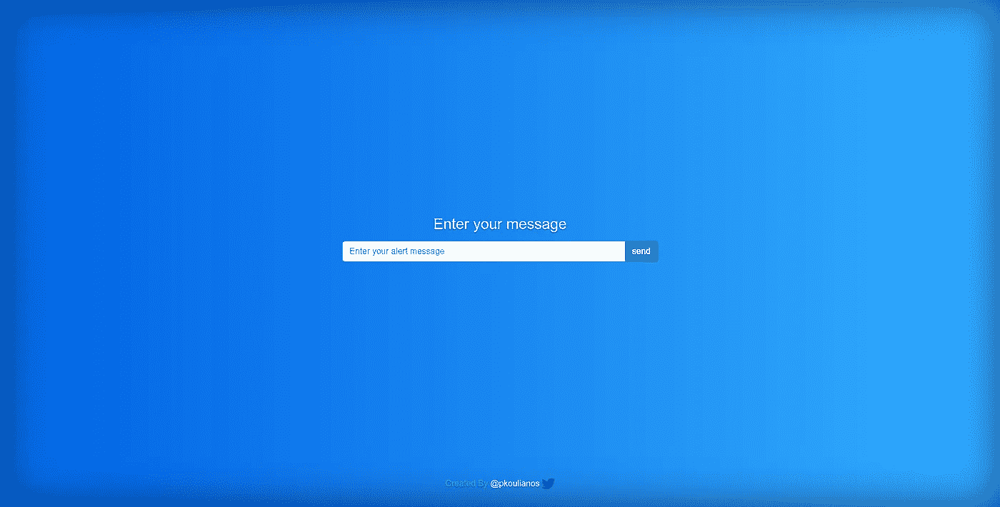
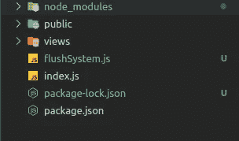

# 用 Node.js 构建一个 Flush 消息中间件

> 原文：<https://javascript.plainenglish.io/build-a-flush-message-middleware-with-node-js-from-scratch-843f6e9823ba?source=collection_archive---------4----------------------->

## 了解如何使用 node.js 和 express.js 从头开始构建一个 flush messages 中间件系统


Photo by [Octavian Rosca](https://unsplash.com/@tavi004?utm_source=medium&utm_medium=referral) on [Unsplash](https://unsplash.com?utm_source=medium&utm_medium=referral)

# 1.介绍

在这个故事中，我们将学习如何使用 node.js 和 express.js 从头开始构建一个 flush 消息中间件。

但是什么是同花顺消息呢？

> 刷新消息是通知用户客户端各种情况的小消息，例如不成功的登录、表单字段上的无效输入等

从克隆项目存储库开始

```
git clone [https://github.com/petranb2/flushMessages.git](https://github.com/petranb2/flushMessages.git)
```

# 2.安装和发现

```
cd flushMessages/startFlushMessages
```

安装依赖项:

```
npm install
```

您的目录:



project directory

我们的开始模板有:

1.  一个带有标准 express 应用程序和会话的 **index.js** 文件。
2.  一个包含一页 **views/pages/home.ejs** 的 views 文件夹和一个包含 **head.js** 、 **footer.ejs** 和 **messages.ejs** 的 **views/template** 文件夹。

运行启动应用程序:

```
npm run start
```

点击浏览器 [http://localhost:3000](http://localhost:3000)



[http://localhost:3000](http://localhost:3000)

# 3.构建中间件

在您的根项目文件夹中创建一个名为 **flushSystem.js** 的新文件，并粘贴以下代码:



上面的代码公开了一个返回中间件的函数，中间件正在做以下工作:

1.检查请求对象是否有会话

```
// Check for sessionsif(!req.session){throw new Error('flushSystem must have sessions enabled')}
```

2.初始化一个数组以存储 req.session.messages 中的刷新消息

```
// INIT messages arrayif (!req.session.messages) {req.session.messages = [];}
```

3.用数组初始化 **res.locals.messages** ，我们使用 **res.locals.messages** 将 **messages** 数组直接从响应对象发送到所有视图

> [**res.locals**](https://expressjs.com/en/api.html#res.locals)
> 
> 一个对象，包含请求范围内的响应局部变量，因此只对请求/响应周期(如果有)中呈现的视图可用。

```
// INIT THE locals.messageres.locals.messages = [];
```

4.从 **response.locals** 中添加对 **request.locals** 的引用

```
// add res.locals to req objectreq.locals = res.locals;
```

5.添加一个 **req.pushMessage** 功能来推送新消息

```
// add addMessage function to req objectreq.pushMessage = addMessage; function addMessage(message) {// PUSH NEW MESSAGEthis.session.messages.push(message);}
```

6.添加一个 **req.setMessages** a 函数将消息数组设置为 **res.locals.messages** 并清空消息数组

```
// add setMessages function to req objectreq.setMessages = setMessages; function setMessages() {// ADD MESSAGES TO LOCALSthis.locals.messages = this.session.messages;// CLEAR THE MESSAGES ARRAYthis.session.messages = [];}
```

7.调用下一个中间件

```
// call next middlewarenext();
```

# 4.将中间件添加到应用程序

现在，我们将在我们的 express 应用程序中实施我们所做的工作。

要求中间件在 **index.js** 文件的顶部:

```
var flushSystem = require("./flushSystem.js");
```

我们的中间件依赖于会话，因此我们必须在会话初始化之后添加它

```
// sessionsapp.use(session({secret: "132c4a71b767b874948afbd00fe1085c",resave: false,saveUninitialized: true,cookie: { secure: false },}));**// add flushSystem as middleware****app.use(flushSystem());**
```

现在我们已经添加了中间件，传入的请求对象将总是具有 **req.setMessage()** 和 **req.setMessages()** 函数，并且从呈现视图中，我们可以访问**消息**数组。

在**views/template/messages . ejs**文件中，我们可以看到如何访问消息数组并呈现刷新消息。

**views/template/messages.ejs**

我们的 **views/home.ejs** 文件已经包含了 **messages.ejs**

**views/home.ejs**

最后，我们必须为我们的应用程序添加一些功能来发送消息。

将 get 方法替换为:

```
app.get("/", function (req, res) {// set flush messages to render on viewreq.setMessages();res.render("pages/home");});
```

并添加一个 post 方法:

```
app.post("/", function (req, res) {let message = req.body.message;if (message.trim() != "") {req.pushMessage(req.body.message);}res.redirect("/");});
```

启动应用程序:

```
npm run start
```

点击浏览器 [http://localhost:3000](http://localhost:3000)


[http://localhost:3000](http://localhost:3000)

# 5.结论

这是一个简单的同花顺消息中间件，你可以非常容易地构建它，如果你喜欢在你的应用程序中使用它。

您可以从以下网址下载项目资源库

[](https://github.com/petranb2/flushMessages.git) [## petranb2/flushMessages

### 在 GitHub 上创建一个帐户，为 Petra B2/flush messages 的开发做出贡献。

github.com](https://github.com/petranb2/flushMessages.git) 

# 感谢你阅读我的故事

请随意评论，给我发电子邮件，告诉我任何想法、变化等等。

[](https://medium.com/javascript-in-plain-english/learn-to-use-regular-expressions-like-a-ninja-in-node-js-20cfb6806f26) [## Node.js 中的正则表达式备忘单

### 轻松学习、编写和执行正则表达式的详细故事。

medium.com](https://medium.com/javascript-in-plain-english/learn-to-use-regular-expressions-like-a-ninja-in-node-js-20cfb6806f26) [](https://medium.com/javascript-in-plain-english/node-js-bcrypt-vs-bcryptjs-benchmark-69a9e8254cc2) [## Node.js Bcrypt vs BcryptJS 基准测试

### Bcrypt 是最流行、最安全的单向密码散列函数之一。

medium.com](https://medium.com/javascript-in-plain-english/node-js-bcrypt-vs-bcryptjs-benchmark-69a9e8254cc2) [](https://medium.com/swlh/master-ejs-template-engine-with-node-js-and-expressjs-979cc22b69be) [## 具有 Node.js 和 Expressjs 的主 EJS 模板引擎

### EJS 是 node.js 和 expressjs 最受欢迎的模板视图引擎之一，在 GitHub 上有 4.2k 星级，超过 550 万…

medium.com](https://medium.com/swlh/master-ejs-template-engine-with-node-js-and-expressjs-979cc22b69be)