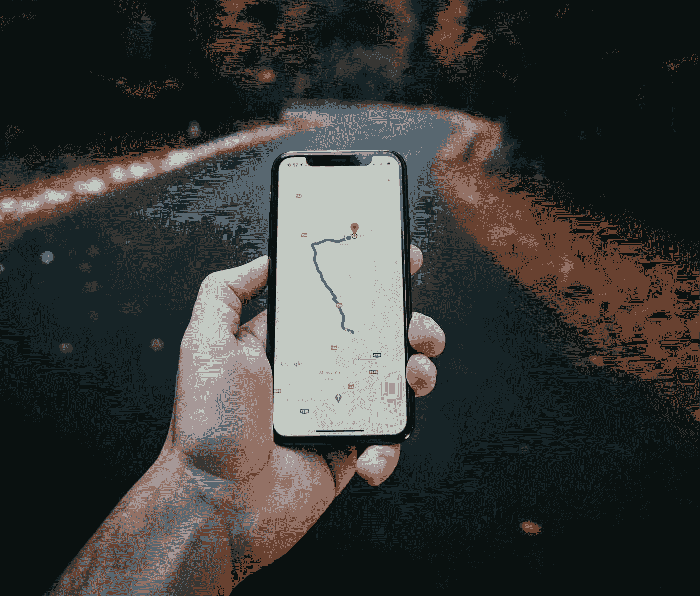
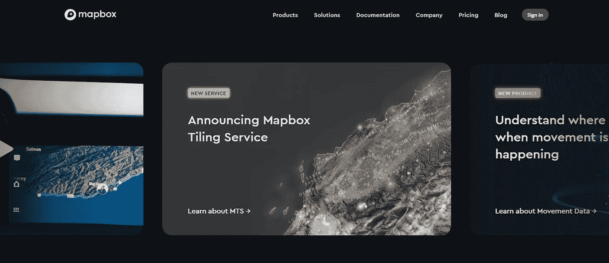
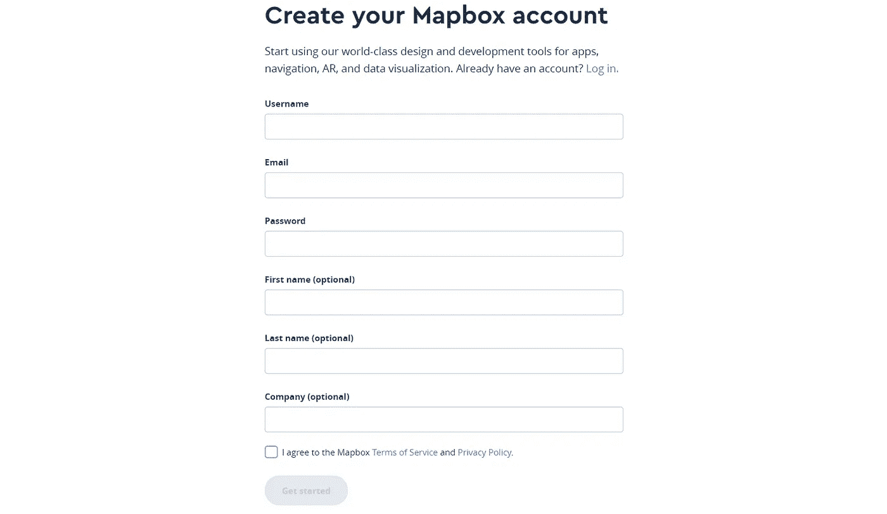
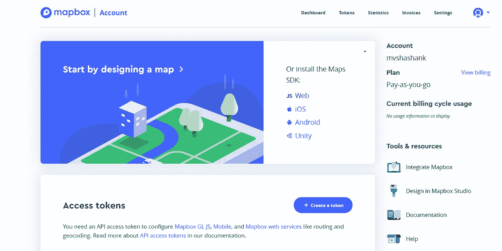
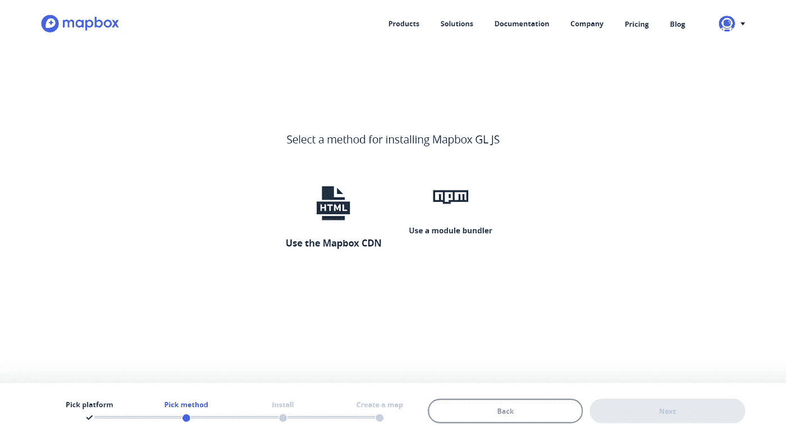
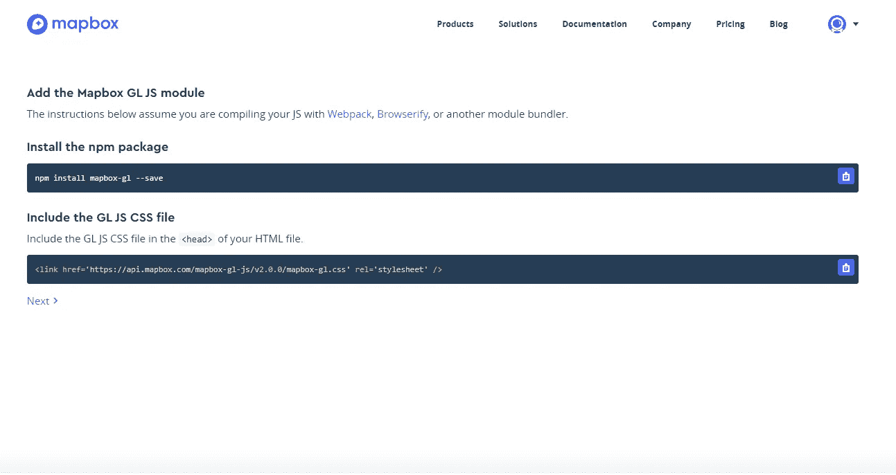
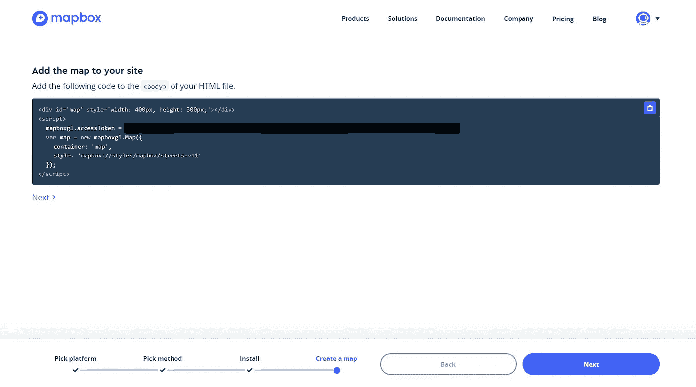

# 在不到 20 分钟的时间内构建一个地图界面

> 原文：<https://javascript.plainenglish.io/build-a-google-maps-clone-in-less-than-20-minutes-6f7c68db13e?source=collection_archive---------5----------------------->

## 使用 React & MapBox API 构建地图界面的分步教程。



Photo by [Tamas Tuzes-Katai](https://unsplash.com/@tamas_tuzeskatai?utm_source=medium&utm_medium=referral) on [Unsplash](https://unsplash.com?utm_source=medium&utm_medium=referral)

# 开始使用:

你所需要的只是一个地图箱账户。如果需要任何帮助，您可以查看这个存储库。在你开始之前，你可以查看这个 [**现场演示**](https://google-maps-clone.herokuapp.com/) 来了解你的应用在本教程结束时的样子。

[](https://github.com/mvshashank123/React-Google-Maps-Clone) [## mvshashank 123/React-谷歌-地图-克隆

### 这个项目是用 Create React App 引导的。在项目目录中，您可以运行:在…中运行应用程序

github.com](https://github.com/mvshashank123/React-Google-Maps-Clone) 

# 设置地图框帐户:

> **第一步:**进入 [Mapbox 的网站](https://www.mapbox.com/)，点击**登录**。



> **第二步:输入所需的详细信息，在 Mapbox 上注册**。



> **第三步:**然后点击**网页**。



> **步骤 4:** 然后选择**使用模块捆扎机。**



> **第五步:** *安装以下 npm 包作为****dev dependency****。* 并复制脚本文件。

```
**npm install mapbox-gl --save**
```



> **步骤 6:** 复制下面的代码。



# 设置项目:

> **步骤 1:** 使用 Create React 应用程序构建基本的 React 模板。

```
**npx create-react-app google-maps-clone**
```

> **步骤 2:** 转到公共文件夹中的**index.html**文件，粘贴步骤 5 中的脚本文件。
> 
> **第三步:**修改**index.html**文件，将 div 的 id 改为**‘app’**，应该是这样的。

> **第四步:**修改 **index.js** 来渲染我们刚刚在**index.html 中修改的 div。**确保你的 index.js 看起来像这样**。**这里我们基本上是使用 **ReactDOM** 中的 render 方法来渲染 App 组件。**起反应。StrictMode** 只是一个帮助我们编写更好的 React 组件的助手。

> **步骤 5:** 删除 render 方法中的所有属性，你的 **App.js** 组件必须是这样的。

# **创建地图组件:**

> **第一步:**新建一个文件 **Map.js.** 使用快捷键 **rafce** 创建一个功能组件(这个快捷键是使用 [React 代码片段](https://marketplace.visualstudio.com/items?itemName=dsznajder.es7-react-js-snippets)扩展启用的，我强烈推荐这个扩展)。

> **步骤 2:** 使用 React 的 **useState** 钩子创建局部变量。然后，我们为地图的经度、纬度和缩放幅度创建本地状态。在 React 中，我们使用 **useState** 钩子创建局部变量。我们在 paranthesis 中设置变量的初始值。

```
const [longitude, setLongitude] = useState(0);const [latitude, setLatitude] = useState(0);const [zoom, setZoom] = useState(5);
```

> **步骤 3:** 使用 React 中的 [**useRef**](https://reactjs.org/docs/hooks-reference.html#useref) 钩子为 mapContainer 创建一个引用。本质上，`useRef`就像一个“盒子”，它的`.current`属性表示[react.org](https://reactjs.org/docs/hooks-reference.html#useref)可以容纳一个可变值。

```
const mapContainerRef = useRef(null);
```

# **向地图容器添加样式:**

创建一个名为 MapStyles.css 的新文件，并添加以下样式:

确保将该文件导入到 **Map.js** 组件中。

# 从用户处获取位置:

> **步骤 1:** 我们使用地理定位 API，通过请求用户访问位置来获得这个信息。将此添加到 ***script.js*** 文件中。 **getCurrentPosition()** 函数主要接受 3 个参数。你可以参考这个链接来获得更好的理解:[getCurrentPosition()](https://developer.mozilla.org/en-US/docs/Web/API/Geolocation/getCurrentPosition.)的文档。

```
navigator.geolocation.getCurrentPosition(success, error, { enableHighAccuracy: true })
```

> **步骤 2:** 创建**成功位置()**和**错误位置()**函数。

## **成功定位()**

当成功提取位置时，执行该函数。因此，我们通过使用**使用状态**钩子中的**设置经度**和**设置纬度**方法，使用这个位置来设置初始坐标。

```
function successPosition(position) {
*//Mapbox receives longitude and latitude from Geolocation API.* setLongitude(position.coords.longitude)
setLatitude(position.coords.latitude)
}
```

## 错误**位置**():

当获取位置时出现错误时，执行该函数，因此我们可以模拟坐标。

```
function errorPosition() {
The following coordinates are mocked.
setlongitude(12.9716)
setlatitude(77.5946)
}
```

# 执行页面加载操作:

我们使用 **useEffect** 钩子在 Map 组件的挂载上执行某些操作。 **useEffect** 钩子在我们的例子中有一个空的依赖数组，这意味着 **useEffect** 只有在页面加载时才被触发。

```
useEffect(() => {Perform Operationsreturn () => {
     Cleanup Operations
};
}, [ Dependency Array ]);
```

## 我们在创建的 **useEffect** 中添加了以下功能。

## 初始化地图框对象:

我们粘贴从设置地图框帐户的第 6 步复制的代码，并将其粘贴到 **useEffect** 中。我们用来自 **useRef** 的引用来代替容器参数。

```
const map = new mapboxgl.Map({
container: mapContainerRef.current,
style: "mapbox://styles/mapbox/streets-v11",
center: [latitude, longitude],
zoom: zoom,
});
```

## 向地图添加导航支持:

这段代码在右上角添加了缩放和指南针。([地图框文档](https://docs.mapbox.com/mapbox-gl-js/api/))

```
map.addControl(new mapboxgl.NavigationControl(), "top-right");
```

我们设置条件来改变移动中的地图坐标。

```
map.on("move", () => {
setLongitude(map.getCenter().longitude);
setLatitude(map.getCenter().latitude);
setZoom(map.getZoom().toFixed(2));
});
```

最后，确定你的**index.html**、 **index.js** 、 **App.js** 、 **Map.js、**和 **MapStyles.css** 文件是这样的。

就这样，你只用了不到 20 分钟就完成了谷歌地图的克隆。！🎉

你还打算增加什么功能？

👋嘿，我们做朋友吧！在 [LinkedIn](https://www.linkedin.com/in/shashank-mv/) 上和我联系。不要忘记在[媒体](https://medium.com/@mv.shashank123)上关注我，以获取更多类似的内容。

## 参考资料:

网站开发简化版——凯尔·库克。(感谢启发)。

[地图框文档](https://docs.mapbox.com/)-通过地图框。

[地图框教程](https://docs.mapbox.com/help/tutorials/)-由地图框提供。