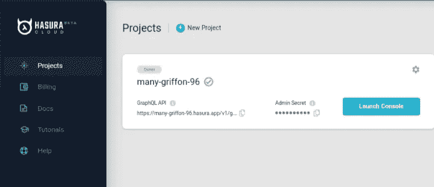

# 用 Hasura 构建一个 GraphQL 应用程序

> 原文：<https://javascript.plainenglish.io/build-a-graphql-app-with-hasura-15438e786f26?source=collection_archive---------6----------------------->

## 了解如何使用 GraphQL API 和 Hasura 构建一个安全的待办事项列表应用程序。


Photo by [Niclas Illg](https://unsplash.com/@nicklbaert?utm_source=medium&utm_medium=referral) on [Unsplash](https://unsplash.com?utm_source=medium&utm_medium=referral)

今天在这篇文章中，我们将使用 GraphQL API 和 Hasura 构建一个安全的待办事项列表。首先你要了解哈苏拉。它不过是一个 postgreSQL 数据库，自动给你一个实时数据。

在进入主题之前，首先让我们看看创建这个应用程序需要遵循的步骤。

*   构建后端。
*   创建一个数据表。
*   认证。
*   授权。
*   构建前端。
*   部署。

现在让我们深入正题。

# 构建后端

转到 Hasura 并创建一个新帐户。哈苏拉会要求连接你的数据库。选择“**使用 heroku** 试用免费数据库”。


Heroku website

用 heroku 完成设置后，新的实例被创建，它运行在如下的 url。

**https://<YOUR _ HEROKU _ PROJECT>. HEROKU app . com**

然后导航到项目并单击启动控制台以打开 Hasura dashboard。



Project layout

# 创建数据表

导航到 data 并创建一个名为 todos 的新表，

*   **id** :整数
*   **标题**:正文
*   **is_completed** :布尔值
*   **用户标识**:文本
*   **创建时间**:时间戳

将 **id** 列设置为唯一主键。


Project table

# 证明

对于身份验证，您可以根据自己的需要使用任何第三方应用程序。我将使用 **feather** ,因为它是一个轻量级的 API，很容易为你的应用添加认证。

在开始使用 feather 之前，首先你必须设置名为**HASURA _ graph QL _ JWT _ SECRET**的环境变量。之后，创建一个新的项目，并导航到仪表板中的设置标签，并复制项目的网址。


Feather layout

将您的项目 id 添加到下面给出的 JSON 模板的“**观众**”字段中。

```
{
  "type":"RS256",
  "jwk_url": "https://api.feather.id/v1/.well-known/jwks",
  "issuer": "api.feather.id",
  "audience": "<YOUR_PROJECT_ID>"
}
```

然后回到我们的 heroku 仪表板，转到设置选项卡，找到一个子部分配置变量，创建一个名为**HASURA _ graph QL _ JWT _ SECRET**的新值，并粘贴 JSON 值。


Heroku layout

# 批准

要获得授权，请转到功能仪表板中的 id 令牌，并将以下代码粘贴到**自定义声明**中，然后单击保存。

```
{
  "https://hasura.io/jwt/claims": {
    "x-hasura-user-id": "{{.USER.ID}}",
    "x-hasura-allowed-roles": ["user"],
    "x-hasura-default-role": "user"
  }
}
```

现在你会看到每个用户登录到你的应用程序，它会自动记录到 Hasura。现在转到 Hasura dashboard 中的 data 选项卡，导航到 permission 并添加一个名为“ **user** ”的新角色。当有人创建一个新的待办事项时，它会自动生成一个新的“**用户 id”**。您可以进行添加、更新和删除操作。


Hasura layout

最后，我们没有写任何代码就完成了所有的后端。让我们为我们的应用程序构建一个前端。

# 构建前端

现在打开您的终端并运行以下命令来创建一个新的 react 应用程序。

```
$ npx create-react-app hasurademo && cd hasurademo && yarn add @apollo/client apollo-link-context apollo-link-http apollo-cache-inmemory feather-client-react graphql graphql-tag
```

现在打开你的编辑器，在 **src** 目录下新建一个文件夹 **feather.js** 。复制 feather dashboard 中的可发布密钥，并使用它来初始化 feather 中的客户端。

```
import {FeatherClient} from "feather-client-react"

export const feather = FeatherClient("pk_live_...")
```

现在让我们创建一个 GraphQL 客户端来发送请求给 Hasura API。现在创建一个名为 **src/apollo.js** 的新文件，并粘贴以下代码。

```
import { ApolloClient } from "@apollo/client";
import { InMemoryCache } from "apollo-cache-inmemory";
import { HttpLink } from "apollo-link-http";
import { setContext } from "apollo-link-context";
import { feather } from "./feather";

const httpLink = new HttpLink({
  uri: "https://hasura-test-pliao.herokuapp.com/v1/graphql",
  fetchPolicy: "network-only"
});

const authLink = setContext((_, { headers }) =>
  feather
    .currentUser()
    .then(u => ({
      headers: {
        ...headers,
        authorization: `Bearer ${u.tokens.idToken}`
      }
    }))
    .catch(_ => ({ headers }))
);

export const apollo = new ApolloClient({
  cache: new InMemoryCache(),
  link: authLink.concat(httpLink)
});
```

现在打开 **src/index.js** 并粘贴以下代码。

```
import React from "react";
import ReactDOM from "react-dom";
import "./index.css";
import App from "./App";
import * as serviceWorker from "./serviceWorker";
import { FeatherProvider } from "feather-client-react";
import { feather } from "./feather";
import { ApolloProvider } from "@apollo/client";
import { apollo } from "./apollo";

ReactDOM.render(
  <React.StrictMode>
    <FeatherProvider client={feather}>
      <ApolloProvider client={apollo}>
        <App />
      </ApolloProvider>
    </FeatherProvider>
  </React.StrictMode>,
  document.getElementById("root")
);

// If you want your app to work offline and load faster, you can change
// unregister() to register() below. Note this comes with some pitfalls.
// Learn more about service workers: https://bit.ly/CRA-PWA
serviceWorker.unregister();
```

现在打开 **src/App.js** ，让代码显示用户登录表单，否则它将创建一个普通的待办事项列表。

```
import React from "react";
import { AuthenticationForm, useCurrentUser } from "feather-client-react";
import Todos from "./Todos";

const styles = {
  title: provided => ({
    ...provided,
    fontSize: "40px",
    fontWeight: 700
  })
};

function App(props) {
  const { loading, currentUser } = useCurrentUser();

  if (loading) return <div />;
  if (!currentUser)
    return (
      <div className="app">
        <AuthenticationForm styles={styles} />
      </div>
    );
  return (
    <div className="app">
      <div className="app-header">
        <h1>My to-do list</h1>
        <p>{currentUser.email}</p>
      </div>
      <Todos />
    </div>
  );
}

export default App;
```

现在创建一个名为 **src/Todos.js** 的新文件，并粘贴以下代码。以便用户可以查看他们的待办事项列表。

```
import React from "react";
import Todo from "./Todo";
import NewTodo from "./NewTodo";
import { useQuery, gql } from "@apollo/client";

export const GET_TODOS = gql`
  query GetTodos {
    todos {
      id
      title
      is_completed
    }
  }
`;

function Todos(props) {
  const { loading, error, data } = useQuery(GET_TODOS);

  if (error) return <p>{error.message}</p>;
  if (loading) return <p>Loading ...</p>;
  return (
    <div>
      {data.todos.map(todo => (
        <Todo key={todo.id} todo={todo} />
      ))}
      <NewTodo />
    </div>
  );
}

export default Todos;
```

现在我们必须为用户创建一个函数来编辑待办事项列表。为此，创建一个名为 **src/todo.js** 的新文件，并添加以下代码。

```
import React from "react";
import { useMutation, gql } from "@apollo/client";

const TOGGLE_TODO = gql`
  mutation ToggleTodo($id: Int!, $is_completed: Boolean!) {
    update_todos(
      where: { id: { _eq: $id } }
      _set: { is_completed: $is_completed }
    ) {
      returning {
        id
        is_completed
      }
    }
  }
`;

export default function Todo(props) {
  const [toggleTodo] = useMutation(TOGGLE_TODO);

  const onChange = e => {
    toggleTodo({
      variables: {
        id: props.todo.id,
        is_completed: !props.todo.is_completed
      }
    });
  };

  return (
    <div style={{ display: "flex", flexDirection: "row" }}>
      <input
        type="checkbox"
        className="todo-checkbox"
        name={props.todo.id}
        checked={props.todo.is_completed}
        onChange={onChange}
      />
      <p>{props.todo.title}</p>
    </div>
  );
}
```

现在为新的待办事项创建一个用户界面。因此，创建一个名为 src/NewTodo.js 的新文件，并粘贴以下代码。

```
import React, { useState } from "react";
import { useMutation, gql } from "@apollo/client";

const CREATE_TODO = gql`
  mutation CreateTodo($title: String!) {
    insert_todos_one(object: { title: $title }) {
      id
      title
      is_completed
    }
  }
`;

function NewTodo(props) {
  const [title, setTitle] = useState("");
  const [createTodo] = useMutation(CREATE_TODO);

  const onSubmit = e => {
    e.preventDefault();
    createTodo({ variables: { title } });
  };

  const onChange = e => {
    setTitle(e.target.value);
  };

  return (
    <form onSubmit={onSubmit}>
      <input
        className="new-todo-input"
        value={title}
        onChange={onChange}
        type="text"
        placeholder="Today I will..."
      />
    </form>
  );
}

export default NewTodo;
```

最后，我们创建了 todo 应用程序，并让它看起来更有吸引力。现在打开 **src/index.css** 并将下面的 css 类添加到其中。

```
.app {
  padding: 80px;
  max-width: 400px;
  margin: 20px auto;
}

.app-header {
  margin-bottom: 40px;
}

.todo-checkbox {
  margin: auto 10px auto 0px;
}

.new-todo-input {
  font-size: 20px;
  padding: 20px;
  width: 100%;
  margin-top: 40px;
}
```

# 部署

现在转到您的终端，运行 **npm start** 并在您的本地主机中运行应用程序。您的应用程序将如下所示。


Final Todo App

# 结论

我希望你今天玩得开心并有所发现。现在，您将能够使用 Hasura 用 GraphQL API 创建一个 todo 应用程序。

感谢阅读！

## 简单英语的 JavaScript

喜欢这篇文章吗？如果有，通过 [**订阅获取更多类似内容解码，我们的 YouTube 频道**](https://www.youtube.com/channel/UCtipWUghju290NWcn8jhyAw) **！**