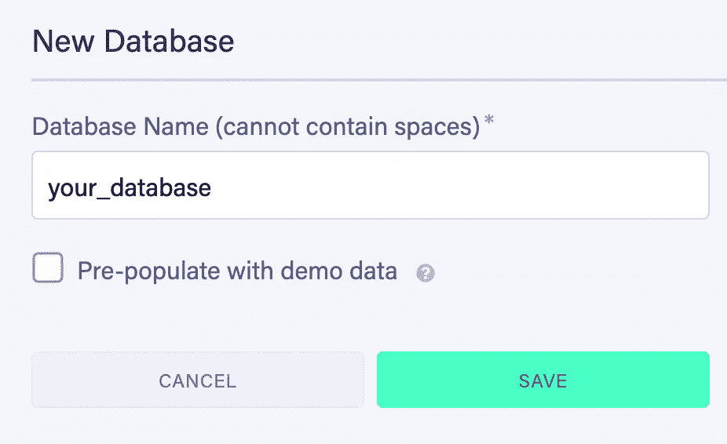
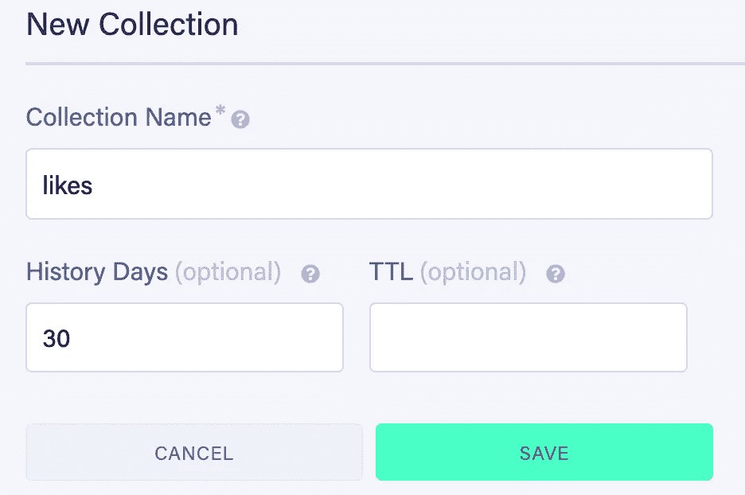
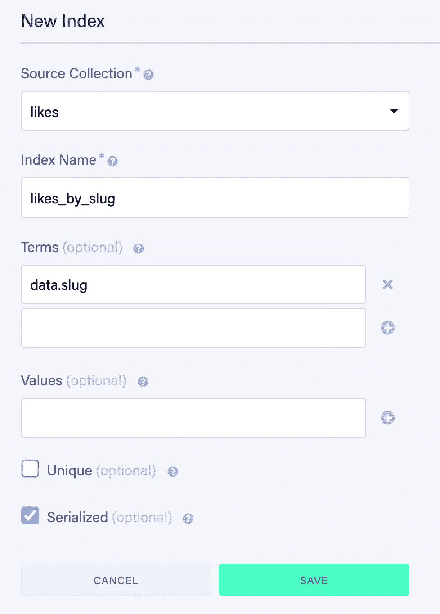
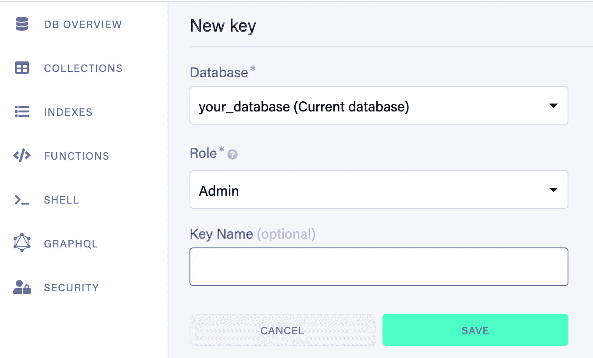
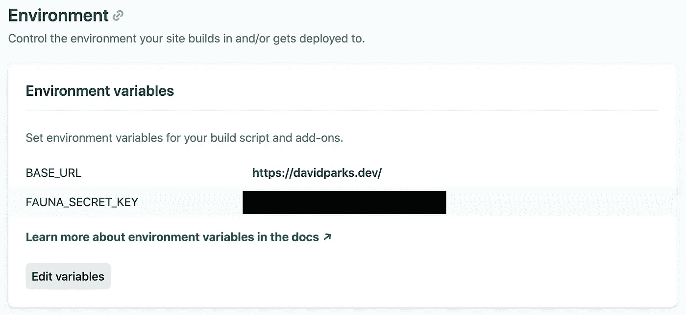

# 用动物群、Netlify 和 Nuxt 建立一个“Like”计数器

> 原文：<https://javascript.plainenglish.io/build-a-like-counter-with-fauna-netlify-and-nuxt-d4106d30a821?source=collection_archive---------18----------------------->


# 介绍

当我建立这个网站的时候，我不断地从我所关注和敬仰的科技领域的一些人那里寻找灵感。其中一个人就是**乔希·科莫**(推特上的@乔希·科莫)。

在他的网站上，我读了一篇名为[构建现代点击计数器](https://joshwcomeau.com/react/serverless-hit-counter/)的博客，这篇博客揭示了在 Jamstack 网站上，与 FaunaDB 配合使用的无服务器功能有多么强大。

虽然他的帖子主要涉及 React/Gatsby，但我想使用他提供的一些无服务器概念和代码在每个博客帖子上创建一个“like”计数器(在我的情况下是一个“voltage”计数器)，作为一个很酷的小细节( ***非常类似于 Josh 在他的博客帖子*** 上的“heart”计数器)。我也将重用和扩展他的一些代码，所以我想给他信用！

这篇文章的目的是让你使用 Netlify 函数和 [FaunaDB](https://fauna.com/) 进行设置，并向你展示如何利用这些工具为你的个人 Nuxt 博客构建一个动态的“like”计数器。

# 设置

在我们开始之前，我们需要确保我们有一个**动物群**帐户设置来处理存储和检索数据，以及一个 **Netlify** 帐户，我们将在其中部署我们的应用程序和捆绑的无服务器功能。

另外，你需要选择一个你喜欢的无头 CMS 来管理你的博客内容。我个人使用 [Nuxt Content](https://content.nuxtjs.org/) ，但是只要你能利用或者为每篇博客文章定义一个独特的`slug`，你就没问题！

# 动物群

一旦你创建了一个动物账户，你需要登录并为你的项目创建一个新的数据库。



在建立我们的数据库后，我们还需要创建一个集合来存储我们每个博客帖子的赞。继续创建一个名为“喜欢”的。



为了成功地查询我们的数据库，我们还需要建立一个**索引**。索引允许我们根据文档属性而不是文档引用来查询文档，这在我们使用博客`slug`获取和更新我们相应的喜好时非常重要。

继续创建一个名为`likes_by_slug`的索引，使用我们的`likes`集合作为源集合，`data.slug`是我们可以搜索的术语之一。



太神奇了！我们快到了。现在我们需要生成一个 API 密钥，我们可以在 Nuxt 项目中使用它来安全地查询我们的动物群数据库。导航到您的动物仪表板中的**安全**部分，并生成一个新的管理密钥。



我们将使用`FAUNA_SECRET_KEY`环境变量来引用这个键。

# Nuxt

太好了！我们已经准备好动物了。现在我们可以跳到我们的 Nuxt 项目，开始引入一些我们需要的依赖项。

继续安装[动物群 npm 包](https://www.npmjs.com/package/faunadb)。

```
# install using npm npm install --save faunadb # install using yarn yarn add faunadb
```

我们还将使用 [Axios](https://axios.nuxtjs.org/) 来处理我们的 API 请求，所以继续安装 Nuxt 模块:

```
# install using npm npm install @nuxtjs/axios # install using yarn yarn add @nuxtjs/axios
```

并将其添加到您的`nuxt.config.js`文件中:

```
export default {
  modules: ['@nuxtjs/axios']
}
```

此外，在项目的根目录下创建一个`.env`文件，并放入您之前生成的动物群 API 密匙

```
BASE_URL=YOUR_PROD_URL
FAUNA_SECRET_KEY=YOUR_KEY
```

太好了！最后，我们现在可以使用我们的`BASE_URL`环境变量来为本地开发和生产部署设置 Axios。

当我使用 [Netlify Dev](https://www.netlify.com/products/dev/) 在本地运行我的 Netlify 项目时，我在端口`8888`上运行它。为了在我们尝试测试无服务器功能时不出现问题，我们需要告诉 Axios 通过端口`8888`调用，或者在本地开发时通过您喜欢的任何端口调用。

将这一行添加到您的`nuxt.config.js`文件中:

```
export default {
  axios: {
    baseURL: process.env.NODE_ENV === 'production' ? process.env.BASE_URL : 'http://localhost:8888/',
  },
}
```

# 网络生活

如果你不熟悉 [Netlify 函数](https://www.netlify.com/products/functions/)，它们本质上是在 AWS Lambda 之上的 Netlify 的包装器(具有非常大的自由层)。简而言之，它们是完全受管理的、自动扩展的无服务器功能，适用于您的网络项目。

为了确保我们部署的站点能够成功查询我们的动物群数据库，我们需要导航到 Netlify 并添加我们之前定义的[环境变量](https://docs.netlify.com/configure-builds/environment-variables/)，这样当我们部署应用程序时，它们将对我们的应用程序可用！



您还应该检查一下 [Netlify Dev](https://www.netlify.com/products/dev/) ，它将允许您在部署之前在本地测试您的功能。这可以在调试函数和 UI 时节省大量时间。这是一个有点复杂的过程，所以我不会涉及它，但是我强烈建议您安装 Netlify CLI，并将您的站点链接到您的项目！

太好了。我们现在已经完全完成了所需零件的安装。

我们有**动物群**来处理我们的“喜好”存储， **Netlify 函数**来处理通过 **Axios** 更新和检索数据，这是我们选择的无头 CMS，当然还有 **Nuxt** ！

是时候深入研究一些代码了！

# 编写我们的函数

我们对这些功能的需求可以分为两部分。

*   我们需要获取当前喜欢的博客页面加载
*   当用户点击我们的“喜欢”计数器时，我们需要能够增加这些喜欢

# 获取喜欢的功能

我们将从一个能让我们的博客依靠页面加载(或组件安装)的博客开始。

继续，在你的 Nuxt 项目的根目录下创建一个名为`functions`的文件夹。每次部署时，Netlify 都会自动在此处查找任何无服务器功能。

在`functions`文件夹内创建一个名为`fetch_likes_for_blog.js`的文件。

```
// Credit to Josh Comeau 
const faunadb = require('faunadb');
exports.handler = async (event) => {
  const q = faunadb.query;
  const client = new faunadb.Client({
    secret: process.env.FAUNA_SECRET_KEY,
  });

  const { slug } = event.queryStringParameters;
  if (!slug) {
    return {
      statusCode: 400,
      body: JSON.stringify({
        message: 'Article slug not provided',
      }),
    };
  }

  const doesDocExist = await client.query(
    q.Exists(q.Match(q.Index('likes_by_slug'), slug))
  );

  if (!doesDocExist) {
    await client.query(
      q.Create(q.Collection('likes'), {
        data: { slug: slug, likes: 1 },
      })
    );
  }

  const document = await client.query(
    q.Get(q.Match(q.Index('likes_by_slug'), slug))
  );

  return {
    statusCode: 200,
    body: JSON.stringify({
      likes: document.data.likes,
    }),
  };
};
```

让我们从头到尾看一遍。

1.  首先，我们正在用之前生成的密钥初始化我们的动物群客户端
2.  我们正在检查博客段是否作为查询参数提供，如果没有，我们返回 **400**
3.  我们检查动物群中的文件是否已经存在
4.  如果它不存在，我们会在`likes`集合中创建一个新的文档，并使用我们的`slug`作为唯一的标识符将初始的喜欢设置为`1`
5.  我们查询之前使用`slug`创建的`likes_by_slug`索引，以检索当前的喜好
6.  我们会回复类似博客的内容

# 递增喜欢函数

这个函数与 fetch 函数非常相似，除了我们需要在将现有的 like count 返回给客户端之前对其进行递增。

当用户与我们想用来处理喜欢博客文章的图标/按钮交互时，我们将调用这个函数。

在你的`functions`目录下创建一个名为`register-like.js`的新文件

```
// Credit to Josh Comeau
const faunadb = require('faunadb');
exports.handler = async (event) => {
  const q = faunadb.query;
  const client = new faunadb.Client({
    secret: process.env.FAUNA_SECRET_KEY,
  });

  const { slug } = event.queryStringParameters;
  if (!slug) {
    return {
      statusCode: 400,
      body: JSON.stringify({
        message: 'Article slug not provided',
      }),
    };
  }

  const doesDocExist = await client.query(
    q.Exists(q.Match(q.Index('likes_by_slug'), slug))
  );

  if (!doesDocExist) {
    await client.query(
      q.Create(q.Collection('likes'), {
        data: { slug: slug, likes: 1 },
      })
    );
  }

  const document = await client.query(
    q.Get(q.Match(q.Index('likes_by_slug'), slug))
  );

  await client.query(
    q.Update(document.ref, {
      data: {
        likes: document.data.likes + 1,
      },
    })
  );

  return {
    statusCode: 200,
    body: JSON.stringify({
      likes: document.data.likes,
    }),
  };
};
```

正如您所看到的，代码本质上是相同的，除了在我们查询索引之后，我们在我们的文档上运行`update`并按`1`递增。

# 在 Nuxt 中使用我们的功能

当我们最终部署应用程序时，我们可以通过以下途径获得它们:`/.netlify/functions/NAME_OF_FUNCTION`。

在我的例子中，我创建了一个 [VoltBatteryCounter](https://github.com/DavidTParks/dev-portfolio-2.0/blob/master/components/VoltBatteryCounter.vue) 组件，我在`pages/blog/_slug.vue`中插入到我的动态博客页面的侧面。在这个组件中，我利用`this.$route.params.slug`将段塞传递给函数。

由于我使用的是 Nuxt 的`static`模式，我正在利用设置了`fetchOnServer: false`的[获取](https://nuxtjs.org/api/pages-fetch/)钩子，以确保每次安装组件时调用钩子，而不是在构建期间只调用一次。

```
<script>
export default {
  data() {
    return {
      initialLikes: null,
    }
  },
  async fetch() {
    const { data } = await this.$axios.get(`/.netlify/functions/fetch_likes_for_blog?slug=${this.$route.params.slug}`);
    this.initialLikes = data.likes;
  },
  fetchOnServer: false,
}
</script>
```

然后，每当用户点击我博客右边的电池，我就会使用我们之前设置的 **Axios** 调用 servleress 函数来增加相同的计数。

```
<script>
export default {
  data() {
    return {
      initialLikes: null,
    }
  },
  async fetch() {
    const { data } = await this.$axios.get(`/.netlify/functions/fetch_likes_for_blog?slug=${this.$route.params.slug}`);
    this.initialLikes = data.likes;
  },
  fetchOnServer: false,
  methods: {
    addLike() {
      this.initialLikes++;
      this.incrementLikes();
    },
    async incrementLikes() {
      await this.$axios.post(`/.netlify/functions/register-like?slug=${this.$route.params.slug}`);
    }
  },
}
</script>
```

不过，你可能想知道, ***如果有人决定垃圾邮件我的喜欢按钮数千次，并完全吃掉我的自由层的功能呢？***

有几条路你可以走。其中之一是引入一些像`userLikeCount`这样的地方州，以及一个名为`likesMaxed`的计算属性，该属性只允许用户将计数器增加 12 次左右。例如:

```
<script>
export default {
  data() {
    return {
      initialLikes: null,
      userLikeCount: 0,
    }
  },
  async fetch() {
    const { data } = await this.$axios.get(`/.netlify/functions/fetch_likes_for_blog?slug=${this.$route.params.slug}`);
    this.initialLikes = data.likes;
  },
  fetchOnServer: false,
  methods: {
    addLike() {
      if(!likesMaxed) {
        this.initialLikes++;
        this.userLikeCount++;
        this.incrementLikes();
      }
    },
    async incrementLikes() {
      await this.$axios.post(`/.netlify/functions/register-like?slug=${this.$route.params.slug}`);
    }
  },
  computed: {
    likesMaxed() {
      return this.userLikeCount >= 12;
    },
  },
}
</script>
```

然而，用户只需重新加载页面，并将计数器再增加 12 次。

在我的例子中，我决定使用`localStorage`来确保每个博客帖子用户最多只能增加 12 次相同的次数，这将会持续到后续的页面访问中(这个想法归功于[露西](https://twitter.com/li_hbr)！)

# 将喜好存储在本地存储中

首先在你的 Nuxt 项目的`store`目录中创建一个名为`index.js`的文件。

```
export const state = () => ({
  storedUserLikes: 1
})

export const mutations = {
  initializeLikes(state, slug) {
    const storedLikes = Math.abs(Number(localStorage.getItem(slug)));

    if(storedLikes) {
      storedLikes >= 12 ? state.storedUserLikes = 12 : state.storedUserLikes = storedLikes;
    } else {
      localStorage.setItem(slug, 1);
      state.storedUserLikes = 1;
    }
  },
  incrementLikes(state, slug) {
    state.storedUserLikes = state.storedUserLikes + 1;
    localStorage.setItem(slug, state.storedUserLikes);
  }
}
```

首先，我通过从本地存储中读取相关的计数来初始化页面上的喜欢。

我还添加了一些检查，以获得绝对值，以防用户将其编辑为负数，允许他们无限点击，并确定该数字是否大于 12，以仅将 storedLikes 设置为 12。

现在，我们可以扩展我们以前的代码来利用这个新的全局状态。

```
<script>
export default {
  data() {
    return {
      initialLikes: null,
      userLikeCount: 0,
    }
  },
  async fetch() {
    const { data } = await this.$axios.get(`/.netlify/functions/fetch_likes_for_blog?slug=${this.$route.params.slug}`);
    this.initialLikes = data.likes;
  },
  mounted() {
    this.$store.commit('initializeLikes', this.$route.params.slug);
  },
  fetchOnServer: false,
  methods: {
    async addLike() {
      if(this.storedUserLikes < 12) {
        this.initialLikes++;
        this.$store.commit('incrementLikes', this.$route.params.slug);
        this.incrementLikes();
      }
    },
    async incrementLikes() {
      await this.$axios.post(`/.netlify/functions/register-like?slug=${this.$route.params.slug}`);
    }
  },
  computed: {
    likesMaxed() {
      return this.userLikeCount >= 12;
    },
    storedUserLikes() {
      return this.$store.state.storedUserLikes;
    }
  }
}
</script>
```

我们首先在`mounted()`钩子中调用我们的 Vuex 突变`initializeLikes`,因为 localStorage 对我们来说是可用的，然后我们使用一个计算属性`storedUserLikes`从我们的存储中检索那个博客的赞(如果有的话)。

厉害！我们现在有了一个 like 计数器，它在多个会话和页面访问中保持不变。这取决于你想如何呈现喜欢计数，所以用你的想象力！如果你想做一些类似于我的电池的事情，请随时查看我在 Github 上的[源代码](https://github.com/DavidTParks/dev-portfolio-2.0/blob/master/components/VoltBatteryCounter.vue)，因为我已经决定开源我的网站。

如果你喜欢更传统的“喜欢按钮”外观，这里有一个简单的顺风按钮让你开始！

```
<template>
  <button @click="addLike" class="focus:outline-none" :class="{'text-red-600' : likesMaxed}">
    {{initialLikes}}
    <svg class="w-6 h-6" fill="none" stroke="currentColor" viewBox="0 0 24 24" ><path stroke-linecap="round" stroke-linejoin="round" stroke-width="2" d="M4.318 6.318a4.5 4.5 0 000 6.364L12 20.364l7.682-7.682a4.5 4.5 0 00-6.364-6.364L12 7.636l-1.318-1.318a4.5 4.5 0 00-6.364 0z"></path></svg>
  </button>
</template>
```

# 包扎

如果你已经走了这么远，干得好！我迫不及待地(希望)在未来静态生成的 Nuxt 站点上看到更多动态的计数器。

如果你决定实施一个，请在 Twitter 上告诉我！我很想看看你有什么想法。

感谢阅读！

*原载于 2020 年 10 月 26 日*[*https://David parks . dev*](https://davidparks.dev/blog/building-a-like-counter-with-faunadb-and-nuxt)*。*