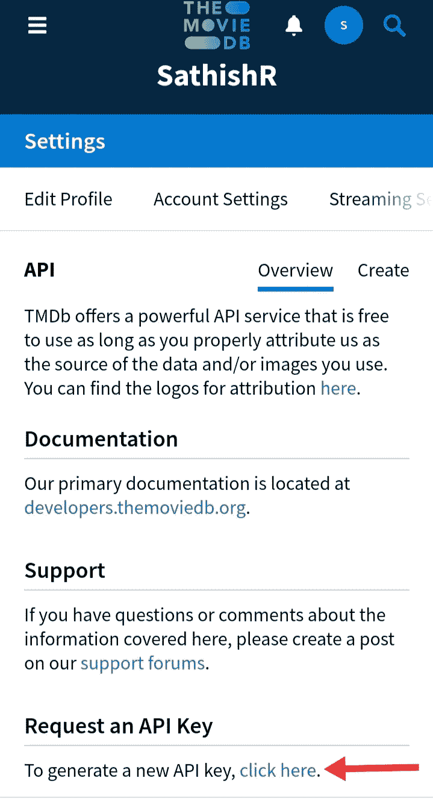
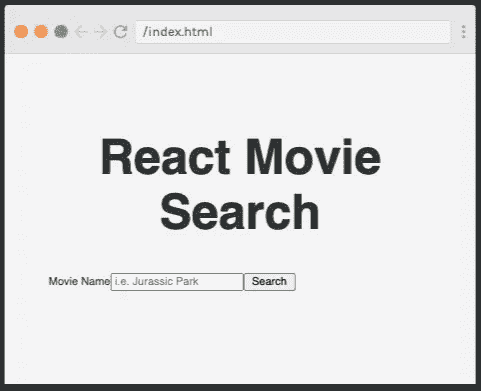
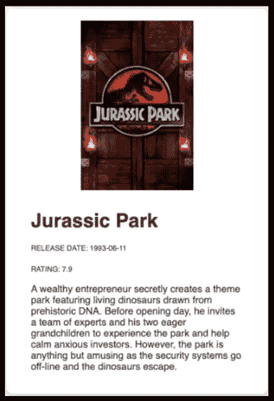

# 构建电影信息搜索应用程序

> 原文：<https://javascript.plainenglish.io/build-a-movie-info-search-app-ea39e1df6fdd?source=collection_archive---------2----------------------->

## 了解如何使用 React 构建电影信息搜索应用程序


Photo by [Felix Mooneeram](https://unsplash.com/@felixmooneeram?utm_source=medium&utm_medium=referral) on [Unsplash](https://unsplash.com?utm_source=medium&utm_medium=referral)

在这篇文章中，你将知道如何使用 React 创建一个简单的电影信息搜索应用程序。然后，我将指导你如何克服开发项目时将面临的交互式挑战，并成为一名成功的 React 开发人员。

在进入正题之前，我们先来看看 react。它是一个强大的前端框架，用于为移动和 web 开发构建用户界面。您可以使用可重用组件在 react 中创建复杂的 UI。

让我们深入了解我们的项目，开发这个应用程序要遵循的步骤列表:

*   获取 API 密钥
*   添加基本样式
*   创建组件并设置其样式。
*   创建函数
*   使用挂钩管理状态
*   创建和设计卡片

# 先决条件

在开始之前，您应该具备 HTML、CSS 和 JavaScript 基础知识来开发这个 React 代码。

我们开始吧！

# 获取 API 密钥

我们用来显示电影信息的 API 是 themoviedb.org。去这个网站注册一个免费账户，然后在你的账户中点击设置标签，生成一个 API。



# 添加基本样式

我们实例化的基本 React 应用程序如下所示:

```
import React from "react";
import ReactDOM from "react-dom";

class Main extends React.Component {
	render() {
		return <h1>Hello world!</h1>;
	}
}

ReactDOM.render(<Main />, document.getElementById("root"));
```

然后给 **style.css** 添加一些基本样式，包括边距、填充和样式表设置为默认，使应用居中。style.css 看起来像这样:

```
html {
   font-size: 10px;
}
* {
   border-sizing: border-box;
}body {
   margin:0;
   padding:0;
   background-color: rgba(244,244,244);
   color: #333;
}
p {
   font-size: 1.6 rem;
}
small {
   font-size: 1.2 rem;
}
. container {
   margin: 0;
   max-width: 1000px;
   padding: 40px;
}
.title {
   font-size: 4.4 rem;
   text-align: centre;
}
```

# 设置搜索电影组件的样式

下一步是设计我们的新组件。样式为我们的 **<窗体>** ， **<标签>** ， **<输入>** 和 **<按钮>** 然后添加一个媒体查询到 **style.css** 来调整较大设备上的样式。

```
@media (min-width: 786px) {
	.form {
		grid-template-columns: auto 1fr auto;
		grid-gap: 1rem;
		align-items: center;
	}

	.input {
		margin-bottom: 0;
	}
}
```

# 创建搜索电影功能



我们必须创建一个异步函数，该函数将获取 API 来检索 MovieDB API 中的电影信息，并将信息显示到我们的组件中。在 **searchMovie.js.** 中添加以下代码

```
export default function SearchMovies(){

    const searchMovies = async (e) => {
        e.preventDefault();

        const query = "Jurassic Park";

        const url = `https://api.themoviedb.org/3/search/movie?api_key=5dcf7f28a88be0edc01bbbde06f024ab&language=en-US&query=${query}&page=1&include_adult=false`;

        try {
            const res = await fetch(url);
            const data  = await res.json();
            console.log(data);
        }catch(err){
            console.error(err);
        }
    }
```

# 使用挂钩管理状态

让我们展示如何通过 **useState** 钩子使用状态来跟踪用户的查询。

```
const [query, setQuery] = useState("");
```

然后在我们的 **<输入>** 上设置 **onChange** 将其绑定到状态。

```
<input
	className="input"
	type="text"
	name="query"
	placeholder="i.e. Jurassic Park"
	value={query}
	onChange={(e) => setQuery(e.target.value)}
/>
```

# 创建并设计电影卡

现在让我们来展示一下我们的电影卡的风格，让它更有吸引力和用户友好。我们从一个卡片容器

开始。

```
.card {
    padding: 2rem 4rem;
    border-radius: 10px;
    box-shadow: 1px 1px 5px rgba(0,0,0,0.25);
    margin-bottom: 2rem;
    background-color: white;
}
```



Movie card

现在，我们已经在单独的模块中完成了所有这些步骤。让我们看看最后的 **searchMovie.js** 是什么样子的。

```
import React, {useState} from "react";

export default function SearchMovies(){

    //states- input query, movies
    const [query, setQuery] = useState('');
    //create the state for movies, and update that state appropriate
    const [movies, setMovies] = useState([]);

    const searchMovies = async (e) => {
        e.preventDefault();

        const url = `https://api.themoviedb.org/3/search/movie?api_key=5dcf7f28a88be0edc01bbbde06f024ab&language=en-US&query=${query}&page=1&include_adult=false`;

        try {
            const res = await fetch(url);
            const data  = await res.json();
            setMovies(data.results);
        }catch(err){
            console.error(err);
        }
    }

    return (
        <form className="form" onSubmit={searchMovies}>
            <label className="label" htmlFor="query">Movie Name</label>
            <input className="input" type="text" name="query"
                placeholder="i.e. Jurassic Park"
                value={query} onChange={(e) => setQuery(e.target.value)}
                />
            <button className="button" type="submit">Search</button>
        </form>
    )
}
```

# 结论

我希望你喜欢，知道如何在 React 中创建一个简单的组件，以及如何从第三方网站获取 API，并将其传递到我们的组件中并显示信息。您还可以向该应用程序添加许多功能。

祝您阅读愉快并感谢您的阅读！

## 简单英语的 JavaScript

喜欢这篇文章吗？如果是这样，通过 [**订阅解码获得更多类似内容，我们的 YouTube 频道**](https://www.youtube.com/channel/UCtipWUghju290NWcn8jhyAw) **！**