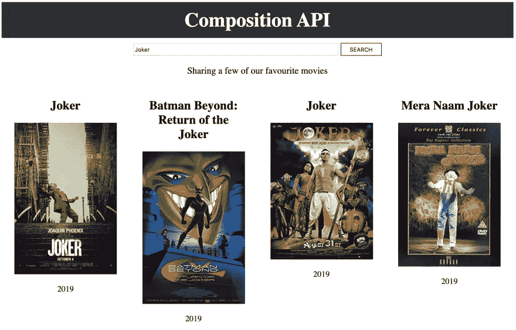

# 使用 Vue 合成 API 构建电影搜索应用程序

> 原文：<https://javascript.plainenglish.io/build-a-movie-search-app-using-the-vue-composition-api-f2e104ca9c79?source=collection_archive---------2----------------------->


Vue 3 的第一个 [alpha 版本发布了！版本 3 有很多令人兴奋的特性:Vue 在新的组合 API 后面公开了它的反应系统。如果你没有听说过它，我推荐阅读描述它的](https://github.com/vuejs/vue-next)[RFC](https://vue-composition-api-rfc.netlify.com/)。起初，我有点怀疑，但看着 React 的 Hooks API，这有点类似，我决定尝试一下。

在本文中，我们将使用 Composition API 构建一个电影搜索应用程序。我们不会使用基于对象的组件。我将解释新的 API 如何工作，以及我们如何构建应用程序。

当我们完成时，我们会看到类似这样的内容:



该应用程序将能够通过[开放电影数据库 API](http://www.omdbapi.com/apikey.aspx) 搜索电影，并呈现结果。构建这个应用程序的原因是，它足够简单，不会分散学习新 API 的注意力，但又足够复杂，足以展示它的工作原理。

如果你对解释不感兴趣，你可以直接进入[源代码](https://github.com/blacksonic/movie-search-vue)和[最终应用](https://codesandbox.io/s/github/blacksonic/movie-search-vue)。

# 设置项目

对于本教程，我们将使用 Vue CLI，它可以快速生成必要的环境。

```
npm install -g @vue/cli 
vue create movie-search-vue 
cd movie-search-vue 
npm run serve
```

我们的应用程序现在运行在 [http://localhost:8080](http://localhost:8080/) 上，如下所示:


在这里，您可以看到默认的文件夹结构:


如果你不想在本地计算机上安装所有的依赖项，你也可以在 [Codesandbox](https://codesandbox.io/) 上启动项目。Codesandbox 为最重要的框架提供了完美的入门项目，[包括 Vue](https://codesandbox.io/s/vue) 。

# 启用新的 API

生成的源代码使用 Vue 2 和旧 API。要在 Vue 2 中使用新的 API，我们必须安装[合成插件](https://github.com/vuejs/composition-api)。

```
npm install @vue/composition-api
```

安装后，我们必须将其添加为插件:

```
import Vue from 'vue';
import VueCompositionApi from '@vue/composition-api';

Vue.use(VueCompositionApi);
```

组合插件是附加的:你仍然可以用老方法创建和使用组件，并开始使用新的组合 API。

我们将有四个组成部分:

*   App.vue:父组件。它将处理 API 调用并与其他组件通信。
*   Header.vue:接收和显示页面标题的基本组件
*   它渲染每部电影。电影对象作为属性传递。
*   它包含一个带有输入元素和搜索按钮的表单。当您提交表单时，它向应用程序组件提供搜索词。

# 创建组件

让我们编写我们的第一个组件，头:

```
<template>
  <header class="App-header">
    <h2>{{ title }}</h2>
  </header>
</template>

<script>
  export default {
    name: 'Header',
    props: ['title'],
    setup() {}
  }
</script>
```

组件`props`以同样的方式声明。您将期望从父组件获得的变量命名为数组或对象。这些变量将在模板(`{{ title }}`)和`setup`方法中可用。

这里的新东西是`setup`方法。它在最初的`props`决议之后运行。`setup`方法可以返回一个对象，该对象的属性将被合并到模板上下文中:这意味着它们将在模板中可用。这个返回的对象也是放置生命周期回调的地方。我们将在搜索组件中看到这样的例子。

让我们来看看搜索组件:

```
<template>
  <form class="search">
    <input
       type="text"
       :value="movieTitle"
       @keyup="handleChange"
    />
    <input @click="handleSubmit" type="submit" value="SEARCH" />
  </form>
</template>

<script>
  import { ref } from '@vue/composition-api';

  export default {
    name: 'Search',
    props: ['search'],
    setup({ search }, { emit }) {
      const movieTitle = ref(search);

      return {
        movieTitle,
        handleSubmit(event) {
          event.preventDefault();
          emit('search', movieTitle.value);
        },
        handleChange(event) {
          movieTitle.value = event.target.value
        }
      }
    }
  };
</script>
```

搜索组件跟踪击键并将输入值存储在变量中。当我们完成并按下 submit 按钮时，它发出当前的搜索词直到父组件。

`setup`方法有两个参数。

第一个参数是作为命名对象解析的`props`。您可以使用对象析构来访问其属性。该参数是反应性的，这意味着当输入属性改变时，`setup`功能将再次运行。

第二个参数是上下文对象。在这里，您可以找到 2.x API 中的`this`上可用的属性的选择性列表(`attrs`、`slots`、`parent`、`root`、`emit`)。

这里的下一个新元素是`ref`函数。`ref`功能暴露 Vue 的反应系统。当被调用时，它创建一个具有单一属性`value`的反应性可变变量。属性将把参数的值传递给函数。它是围绕原始值的反应式包装器。在模板内部，我们不需要引用`value`属性，Vue 会为我们解开它。如果我们传入一个对象，它将是深度反应的。

Reactive 意味着当我们修改对象的值(在我们的例子中是`value`属性)时，Vue 将知道值已经改变，它需要重新呈现连接的模板并重新运行被监视的函数。

它的行为类似于从`data`方法返回的对象属性。

```
data: function() {
  return { movieTitle: 'Joker' };
}
```

# 粘合在一起

下一步是引入标题和搜索组件的父组件，即 App 组件。它监听来自搜索组件的搜索事件，在搜索词发生变化时运行 API，并将找到的电影传递给电影组件列表。

```
<template>
  <div class="App">
    <Header :title="'Composition API'" />
    <Search :search="state.search" @search="handleSearch" />
    <p class="App-intro">Sharing a few of our favourite movies</p>
    <div class="movies">
      <Movie v-for="movie in state.movies" :movie="movie" :key="movie.imdbID" />
    </div>
  </div>
</template>

<script>
  import { reactive, watch } from '@vue/composition-api';
  import Header from './Header.vue';
  import Search from './Search.vue';
  import Movie from './Movie.vue';

  const API_KEY = 'a5549d08';

  export default {
    name: 'app',
    components: {
      Header, Search, Movie
    },
    setup() {
      const state = reactive({
        search: 'Joker',
        loading: true,
        movies: [],
        errorMessage: null
      });

      watch(() => {
        const MOVIE_API_URL = `https://www.omdbapi.com/?s=${state.search}&apikey=${API_KEY}`;

        fetch(MOVIE_API_URL)
          .then(response => response.json())
          .then(jsonResponse => {
            state.movies = jsonResponse.Search;
            state.loading = false;
          });
      });

      return {
        state,
        handleSearch(searchTerm) {
          state.loading = true;
          state.search = searchTerm;
        }
      };
    }
  }
</script>
```

我们在这里引入两个新元素:`reactive`和`watch`。

`reactive`功能相当于 Vue 2 的`Vue.observable()`。
它使传递的对象深度反应:获取原始对象并用代理包装它(ES2015 基于代理的实现)。在从`reactive`返回的对象上，我们可以直接访问属性，而不是从`ref`函数返回的值，我们需要使用`value`属性。如果您想在 Vue 2.x API 中搜索对等物，那么`data`方法将是完全匹配的。

`reactive`对象的一个缺点是我们不能将它扩展到从`setup`方法返回的对象中。

`watch`函数需要一个函数。它跟踪内部的反应变量，就像组件跟踪模板一样。当我们修改传递的函数中使用的反应变量时，给定的函数再次运行。在我们的例子中，每当搜索词改变时，它获取匹配搜索词的电影。

剩下一个组件，显示每个电影记录:

```
<template>
  <div class="movie">
    <h2>{{ movie.Title }}</h2>
    <div>
      
    </div>
    <p>{{ movie.Year }}</p>
  </div>
</template>

<script>
  import { computed } from '@vue/composition-api';

  export default {
    name: "Movie",
    props: ['movie'],
    setup({ movie }) {
      const altText = computed(() => `The movie titled: ${movie.Title}`);

      return { altText };
    }
  };
</script>
```

电影组件接收要显示的电影，并将其名称与其图像一起打印出来。令人兴奋的是，对于图像的`alt`字段，我们使用了基于其标题的计算文本。

`computed`函数获取一个 getter 函数，并将返回的变量包装成一个反应变量。返回的变量与从`ref`函数返回的变量具有相同的接口。区别在于它是只读的。当 getter 函数中的一个反应变量改变时，getter 函数将再次运行。如果`computed`函数返回一个非包装的原始值，模板将无法跟踪依赖关系的变化。

# 清理组件

此时，我们在 App 组件内部有很多业务逻辑。它做两件事:处理 API 调用及其子组件。目标是每个对象有一个责任:应用程序组件应该只管理组件，不应该为 API 调用而烦恼。为此，我们必须提取 API 调用。

```
import { reactive, watch } from '@vue/composition-api';
const API_KEY = 'a5549d08';

export const useMovieApi = () => {
  const state = reactive({
    search: 'Joker',
    loading: true,
    movies: []
  });

  watch(() => {
    const MOVIE_API_URL = `https://www.omdbapi.com/?s=${state.search}&apikey=${API_KEY}`;

    fetch(MOVIE_API_URL)
      .then(response => response.json())
      .then(jsonResponse => {
        state.movies = jsonResponse.Search;
        state.loading = false;
      });
  });

  return state;
};
```

现在，App 组件收缩到只处理与视图相关的操作:

```
import Header from './Header.vue';
import Search from './Search.vue';
import Movie from './Movie.vue';
import { useMovieApi } from '../hooks/movie-api';

export default {
  name: 'app',
  components: { Header, Search, Movie },
  setup() {
    const state = useMovieApi();

    return {
      state,
      handleSearch(searchTerm) {
        state.loading = true;
        state.search = searchTerm;
      }
    };
  }
}
```

仅此而已；我们用新的组合 API 实现了一个小应用程序。

# 包装它

自从使用 Vue CLI 生成项目以来，我们已经走过了漫长的道路。让我们总结一下我们所学的。

我们可以在当前稳定的 Vue 2 版本中使用新的组合 API。为了实现这一点，我们必须使用`@vue/composition-api`插件。API 是可扩展的:我们可以用新的 API 和旧的一起创建新的组件，现有的组件将继续像以前一样工作。

Vue 3 将引入许多不同的功能:

*   `setup`:驻留在组件上，将编排组件的逻辑，在初始`props`解析后运行，接收`props`和上下文作为参数
*   `ref`:返回一个反应变量，在模板改变时触发重新渲染，我们可以通过`value`属性操纵它的值。
*   `reactive`:返回一个反应对象(基于代理)，在反应变量改变时触发模板的重新渲染，我们可以在没有`value`属性的情况下修改其值
*   `computed`:根据 getter 函数参数返回一个反应变量，跟踪反应变量的变化，并在变化时重新计算
*   `watch`:根据提供的功能处理副作用，跟踪反应变量变化，并根据变化重新运行

我希望这个例子已经让您熟悉了新的 API，并消除了您的疑虑，就像我一样。

*原发布于 2019 年 10 月 17 日*[*https://dev . to*](https://dev.to/blacksonic/build-a-movie-search-app-using-the-vue-composition-api-5218)*。*