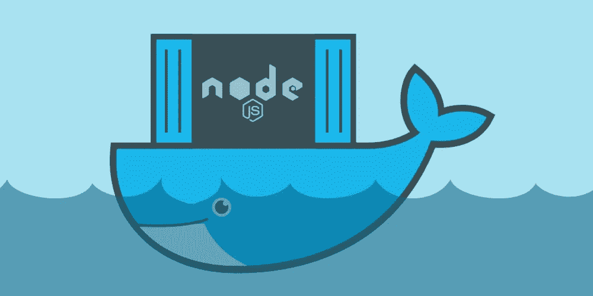

# 使用 Docker 构建生产就绪节点/Express API

> 原文：<https://javascript.plainenglish.io/build-a-production-ready-node-express-api-with-docker-9a45443427a0?source=collection_archive---------0----------------------->



image courtesy of dev.to

容器是运行在共享操作系统上的独立进程。要在容器中运行应用程序，您需要一个映像，它是源代码、运行时、库、配置文件和其他所需资产的“捆绑包”。这个“捆绑包”确保了标准化，并且只包含必需的资产。这使得容器化的应用程序变得轻量级和非常便携。

Docker 是一种允许我们将应用程序打包并作为容器运行的技术。随着最近对构建可伸缩的分布式系统的需求的增加，容器化已经成为主流，以至于“Dockerize”几乎成为一种事物。这也导致了围绕集装箱化构建的工具和框架的兴起，如 [Docker Swarm](https://docs.docker.com/engine/swarm/) 和 [Kubernetes](https://kubernetes.io/) 。

欢迎阅读关于 NodeJS 和 Express 的三部分系列的第二部分。本系列的其他文章包括:

*   [用 Node、Express 和 TypeScript 构建轻量级 REST API](https://medium.com/swlh/build-a-light-weight-rest-api-with-node-express-and-typescript-2e16b70691ad)
*   在裸机服务器上部署节点和 Express API

# 让我们对 Express API 进行分类

事实证明，为 Express 应用程序创建 Docker 映像非常容易。你所需要的只是一个文档。这是一个文本文件，包含一组命令性的指令，告诉 Docker 如何构建映像。首先，让我们看看我们在上一篇文章中写的代码:

[](https://github.com/MwinyiMoha/express-typescript-api) [## MwinyiMoha/express-typescript-API

### Express 和 TypeScript 入门。为 MwinyiMoha/express-typescript-API 开发做出贡献，创建一个…

github.com](https://github.com/MwinyiMoha/express-typescript-api) 

让我们创建一个名为`Dockerfile`的文件—是的，没有扩展名。然后，增加以下内容:

让我们通过在包含我们代码的目录中打开一个终端并运行:

```
docker build -t <docker-username>/expressapi:v1 .
```

我假设你有码头工人账户。如果没有，请前往 [Docker Hub](https://hub.docker.com/) 免费注册。用您的真实 Docker 用户名替换`<docker-username>`。

# 多么可怕的例子

上述 Dockerfile 文件生成的图像是:

*   非常“重”，重量高达 1GB。沉重的映像会导致部署缓慢，在某些情况下还会让您损失金钱
*   构建缓慢，因为它没有利用 Docker 的缓存机制
*   充斥着开发依赖
*   不安全，离生产就绪还差得远

虽然网上有概述上述步骤或类似内容的资料，但它们要么是针对绝对初学者的，要么是方便的简短示例，要么是彻头彻尾的糟糕指南。

# 以正确的方式去做

为了减轻前面提到的一些顾虑，如果我们的映像准备好投入生产，我们需要考虑几个问题。其中包括:

*   **Docker 的构建上下文**

构建上下文基本上是 docker 文件所在的目录。在构建期间，文件和目录的所有递归内容都作为构建上下文发送到 Docker。这包括臭名昭著的`node_modules`目录的内容，我们不需要发送这些内容，因此需要忽略它们。我们为此使用了一个`.dockerignore`文件:

```
touch .dockerignoreecho "node_modules/" >> .dockerignore
```

下一次我们运行构建时，我们的上下文将**在这个例子中**小大约 **60MB** 。

*   **从轻量级基础映像开始**

在之前的构建中，我们从基于 Debian(stretch) Linux 的`node:latest`基础映像开始，它的重量大约为 **940MB** 。相比之下，基于 Alpine Linux 的`node:14-alpine`有 **117MB** 重，是一个可行的轻量级候选。让我们更新 docker 文件中的第一行，使用这个更亮的图像:

```
FROM node:14-alpine
```

*   **利用 Docker 的层缓存机制**

Docker 的缓存机制可能值得单独写一篇文章。总之，Docker 使用分层的方法一层一层地“堆叠”来构建图像。如果特定层的指令与之前的构建相比没有变化，Docker 将从缓存中提取该层，而不是重建它，从而加快构建过程。让我们用它来安装 NPM 库:

```
COPY package*.json ./RUN npm iCOPY . .
```

在上面的设置中，我们在运行安装命令之前复制了`package.json`和`package-lock.json`文件。然后，在安装 NPM 库之后，我们复制其余的源代码。这确保了如果`package.json`和`package-lock.json`的内容没有改变，Docker 将使用缓存层并跳过重新安装 NPM 库。

*   **使用多阶段构建管理依赖关系**

如果您还记得，在第一篇文章中，我们安装了几个开发依赖项，使用了:

```
npm i -D typescript ts-node-dev @types/express
```

代码从 TypeScript 转换成 JavaScript 后，这些库就不再需要了，这意味着它们只是增加了我们的图像。我们将采用多阶段构建来移除这些。现在，多阶段构建是另一个可能需要单独文章的概念。点击此处阅读更多内容:

[](https://docs.docker.com/develop/develop-images/multistage-build/) [## 使用多阶段构建

### 多阶段构建是一项新功能，要求守护程序和客户端上的 Docker 17.05 或更高版本。多阶段构建是…

docs.docker.com](https://docs.docker.com/develop/develop-images/multistage-build/) 

我们的多阶段战略将有两个命名阶段:构建阶段和最终阶段。构建阶段将:

*   安装所有依赖项，包括 TypeScript
*   将代码转换成 JavaScript 并保存在一个`dist`目录中

最后阶段将:

*   从构建器阶段复制`dist`目录
*   仅安装**生产中所需的**依赖项
*   使用复制的 JavaScript 代码运行应用程序

我们的 docker 文件现在看起来像这样:

嗯，这是一些 docker 文件！

*   **以非根用户身份运行应用**

默认情况下，Docker 映像以 root 用户身份运行。这带来了安全问题，因为根用户拥有升级的权限。经验法则:以非根用户的身份运行 docker 映像。幸运的是，`node:14-alpine`映像附带了一个名为`node`的非根用户，其主目录在`/home/node/`。在确保该用户拥有必要文件的所有权后，我们将使用该用户来运行应用程序。

让我们更新我们的最后阶段:

*   **使用生产级流程经理**

虽然 Node 二进制文件在开发环境中可能已经足够了，但是在生产环境中运行 Node 应用程序的最佳方式是使用进程管理器，比如 PM2。它提供了方便启动、管理和管理节点应用程序的特性。点击此处了解更多信息:

[](https://pm2.keymetrics.io/) [## PM2 -家

### 伙计们刚刚在我的实时服务器上安装了 pm2，并连接到 Keymetrics。印象深刻。这一切天衣无缝，棒极了…

pm2.keymetrics.io](https://pm2.keymetrics.io/) 

PM2 的一个优点是，我们可以使用配置文件来声明应用程序的期望状态。让我们在项目的根目录下创建一个`process.yml`文件，内容如下:

文件告诉 PM2:

*   我们有一个名为`express-typescript-api`的应用
*   入口点是`./dist/index.js`
*   应用程序应该以集群模式运行，并且
*   从系统中推断要运行的工作人员的最大数量

我们还需要安装 PM2，并使用适合容器化应用程序的`pm2-runtime`来运行应用程序。让我们再次更新我们的最后阶段:

既然说的是生产级流程经理，那也可以说一下 **NODE_ENV** 。如 Dockerfile 中的第 6 行所示，将此设置为“production ”,可以提高应用程序的性能，并减少错误消息的冗长性，这是典型的生产行为。

请注意，有时我们可能不想在构建步骤中直接设置环境，而是在运行容器时指定它。在这种情况下，您可以从 Dockerfile 中省略环境，并在运行时指定它，如下所示:

```
docker run -e NODE_ENV=production <image-name>
```

上面的命令为我们提供了灵活性，以便我们可以在开发或生产设置下确定应用程序的行为

*   **安装安全更新**

最新的平台和安全补丁对生产中运行的任何应用程序都至关重要。我们将通过使用 Alpine Linux 的`apk`包管理器安装更新来确保我们的应用程序基础层是最新的:

```
RUN apk --no-cache -U upgrade
```

该命令更新基本映像的包索引，升级已安装的包，并使用`--no-cache`标志确保包索引文件不会下载到我们的映像中，从而保持它的简洁。

# 让我们建立图像

我们最终的 docker 文件现在看起来像这样:

Build a light-weight REST API with Node, Express and TypeScript

让我们使用以下方式构建图像:

```
docker build -t <docker-username>/expressapi:latest .
```

我们的新图像重达令人印象深刻的 155 MB。并且，请记住 **117MB** 是我们的基本映像，这意味着我们的源代码、节点包、操作系统更新和配置只给我们的总映像大小增加了 **38 MB** ，这是相当公平的。

由于我们使用的是多阶段策略，我们可以瞄准并构建一个特定的阶段。这允许我们为检查目的构建图像的开发版本。例如，我们可以针对`builder`阶段使用:

```
docker build --target builder -t <docker-username>/expressapi:dev .
```

# **总结**

总而言之，我们做了大量工作来确保我们的映像符合在生产中运行容器化应用程序的既定标准。进一步的调整和优化可以使我们的形象“更好”。

例如，如果我们选择将我们的应用基于 Node 版本 10——该版本将于 2021 年 4 月在 LTS 发布——而不是版本 14，我们可以减少额外的 33MB。但是，考虑与使用旧版本相关的权衡是很重要的。

一个叫做`FromLatest`的有趣工具帮助检测和解决 Dockerfiles 中的问题。请点击这里查看:

[](https://www.fromlatest.io/#/) [## 来自:最新的，一个固执己见的码头工人。

### 查看您的 docker 文件，看看您是否实现了最佳实践。

www.fromlatest.io](https://www.fromlatest.io/#/) 

快乐大厦！