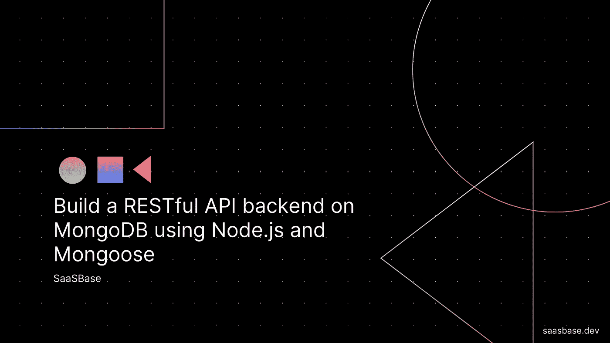
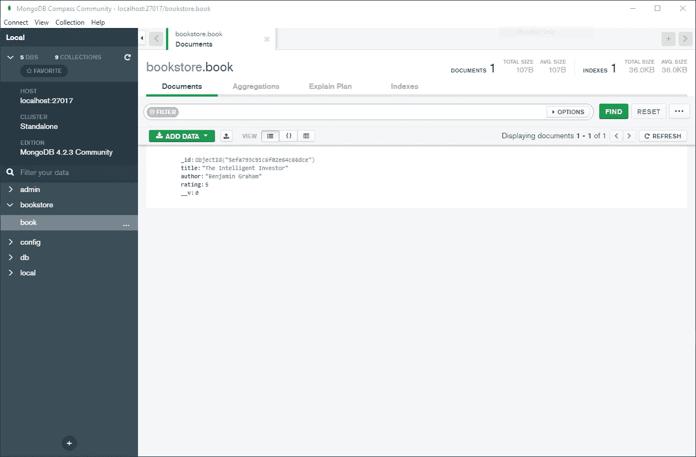

# 使用 Node.js 和 Mongoose 在 MongoDB 上构建一个 RESTful API 后端

> 原文：<https://javascript.plainenglish.io/build-a-restful-api-backend-on-mongodb-using-node-js-and-mongoose-63f0866e4603?source=collection_archive---------2----------------------->

## Node.js 开发

## MongoDB 是一个优秀的 NoSQL 数据库



在本教程中，我们将创建一个 Node.js 应用程序，为一家已建立的书店存储图书。

# 先决条件

1.  [Node.js](https://nodejs.org/en/download/)
2.  [MongoDB](https://www.mongodb.com/try/download/community)
3.  [用于 MongoDB 的指南针](https://www.mongodb.com/products/compass)

# 启动 MongoDB

打开命令提示符。键入，

默认情况下，这将在本地主机的端口 27017 上启动一个 MongoDB 服务器。

打开指南针并连接到 MongoDB。它允许您更容易地检查数据，而不需要 shell 命令。

# 创建新项目

在这里克隆简单的 Node.js 项目[。](https://github.com/bdcorps/serve-static-website-nodejs)

Node.js 新手？参考此[链接](https://medium.com/@adnanrahic/hello-world-app-with-node-js-and-express-c1eb7cfa8a30)获取详细的演练。

安装 NPM 软件包，

```
npm install body-parser express mongoose
```

使用以下命令在本地运行它，

转到[localhost:3000](https://saasbase.dev/build-a-restful-api-backend-on-mongodb-using-nodejs-and-mongoose/localhost:3000),“Hello World”应该会出现在屏幕上。

# 创建数据模型

因为我们保存了我们最喜欢的书的记录，所以让我们定义我们的`book`模型。

创建一个新文件，`book/book.model.js`

```
var mongoose = require("mongoose");
var Schema = mongoose.Schema;

var bookSchema = new Schema({
  title: String,
  author: String,
  rating: Number,
});

var bookModel = mongoose.model("book", bookSchema, "book");

module.exports = bookModel;
```

# 创建服务层

作为最佳实践的一部分，拥有一组像`createBook`、`getBooks`这样的标准化函数总比直接从主应用程序与模型交互要好。这也使得添加单元测试更加容易。

创建一个新文件，`book/book.service.js`

```
const addBook = (Book) => (title, author, rating) => {
  if (!title || !author || !rating)
    throw new Error(
      "Missing Data. Please provide values for title, author, and rating."
    );
  const book = new Book({ title, author, rating });
  return book.save();
};

const listBooks = (Book) => () => {
  return Book.find({});
};

module.exports = (Book) => {
  return {
    addBook: addBook(Book),
    listBooks: listBooks(Book),
  };
};
```

创建一个新文件，`book/index.js`

```
const Book = require("./book.model");
const BookService = require("./book.service");

module.exports = BookService(Book);
```

# 添加 API 端点

让我们设置 API 端点，这些端点将用于添加和列出书店中当前可用的书籍。

创建一个名为`app.js`的文件

```
"use strict";
var express = require("express");
var bodyParser = require("body-parser");
var mongoose = require("mongoose");

const BookService = require("./book");

var app = express();

mongoose.Promise = global.Promise;

var uri = "mongodb://localhost:27017/bookstore";
mongoose.connect(uri, {
  useUnifiedTopology: true,
  useNewUrlParser: true,
});

app.use(
  bodyParser.urlencoded({
    extended: false,
  })
);
app.use(bodyParser.json());

app.get("/listBooks", async function (req, res, next) {
  try {
    const books = await BookService.listBooks();
    res.json(books);
  } catch (e) {
    next(e);
  }
});

app.get("/addBook", async function (req, res, next) {
  const title = req.query.title;
  const author = req.query.author;
  const rating = req.query.rating;

  try {
    const books = await BookService.addBook(title, author, rating);
    res.json(books);
  } catch (e) {
    next(e);
  }
});

app.listen(3000, "0.0.0.0", function () {
  console.log("server starting on localhost:3000");
});
```

# 测试应用程序

```
**node app**
```

通过运行以下命令启动应用程序，

书店应用程序的启动命令

让我们打开 Postman，尝试添加一本新书。

我们可以打开 Compass 并确认图书记录确实已经被添加。



让我们试着列出所有可得到的书。


# 后续步骤

在本教程中，我们将本地 MongoDB 服务器连接到 Node.js 应用程序，以便保存和读取数据。为`updateBook`和`deleteBook`添加端点以构建更多功能。添加一个简单的 HTML 页面，使用户可以轻松地创建和列出图书。

在[推特](https://twitter.com/sssaini_)上找到我，我们聊聊:)

*原载于 2020 年 6 月 7 日*[*https://SaaS base . dev*](https://saasbase.dev/build-a-restful-api-backend-on-mongodb-using-nodejs-and-mongoose/)*。*