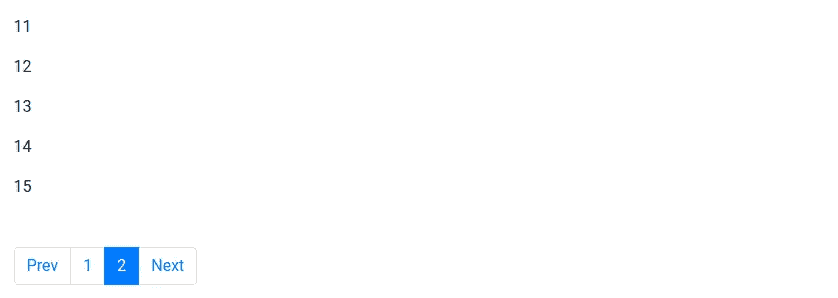

# 用 Bootstrap 4 和 LitElement 构建一个可重用的分页 Web 组件

> 原文：<https://javascript.plainenglish.io/build-a-reusable-pagination-web-component-with-bootstrap-4-and-litelement-63ff4eebda4b?source=collection_archive---------2----------------------->

## 使用 bootstrap、LitElement 和 ES6+的标准 Web 组件的简单实现


Image: Two monitors with no visible code.

最近在一个项目中，我不得不使用 Bootstrap 4 为我的清单使用分页器组件。因为我找不到一个基于 Web 组件的，所以我决定创建一个。

在这篇总结性文章中，我将一步步向您展示如何基于 Bootstrap 4 styles、LitElement 和 jQuery 构建 Web paginator 组件。

要阅读这篇文章，建议你具备基本的文学知识。在上一篇文章中，我写了一篇关于 LitElement 的介绍:“[如何用 LitElement](http://How to create a lightweight web component with LitElement) 创建轻量级 web 组件。”

## 要求

**LitElement:** *一个简单的基类，用于创建快速轻量级的 web 组件。LitElement 遵循* [*Web 组件标准*](https://developer.mozilla.org/en-US/docs/Web/Web_Components) *，因此您的组件将与任何框架一起工作。*

[https://lit-element.polymer-project.org/](https://lit-element.polymer-project.org/)

**jQuery:** *jQuery 是一个快速、小巧、功能丰富的 JavaScript 库。它通过一个跨多种浏览器工作的易于使用的 API，使 HTML 文档遍历和操作、事件处理、动画和 Ajax 变得更加简单。*

[https://jquery.com/](https://jquery.com/)

Bootstrap : *Bootstrap 是一个免费的前端框架，用于更快更简单的 web 开发。我们需要自举 4 风格。*

让我们开始:

# 1.包括所有必要的依赖项

## **文件:Index.html**

```
**<!doctype html>**
<html class="no-js" lang="">**<head>**<!-- **Bootstrap CSS** -->
<link rel="stylesheet" href="https://maxcdn.bootstrapcdn.com/bootstrap/4.0.0/css/bootstrap.min.css" integrity="sha384-Gn5384xqQ1aoWXA+058RXPxPg6fy4IWvTNh0E263XmFcJlSAwiGgFAW/dAiS6JXm" crossorigin="anonymous"><!--**Jquery**-->
<script src="[https://cdnjs.cloudflare.com/ajax/libs/jquery/3.2.1/jquery.min.js](https://cdnjs.cloudflare.com/ajax/libs/jquery/3.2.1/jquery.min.js)" crossorigin="anonymous"></script><!--**LitElement**-->
<script type="module">
 import { LitElement, html } from 'lit-element';
</script>**</head>** **<body>
  ...
 </body>****</html>**
```

现在让我们定义一个名为 *ListComponent* 的 web 组件，它将显示一个元素列表，我们将使用我们的*分页 Web 组件*对它的元素进行分页。

## **文件:ListComponent.js**

1.  导入 LitElement 依赖项。
2.  导入我们的 paginator 组件。
3.  创建 ListComponent 组件。
4.  确保在任何声明的属性更改时计划元素更新。
5.  在类的构造函数中初始化变量。
6.  引用包含所有元素的原始列表。
7.  响应列表是每页上显示的列表。
8.  如果我们正在初始化分页，一个帮助变量对分页器组件说。例如，如果我们向服务器发出一个新的调用，根据一些搜索字段给我们带来另一个新的列表，这是很有用的。
9.  在元素的 DOM 第一次更新后，调用“firstUpdated”方法。
10.  我们要分页显示的列表。
11.  基于 const: PAGINATION_SIZE 创建初始分页列表。
12.  每当我们改变父列表中原始列表的内容时，我们都必须重新初始化分页器。
13.  订阅我们的“分页事件”从分页组件调用。
14.  当使用分页器时，我们更新列表的内容以显示在父节点上。
15.  呈现列表并包含我们的分页器组件。
16.  将我们的分页器组件作为 ListComponent 的子组件。
17.  通过这种方法，我们定义了一个新的定制元素。

```
//1.
import { LitElement , html} 
 from '../web_modules/
 lit-element.js';//2.
import { PaginatorComponent } 
 from 
 './paginatorComponent.js';//3.
export class ListComponent 
 extends LitElement {//4.
static get properties() {
  return {
   itemsPaginated: {type: Array}
  };
}//5.
constructor() {
 super();
 //6.
 this.responseList = [];
 //7\. 
 this.itemsPaginated = [];
 //8\. 
 this.initPagination = true;
}//9.
firstUpdated() {//10.
this.responseList = 
  [1,2,3,4,5,6,7,8,9
   ,10,11,12,13,14,15];//11
this.itemsPaginated = 
  this.responseList.slice(0,
   PAGINATION_SIZE);//12.
this.initPagination = 
   !this.initPagination//13.
this.addEventListener('page-event',  
   this.updateFromPaginationComponent);
}//14.
updateFromPaginationComponent(e) {
 this.itemsPaginated 
  =e.detail.newList;
 e.stopPropagation();
}//15.
render() {
 return html`
  <ul>
   ${this.itemsPaginated.map(
   item => html`
    <li>
     ${item}
    </li>`
    )}
  </ul>//16\. 
 <**paginator**
    .list = "${this.responseList}"
    .initPagination = 
      "${this.initPagination}"
 </**paginator**> 
 `
 }
}//17.
customElements
  .define('list-component',
  ListComponent);
```

# 2.创建分页器 Web 组件

## **文件:PaginatorComponent.js**

1.  顶部的按钮数量，不包括上一页/下一页，
    但包括虚线按钮。
2.  限制每页的项目数。
3.  初始化我们的 Web 组件。
4.  创建初始按钮和监听器。
5.  管理分页链接和事件。
6.  DispatchEvent 函数。
7.  返回页码数组。
8.  “customElements.define”定义一个新的自定义元素。

```
import { html, LitElement}
 from './lit-element.js';//1.
const PAGINATION_SIZE = 10;//2.
const LIMIT_PER_PAGE =10;export class 
 PaginatorComponent
 extends LitElement { //3. //4. //5. //6. //7.render() {
  return html`
   <nav aria-label="Page 
     navigation">
     <ul class="pagination mb-5" 
       id="pagination">
     </ul>
  </nav>
  `
 }
}//8.
customElements
.define('paginator', Paginator);
```

# **3。**初始化我们的 Web 组件

3.1 如果要分页的列表发生变化，则对元素重新分页。

3.2 如果“initPagination”属性发生变化，那么我们将“currentPage”的值设置为 1，因为原来的列表发生了变化，我们需要重新启动分页器。

3.3 我们在创建组件时初始化变量。

```
static get properties() {
 return {
   list: {
    type: Array
   },
   initPagination:{type: Boolean}
   };
}//3.1
set list(value) {
 if(value && value.length >0) {
   this.originalListCopy = value;
   this.paginate(value);
 }
}//3.2
set initPagination(value){
 this.currentPage = 1;
}//3.3
constructor() {
    super();
    this.list = [];
    this.originalListCopy = [];
    this.currentPage = 1;
}firstUpdated() {}
```

# **4。**创建初始按钮并添加监听器

创建初始按钮，并在我们的分页器中向它们添加侦听器:

4.1 总页数限制功能中的每页项数。向上舍入的总页数。

4.2 添加“上一步”按钮。

4.3 添加“下一步”按钮。

4.4 显示分页元素。

4.5 向按钮添加监听器并使用事件委托，因为这些项目稍后会被重新创建。单击按钮时，重新加载 pagination 元素。

```
paginate(list) {
 $(() => { let numberOfItems = 
  list ? list.length : 0; //4.1
 let totalPages =
  Math.ceil(numberOfItems 
    / LIMIT_PER_PAGE); //4.2 
 $(".pagination").append(
    $("<li>")
    .addClass("page-item")
    .attr(
    {id: "previous-page"})
     .append(
       $("<a>")
       .addClass("page-link")
       .attr({
        href: "javascript:void(0)"
       })
      .text(this.t(Prev'))
  ), //4.3
 $("<li>")
   .addClass("page-item")
   .attr({id: "next-page"})
   .append(
    $("<a>")
    .addClass("page-link")
    .attr({
    href: "javascript:void(0)"
    })
    .text(this.t('Next'))
    )
 ); //4.4 
 this.showPage(this.currentPage, 
  totalPages, false); //4.5
 $('#previous-page')
   .on("click",
     (e) => {
       e.stopImmediatePropagation();
        return this.showPage(
         this.currentPage -1,
         totalPages, true);
 }); $(document)
   .on("click",
    ".pagination li.current-page:not(.active)",
    (e) =>{
      e.stopImmediatePropagation();
      return this.showPage(
        parseInt($(e.target).text()),   
        totalPages, true);
 }); $('#next-page')
  .on("click", (e) => {
    e.stopImmediatePropagation();
    return this.showPage(
     this.currentPage 
     +1, totalPages, true);
    });
  });}
```

# **5。**管理分页链接和事件

5.1 更换导航项目(上一页/下一页除外):

```
showPage(whichPage, totalPages, dispatchEvent) { if (whichPage < 1 ||
  whichPage > totalPages)
    return false; //5.1
 $(".pagination li")
   .slice(1, -1).remove(); this.getPageList(totalPages,
   whichPage,  
   PAGINATION_SIZE).forEach(item => { $("<li>")
    .addClass(
      "page-item " +
      (item ? 
      "current-page " : "") +
      (item === whichPage 
         ? "active " : "") 
    )
    .append(
      $("<a>")
      .addClass("page-link")
      .attr({
        href: 
         "javascript:void(0)",
      })
      .attr({id: item})
      .text(item || "...")
      )
    .insertBefore("#next-page"); this.currentPage=whichPage;
      if(dispatchEvent === true 
          && whichPage === item){
        this.dispatchEvent();
      }
   });return true;}
```

# **6。D** ispatchEvent 函数

6.1 将事件分派给父亲，新列表将显示在主组件(ListComponent)中。

```
dispatchEvent() {
 let newList = 
   this.originalListCopy.slice(
    (this.currentPage - 1) *   
     LIMIT_PER_PAGE,
     this.currentPage 
     * LIMIT_PER_PAGE
   ); let myEvent =
   new CustomEvent('pag-event',
   { bubbles: true,
     composed: false ,
     detail: {
      newList: newList
   }}); //6.1
 this.dispatchEvent(myEvent)
}
```

# **7。**返回页码数组

返回 maxLength(或更少)页码的数组，其中返回的数组中的 0 表示系列中的间隔。

7.1 参数:

totalPages:总页数。
页面:当前页面。
maxLength:返回数组的最大大小。

7.2 列表中没有中断。

7.3 页面左侧无分隔符。

7.4 页面右侧无分隔符

两边 7.5 断。

```
//7.1
getPageList(totalPages, page, maxLength) {if (maxLength
  < MINIMUN_MAX_LENGTH)
  throw "maxLength must be at least:"
  +MINIMUN_MAX_LENGTH;function range(start, end) {
  return Array.
    from(Array(end - start + 1),
    (_, i) => i + start);
}let sideWidth =
  maxLength < PAGINATION_SIZE -1 ? 1 : 2;let leftWidth = (maxLength 
  - sideWidth * 2 - 3) >> 1;let rightWidth = (maxLength 
  - sideWidth * 2 - 2) >> 1;//7.2
if (totalPages <= maxLength) { 
  return range(1, totalPages);
}//7.3
if (page <= maxLength -
     sideWidth - 1 - rightWidth) {return range(1, maxLength 
      - sideWidth - 1)
    .concat([0])
    .concat(range(totalPages 
     - sideWidth 
    + 1, totalPages));
}//7.4
if (page >= totalPages - 
    sideWidth - 1 - rightWidth) {return range(1, sideWidth)
      .concat([0])
      .concat(
        range(totalPages 
         - sideWidth
         - 1 - rightWidth - 
         leftWidth, totalPages)
      );
    } //7.5
 range(1, sideWidth)
 .concat([0])
 .concat(range(page - 
     leftWidth, page +
     rightWidth))
 .concat([0])
 .concat(range(totalPages 
     - sideWidth + 1,
 totalPages));
}
```

最终代码包括所有内容:

```
**<!doctype html>**
<html class="no-js" lang="">**<head>**<!-- **Bootstrap CSS** -->
<link rel="stylesheet" href="https://maxcdn.bootstrapcdn.com/bootstrap/4.0.0/css/bootstrap.min.css" integrity="sha384-Gn5384xqQ1aoWXA+058RXPxPg6fy4IWvTNh0E263XmFcJlSAwiGgFAW/dAiS6JXm" crossorigin="anonymous"><!--**Jquery**-->
<script src="https://cdnjs.cloudflare.com/ajax/libs/jquery/3.2.1/jquery.min.js" crossorigin="anonymous"></script><!--**LitElement**-->
<script type="module">
 import { LitElement, html } from 'lit-element';
</script>**</head>**<body>**//Our list component with the paginator component inside of it.
  <list-component></list-component>**<script type="module">
    import {
     ListComponent from './listComponent.js'  
  </script></body>**</html>**
```

在 Web 浏览器中显示:


The paginated list. Page 1



The paginated list. Page 2

# 结论

在本文中，我们看到了一个简单的例子，展示了如何构建用于分页的 web 组件，如果您需要使用 Web 组件和 bootstrap 创建分页器，这个例子可以作为一个例子。

非常感谢您阅读这篇小文章。我希望它对你有用！

## 参考

[https://codepen.io/kshoeb/pen/NQboaL](https://codepen.io/kshoeb/pen/NQboaL)