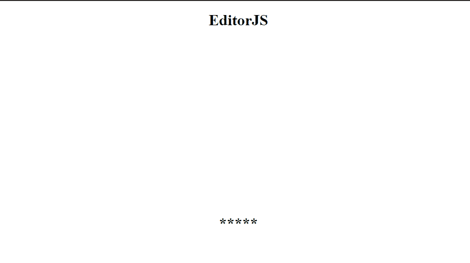
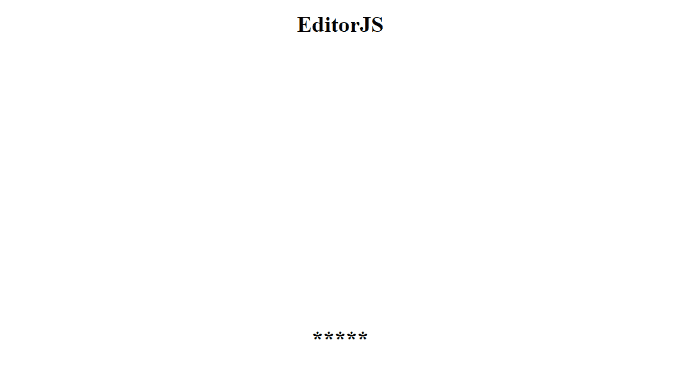
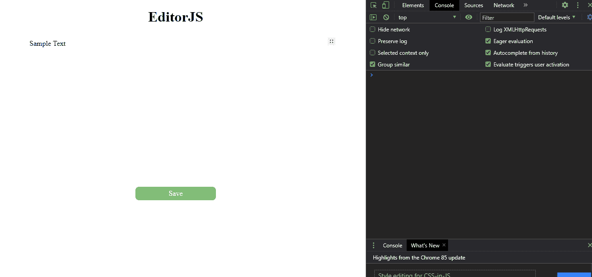

# 用 Editor.js 构建一个富文本编辑器

> 原文：<https://javascript.plainenglish.io/build-a-rich-text-editor-with-editor-js-b31a28583015?source=collection_archive---------0----------------------->

## 使用普通 JavaScript 的块样式编辑器


[Demo of Editor.js](https://editorjs.io/)

js 是一个现代的、功能丰富的块样式编辑器。Editor.js 最突出的特点是它是一个块样式的编辑器，这意味着它为不同的元素，如段落、图像、列表等，创建单独的块。

这也使 Editor.js 能够呈现干净的 JSON 数据。与 Editor.js 的 JSON 数据输出相比，Draft.js 等其他文本编辑器生成的 HTML 标记数据更难存储。数据输出如下所示:

```
{
   "time": 1550476186479,
   "blocks": [
      {
         "type": "header",
         "data": {
            "text": "Editor.js",
            "level": 2
         }
      },
      {
         "type": "paragraph",
         "data": {
            "text": "Hey. Meet the new Editor. On this page you can see it in action — try to edit this text. Source code of the page contains the example of connection and configuration."
         }
      },
      {
         "type": "header",
         "data": {
            "text": "Key features",
            "level": 3
         }
      },
}
```

此外，您可以为 Editor.js 的数据输出创建自己的呈现器，因为数据在 JSON 中。

它适用于普通的 JavaScript 以及各种框架。您可以为自己选择的框架创建一个包装器组件，并开始使用 Editor.js，也可以使用其他人的包装器组件。下面列出了一些最流行的 Editor.js 包装组件:

1.  [Ngx-EditorJS for Angular](https://www.npmjs.com/package/@tinynodes/ngx-editorjs)
2.  [vue-editor-js for Vue](https://www.npmjs.com/package/vue-editor-js)
3.  [react-editor-js for React](https://www.npmjs.com/package/react-editor-js)

在本教程中，我将使用普通 JavaScript 设置和配置 Editor.js。

## **入门**

您可以使用`npm i @editorjs/editorjs — save`通过 NPM 安装 Editor.js，或者通过 CDN 加载。除此之外，您还可以[手动将文件加载到您的项目中。](https://editorjs.io/getting-started#load-from-cdn)如果你没有安装 NPM，官方文档[已经为你提供了。](https://docs.npmjs.com/downloading-and-installing-node-js-and-npm)

我将使用 CDN 加载 Editor.js，但也可以随意使用 NPM 进行更健壮的设置。

要从 CDN 加载，我们必须在主 HTML 文件中的 head 标签之间添加下面一行。

```
<script src="https://cdn.jsdelivr.net/npm/@editorjs/editorjs@latest"></script>
```

我们的 HTML 文件应该是这样的:

```
<!DOCTYPE html>
<html lang="en"><head>
    <meta charset="UTF-8">
    <meta name="viewport" content="width=device-width, initial-scale=1.0">
    <title>EditorJS Demo</title>
    <script        src="[https://cdn.jsdelivr.net/npm/@editorjs/editorjs@latest](https://cdn.jsdelivr.net/npm/@editorjs/editorjs@latest)"></script>
    <link rel="stylesheet" href="style.css">
</head><body>
    <h1>EditorJS</h1>
    <div class="container">
        <div id="editorjs"></div>
    </div>
    <script src="./index.js"></script>
    <h1>*****</h1>
</body></html>
```

我们将在 ID 为“editorjs”的 div 元素中使用 Editor.js 实例。我们将在 JavaScript 文件中引用这个 ID。

如您所见，我已经添加了名为“style.css”的自定义 CSS 文件以及我自己的 JavaScript 文件“index.js”。我们将在 index.js 文件中导入并设置 Editor.js。

我们的 index.js 应该是这样的:

```
const editor = new EditorJS({
    holder: 'editorjs',
 }
);
```

您需要将想要运行 Editor.js 实例的 HTML 元素的 ID 传递到 holder 属性中。在我们的例子中，我们希望在 ID 为“editorjs”的 div 元素中运行 Editor.js，因此我们将“editorjs”传递给了 holder 属性。

在我的 CSS 文件中，我将文本居中，使其看起来更吸引人。

这就是我们开始使用 Editor.js 所需的全部内容！



Here is what our editor looks like so far

## 配置工具

Editor.js 为我们提供了许多可以手动加载和配置的工具。默认情况下，只预装文本。我们将在本教程中安装以下工具:

1.  页眉
2.  段落
3.  简单图像
4.  把…嵌入
5.  定界符

Embed 为来自 YouTube、Twitter、Gycat 等服务的嵌入内容提供支持。你可以在这里找到详细的列表[。Simple-Image 是一个工具的名字，它可以通过粘贴图像的 URL 来渲染图像。](https://github.com/editor-js/embed/blob/master/docs/services.md)

值得注意的是，如果你想从你的本地设备上传图片到编辑器，你需要一个不同的工具。你可以使用[图像工具](https://github.com/editor-js/image)来渲染你上传的内容，也可以通过粘贴它们的 URL 来渲染图像。

我在本文中展示 Simple-Image 而不是 Image 工具的原因主要是 Image 工具需要一个后端服务来接收上传的图像并返回该图像的 URL 端点。 [Github 库对此进行了深入的解释。](https://github.com/editor-js/image#backend-response-format-)

除此之外还有很多，比如警告、引用、音频、表格等等。你可以在 Github 上找到带有说明的[完整列表。](https://github.com/editor-js)

我们将使用 CDN 来加载我上面列出的所有工具。添加后，我们的 HTML 文件应该如下所示:

```
<!DOCTYPE html>
<html lang="en"><head>
    <meta charset="UTF-8">
    <meta name="viewport" content="width=device-width, initial-scale=1.0">
    <title>EditorJS Demo</title>
    <script src="[https://cdn.jsdelivr.net/npm/@editorjs/editorjs@latest](https://cdn.jsdelivr.net/npm/@editorjs/editorjs@latest)"></script>
    <script src="[https://cdn.jsdelivr.net/npm/@editorjs/header@latest](https://cdn.jsdelivr.net/npm/@editorjs/header@latest)"></script>
    <script src="[https://cdn.jsdelivr.net/npm/@editorjs/paragraph@latest](https://cdn.jsdelivr.net/npm/@editorjs/paragraph@latest)"></script>
    <script src="[https://cdn.jsdelivr.net/npm/@editorjs/simple-image@latest](https://cdn.jsdelivr.net/npm/@editorjs/simple-image@latest)"></script>
    <script src="[https://cdn.jsdelivr.net/npm/@editorjs/embed@latest](https://cdn.jsdelivr.net/npm/@editorjs/embed@latest)"></script>
    <script src="[https://cdn.jsdelivr.net/npm/@editorjs/delimiter@latest](https://cdn.jsdelivr.net/npm/@editorjs/delimiter@latest)"></script>
    <link rel="stylesheet" href="style.css">
</head><body>
    <h1>EditorJS</h1>
    <div class="container">
        <div id="editorjs"></div>
    </div>
    <script src="./index.js"></script>
    <h1>*****</h1>
</body></html>
```

我们的 index.js 应该如下所示:

```
const editor = new EditorJS({
    holder: 'editorjs',/** 
     * Available Tools list. 
     * Pass Tool's class or Settings object for each Tool you want to use 
     */
   tools:{
       header:Header,
       delimiter: Delimiter,
       paragraph: {
        class: Paragraph,
        inlineToolbar: true,
      },
      embed: Embed,
      image: SimpleImage,
   }
}
);
```

向我们的编辑器添加更多这样的工具是非常容易的。我们必须通过 npm 或 CDN 安装或加载它们，然后就像我上面所做的那样，将它们传递到我们的“工具”属性中。

这就是我们用选定的工具启动和运行 Editor.js 所需要的全部内容。



Our editor with all the plugins we installed.

## 持久数据

如果我们不能存储和持久化数据，编辑器还有什么用？

如前所述，Editor.js 输出干净的 JSON 数据。为了检索这些数据，我们可以在 Editor.js 实例上调用`save()`方法。它将返回一个用干净数据解决的承诺。我们可以将这些数据存储在我们的数据库中。现在，我将在我们的控制台中记录数据。

首先，我们需要创建一个函数，我们可以调用它来获取和保存编辑器的数据。在 index.js 文件的底部添加以下函数:

```
function myFunction(){
    editor.save().then((output) => {
        console.log('Data: ', output);
    }).catch((error) => {
        console.log('Saving failed: ', error)
    });
}
```

但是增加功能是不够的。我们需要一个按钮来调用这个函数。我以下面的方式在我的 HTML 文件中添加了一个按钮:

```
<div  onclick="myFunction()" class="btn">Save</div>
```

除此之外，我还使用 CSS 设计了按钮的样式。

```
.btn{
    text-align: center;
    align-items:center;
    justify-content: center;
    display: flex;
    background:rgb(119, 206, 119);
    padding:.4rem;
    width:20%;
    margin:auto;
    border-radius: 8px;
    color:white;
    cursor: pointer;
}
.btn:hover{
    background:rgb(17, 170, 17);
}
```

现在，我们可以在控制台中看到我们的数据了。



Data gets logged into the browser’s console

虽然我已经将数据记录到控制台，但是您可以将这些数据发送到您的数据库。正如我们所看到的，数据是 JSON 格式的。因此，它可以很容易地存储在数据库中。此外，您还可以在存储数据之前对其进行清理。

## 结论

从撰写个人描述到填写产品细节，几乎每个需要输入的应用程序都需要富文本编辑器。Editor.js 提供了一个功能丰富的编辑器，它不仅看起来干净，而且产生干净的数据。

在撰写本文时，Editor.js 的最新版本是 2.18，但下一个版本 2.19 预计将很快发布。下一个版本将为 Editor.j s 添加期待已久的只读模式，从而消除了创建定制渲染器的需要。

你可以在他们的[官网](https://editorjs.io/base-concepts)上找到 Editor.js 的完整指南。此外，你可以在 [Github](https://github.com/anuragk15/editorjs-demo/tree/main) 上找到我在本文中使用的所有代码。