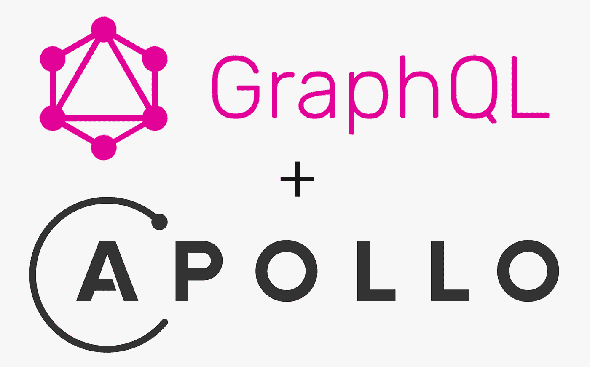
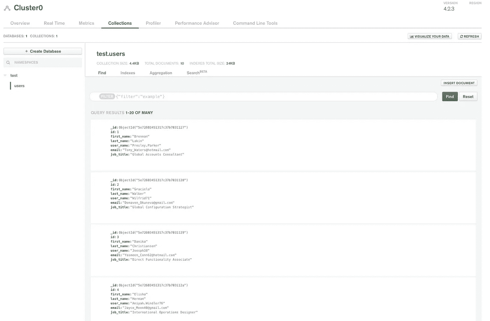
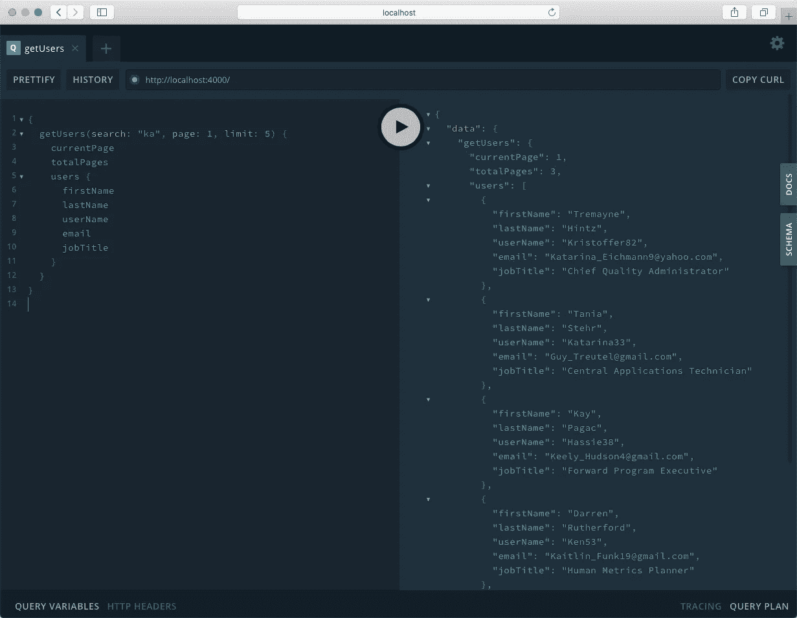

# 在 Apollo GraphQL 和 MongoDB 中构建可搜索的查询

> 原文：<https://javascript.plainenglish.io/build-a-searchable-query-in-apollo-graphql-and-mongodb-747b183f832c?source=collection_archive---------2----------------------->



Image Credit: Apollo

# 介绍

自 2015 年公开发布以来，GraphQL 的人气一直在攀升，并被选为久经考验的 REST API 的替代产品。以下是我自己喜欢使用 GraphQL 的几个原因:

1.  开箱即用的验证和类型检查
2.  查询基本上是自我记录的
3.  只检索您需要的数据，这样您就不会过量提取
4.  所有查询的单一端点
5.  提供详细的错误消息

如果您想了解更多，有大量的文章讨论了使用 GraphQL 的好处。如果您是 GraphQL 的新手，我还强烈建议您深入研究 GraphQL 的文档。

[](https://graphql.org/) [## GraphQL:一种 API 查询语言。

### 学习准则社区规范行为准则基金会景观学习准则社区规范行为准则基金会…

graphql.org](https://graphql.org/) 

在本文中，我将向您展示如何在 Apollo GraphQL 中构建可搜索的查询。您可以在这里找到完整项目的代码:

[](https://github.com/kluu1/users-api) [## kluu1/用户-api

### 这是我在 Medium 上发表的博客文章“用 Apollo GraphQL 和 MongoDB 构建可搜索查询”的完整代码。检查…

github.comm](https://github.com/kluu1/users-api) 

# 先决条件

拥有 Node.js、GraphQL 和 MongoDB 的坚实基础会有所帮助，但不是必需的。

但是，您需要有一个 MongoDB 的实例，要么在本地，要么在 MongoDB Atlas 这样的托管平台上。我正在使用 MongoDB Atlas 的免费层。

[](https://www.mongodb.com/cloud/atlas) [## 托管 MongoDB 托管|数据库即服务

### 借助云 MongoDB 服务加快移动速度。专为那些宁愿花时间构建应用程序也不愿管理应用程序的敏捷团队打造…

www.mongodb.com](https://www.mongodb.com/cloud/atlas) 

下面是我们构建用户 api 应用程序的步骤:

1.  项目设置
2.  生成用户数据并将其插入 MongoDB
3.  创建 Mongoose 用户模型
4.  设置类型定义
5.  设置解析器
6.  设置 GraphQL 服务器
7.  启动 GraphQL 服务器并测试我们的查询

# 1.项目设置

让我们设置我们的项目文件夹结构。

```
mkdir users-api
cd users-api
mkdir models
mkdir scripts
mkdir graphql
git init
npm init -y
touch .gitignore
echo node_modules >> .gitignore
echo .env >> .gitignore
npm install apollo-server dotenv faker graphql mongodb mongoose
```

# 2.生成用户数据并将其插入 MongoDB

在**脚本**文件夹中新建一个名为 **data.js** 的文件。该脚本将生成 100 个假用户，并将其插入 MongoDB。

/scripts/data.js

创造一个**。在运行脚本之前，将您的连接字符串设置为 **MONGO_URI** 。参见下面的例子。**

Create a .env file in the root of the project directory

在您的终端根目录下运行以下命令来执行 data.js 脚本。

```
node scripts/data.js
```

验证用户数据已经插入到您的 MongoDB 中。由于我使用的是 MongoDB Atlas，所以可以通过 web 门户进行验证。



Verified user data has been generated in MongoDB Atlas

# 3.创建 Mongoose 用户模型

在**模型**文件夹中创建一个名为 **users.js** 的新文件。这是我们的猫鼬模型。

/models/user.js

# 4.设置类型定义

在 **graphql** 文件夹中创建一个新文件 **typeDefs.js** 。这个文件描述了数据的外观和类型。它还公开了 GraphQL 中可用的查询。

/graphql/typeDefs.js

# 5.设置解析器

在 **graphql** 文件夹中创建一个新文件 **resolvers.js** 。解析器基本上是处理逻辑的地方。这是您执行检索、更新和删除数据等操作的地方。

/graphql/resolver.js

如您所见，大部分搜索逻辑都在这里。当" **getUsers** 查询被触发时，我们首先从参数中析构**搜索**、**页面**和**限制**。我们还设置了默认值，以防它们没有被传入。

在第 10 行，我们检查**搜索**是否包含任何搜索值。如果是，我们构建搜索查询，使用 regex 对所有字段执行部分匹配。我们还传入了 **$options: 'i'** ，使我们的搜索不区分大小写。然后我们执行查询。

我们还对查询进行了一些简单的分页。**页面**是您正在尝试检索的当前页面。**限制**是您尝试检索的文档数量。如果您想了解关于简单分页的更多信息，请查看我的博客“[使用 Node.js、Express 和 mongose](https://medium.com/javascript-in-plain-english/simple-pagination-with-node-js-mongoose-and-express-4942af479ab2)进行简单分页”

# 6.设置 GraphQL 服务器

最后，我们创建我们的服务器。在根目录下创建一个名为“ **app.js** 的新文件，并复制以下内容:

Our GraphQL Server

# 7.启动 GraphQL 服务器并测试我们的查询

现在我们可以启动我们的 GraphQL 服务器了。在您的终端中，在项目根目录下运行下面的命令。

```
node app.js
```

我们应该能够在您的浏览器中访问 [http://localhost:4000/](http://localhost:4000/) 并看到 GraphQL Playground。


GraphQL Playground

复制并粘贴下面的查询，并根据需要更新查询参数。单击“播放”按钮执行查询。

```
{
  getUsers(search: "ka", page: 1, limit: 5) {
    currentPage
    totalPages
    users {
      firstName
      lastName
      userName
      email
      jobTitle
    }
  }
}
```



It works!

# 摘要🙌

现在我们有了。总而言之，我们现在有了一个带有 MongoDB 数据库的 Apollo GraphQL 服务器。我们有一个“ **getUsers** ”查询，可以通过传入一个 **search** 值进行搜索。另外，我们还有分页功能。

如果你遇到任何问题，请随时给我发消息或在评论中留言。我希望你像我写这篇文章时一样喜欢它。感谢阅读！🍻

我在业余时间写这些文章是为了娱乐。如果你喜欢这篇文章，请在下面留下你的喜欢和评论！可以关注我上 [*中*](https://medium.com/@this.kevinluu) *和* [*推特*](https://twitter.com/kluu_10) *。感谢支持！*