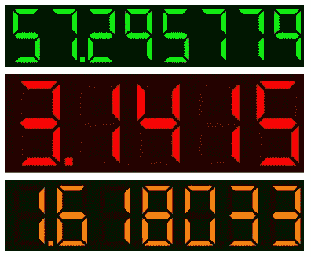
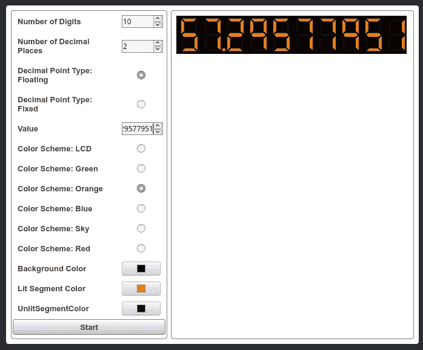

# 用 JavaScript 构建一个七段显示

> 原文：<https://javascript.plainenglish.io/build-a-seven-segment-display-in-javascript-8822a7332c70?source=collection_archive---------7----------------------->

对于这个项目，我将编写一个 JavaScript 小部件，它使用 SVG 以七段显示风格在网页上显示数值。

这个帖子在 YouTube 上有一个相关的视频。

## 该项目

该项目由以下文件组成，您可以克隆/下载 [Github 库](https://github.com/CodeDrome/seven-segment-display-javascript)。

*   seven_segment_display.js
*   seven_segment_display.htm
*   seven_segment_display_page.js

第一个 JavaScript 文件包含小部件本身。HTML 文件包含一组用于配置、控制和显示小部件实例的控件，第二个 JavaScript 文件包含页面代码。

该小部件实现为 ES6/ES2015 类。让我们先看看它的构造函数。

首先，我们有两个对象，作为小部件的两个属性的枚举。接下来，小部件的内容和格式有许多变量。`_Segments`数组用每个数字点亮的段模式初始化。

最后，我们调用三个函数来设置小部件的初始状态:

对于任何给定的位数，宽度:高度的比率必须是一个特定的值，因此`_SetHeight`函数将相对于 SVG 元素宽度的高度设置为正确的值。

主页面中的 SVG 元素需要添加许多元素，显示中的每一段都有一个元素，包括小数点。这些都是由`_CreateSegments`函数创建的。

通过`_SetSegmentColours`功能设置适当的分段颜色来显示数字。在此阶段，将显示默认值 0。

接下来，我们将查看属性。

`ColorSchemes`和`DecimalPointTypes`是可供客户端代码使用的只读属性，因此它知道相应的`ColorScheme`和`DecimalPointType`属性的可用值。

各种颜色属性`BackgroundColor`、`LitSegmentColor`、`UnlitSegmentColor`和`ColorScheme`都很简单(如果是`ColorScheme`的话就有点啰嗦了！)在设置了适当的变量后，它们调用`_SetSegmentColours`用新的颜色更新小部件。

`NumberOfDigits` setter 验证新值，设置变量，然后调用各种函数来更新显示。`NumberOfDecimalPlaces`设置器以类似的方式工作。

在`DecimalPointType`设置器中，我们只需要重新计算`_ValueDisplayString`并调用`_SetSegmentColours`。

最终属性是`Value`。验证之后，我们需要重新计算`_ValueDisplayString`并调用`_SetSegmentColours`。

最后我们有一些方法。

## _SetHeight

正如我上面提到的，对于给定的宽度和位数，小部件需要有特定的高度。这个函数设置这个高度。

## _ calculatevalueddisplaystring

SetSegmentColours 函数需要一个字符串而不是一个数字来显示线段的正确模式。_ CalculateValueDisplayString 函数从数值属性生成此字符串，设置 _DecimalPointPosition 并用空格填充该字符串。

## _ 创建分段

此函数创建表示小部件分段的 SVG 元素，在构造函数中调用，如果分段的数量发生变化，也会调用此函数。

## _ SetSegmentColours

SetSegmentColours 函数根据 _Segments 数组中的模式设置段颜色以显示 _ValueDisplayString。它需要一个重绘参数。如果这是假的，那么它只改变实际上在开和关之间翻转的段的颜色，如果值属性改变，这是所有需要做的。然而，如果任何颜色属性已经改变，所有的段需要改变它们的颜色，即使它们显示相同的数字；在这种情况下，重绘需要为真。

这就是完成的七段显示小部件，现在让我们继续创建一个 HTML 页面和一些代码来创建和使用小部件。

## seven_segment_display.htm

我没有在这里列出页面的 HTML，但它包含在下载中，这是在浏览器中打开的页面。

如您所见，它包括一组控件来设置小部件的属性。还有一个启动/停止计数器的按钮，如果你点击它,`Value`属性每秒增加一次。

## seven_segment_display_page.js

同样，我没有在这里列出代码，但是它创建了我们的 Seven Segment Display 小部件的一个实例，并且还包含事件处理程序，用于在用户更改任何内容时设置其属性。

该代码还使用 JavaScript `setInterval`和`clearInterval`函数来启动或停止一个 1 秒钟的计时器，该计时器递增`Value`属性。