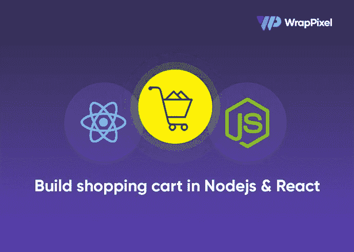
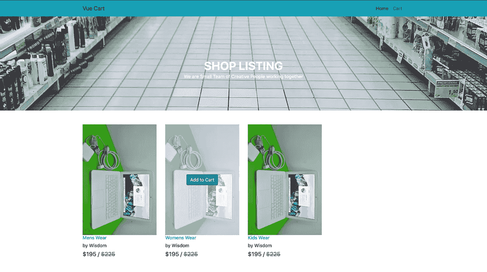
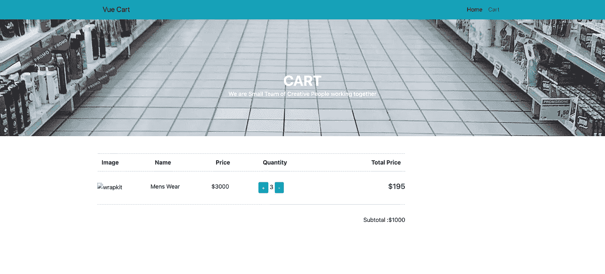

# 在 Node.js 中构建购物车并做出反应

> 原文：<https://javascript.plainenglish.io/build-a-shopping-cart-in-nodejs-and-react-c7b488d46e79?source=collection_archive---------0----------------------->



在本文中，我们将使用 React 为我们的应用程序构建购物车前端。这将是一个简单的反应电子商务教程。

你可以查看我们已经发布的 Node.js 中内置的[后端部分。](https://www.wrappixel.com/building-a-shopping-cart-in-nodejs/)

尽我们所能，这将是充分理解主要功能的最低限度。

首先，我们需要使用 create-react-app 设置 React 应用程序。

```
npx create-react-app shopping-cart
cd shopping-cart
code .
npm start
```

如果您以前没有安装 react CLI，您可能需要先在本地计算机上安装它。

`code .`命令在 visual studio 代码中打开项目。

我们现在可以丢弃 App.js 中不需要的东西，也可以去掉文件(App.css 和 index.css)。

# 到主要工作

首先，我们创建一个组件文件夹；这包含了我们可重用的组件，例如 Navbar。

我们将继续为应用程序设置用户界面。你可以从 [WrapPixel 的 UI 套件](https://www.wrappixel.com/templates/wrapkit/)中获得我们所有的 UI 组件。

WrapPixel 是一个在线模板商店，在那里你可以获得很棒的[免费 react 仪表盘](https://www.wrappixel.com/templates/category/react-templates/)和 [react 引导模板](https://www.wrappixel.com/templates/category/reactstrap-templates/)。

我们将把引导 CDN 添加到公共目录中的根`index.html`文件中。

```
<!DOCTYPE html>
<html lang="en">
<head>
  <meta charset="utf-8" />
  <link rel="icon" href="%PUBLIC_URL%/favicon.ico" />
  <meta name="viewport" content="width=device-width, initial-scale=1" />
  <meta name="theme-color" content="#000000" />
  <meta name="description" content="Web site created using create-react-app" />
  <link rel="apple-touch-icon" href="%PUBLIC_URL%/logo192.png" />
  <link rel="stylesheet" href="https://stackpath.bootstrapcdn.com/bootstrap/4.5.2/css/bootstrap.min.css"
    integrity="sha384-JcKb8q3iqJ61gNV9KGb8thSsNjpSL0n8PARn9HuZOnIxN0hoP+VmmDGMN5t9UJ0Z" crossorigin="anonymous">
  <link rel="manifest" href="%PUBLIC_URL%/manifest.json" />
  <title>Shopping cart</title>
</head>
<body>
  <noscript>You need to enable JavaScript to run this app.</noscript>
  <div id="root"></div>
</body>
</html>
```

然后我们将一个`Navbar.js`文件添加到组件文件夹中。这是我们处理路由的地方。

```
import React from "react"
import {
  Link
} from "react-router-dom"
export const Navbar = () => {
  return ( <
    nav className = "navbar navbar-expand-lg navbar-light bg-info" >
    <
    div className = "container" >
    <
    Link to = "/"
    className = "navbar-brand" > Vue Cart < /Link>
    <
    div className = "collapse navbar-collapse justify-content-end"
    id = "navbarNav" >
    <
    ul className = "navbar-nav" >
    <
    li className = "nav-item active" >
    <
    Link to = "/"
    className = "nav-link" > Home < /Link> < /
    li > <
    li className = "nav-item" >
    <
    Link to = "/cart"
    className = "nav-link" > Cart < /Link> < /
    li > <
    /ul> < /
    div > < /div> < /
    nav >
  )
}
```

请记住，我们使用`react-router-dom`来路由页面，所以我们需要在我们的开关下面添加导航条，如下所示' App.js '

```
import React from "react"
import { Switch } from "react-router-dom"
import { Navbar } from "./components/Navbar"import "./App.css"
function App() {
  return (
    <div className='App'>
      <Navbar />
      <Switch>
        // Our pages will go here
      </Switch>
    </div>
  )
}
export default App
```

其次，我们创建一个页面文件夹。该文件夹包含我们的页面(产品和购物车页面)，我们所有的服务和视图都将呈现在页面中以进行路由。

让我们创建一个简单的**产品**

```
import React, { useState, useEffect } from "react";
import { Link } from "react-router-dom";
export const Products = () => {
  const [products, setProducts] = useState([]);
  const [hasError, setError] = useState(false);
  async function fetchData() {
    const res = await fetch("http://localhost:4000/product");
    res
      .json()
      .then((res) => {
        console.log(res.data);
        setProducts(res.data);
      })
      .catch((error) => {
        setError(error);
      });
  }
  async function addToCart(id, quantity) {
    try {
      const response = await fetch("http://localhost:4000/cart", {
        method: "POST",
        body: JSON.stringify({
          productId: id,
          quantity: quantity,
        }),
        headers: {
          "Content-type": "application/json; charset=UTF-8",
        },
      });
      let data = await response.json();
      alert("Item Added To Cart");
      console.log(data);
    } catch (err) {
      alert("Something Went Wrong");
      console.log(err);
    }
  }
  useEffect(() => {
    fetchData();
  }, []);
  console.log(products);
  return (
    <main>
      <section>
        <div className="banner-innerpage">
          <div className="container">
            <div className="row justify-content-center">
              <div className="col-md-6 align-self-center text-center">
                <h1 className="title">Shop listing</h1>
                <h6 className="subtitle op-8">
                  We are small team of creative people working together
                </h6>
              </div>
            </div>
          </div>
        </div>
      </section>
      <section>
        <div className="spacer">
          <div className="container">
            <div className="row mt-5">
              <div className="col-lg-9">
                <div className="row shop-listing">
                  {products.map((product, i) => (
                    <div className="col-lg-4">
                      <div className="card shop-hover border-0">
                        
                        <div className="card-img-overlay align-items-center">
                          <button
                            onClick={(e) => addToCart(product._id, 1)}
                            className="btn btn-md btn-info"
                          >
                            Add to cart
                          </button>
                        </div>
                      </div>
                      <div className="card border-0">
                        <h6>
                          <a href="#" className="link">
                            {product.name}{" "}
                          </a>
                        </h6>
                        <h6 className="subtitle">by Wisdom</h6>
                        <h5 className="font-medium m-b-30">
                          $195 /{" "}
                          <del className="text-muted line-through">$225</del>
                        </h5>
                      </div>
                    </div>
                  ))}
                </div>
              </div>
            </div>
          </div>
        </div>
      </section>
    </main>
  );
};
```

注意到`fetchData`功能了吗？我们向后端发出一个 http 请求，列出所有产品并存储在变量 products 中(记住，我们使用的是 React 钩子)。

因为我们现在把它作为一个数组，所以我们通过它循环显示，如第 64 行所示。

我们还需要将商品添加到购物车中，这将是一个异步方法，向后端发出请求，并向其传递参数。这也是一个非常重要的特性。

`addToCart`在第 18 行定义:

```
async function addToCart(id, quantity) {
    try {
      const response = await fetch("http://localhost:4000/cart", {
        method: "POST",
        body: JSON.stringify({
          productId: id,
          quantity: quantity,
        }),
        headers: {
          "Content-type": "application/json; charset=UTF-8",
        },
      })
      let data = await response.json()
      console.log(data)
    } catch (err) {
      console.log(err)
    }
  }
```

之后，我们向按钮添加事件监听器来调用`addToCart`按钮

```
<button
                            onClick={(e) => addToCart(product._id, 1)}
                            className="btn btn-md btn-info"
                          >
                            Add to cart
                          </button>
```

这里，我们传递产品的`id`和一个默认数量 1。

然后再一次添加到我们的`App.js`，作为页面。

```
import React from "react"
import { Switch, Route } from "react-router-dom"
import { Products } from "./pages/product"import { Navbar } from "./components/Navbar"import "./App.css"
function App() {
  return (
    <div className='App'>
      <Navbar />
      <Switch>
        <Route exact path='/' component={Products} />
      </Switch>
    </div>
  )
}
export default App
```



让我们转到购物车页面，添加我们的简单 UI。

然后，我们添加一个方法，从后端获取购物车商品列表。注意下面的 fetchCart 方法。随心所欲。

如果你不熟悉 react 钩子，你可以去查一下，或者更好地使用基于组件的钩子。

```
import React, { useState, useEffect } from "react";
import { Link } from "react-router-dom";
import "./cart.css";
export const Cart = (props) => {
  const [carts, setCarts] = useState([]);
  const [payload, setPayloader] = useState({});
  const [hasError, setError] = useState(false);
  async function fetchCart() {
    const res = await fetch("http://localhost:4000/cart");
    res
      .json()
      .then((res) => {
        console.log(res.data.items);
        setCarts(res.data.items);
        setPayloader(res.data);
      })
      .catch((error) => {
        setError(error);
      });
  }
  async function increaseQty(id) {
    try {
      const res = await fetch("http://localhost:4000/cart", {
        method: "POST",
        body: JSON.stringify({
          productId: id,
          quantity: 1,
        }),
        headers: {
          "Content-type": "application/json; charset=UTF-8",
        },
      });
      console.log(res);
      fetchCart();
      alert("Item Increamented");
    } catch (err) {
      console.log(err);
    }
  }
  async function emptyCart() {
    try {
      const res = await fetch("http://localhost:4000/cart/empty-cart", {
        method: "DELETE",
      });
      await res.json();
      fetchCart();
      props.history.push("/");
    } catch (err) {
      console.log(err);
    }
  }
  useEffect(() => {
    fetchCart();
  }, []);
  return (
    <main>
      <section>
        <div className="banner-innerpage">
          <div className="container">
            <div className="row justify-content-center">
              <div className="col-md-6 align-self-center text-center">
                <h1 className="title">Cart Listing</h1>
                <h6 className="subtitle op-8">
                  We are small team of creative people working together
                </h6>
              </div>
            </div>
          </div>
        </div>
      </section>
      <section>
        <div className="spacer">
          <div className="container">
            <div className="row mt-5">
              <div className="col-lg-9">
                <div className="row shop-listing">
                  <table className="table shop-table">
                    <tr>
                      <th className="b-0">Name</th>
                      <th className="b-0">Price</th>
                      <th className="b-0">Quantity</th>
                      <th className="b-0 text-right">Total Price</th>
                    </tr>
                    {carts.map((item, i) => (
                      <tr>
                        <td>{item.productId.name}</td>
                        <td>{item.productId.price}</td>
                        <td>
                          <button
                            onClick={(e) => increaseQty(item.productId._id)}
                            className="btn btn-primary btn-sm"
                          >
                            +
                          </button>
                          {item.quantity}
                          <button className="btn btn-primary btn-sm">-</button>
                        </td>
                        <td className="text-right">
                          <h5 className="font-medium m-b-30">{item.total}</h5>
                        </td>
                      </tr>
                    ))}
                    <tr>
                      <td colspan="3" align="right">
                        Subtotal :{payload.subTotal}
                      </td>
                      <td colspan="4" align="right">
                        <button
                          className="btn btn-danger"
                          onClick={(e) => emptyCart()}
                        >
                          Empty cart
                        </button>
                      </td>
                    </tr>
                  </table>
                </div>
              </div>
            </div>
          </div>
        </div>
      </section>
    </main>
  );
};
```

然后我们可以遍历数组(cart)并修改。

请注意`increamentQty(id)`方法，它将产品 id 作为参数，然后将数量设置为 1 作为默认值，因为我们将数量更新 1。

```
async function increaseQty(id) {
    try {
      const res = await fetch("http://localhost:4000/cart", {
        method: "POST",
        body: JSON.stringify({
          productId: id,
          quantity: 1,
        }),
        headers: {
          "Content-type": "application/json; charset=UTF-8",
        },
      });
      console.log(res);
      fetchCart();
      alert("Item increamented");
    } catch (err) {
      console.log(err);
    }
  }
```

之后，我们向按钮添加了 click 事件来触发该方法:

```
<button
                            onClick={(e) => increaseQty(item.productId._id)}
                            className="btn btn-primary btn-sm"
                          >
                            +
                          </button>
```

点击按钮将增加物品的数量。

然后我们定义一个`emptyCart`方法来删除当前购物车中的所有商品。见下文；

```
async function emptyCart() {
    try {
      const res = await fetch("http://localhost:4000/cart/empty-cart", {
        method: "DELETE",
      });
      await res.json();
      fetchCart();
      props.history.push("/");
    } catch (err) {
      console.log(err);
    }
  }
```



# 锻炼

*   实现减量功能
*   实施从购物车中移除产品

实现之后，将您的工作推送到 git，并在评论部分添加链接。让我们找点乐子😁