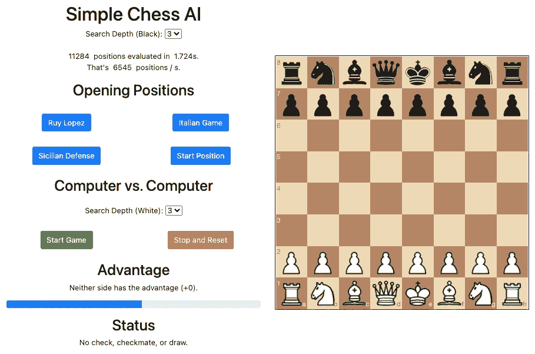
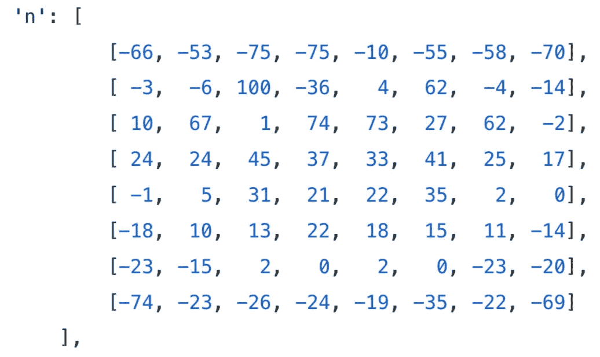
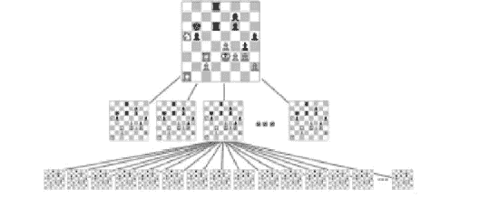
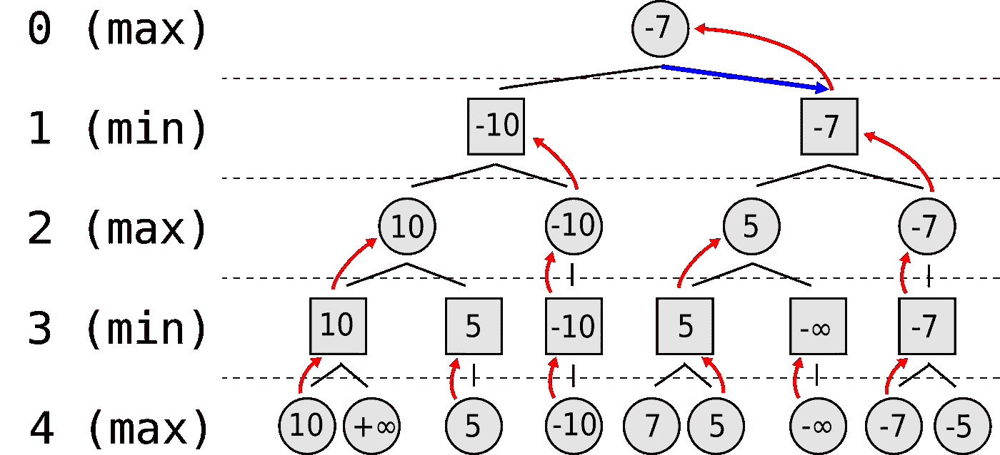
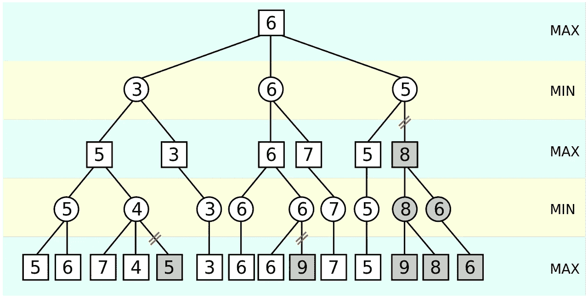
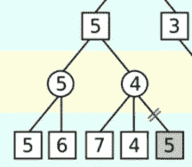

# 用 JavaScript 构建一个简单的象棋人工智能

> 原文：<https://javascript.plainenglish.io/build-a-simple-chess-ai-in-javascript-22b350abb31?source=collection_archive---------3----------------------->

## 电路板评估和极大极小算法

Photo by [GR Stocks](https://unsplash.com/@grstocks?utm_source=medium&utm_medium=referral) on [Unsplash](https://unsplash.com?utm_source=medium&utm_medium=referral)

国际象棋是一项伟大的游戏。如果擅长就更好了。遗憾的是，我从来没有花时间学习象棋策略，所以我决定依靠计算和博弈论的力量来代替！作为一个有趣的业余项目，我用 JavaScript 实现了一个简单的象棋人工智能。

你可以在我的 [GitHub 库](https://github.com/zeyu2001/chess-ai)中找到本教程的完整源代码。

Play at [https://zeyu2001.github.io/chess-ai/](https://zeyu2001.github.io/chess-ai/)

最终产品可以在 https://zeyu2001.github.io/chess-ai/的[播放。](https://zeyu2001.github.io/chess-ai/)

# 先决条件

你应该知道基本编程和一个[树](https://en.wikipedia.org/wiki/Tree_(data_structure))数据结构的*一般*概念。其他内容将在本教程中介绍。

涉及的两个主要算法是[最小最大算法](https://en.wikipedia.org/wiki/Minimax)和[阿尔法-贝塔剪枝](https://en.wikipedia.org/wiki/Alpha%E2%80%93beta_pruning)。这些将在后面深入解释，如果你有编程经验，应该相对容易掌握。

# 重要的事情先来

摆脱图形用户界面和游戏机制。这使得我们可以将注意力集中在应用程序最吸引人的方面:决策(AI)部分！为此，我们将使用外部库:

*   [*棋盘. js*](https://chessboardjs.com/) 处理图形界面，即棋盘本身。
*   [*chess.js*](https://github.com/jhlywa/chess.js) 处理游戏机制，如棋步生成/验证。

有了这些库，你应该能够按照*棋盘. js* 网站上的[示例](https://chessboardjs.com/examples#5000)(特别是 5000 到 5005)来创建一个有效的国际象棋游戏。

# 评价函数

太好了！我们有一个正常运转的棋盘。但是我们如何实现一个能下(相当)好棋的人工智能呢？嗯，我们需要一个*评估函数。基本上，我们希望给每个棋盘实例(即棋盘上每组棋子位置)分配一个“分数”，这样我们的人工智能就可以决定哪些位置比其他位置更有利。*

Evaluation Function

## 零和游戏

国际象棋是一个零和游戏。玩家 A 获得的任何优势都意味着玩家 b 的劣势。优势可以表现为夺取对手的棋子，或者将棋子放在有利的位置。因此，当从我们人工智能的角度分配分数时，正分数意味着我们人工智能的整体优势和对手的劣势，而负分数意味着我们人工智能的整体劣势和对手的优势。

## 简单的例子

例如，开始位置的分数是 0，表明双方都没有优势。在游戏的后期，我们面临着两个行动之间的决定:移动 A 和移动 B。假设移动 A 捕获了一个女王，我们的分数为 900，而移动 B 捕获了一个棋子，我们的分数为 100。

人工智能将能够比较两种潜在的情况，并决定移动 A 是更好的移动。当然，这并没有考虑未来的影响——如果移动 A 给了我们的对手进攻的机会呢？在接下来的章节中，我们将通过执行前瞻来预测后续的移动，从而克服这个障碍。

## 单件重量

我们评估的第一个方面是为每种类型的产品分配重量。如果我们的人工智能从黑棋的角度出发，任何黑棋都将增加我们的分数，而任何白棋都将根据以下权重从我们的分数中减去:

*   卒:100
*   骑士:280
*   主教:320
*   479
*   女王:929
*   国王:六万

## 块方桌

我们现在有了一个分数，它基于棋盘上存在的棋子，但是有些位置比其他位置更有利。例如，给予较高流动性的职位应该更有利。为此，我们使用*棋子方桌* (PSTs)，它根据每个棋子在棋盘上的位置为其分配一个额外的分数增量。

例如，骑士的 PST 鼓励向中心移动:

Piece Square Table, Knight

这是从白色的角度来看，所以它必须被黑色反射。

我当然不是象棋专家，所以棋子重量和 PST 值改编自 [Sunfish.py](https://github.com/thomasahle/sunfish/blob/master/sunfish.py) 。下面是我对评价函数的实现。请注意，我们不是对每次评估迭代 64 个方格，而是简单地从 0 开始，根据最新的移动增加或减少分数，跟踪以前的分数。

# 极大极小

现在我们有了评估算法，我们可以开始做出明智的决策了！我们将为此使用极大极小算法，我强烈推荐阅读维基百科文章[来更好地理解这个决策策略。](https://en.wikipedia.org/wiki/Minimax)

## 博弈树

我们可以将棋盘位置表示为*博弈树中的节点。*每个节点都是一个棋盘实例，并且有对应于可以从父节点采取的可能走法的子节点。

Chessboard Positions as Tree Nodes

## 最小化损失

本质上，minimax 旨在最小化可能的损失，假设双方都是理性的决策者。我们可以将可能的移动表示为博弈树，其中每一层在最大化和最小化玩家之间交替。我们是最大化玩家，试图最大化我们的分数，而对手是最小化玩家，试图最小化我们的分数。

Game Tree, Minimax Algorithm

在叶节点，评估的分数被回溯。正无穷大和负无穷大分别是赢和输。在每个递归层，最大化和最小化角色是交替的。第 0 层是当前的游戏状态，目标是最大化我们的分数。

## 交替移动

我们的人工智能要回答的问题是:“在第 0 层所有可能的移动中，哪个*保证*得分最高？”

这就好比问，“*假设我的对手总是做出最佳决策*，哪一步有可能获得最高分？”

如果我们想让我们的人工智能在国际象棋上表现得更好，我们就必须预测对手的下一步棋。当然，我们只能提前预测几个回合——要预测到最终的胜负状态在计算上是不可行的。我们将不得不引入一个*深度限制*，它对应于我们愿意向前看的回合数，并使用我们的评估函数来确定一旦我们达到深度限制时游戏状态的有利性。

## 该算法

这是一个有趣的递归问题，我建议尝试自己实现它，尽管我的实现可以在下面找到。如果你被卡住了，这里有一个总的想法:

1.  我们决定一个预定的深度极限。
2.  在第 0 层，我们考虑每个可能的移动，即子节点。
3.  对于每个子节点，我们考虑对手能迫使我们接受的最低分数。然后，我们选择最大节点。
4.  但是要知道对手能逼我们收的最低分，就必须到第 1 层。对于第 1 层中的每个节点，我们考虑它们的子节点。
5.  对于每个子节点(对手可能的移动)，我们考虑我们随后可以达到的最高分数。那么，对手能逼我们收的最低分就是最小节点。
6.  但是要知道我们随后可以达到的最高分数，我们必须到第 2 层。
7.  诸如此类。
8.  在层 *k* 处，评估最终的棋盘状态，并回溯到层 *k - 1* ，这一直持续到我们到达层 0，此时我们可以最终回答:“此时的最优移动是什么？”

下面是我的实现。注意，我使用了稍微修改过的 *chess.js* 版本，它允许我使用`game.ugly_moves()`和`game.ugly_move()`来生成和进行移动，而无需将它们转换为人类可读的格式，提高了算法的效率。修改后的版本可以在这里找到，但是使用普通的`game.moves()`和`game.move()`也可以。

# 阿尔法-贝塔剪枝

我们的人工智能现在应该能够做出相当好的决定。搜索深度越高，会玩的越好。但是，增加搜索深度会显著增加执行时间。 [Alpha-beta 修剪](https://en.wikipedia.org/wiki/Alpha%E2%80%93beta_pruning)通过“修剪”我们不需要评估的分支，帮助提高算法的效率。可以在[这里](http://web.cs.ucla.edu/~rosen/161/notes/alphabeta.html)找到额外的阅读资源。

## 核心理念

阿尔法-贝塔剪枝的核心思想是，当至少有一种可能性被发现，证明一步棋比之前检查过的一步棋更差时，我们可以停止评估一步棋。

假设博弈树如下:

Minimax with Alpha-beta Pruning

为了简洁起见，让我们考虑下面的子树:

Subtree, Alpha-beta Pruning

最大化玩家首先考虑左边的孩子，并确定它的值为 5。其他路径只有在它们的值为`x > 5`时才会被选择。

接下来考虑合适的孩子。最小化玩家，在右边的孩子，到目前为止已经找到了值 7 和 4。但是这意味着不管剩余值是多少，最小化玩家最终得到的最小值最多是 4。我们知道这个子树的最终值是`x <= 4`，不考虑剩余的值。

为了使该路径相关，`x > 5`。但是我们知道`x <= 4`。这是一个矛盾，所以最大化玩家不会选择这条路，进一步评估这条路是没有意义的。

## 该算法

同样的想法可以扩展到游戏树的其他部分。我们使用两个变量， *alpha* 和 *beta* ，来分别跟踪最大化和最小值(上例中为 5 和 4)。这只需要对前面的 minimax 函数进行微小的修改——看看你自己能不能实现！

下面是我的实现:

# 结论

仅此而已！我希望你喜欢读这篇文章，就像我喜欢写它一样。我已经解释了我是如何实现我的人工智能的，并希望向你介绍几个新的有趣的概念。

我还实现了一些其他功能，包括让人工智能与自身对抗。你可以在[https://zeyu2001.github.io/chess-ai/](https://zeyu2001.github.io/chess-ai/)玩，具体可以参考我的 [GitHub 库](https://github.com/zeyu2001/chess-ai)实现。