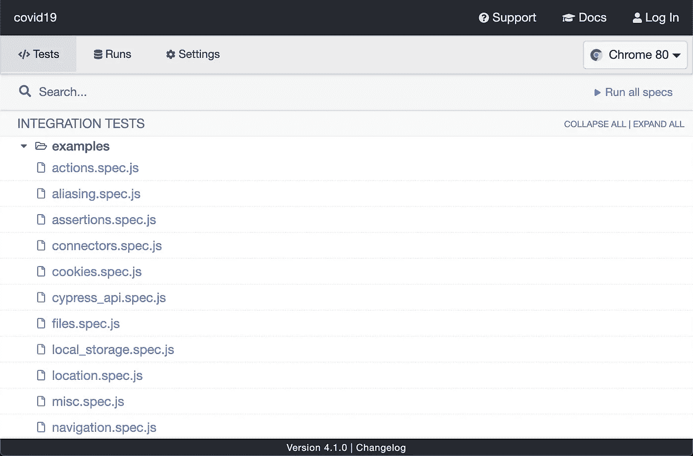
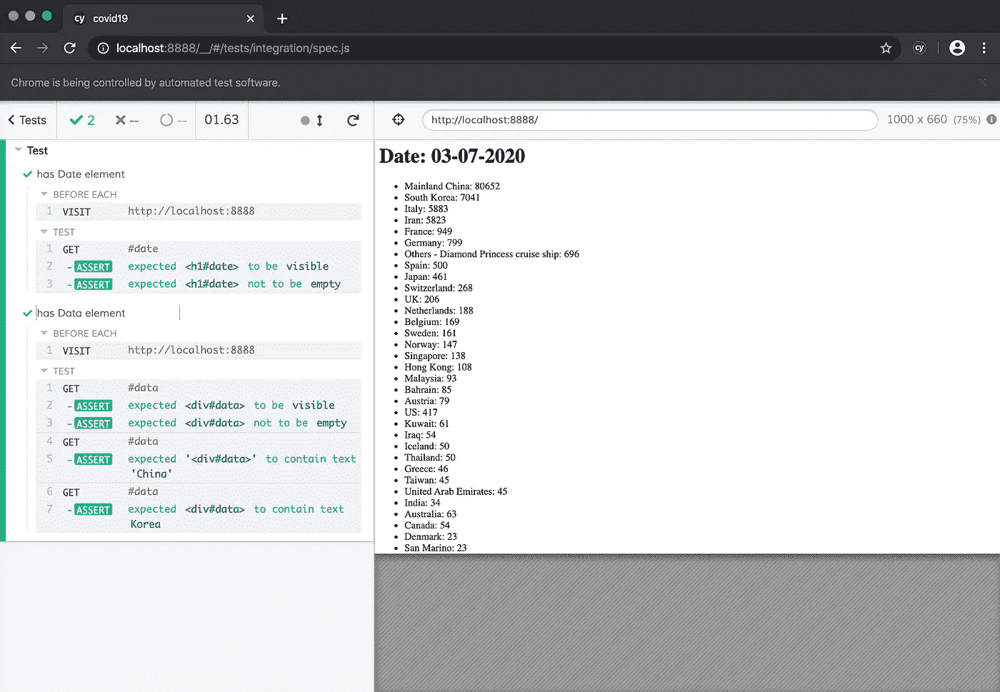
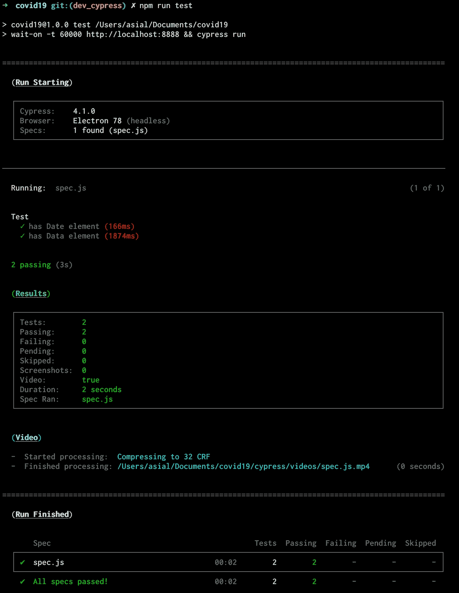

# 构建一个简单的新冠肺炎跟踪应用程序

> 原文：<https://javascript.plainenglish.io/build-a-simple-covid-19-tracking-app-with-offline-support-76085e9d1011?source=collection_archive---------6----------------------->


Image Courtesy of [Consumer Reports](https://www.consumerreports.org/coronavirus/coronavirus-faq-what-you-need-to-know-covid-19/)

在本文中，我们将介绍如何构建一个非常简单的应用程序，通过使用没有任何框架的普通 JavaScript 和由位于[约翰霍普金斯大学](https://systems.jhu.edu/research/public-health/ncov/)的系统科学与工程中心(CSSE)免费提供的[数据](https://github.com/CSSEGISandData/COVID-19)，来跟踪被称为**新冠肺炎**的臭名昭著的冠状病毒的报告病例。该机构已经建立了一个令人敬畏的基于网络的交互式仪表盘来实时可视化和跟踪报告的案例。

如果你是一个对新型致命冠状病毒一无所知的纯开发者(像我和我自己一样)，请从世界卫生组织的官方报告中给自己提个醒。*不客气！*

# 让我们把它做完吧

首先，让我们用几个 HTML 元素和 JavaScript **app.js** 创建一个非常简单的**index.html**，用于下载和处理数据。

Your first index.html

接下来，当然你可能已经猜到了，创建 **app.js**

The logic of the app

# 获取数据

这个实现最重要的部分是我们如何获取数据。如前所述，我从这个 [GitHub](https://github.com/CSSEGISandData/COVID-19) 获取数据。那里有许多不同种类的数据。为简单起见，我们只关注显示所有国家每日报告病例的数据。它位于这个目录下——[https://github . com/CSSEGISandData/新冠肺炎/tree/master/csse _ covid _ 19 _ data/csse _ covid _ 19 _ daily _ reports](https://github.com/CSSEGISandData/COVID-19/tree/master/csse_covid_19_data/csse_covid_19_daily_reports)。如果你比我早一步，你可能已经导航到目录并研究它的结构。正如你所看到的，它包含了从 2020 年 1 月 22 日到今天(或昨天)的所有数据。文件为 **CSV** 格式，命名为 **MM-DD-YYYY** 格式。如果您点击其中一个 csv 文件，并点击 **RAW** 按钮，它将显示带有不同链接的 RAW 格式的文件，例如，[https://RAW . githubusercontent . com/CSSEGISandData/新冠肺炎/master/csse _ covid _ 19 _ data/csse _ covid _ 19 _ daily _ reports/03-07-2020 . CSV](https://raw.githubusercontent.com/CSSEGISandData/COVID-19/master/csse_covid_19_data/csse_covid_19_daily_reports/03-07-2020.csv)。

瞧，这就是我获取每日数据的方法。我们需要做的只是将“03–07–2020”替换为当前日期或我们想要获取的任何日期。

Fetching data with CORS

如果我们放大到 **fetchData** ，首先它通过从传递的 **date** 参数中获取值来构造获取数据的 url，并用“https://CORS-anywhere . heroku app . com”作为 [**CORS 代理 url**](https://cors-anywhere.herokuapp.com/) 来修补它，以解决跨来源问题。然后，如果数据可用，它将返回数据，或者尝试获取昨天的数据，等等。

# 呈现数据

在我们得到数据后，下一个也是最后一个任务是按照我们的愿望和想象烹饪数据，并在盘子上显示出来。

Cooking the data …

我们的目标是获得每个国家确诊病例的总数。因此，我为您提供了一个非常简单的解决方案，即从第 4 列中获取国家名称。此外，如果国家是“other ”,我们连接“province”列来增加它的含义。最后，我们在简单的列表元素中显示它。我们完事了。

> 更新(2020/03/28):他们改变了数据的格式，所以我相应地更新了文章和源代码。

# 加分—实现缓存和离线支持

我们要用工具箱来做脏活。如果你想知道它是什么，请阅读我以前的[博客](https://medium.com/the-web-tub/build-a-pwa-using-workbox-2eda1ef51d88)。

> *Workbox 是一组库和节点模块，可以轻松缓存资产，并充分利用用于构建渐进式 Web 应用程序的功能。*

首先你需要安装软件包

```
npm install workbox-cli --save-dev
```

接下来，创建**manifest . JSON**——你可以从[这里](https://github.com/yong-asial/covid-19-tracking/blob/master/manifest.json)下载。它主要是指定当你安装到你的设备时，你会得到哪个图标。

然后，为 workbox 配置创建 **workbox-config.js** 。它只是缓存所有文件(样式表、HTML、JavaScript 和图像)并指定服务工作器的源和目标配置。

workbox configuration

然后，创建 **service-worker-src.js** 来配置预缓存和运行时缓存。

service worker configuration

它的主要部分是在我们获取数据并将其存储在浏览器缓存中时配置运行时缓存。这里，我们使用的是**stalewhirevalidate**策略。你可以在这里阅读更多细节[。](https://developers.google.com/web/tools/workbox/modules/workbox-strategies)

最后但同样重要的是，导航到您的应用程序目录并运行以下命令来生成编译后的 **service-worker.js**

```
npx workbox injectManifest workbox-config.js
```

还有一件事很抱歉，把**服务人员**和 **manifest.json** 注册到你的**index.html**上。

还是那句话，如果你想测试一下缓存和离线浏览是如何工作的，请参考我之前的[博客](https://medium.com/the-web-tub/build-a-pwa-using-workbox-2eda1ef51d88)。

….这次我们完了。

# 家庭作业

请为设计工作添加更多的味道。您还可以实现更多的功能，例如将其投影到地图上，因为数据还包含经度和纬度，或者从时间序列数据中创建时间轴跟踪。

# 另一个加分点——e2e 测试

因为你是一个好人，我们会给你另一个加分，那就是用 **Cypress** 实现端到端测试。

## 柏树是什么？

Cypress 是为现代网络构建的下一代前端测试工具。我们解决了开发人员和 QA 工程师在测试现代应用程序时面临的主要难题。

## **为什么是柏树？**

我一直在寻找最好的工具来为我们构建的产品执行端到端测试。我尝试了几种测试工具和框架，但是没有什么能打败 Cypress。然后我们决定用它来验证我们的概念，整个团队更加喜欢它了。最近，Cypress 团队发布了 4.0 版本，在 Chrome 支持的基础上引入了 [Firefox 和 Edge 支持](https://www.cypress.io/blog/2020/02/06/introducing-firefox-and-edge-support-in-cypress-4-0/)。既然它现在支持几乎所有的主流浏览器，你也应该试一试。

## 装置

让我们对我们的项目进行 E2E 测试。首先，导航到项目目录并安装以下命令。

```
npm install cypress -D
```

安装完成后，可以通过运行`npx cypress open`打开 cypress 工具。要测试它，你可以点击任何示例文件，然后它应该打开另一个窗口，并运行交互式测试浏览器。



Cypress Example

## 编码

那么，我们可以删除所有这些示例文件，并创建我们的简单规范文件**cypress/integration/spec . js**，如下所示

Specification file

让我们分解代码的含义

**beforeEach section:** 该区间将在每次案件之前运行。在我们测试元素之前，它导航到本地 URL。

**第一种情况(在第 9 行)**:它只是检查**日期**元素是否可见并且不为空。它是非常直接的，不是吗？

**第二种情况(在第 15 行)**:首先检查**数据**元素可见且为空。然后检查元素是否包含“中国”和“韩国”。

接下来，我们需要如下创建 Cypress 配置。

Cypress configuration

## 运行测试

运行 test 的简单方法是运行`npx cypress open`,您将得到如下结果。



Cypress interactive mode

如果你是终端用户，我们就在 **package.json** 中创建一个 **dev** 和 **test** 脚本，这样下次就可以轻松运行了。

package.json

接下来，安装`browser-sync`并运行`npm run dev`来启动开发服务器。然后安装`wait-on`包，在另一个终端上运行`npm run test`开始测试。`wait-on`用于等待，直到`http://localhost:8888`返回 OK 代码，然后运行测试。



Cypress terminal mode

唷…这次终于完成了。如果你跟不上，你可以复制[回购](https://github.com/yong-asial/covid-19-tracking)并按照自己的节奏学习。

保重，注意安全！

## 简明英语笔记

你知道我们推出了一个 YouTube 频道吗？我们制作的每个视频都旨在教给你一些新的东西。点击 点击 [**查看我们，并确保订阅该频道😎**](https://www.youtube.com/channel/UCtipWUghju290NWcn8jhyAw)