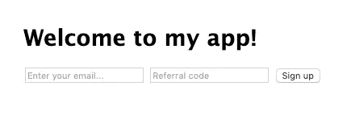

# 用 Node.js 和 MySQL 构建一个简单的推荐系统

> 原文：<https://javascript.plainenglish.io/build-a-simple-referral-system-with-nodejs-and-mysql-3164de2e7818?source=collection_archive---------1----------------------->

## 通过推荐计划获得更多关于您下一个项目的注册


Photo by [Bewakoof.com Official](https://unsplash.com/@bewakoofofficial?utm_source=medium&utm_medium=referral) on [Unsplash](https://unsplash.com?utm_source=medium&utm_medium=referral)

推荐项目无处不在。几乎在任何时候，你注册一个新的 SaaS 产品或订阅一个热门的新电子邮件简讯，你会得到一个推荐链接，你可以与他人分享一个特殊的奖金。

创建一个推荐项目是为你的产品获得社会证明的一个不可思议的方法。有人注册，其他人看到他们这样做，反过来他们也更有可能注册。

> “[社会证明]描述了一种心理和社会现象，其中人们模仿他人的行为，试图在给定的情况下采取行动。”

在制作我最新的产品[货架的时候(看看吧！)](https://shelf.news/?ref=ea8d222)，我实现了一个自定义的推荐程序，想分享一下我是怎么做的。

# 这个计划

对于这个项目，我将使用 Node.js/Expressjs 服务器和 MySQL 数据库。您可以自由使用任何 web 服务器+数据库组合，因为同样的原则也适用。

节点服务器需要执行以下操作:

*   呈现带有电子邮件注册的网页
*   为每个注册的用户生成唯一的推荐代码
*   将推荐代码返回给客户，以便显示

…数据库需要保存所有注册用户的列表，包括以下信息:

*   电子邮件地址
*   推荐代码*(他们的唯一代码)*
*   推荐人*(他们用来注册的代码，如果有的话)*
*   添加时间

# 关系型数据库

对于这个简单的推荐系统，我们只需要一个可以保存四样东西的数据库:用户的电子邮件地址、他们唯一的推荐代码、推荐他们的人的代码以及他们被添加的时间。

我用以下模式创建了我的表:

```
CREATE TABLE `users` (
 `id` INT(11) NOT NULL AUTO_INCREMENT,
 `email` VARCHAR(255) NOT NULL,
 `referral_code` VARCHAR(255) NOT NULL,
 `referrer` VARCHAR(255),
 `time_added` TIMESTAMP NOT NULL DEFAULT 'CURRENT_TIMESTAMP',
 PRIMARY KEY (`id`)
);
```

无论您在何处或以何种方式设置数据库，请确保跟踪其凭据，以便我们稍后可以通过 Node.js 应用程序访问它。您将需要:

*   数据库名称
*   数据库主机
*   数据库用户
*   数据库密码

# Node.js + Expressjs

我将首先使用带有`[express-generator](https://expressjs.com/en/starter/generator.html)`的 EJS 视图引擎创建一个名为`referral-program`的简单快速项目。

```
**express --view=ejs referral-program**create : referral-program/
create : referral-program/public/
create : referral-program/public/javascripts/
create : referral-program/public/images/
create : referral-program/public/stylesheets/
create : referral-program/public/stylesheets/style.css
create : referral-program/routes/
create : referral-program/routes/index.js
create : referral-program/routes/users.js
create : referral-program/views/
create : referral-program/views/error.ejs
create : referral-program/views/index.ejs
create : referral-program/app.js
create : referral-program/package.json
create : referral-program/bin/
create : referral-program/bin/wwwchange directory:
$ cd referral-programinstall dependencies:
$ npm installrun the app:
$ DEBUG=referral-program:* npm start
```

按照指示，我们可以使用以下命令运行该项目:

```
cd referral-program
npm install
npm start
```

一旦你运行了，通过访问`localhost:3000`来确认一切正常。您应该会看到一个页面，上面写着“欢迎快递”

## 用户界面

在`index.ejs`文件中，我们需要一些代码来呈现 email & referral code 输入字段和一个 submit 按钮，用一点 Javascript(本例中是 jQuery)将数据提交给我们的服务器。

这里,`script`标记中的 jQuery 将使用来自电子邮件和推荐代码输入框的数据向`/`路由提交一个 AJAX POST 请求。您可以立即提交您的电子邮件进行测试；您应该会得到一个 404 Not Found 错误，因为我们还没有在该路由上实现 POST 处理程序。然而，当该路由被实现时，您可以看到，一旦成功，它将向用户提示他们的唯一推荐链接。

如果您使用像我这样的代码，那么您的主页应该是这样的:



## 属国

让我们从安装来自 **npm** 的一些依赖项开始后端工作。

我们将需要:

*   `mysql`与我们的 MySQL 数据库交互
*   `dotenv`用于从**访问环境变量。环境**文件
*   `shortid`用于生成简短、URL 友好的推荐代码

使用以下命令安装它们:

```
npm i mysql
npm i dotenv
npm i shortid
```

## app.js

我们需要对我们项目的`app.js`文件做一个小小的调整。在文件的最顶部，在其他任何内容之前，添加以下行:

```
require('dotenv').config();
```

这将允许我们稍后使用`process.env.VARIABLE_NAME`来访问环境变量。

## 创建环境变量

在项目的根目录下创建一个名为`.env`的文件，并将您的 MySQL 数据库凭证放入其中。您的文件应该如下所示:

```
DB_USER=your_database_username
DB_PASS=your_database_password
DB_NAME=your_database_name
DB_HOST=your_database_host
```

## “邮政/”路线

我们告诉我们的表单将所有条目作为 POST 请求提交到`/`路由，所以现在让我们定义那里发生了什么。这条路线需要:

1.  阅读用户提交的数据:电子邮件和推荐人
2.  生成用户可以共享的唯一推荐代码
3.  将提交的内容放入数据库
4.  将推荐代码返回给客户

# 恭喜你！🥳

你已在你的应用中成功实施了推荐计划！

为了测试它，重新启动您的节点服务器(`ctrl+c`停止它，然后`npm start`再次启动)并重新访问`localhost:3000`。提交您的电子邮件地址，您应该会看到一个弹出窗口，显示您的唯一推荐链接。然后，如果您使用该推荐代码进行另一次提交，您将看到该代码记录在数据库中。

如果你遇到任何麻烦，你可以查看我的 GitHub repo 中的完整代码:[https://github.com/adboio/nodejs-referral-program](https://github.com/adboio/nodejs-referral-program)

# 进一步的想法

这里提出的想法是一个简单的推荐系统的核心，但是从这里你把它带到哪里取决于你自己！下面是我在最新产品 [Shelf](https://shelf.news/?ref=ea8d222) 中如何使用推荐程序的一些灵感:

*   我将推荐代码表示为推荐链接，例如 https://shelf.news/?ref=ea8d222 的。当用户使用其中一个链接访问站点时，推荐代码会自动随 POST 请求一起发送，以便跟踪。这样，他们就不必真的输入推荐代码了。
*   推荐更多人使用该应用的用户在等待列表中的位置会更靠前。这是通过计算每个用户有多少推荐，并以这种方式排序来实现的。

回复我，让我知道你打算如何在你的下一个项目中使用推荐计划！


[Subscribe to Decoded, our official YouTube channel!](https://www.youtube.com/channel/UCtipWUghju290NWcn8jhyAw)