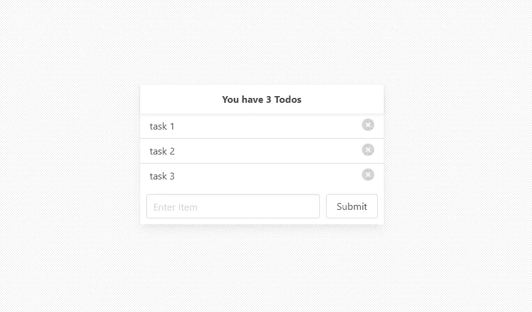
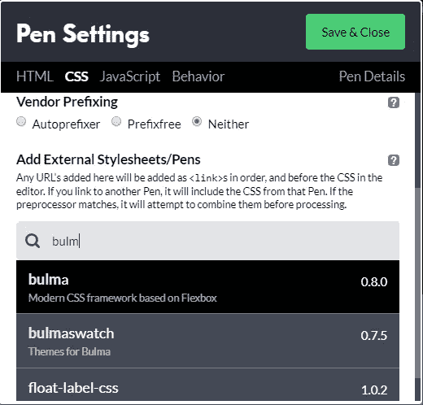
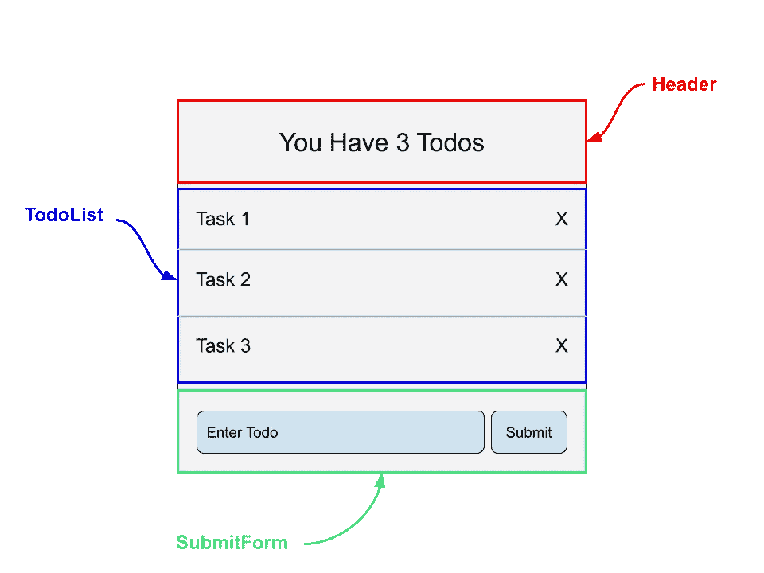
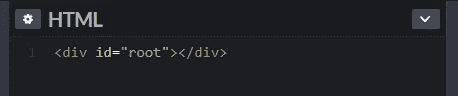
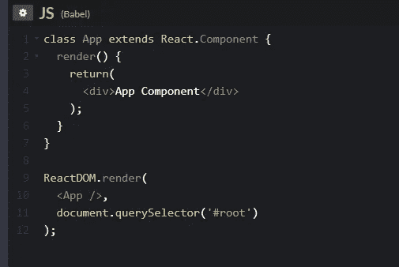
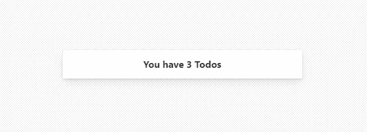
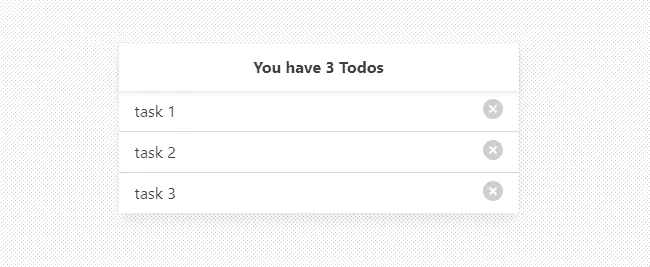

# 用 React ⚛创建一个简单的 Todo 应用程序

> 原文：<https://javascript.plainenglish.io/build-a-simple-todo-app-with-react-561579b39ad1?source=collection_archive---------0----------------------->



The Finished Product

我知道这是一个过度的项目，但是，构建一个 todo 应用程序是学习 React 和巩固库的一些基本原则的好方法。所以今天，我们将构建一个简单的 React 应用程序，看起来就像上面的图片。

# 设置

我们将在 [Codepen](http://codepen.io) 中构建这个应用程序，这将为我们提供一种快速的方式来设置环境，并在我们编码时查看我们对应用程序所做的实时更改。首先，请访问 Codepen 的网站，选择左侧面板上的按钮来创建一个新的笔。

为了确保我们可以在 Codepen 中使用 React，我们需要向我们的应用程序添加适当的依赖项。为此，首先选择页面顶部的“设置”按钮。然后选择“Javascript”选项卡。在这里，您需要将 Javascript 预处理器设置为“Babel ”,并添加 react 和 react-dom 外部脚本。您的笔设置应该像这样:


Adding React dependencies

对于我们的风格，我们将使用一个名为布尔玛的外部 CSS 框架。在设置菜单仍然打开的情况下，翻到 CSS 标签，向下滚动到外部脚本部分，搜索“bulma”。



Adding Bulma framework

只需点击顶部的结果添加布尔玛到您的项目。添加完这些依赖项后，您可以单击“保存并关闭”。现在，我们准备开始编码了！

# 设计

但是在我们开始之前还有一件事…在你开始打字之前有一个你将要建立的计划总是一个好主意。尤其是在用 React 构建用户界面的时候。我们希望对接口的外观有一些了解，这样我们就可以知道我们需要构建什么组件，以及每个组件将负责处理什么数据。

首先，我画了一个 todo 应用程序的草图，并标记了我们需要创建的所有组件:



Todo App Layout

因此，看起来我们需要构建三个主要组件…

1.  Header —这将在所有任务上方简单地显示一些消息。我要让我的显示列表中总共有多少任务。
2.  TodoList —这是一个用于存放待办事项列表的容器。我们可能会为每个单独的行创建一个单独的“todo”组件，但我们会在到达那里时处理它。
3.  提交表单—这是用于向列表添加新待办事项的表单。

需要注意一些事情:

我们将有一个包含一切的“应用程序”组件。我认为这使得所有的任务都存在于应用程序组件中，因为这些数据将决定几个子组件的外观。因此，我们的应用程序组件需要是一个基于类的组件，这样我们就可以在状态中存储所有的任务。

我认为我们需要的另一个基于类的组件是 SubmitForm 组件。每当你有一个表单元素时，明智的做法是让它成为一个由*控制的*组件，这意味着数据是由 React 管理的，而不是 DOM。当我们编写 SubmitForm 组件时，您将看到这是如何实现的。

因为这篇文章不是关于 CSS 的，所以我在这里包含了你需要的所有 CSS:

```
form {
  display: flex;
  padding: 10px;
}
.wrapper {
  min-height: 100vh;
  display: flex;
  justify-content: center;
  align-items: center;
  background-image: url('data:image/svg+xml,%3Csvg ae md" href="http://www.w3.org/2000/svg" rel="noopener ugc nofollow" target="_blank">http://www.w3.org/2000/svg" width="4" height="4" viewBox="0 0 4 4"%3E%3Cpath fill="%239C92AC" fill-opacity="0.4" d="M1 3h1v1H1V3zm2-2h1v1H3V1z"%3E%3C/path%3E%3C/svg%3E');
}
.input {
  margin-right: 10px;
}
.frame {
  width: 40vw;
  max-width: 400px;
}
.header {
  display: inline;
  text-align: center;
}
.list-wrapper {
  max-height: 200px;
  overflow-y: auto;
}
```

继续将它复制到 CodePen 项目的 CSS 面板中。

# 密码

好了，是时候开始写代码了！如果你在任何时候遇到困难，可以在这里随意查阅已经完成的应用:[https://codepen.io/wilstaley/pen/KKwypJW](https://codepen.io/wilstaley/pen/KKwypJW)

让我们首先在 CodePen 的 HTML 面板中创建一个 id 为“root”的 div。这将是我们需要编写的唯一 html，因为 react-dom 库会将我们的 react 代码添加到这个 HTML 页面中。



Root Div that our React code will be added to

好了，现在让我们跳到 JavaScript 面板，开始创建我们的应用程序组件。请记住，这是将所有 todos 保持在其状态的首要组件。它也将是我们创建的所有其他组件的父组件。

但是首先，我们应该确保我们能在屏幕上显示一些东西。所以最初，我只是创建了最基本的基于类的组件。它只有一个返回单个 div 的 render 方法。然后我添加代码，使其呈现在我们的页面上。这是最初几个步骤之后的样子:



Creating the App Component and Rendering it to the Page

一旦你有了这些代码，你应该会看到“应用组件”出现在你的应用中(CodePen 的底部面板)。如果看不到任何内容，请确保正确配置了 CodePen 设置，并且代码编写正确。

现在我们可以向我们的应用程序组件添加状态了！将以下代码添加到您的应用程序组件中 render 方法的上方:

`state = { tasks: ['task 1', 'task 2', 'task 3'] };`

这个状态对象只包含一个项目，即 tasks。Tasks 是一个字符串数组，它是应用程序中 todo 项目的内容。当这个数组更新时，我们的应用程序应该重新呈现，以显示新的变化。

好吧，这看起来不错…但我们不希望我们的应用程序只显示“应用程序组件”，所以让它呈现别的东西。

```
class App extends React.Component {
  state = {
    tasks: ['task 1', 'task 2', 'task 3']
  }; render() {
    return(
       <div className='wrapper'>
        <div className='card frame'>
          <Header />
        </div>
      </div>
    );
  }
}
```

这里我们有两个外 div。第一个有一个“包装器”类。这个 div 占据了整个页面，并确保 todo 列表水平居中和垂直居中。它还有一个花哨的圆点背景。这个的 CSS 在我一开始给你的代码里。第二个 div 有一个“card”和“frame”类。这些是布尔玛类，将为我们做一些造型。如果你想了解更多关于布尔玛的信息，你可以在这里阅读他们的文档:[https://bulma.io/documentation/](https://bulma.io/documentation/)

在这两个 div 中，我们有 Header 组件。但是我们实际上还没有创建这个！让我们现在做那件事。

Header 组件只需要显示我们的 todo 列表的标题。但是因为我想让我的显示列表中有多少项，所以我将把这个数字作为道具传递给组件。标题组件将类似于以下内容:

```
const Header = (props) => {
  return(
    <div className='card-header'>
      <h1 className='card-header-title header'>
        You have {props.numTodos} Todos
      </h1>
    </div>
  )
}
```

这里所有的类名都是由布尔玛提供的，用于设计头部的样式，无需编写 CSS。

在这里，我们传入 props 来获取 todos 数量的引用。但是为了让它工作，我们需要将它添加到我们的应用程序组件内的标题组件中！返回到应用程序组件并更新标题，如下所示:

`<Header numTodos={this.state.tasks.length} />`

我们不需要添加另一个状态变量来跟踪任务的数量，因为我们可以将数组的长度作为一个属性传入。现在我们应该看到待办事项列表的标题出现了！



Header Component

如果您手动向状态中的任务添加另一个字符串，您应该会看到标题中的数字相应地更新！

现在让我们构建 TodoList 组件。为了让 TodoList 能够访问所有的 todos，我们将把任务作为道具传递。我们将把每个 todo 字符串提取到它自己的 Todo 组件中。为此，我们将使用地图功能:

```
const TodoList = (props) => {
  const todos = props.tasks.map((todo, index) => {
    return <Todo content={todo} key={index} id={index} />
  })
  return( 
    <div className='list-wrapper'>
      {todos}
    </div>
  );
}
```

如您所见，我们使用 map 函数返回一个 Todo 组件数组。每当我们使用 map 函数时，React 都希望我们为每个项目使用一个唯一的“key”属性。为了让每个 todo 都有一个惟一的键，我们在 map 函数中使用了 index 参数。我们还用它来创建一个 id 属性，我们将在从我们的状态中删除 todos 时使用它。

现在，很明显，因为我们正在使用一个虚构的“Todo”组件，所以我们需要创建它！

```
const Todo = (props) => {
  return(
    <div className='list-item'>
      {props.content}
      <button class="delete is-pulled-right"></button>
    </div>
  );
}
```

Todo 道具非常简单。它显示作为道具传入的内容(或任务字符串)。它还有一个按钮，用于删除该任务。现在，我们需要做的就是将 TodoList 组件添加到我们的应用程序中，我们应该会看到我们的任务出现了！

```
<Header numTodos={this.state.tasks.length}/>
<TodoList tasks={this.state.tasks} />
```

不要忘记，我们需要传递任务数组作为道具！



TodoList Component

现在我们的应用程序中有了待办事项/任务列表……当然，移除按钮并不能真正移除任务。现在让我们添加该功能。为了从列表中删除一个项目，我们需要从状态中删除该项目的能力。让我们在应用程序组件中编写一个函数，它将处理从任务数组中删除元素的操作:

```
handleDelete = (index) => {
    const newArr = [...this.state.tasks];
    newArr.splice(index, 1);
    this.setState({tasks: newArr});
}
```

这个函数复制状态数组，删除给定索引的元素，并更新状态。因此，无论何时调用这个函数，应用程序都会重新呈现，因为我们更新了状态。

为了让我们的 Todo 组件能够访问这个函数，我们现在需要将它作为一个 prop 传递下去。因此，更新应用程序组件，使用新的道具来呈现 TodoList，如下所示:

```
<Header numTodos={this.state.tasks.length} />
<TodoList tasks={this.state.tasks} onDelete={this.handleDelete} />
```

然后当我们映射到 Todo 组件时，将它添加为一个道具…

```
const todos = props.tasks.map((todo, index) => {
    return <Todo content={todo} key={index} id={index} onDelete={props.onDelete} />
})
```

现在，在 Todo 组件中，我们可以添加一个 onClick 处理程序，每当按下 delete 按钮时，它都会触发这个函数:

```
<button class="delete is-pulled-right" onClick={() => {props.onDelete(props.id)}}></button>
```

注意，我们将该 todo 的 id 作为参数传递给 delete 函数。这是用于从数组中移除该项的索引。现在，每当我们单击删除按钮时，应该会调用 handleDelete 函数，应用程序应该会重新呈现。我们现在可以从列表中删除 todos 了！

最后，我们可以创建 SubmitForm 组件并包装它。我们将从制作一个简单的基于类的组件开始，该组件呈现文本输入和提交按钮:

```
class SubmitForm extends React.Component {
  render() {
    return(
      <form>
        <input 
          type='text'
          className='input'
          placeholder='Enter Item'
        />
        <button className='button'>Submit</button>
      </form>
    );
  }
}
```

还记得我提到的让它成为“受控”组件的事情吗？下面是我们如何修改该组件，使其输入由 React 管理:

```
class SubmitForm extends React.Component {
  state = { term: '' }; render() {
    return(
      <form>
        <input 
          type='text'
          className='input'
          placeholder='Enter Item'
          value={this.state.term}
          onChange={(e) => this.setState({term: e.target.value})}
        />
        <button className='button'>Submit</button>
      </form>
    );
  }
}
```

首先，我们用“term”键添加状态。这个“术语”代表文本输入字段中的文本。现在我们将输入的值属性设置为这个术语。所以每当状态改变时，输入字段的值实际上是由 React 控制的。最后一步只是添加一个 onChange 处理程序，每当我们键入文本输入时，它都会更新状态。

瞧啊。我们现在有一个受控的输入。最后一步是将用户输入的内容添加到我们的待办事项列表中…

因此，就像我们在 App 组件中添加了一个处理删除的函数一样，现在让我们添加一个处理添加的函数:

```
handleSubmit = task => {
    this.setState({tasks: [...this.state.tasks, task]});
}
```

这个函数只是将旧任务数组的内容复制到一个新数组中，并添加新任务。

当然，如果我们的 SubmitForm 组件要使用这个函数，它需要作为一个道具传递下去。因此，现在是在 App 中添加 SubmitForm 组件的最佳时机:

```
<Header numTodos={this.state.tasks.length} />
<TodoList tasks={this.state.tasks} onDelete={this.handleDelete} />
<SubmitForm onFormSubmit={this.handleSubmit} />
```

现在，我们将在 SubmitForm 组件中添加一个事件处理程序，用于当用户实际按下 submit 按钮或 enter 键时:

```
class SubmitForm extends React.Component {
  state = { term: '' }; handleSubmit = (e) => {
    e.preventDefault();
    if(this.state.term === '') return;
    this.props.onFormSubmit(this.state.term);
    this.setState({ term: '' });
  } render() {
    return(
      <form onSubmit={this.handleSubmit}>
        <input 
          type='text'
          className='input'
          placeholder='Enter Item'
          value={this.state.term}
          onChange={(e) => this.setState({term: e.target.value})}
        />
        <button className='button'>Submit</button>
      </form>
    );
  }
}
```

让我们稍微分解一下。首先，我们向表单元素添加了一个 onSubmit 侦听器。每当用户按下提交按钮或按下回车键时，这将调用组件的' handleSubmit '函数。在 handleSubmit 函数中，首先我们有`e.preventDefault();`。这只是防止页面在提交表单时自动刷新。然后，我们检查输入字段中是否有任何文本。如果它是空的，我们什么也不做，从这个函数返回。否则，我们调用作为道具传递的函数，该函数实际上将 todo 项添加到我们的应用程序的状态中。最后，我们将输入的文本重置为空字符串，从而清空字段。

恭喜你！现在你有了一个全功能的应用程序，可以添加和删除列表中的待办事项。


我希望你喜欢这个教程。如果你想看到更多这样的教程，请考虑成为 www.patreon.com/wilstaley T2 的赞助人

谢谢！