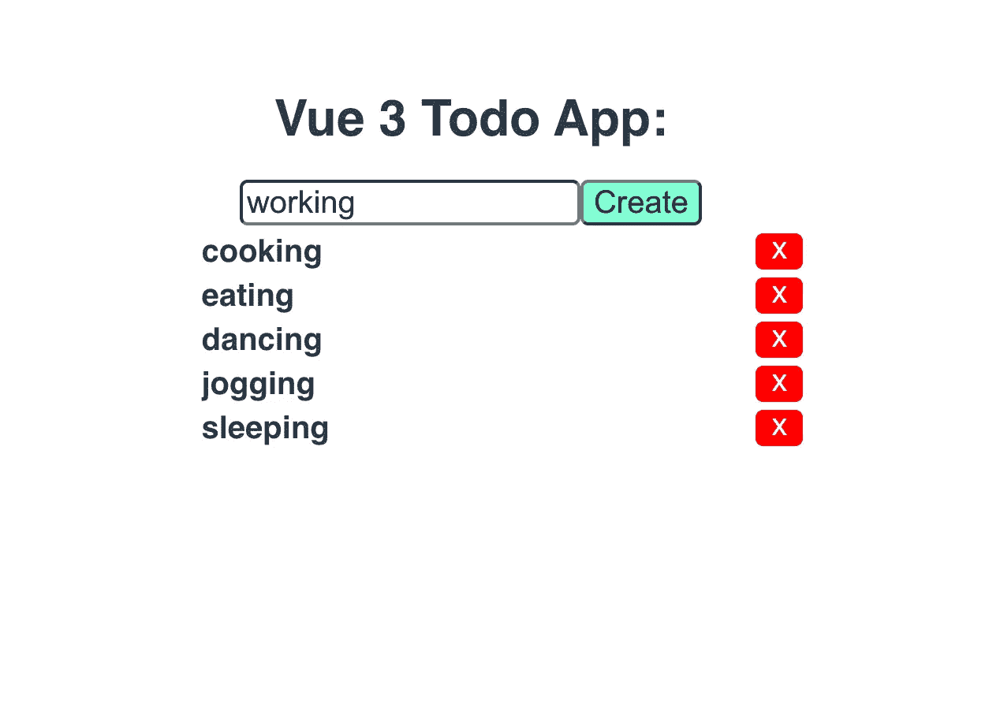
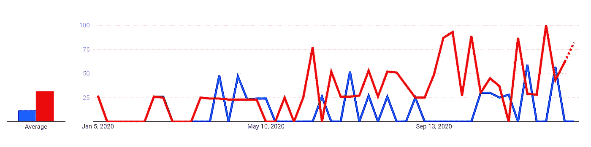
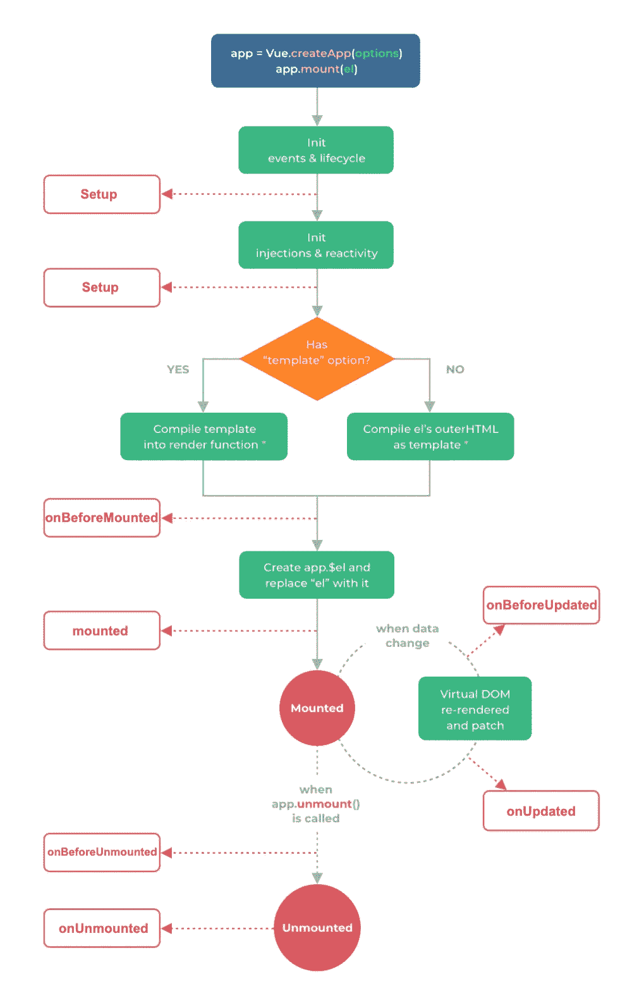
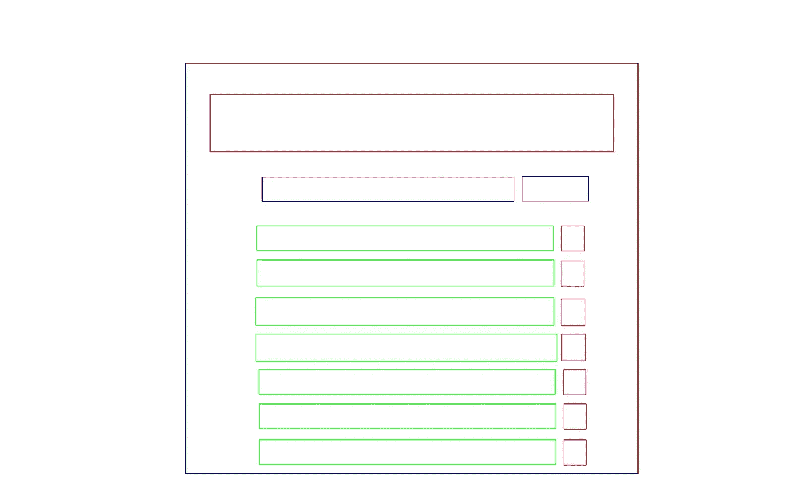

# 用 Vue 3 构建一个简单的 Todo 应用程序

> 原文：<https://javascript.plainenglish.io/build-a-simple-todo-app-with-vue-3-de6b9251e1d?source=collection_archive---------2----------------------->



Vue 3 正式[上线](https://v3.vuejs.org/?ref=madewithvuejs.com)，大多数人都想尝试一下新功能。如果你也想玩它。在这里，我创建了一个简单的应用程序，供您尝试并更好地理解。

下图是从 Vue 2 转向 Vue 3 的开发人员从 Google Trend 迅速增加的情况，红线表示 Vue 3，蓝线表示 Vue 2 用户积极参与的内容。



Google Trend

# 项目设置

安装最新的 vue-cli

```
npm install -g @vue/cli
```

然后使用下面的命令创建第一个项目。

```
$ npm init vite-app <project-name>
$ cd <project-name>
$ npm install
$ npm run dev
```

# Vue3 中的生命周期挂钩

在新的 Vue 3 中，那些生命周期关键字已经被改变了。然而，它仍然做你想要实现的事情。让我给你看一下生命周期挂钩的图表:



```
import { onBeforeMount, onMounted, onBeforeUpdate, onUpdated, onBeforeUnmount, onUnmounted, onActivated, onDeactivated, onErrorCaptured } from 'vue'

export default {
  setup() {
    onBeforeMount(() => {
      // ... 
    })
    onMounted(() => {
      // ... 
    })
    onBeforeUpdate(() => {
      // ... 
    })
    onUpdated(() => {
      // ... 
    })
    onBeforeUnmount(() => {
      // ... 
    })
    onUnmounted(() => {
      // ... 
    })
    onActivated(() => {
      // ... 
    })
    onDeactivated(() => {
      // ... 
    })
    onErrorCaptured(() => {
      // ... 
    })
  }
}
```

> "如果你不知道你要去哪里，你将会到达另一个地方."*——约吉·贝拉，前纽约洋基队捕手*

其他一些类似`computed`和`watch`和`watchEffect`的钩子，你也可以参考 vue3 中的文档

[https://v3 . vuejs . org/guide/reactivity-computed-watchers . html # computed-values](https://v3.vuejs.org/guide/reactivity-computed-watchers.html#computed-values)

# 计划:

规划出你的应用程序在做什么，以及它如何服务于你的期望是非常重要的。一旦你知道它应该做什么。这将节省你大量的编码时间。



Template example

布局是有一些基本的组成部分。你可以发挥你的创造力，让它看起来更花哨或更有条理。因此，这是为了演示的目的，因为你总是可以从一个小的部分做一件伟大的事情。现在让我们开始放一些代码来创建这个应用程序。

> 空谈不值钱。给我看看代码。莱纳斯·托沃兹。

# 代码:

从你的 app.js 中，你创建了`container`这个文件，并放入了头文件。

导航到 components 文件夹，并创建 Container.vue。

直到这一步，你已经有一个非常快速和良好的项目创建。生成`Todo`列表，这样你就可以看到你需要的所有列表。

难以置信！该应用程序需要你不到 5 分钟的时间来创建，你可以通过体验 Vue 3 功能获得一个简单的待办事项应用程序。然而，这个 Todo 应用程序不需要太多复杂的想法。你注意到的是`ref`关键字，它类似于`data`。如果你以前用过 React，那你应该很熟悉。

希望你喜欢并了解了更多关于 Vue 3 的知识。这个演示项目也可以在 [V](https://github.com/shijiezhou1/vue3-todo) ue3-Todo 上找到。

# 参考:

[https://v3.vuejs.org/api/application-config.html](https://v3.vuejs.org/api/application-config.html)

[https://v3.vuejs.org/guide/introduction.html](https://v3.vuejs.org/guide/introduction.html)

[https://github.com/vuejs/vue-next/releases/tag/v3.0.0?ref=madewithvuejs.com](https://github.com/vuejs/vue-next/releases/tag/v3.0.0?ref=madewithvuejs.com)

[https://learnvue.co/2020/03/how-to-use-lifecycle-hooks-in-vue3/](https://learnvue.co/2020/03/how-to-use-lifecycle-hooks-in-vue3/)