# 使用标准库和 Node.js 构建一个 Slack 应用程序，通过 4 个步骤创建和应用条纹优惠券

> 原文：<https://javascript.plainenglish.io/build-a-slack-app-to-create-and-apply-stripe-coupons-in-4-steps-with-standard-library-and-node-js-b8a658328e8c?source=collection_archive---------0----------------------->

## 订阅无处不在——想想网飞、蓝围裙、Xbox Live 等等。––和是从客户那里获取价值的绝佳方式。

## 如今，由于像[条纹计费](https://stripe.com/billing)这样的产品极大地简化了过程，建立订阅比以往任何时候都更容易。

尽管 Stripe 提供了大量的实用程序，但管理订阅需要授予访问权限并导航到安全的仪表板，这对于更常见的管理任务来说可能是多余的。

在本文中，我们将介绍如何使用基于标准库的[构建自己的基于](https://build.stdlib.com) [Slack](https://slack.com) 的条带优惠券管理应用。您的应用将能够:

*   为所有场合(新订户、促销等)创建优惠券代码。)
*   将优惠券应用于现有订户
*   解决世界饥饿和能源危机(开玩笑)

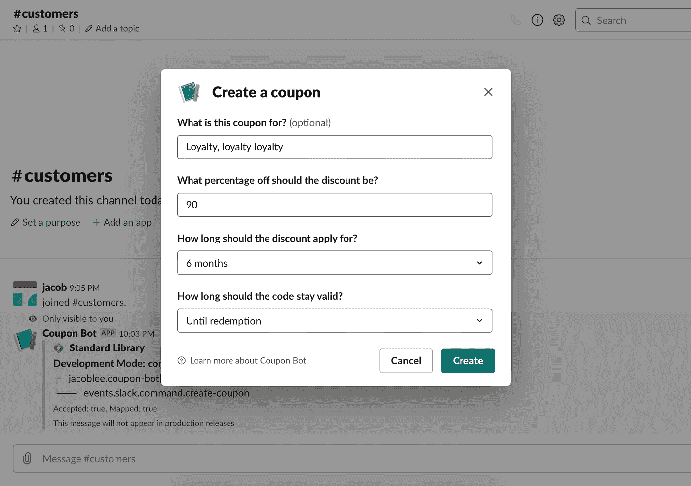

Creating a coupon

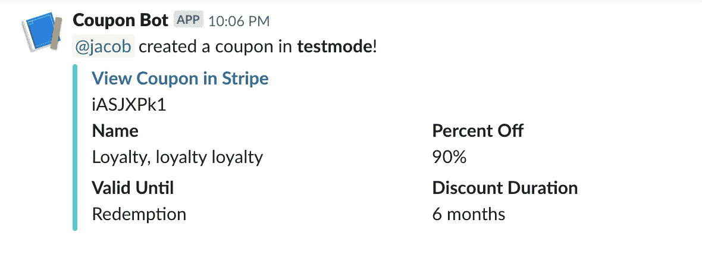

Thanks, Coupon Bot!

激动吗？我们开始吧！

# 先决条件

*   1x [条带](https://stripe.com/)账户
*   1x [空闲](https://slack.com/)工作区(我们建议您从一个新的“测试”工作区开始——您可以在测试后轻松地将您的应用发布到活动工作区)

# 步骤 1:打开项目模板

我们将从 GitHub repo 中的现有模板构建该产品。这个 repo 已经配置为使用 [Build](https://build.stdlib.com) 自动创建事件订阅和触发 API！但是不要担心编码人员，您将能够编辑代码，为其他事件添加新的处理程序，或者在部署后根据您的意愿定制它。

你可以在 [GitHub 这里](https://github.com/stdlib-examples/project-stripe-coupon-slack-app)查看代码。要启动并运行您的个人版本，请单击存储库自述文件中的“ **Deploy** ”按钮。你也可以关注[这个链接](https://build.stdlib.com/from-github/?repo=stdlib-examples/project-stripe-coupon-slack-app)。

You can’t miss it

你会看到这样一个页面:

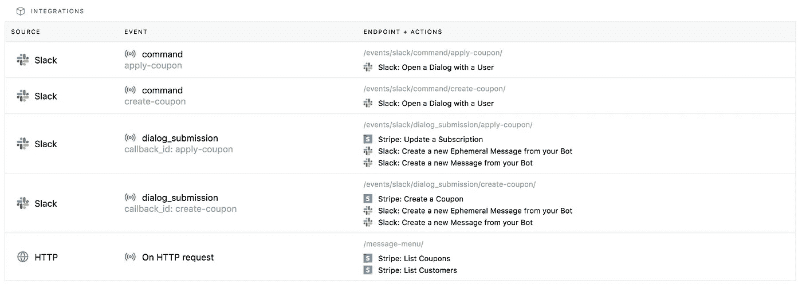

The five endpoints in our coupon bot

我们的应用有五个端点:

1.  `events/slack/command/apply-coupon.js`，由**松弛斜线命令** `/apply-coupon`触发的处理程序。它会打开一个回调 id 为`apply-coupon`的对话框，正如您所料，允许您将优惠券应用到现有订户。
2.  `events/slack/command/create-coupon.js`，由**斜线命令** `/create-coupon`触发的处理程序。它会打开一个回调 id 为`create-coupon`的对话框，允许你创建新的优惠券。
3.  `events/slack/dialog_submission/apply-coupon.js`，当你提交一个回调 id 为`apply-coupon`的对话框时被调用的处理程序。它调用 Stripe API 来更新适当的订阅。
4.  `events/slack/dialog_submission/create-coupon.js`，当你提交一个回调 id 为`create-coupon`的对话框时被调用的处理程序。它调用 Stripe API 用优惠券创建对话框中的参数创建优惠券。
5.  `message-menu.js`，从 Stripe 中检索优惠券和订阅数据并填充对话框中的菜单的端点。它充当对话框中菜单的数据源。

向下滚动，您会看到我们需要链接条带和闲置帐户:

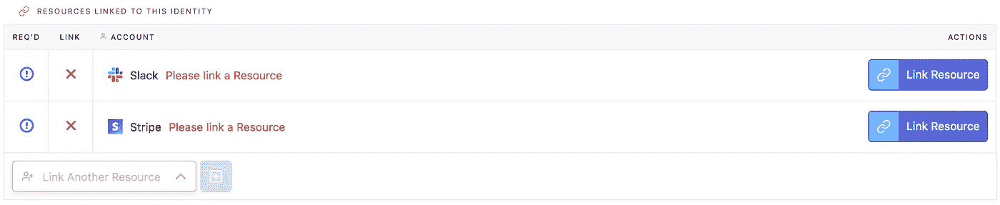

The accounts we need to link

# 步骤 2:设置条带

先说条纹吧！链接您的 Stripe 帐户非常简单。只需单击条带行中的**链接资源**按钮，在出现的对话框中选择**链接新资源**，并在以下 OAuth 弹出窗口中选择您的条带帐户。由于您处于测试模式，只需点击**跳过此账户表单**以避免不必要的设置。

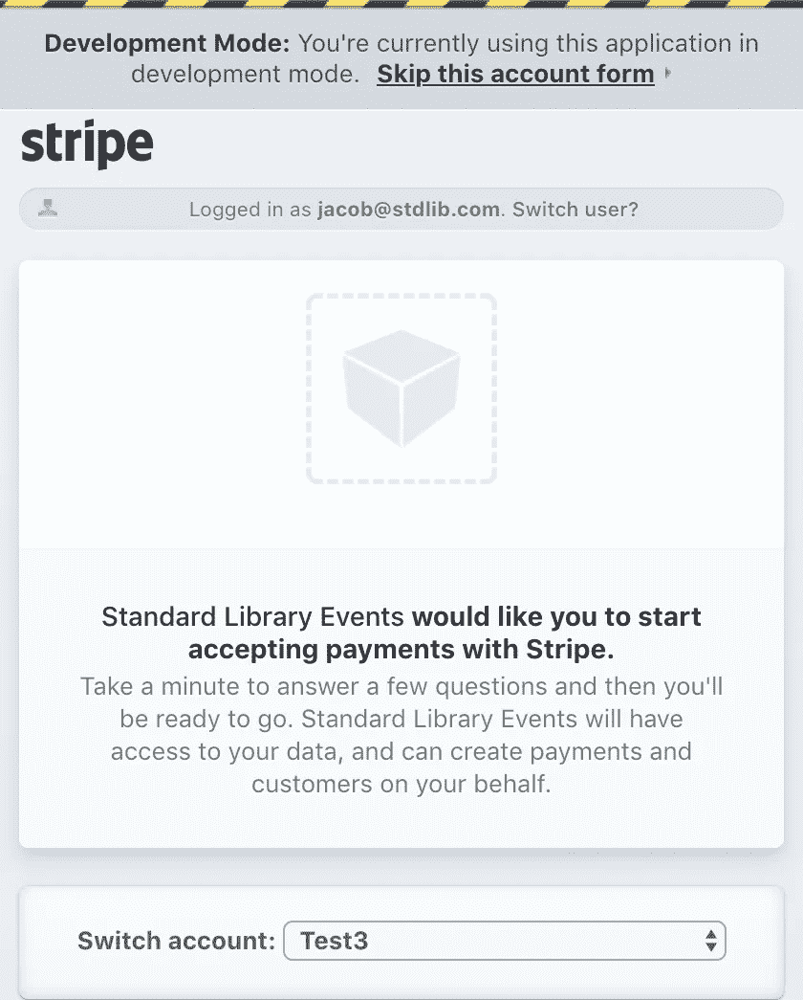

The Stripe OAuth popup

# 步骤 3:设置时差

设置时差还需要几个步骤。对于此应用程序，我们需要:

1.  创建一个 Slack 应用程序
2.  为该应用程序创建一个**机器人用户**
3.  粘贴我们的**认证重定向网址**
4.  粘贴我们的**交互组件 URL**
5.  检索您的应用程序的凭据，并将其链接到您项目的**身份**
6.  注册`/create-coupon` **斜线命令**
7.  注册`/apply-coupon` **斜线命令**
8.  粘贴我们的**消息菜单 URL** 来填充我们对话框中的下拉列表

还好每一步只需要一分钟！若要开始，请单击时差行中的**链接资源**按钮。这将打开一个内置向导，引导您完成前五个步骤:

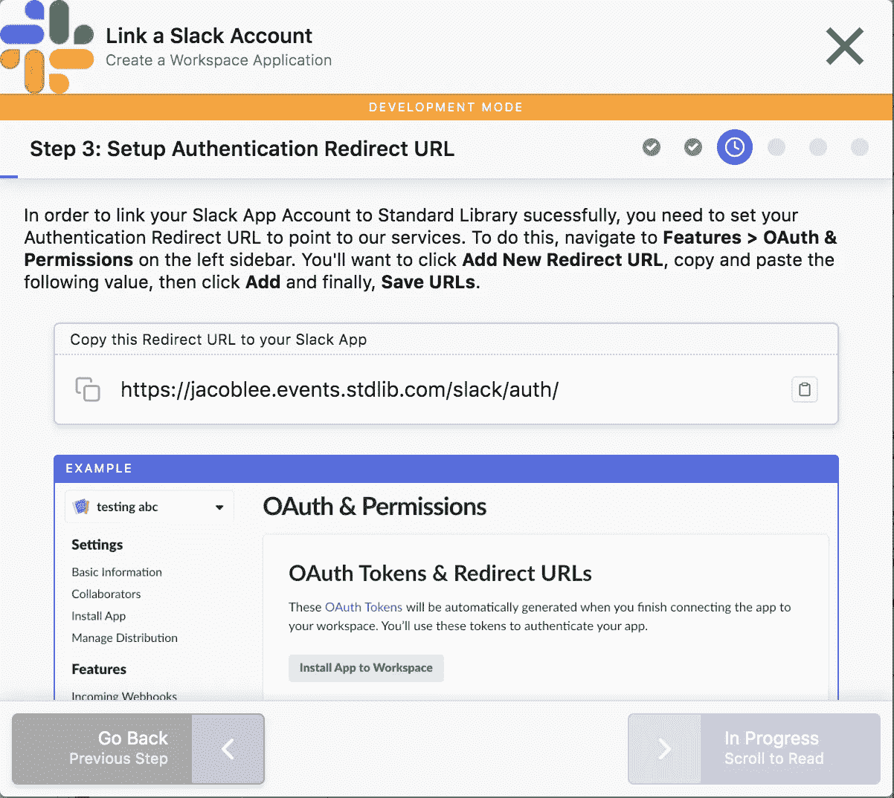

Screenshots included!

在点击**下一步**之前，仔细通读并遵循指南的每个部分，将它提供的 URL 粘贴到您的 [Slack app dashboard](https://api.slack.com/apps) 中的适当位置。完成这些之后，您需要设置三个额外的 URL:两个斜杠命令(`/create-coupon`和`/apply-coupon`)以及对话框中下拉菜单的数据源。

导航到您的 [Slack 应用仪表板](https://api.slack.com/apps)，并选择您刚刚创建的应用。接下来，从左侧栏选择**斜线命令**并按下**创建新命令**。

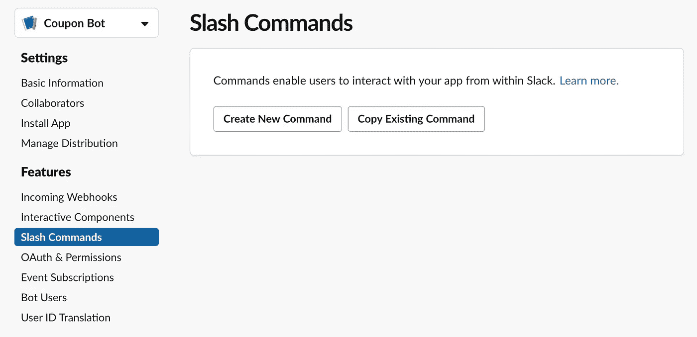

Creating a new command

命名命令`create-coupon`。将`https://<your Standard Library username>.events.stdlib.com`用于**请求 URL** 。完成后点击右下角的**保存**，重复这个过程创建第二个斜线命令`apply-coupon`。

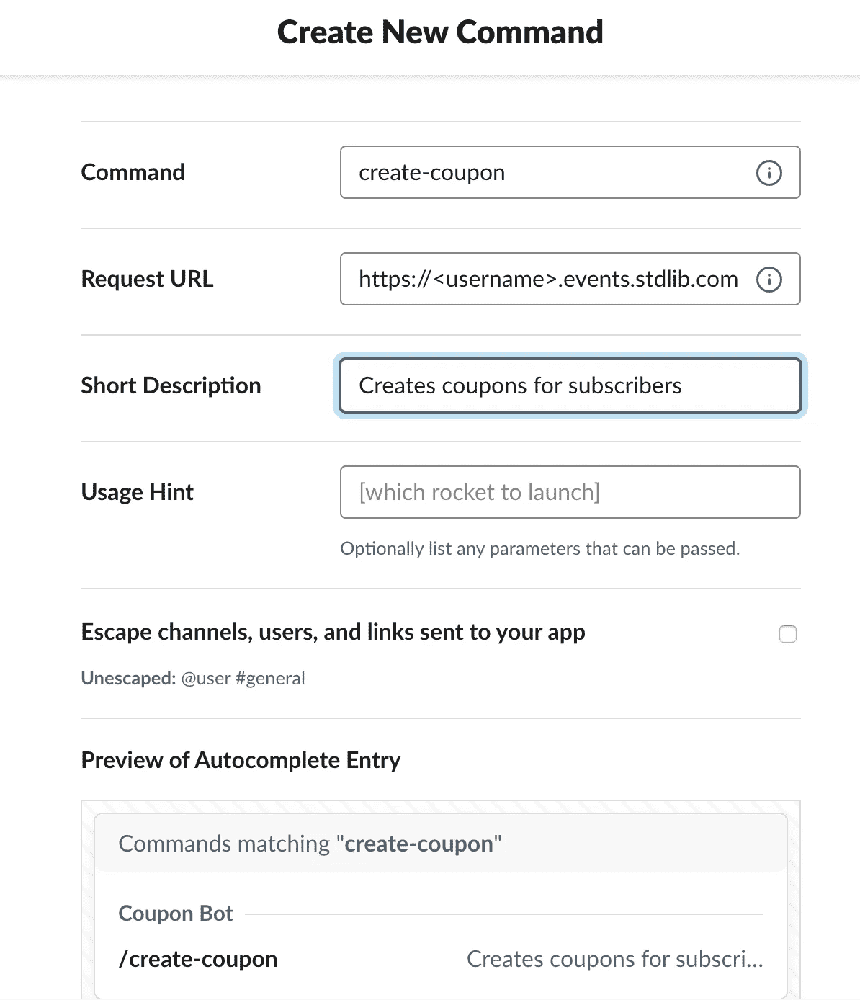

快好了！在左侧栏中选择**交互组件**，向下滚动，用这个 URL: `https://<your Standard Library username>.api.stdlib.com/coupon-bot@dev/message-menu/`填充**消息菜单**。

注意:结尾的斜线很重要——不要忘记！

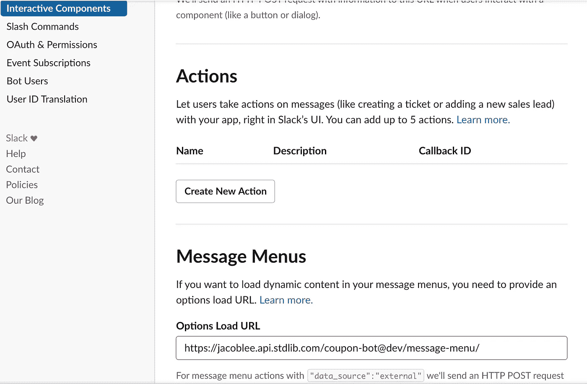

Setting up the data source for the dropdowns in the dialogs. Don’t forget the trailing slash!

# 第四步:发货！

我们准备好出发了！现在我们可以在 [Build](http://build.stdlib.com/) 页面的按钮处点击 **Deploy Project** 按钮。完成后，打开安装应用程序的 Slack 工作区。尝试运行`/create-coupon`并从弹出的对话框中创建优惠券！

如果你有现成的基础设施来处理优惠券代码，你可以直接给你的客户。否则，您可以使用`/apply-coupon`将您使用`/create-coupon`创建的优惠券直接应用于订户。如果您没有任何现有的测试模式订户，您可以通过创建测试客户、支付来源、产品以及最终的订阅，从您的 [Stripe 仪表板](https://dashboard.stripe.com)中创建一个。

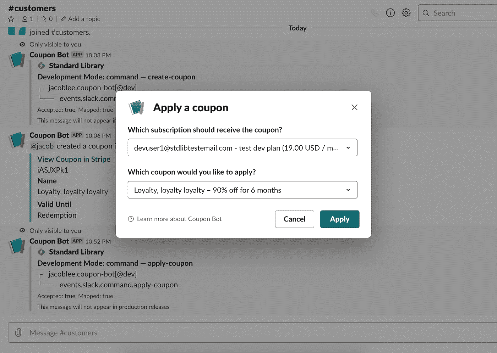

Applying a coupon

# 做更多的修改:这只是代码！

虽然我们在本教程中没有编写任何代码，但我们直接从 GitHub 模板中导入了代码——这意味着我们可以完全控制支持我们的工作流和应用程序的所有代码。要编辑和迭代代码，从项目管理屏幕的列表中选择 **dev** 环境，向下滚动，并单击任何端点前面的**编辑代码**按钮。

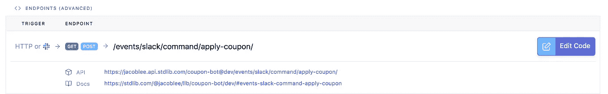

Click “Edit Code” to open your code in code.stdlib.com

这将在我们的在线代码编辑器【code.stdlib.com中打开你的应用程序代码。如果你喜欢在本地工作，你也可以使用我们的[命令行工具](https://github.com/stdlib/lib)来下载和重新部署你的应用。

# 当您准备好了:发货到生产

一旦您部署和迭代了您的应用程序，并使用您的测试工作空间和 testmode Stripe 帐户进行了测试，切换到使用生产数据就很简单了。在 Build 的项目管理界面中，只需点击 **Ship Release** 按钮。系统会提示您链接 Stripe 帐户的实时版本和新的 Slack 工作区，这应该是您实际打算在其中使用该应用程序的工作区。您还必须重复设置斜杠命令和消息菜单数据源的过程。

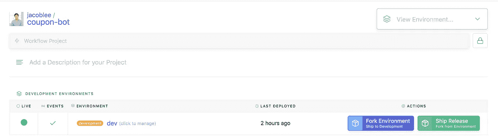

Click “Ship Release”

# 就是这样！谢谢大家！

我们希望您和您的客户喜欢使用您的新优惠券管理应用程序！如果您有任何想法或改进，请随时在模板的存储库中打开一个拉请求。

要获得更多帮助[请查看我们的文档](https://docs.stdlib.com/)，或者通过访问[https://docs.stdlib.com/](https://docs.stdlib.com/)并点击右侧的**请求 Slack 社区邀请**来加入我们的 Slack 工作空间。

再次感谢！产品更新请关注 Twitter 上的标准库， [@StdLibHQ](https://twitter.com/stdlibhq) ，或者我个人( [@hacubu](https://twitter.com/hacubu) )！我们有更多令人兴奋的事情要做。

雅各布·李是标准图书馆的联合创始人。他喜欢超级粉碎兄弟，打壁球，用第三人称谈论自己。在推特上关注他[*@ hacubu*](https://twitter.com/hacubu)*！*