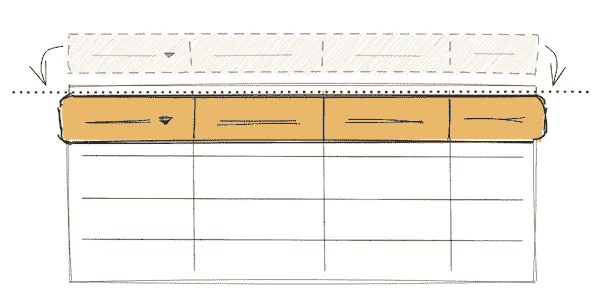
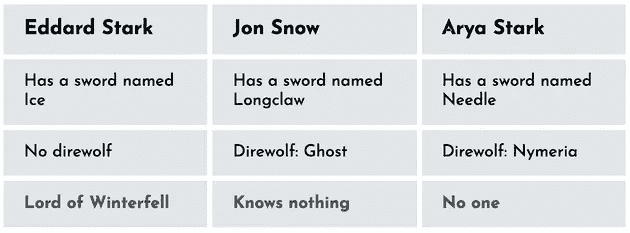
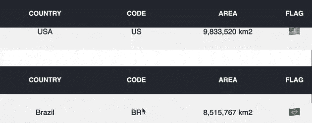

# 用 React 钩子构建一个粘性表头

> 原文：<https://javascript.plainenglish.io/build-a-sticky-table-header-with-react-hooks-b5a344203045?source=collection_archive---------13----------------------->

## 正视表格的局限性，用 React 钩子把它的标题变成一个粘性元素。



使用一个`<table />`元素代替 flexbox 来表示数据是一件好事。想知道如何在 React 的帮助下制作一个粘性表头吗？想知道如何将解决方案应用到生产代码中吗？这篇博文是写给你的！

接下来的不是一个关于你应该如何解决这个问题的简单教程。它也不是一个理论或虚构的实现。相反，我们关注的是在真实项目中测试过的、可以轻松重用的可能解决方案。它还整理了使用`<table />`时的一些边缘情况。

*直奔* [*代号*](#88a7) *，如果那多半就是你要找的。*

# 目录:

1.[表格与 Flexbox](#53d8)

*   [通过标题单元格控制列](#e764)
*   [标题和内容组件拆分](#3ca6)
*   [表格开箱即用](#39fc)

2.[粘性表头(代码解)](#88a7)

*   [<表/ >组件接口](#f436)
*   [<表/ >组件实现](#234a)
*   [useStickyHeader()实现](#ff81)

3.[最后的话](#aba8)

4.[资源](#1f7d)

# 表格与 Flexbox

每当您必须处理数据表示时，通常第一个意图是用 flexbox 创建一个基于`<div />`的布局。人们不知何故对桌子有偏见。在过去，表格被用来构建网页的名声并不好。但是如果做得好，它们可以帮你解决很多问题。表格也可以很好地使用 React。

**另一方面，循环遍历数据并将其放在基于 flexbox 的网格中并不方便。**在[可访问的、简单的、反应灵敏的表格](https://css-tricks.com/accessible-simple-responsive-tables/#1b-for-column-oriented-tables)中对该问题进行了很好的说明。



Table layout with flexbox. The screenshot is taken from [here](https://codepen.io/moubi/pen/WNxVdxY).

上面的表格布局是用 flex 设计的，看起来非常类似于:

```
<div class="table">
  <h3 class="header">Eddard Stark</h3>
  <div class="row">Has a sword named Ice</div>
  <div class="row">No direwolf</div>
  <div class="row">Lord of Winterfell</div>

  <h3 class="header">Jon Snow</h3>
  <div class="row">Has a sword named Longclaw</div>
  <div class="row">Direwolf: Ghost</div>
  <div class="row">Knows nothing</div>
  ...
</div>
```

很快就出现了一个问题:用给定的标记遍历标题和行数据有多容易？

**相反，一些表的好处包括:**

1.  通过标题单元格控制列宽
2.  标题和内容(表格行)之间无痛苦的组件式拆分
3.  开箱即用(无 css)

所有这些都与将表格标题(`<thead />`)变成粘性项目背后的挑战密切相关。理解它们，应该有助于你以后更好地遵循代码解决方案。

您可以使用常用的`<table />`标签构建表格布局，或者通过带有`display: table`和语义元素(`<div />`)的 css 来实现同样的功能。

```
// This
<table>
  <thead />
  ...
</table>

// is the same as
<div style={{ display: "table" }}>
  <div style={{ display: "table-header-group" }} /> 
  ...
</div>
```

同样的视觉效果。但是，如果你把`<thead />`放在它的`<table />`父节点之外，第一个会引起 React 抱怨(也是在测试中)。

```
<div>
  <thead />
</div>Warning: validateDOMNesting(...): <thead> cannot appear as a child of <div>.
```

为了简单和明确起见，后面的所有例子都基于`<table />`元素。

回到福利上。

# 通过标题单元格控制列

这可能看起来违反直觉，因为标题和正文单元格在 DOM 中彼此放置得很远。

```
<table>
  <thead>
    <tr>
      <th style="width: 200px;">Header cell</th>
    </tr>
  </thead>
  <tbody>
    <tr>
      <td>Table cell 1</td>
    </tr>
    <tr>
      <td>Table cell 2</td>
    </tr>
  </tbody>
</table>
```

在本例中，所有`<td />`元素的宽度将与用`<th style="width: 200px;">Header cell</th>`设置的宽度相同。

**您得到了一个副作用，允许轻松控制列的大小，而不需要设置大量 css 规则的额外成本。**

# 标题和内容组件拆分

除了调整列的大小，排序和过滤功能也大多附加在标题上。原来他们是统治整个牌桌的非常强大的单位。特别是当您需要将表拆分成 React 组件时，这种依赖关系就会出现。

查看这个表组件接口(不涉及细节):

```
<Table sortable headers={["Country", "Population"]} data={data}>
  {dataAfterSorting => (
    dataAfterSorting.map(country =>
      <TableDataRow data={country} />
    )
  )}
</Table>
```

[这种结构很自然](https://reactjs.org/docs/fragments.html#motivation)因为:

1.它遵循了表格在 DOM 中的呈现方式(*带有单独的标题和主体部分*)。

2.标题附带了排序功能。

页眉设置自己的样式。这包括排序指示器、悬停状态，但也包括行为(点击处理程序)。一个独立的组件，编排与之分离的全部内容。

3.内容不知道它的上下文。

像`<TableDataRow />`这样的组件可能存在于表外。它接受一部分预先排序的数据，并简单地用自己的样式呈现一行。**这个组件不知道它的上下文，也不需要知道。有一个例外:它显示的单元格数量(** `**<td />**` **)必须与表头相同。**

# 表格开箱即用

[表格简单明了，众所周知](https://css-tricks.com/complete-guide-table-element/)。您不需要额外的代码来实现给定数据集的基本表示。通过简单地使用`<table />`结构，你已经有了一个数字的形式。

如前所述，对于**柔性盒**来说，情况并非如此。

# 粘性标题(代码解决方案)


这是演示实现，其代码可以在 [CodeSandbox 项目](https://codesandbox.io/s/sticky-header-table-with-react-3j5zy?file=/src/Table.js)中找到。粘性是通过一个简单的`<Table />`组件和一个`useStickyHeader`反应钩实现的。

**通过在**[**styles . CSS**](https://codesandbox.io/s/sticky-header-table-with-react-3j5zy?file=/src/styles.css)**中添加您的自定义表格样式来重用它。**

# `<Table />`组件接口

表格组件本身呈现如下

```
// App.js
const tableHeaders = ["Country", "Code", "Area", "Flag"];

export const tableData = [
  {
    country: "Brazil",
    code: "BR",
    area: "8,515,767 km2",
    flag: "🇧🇷"
  },
  ...
];

<Table headers={tableHeaders} data={tableData} />
```

其中它的`headers`属性接受一个字符串数组，而`data`是一个对象数组。

的接口对于实际的粘性实现并不重要，你可以构建自己的抽象。

# `<Table />`组件实现

下面是`Table.js`背后的代码。它充当表及其粘性头的包装器。

```
// Table.js
function Table({ headers = [], data = [] }) {
  const { tableRef, isSticky } = useStickyHeader();

  const renderHeader = () => (
    <thead>
      <tr>
        {headers.map(item => <th key={item}>{item}</th>)}
      </tr>
    </thead>
  );

  return (
    <div>
      {isSticky && (
        <table
          className="sticky"
          style={{
            position: "fixed",
            top: 0,
            left: 0,
            right: 0
          }}
        >
          {renderHeader()}
        </table>
      )}
      <table ref={tableRef}>
        {renderHeader()}
        <tbody>
          {data.map(item => (
            <tr key={item.code}>
              <td>{item.country}</td>
              <td>{item.code}</td>
              <td>{item.area}</td>
              <td>{item.flag}</td>
            </tr>
          ))}
        </tbody>
      </table>
    </div>
  );
}
```

一些重要的方面需要一些细节。

```
const { tableRef, isSticky } = useStickyHeader ( ) ;
```

[自定义反应钩](https://reactjs.org/docs/hooks-custom.html)露出两个道具:

*   `tableRef` -用于引用您希望具有粘性标题的表格元素。
*   `isSticky` -每当表格超过页面的上边缘时，标志转动`true`。

```
// Render if isSticky is true.
{isSticky && (
  // This is a required <table /> wrapper for the sticky header.
  // .sticky class distinguishes from the original table
  // and the additional style enables the stickiness.
  <table
    className="sticky"
    style={{
      position: "fixed",
      top: 0,
      left: 0,
      right: 0
    }}
  >
    {/* Render the same table header */}
    {renderHeader()}
  </table>
)}
```

如果`isSticky`为真，则该部分呈现粘性报头。

上面的粘性元素应该继承原来的`<table />`的样式，以获得相同的外观。

另一件需要注意的事情是——有两个对`renderHeader()`的调用。如果启用了粘性，这意味着标记中有两个`<thead />`。**这是必需的。原始头需要填充表顶部的物理空间。而且它不能去粘自** `**position: fixed**` **断章取义**[](https://developer.mozilla.org/en-US/docs/Web/CSS/position#Syntax)****。在这种情况下，引入头的第二个副本是解决该问题的一种方法。****

# **useStickyHeader()实现**

**鉴于`<Table />`组件上的注释，`useStickyHeader`钩子可能是你需要的唯一一段代码。**

```
// useStickyHeader.js
const useStickyHeader = (defaultSticky = false) => {
  const [isSticky, setIsSticky] = useState(defaultSticky);
  const tableRef = useRef(null);

  const handleScroll = useCallback(({ top, bottom }) => {
    if (top <= 0 && bottom > 2 * 68) {
      !isSticky && setIsSticky(true);
    } else {
      isSticky && setIsSticky(false);
    }
  }, [isSticky]);

  useEffect(() => {
    const handleScroll = () => {
      handleScroll(tableRef.current.getBoundingClientRect());
    };
    window.addEventListener("scroll", handleScroll);

    return () => {
      window.removeEventListener("scroll", handleScroll);
    };
  }, [handleScroll]);

  return { tableRef, isSticky };
};
```

**快速浏览一段一段的代码。**

```
const [isSticky, setIsSticky] = useState(defaultSticky);
const tableRef = useRef(null);
```

**`useState`提供了一种基于某些计算来更新`isSticky`标志的方法。它采用父级传递的默认值(页面可能会加载中间的表)。`tableRef`只是对后面一些计算所需的表元素的引用。**

```
const handleScroll = useCallback(({ top, bottom }) => {
  // The number 68 is hardcoded here and is the header's height.
  // It could also be skipped
  if (top <= 0 && bottom > 2 * 68) {
    !isSticky && setIsSticky(true);
  } else {
    isSticky && setIsSticky(false);
  }
  // returns a new memoized callback
  // whenever the value of isSticky changes
}, [isSticky]);
```

**下面是必要的计算。`{ top, bottom }`描述表格在屏幕上的位置。一旦它开始消失(`top <= 0`)或至少有两个标题的可视空间(`bottom > 2 * 68` ) -粘性模式启用。**

****

**钩子实现的第二部分是它的副作用。它执行滚动事件绑定，并将当前表维度向下传递给评估回调。**

```
useEffect(() => {
  const handleScroll = () => {
    // Pass the current bounding rect of the table
    handleScroll(tableRef.current.getBoundingClientRect());
  };
  window.addEventListener("scroll", handleScroll);
  // Clear the effect
  return () => {
    window.removeEventListener("scroll", handleScroll);
  };
  // Recreate the effect if handleScroll is a new function
}, [handleScroll]);
```

# **最后的话**

**全解住[这里](https://codesandbox.io/s/sticky-header-table-with-react-3j5zy?file=/src/App.js)。**

**与 flexbox 制作的东西相比，将表格标题变得有粘性可能是一项挑战。令人沮丧的是，简单地将`position: fixed`应用到标题并不能神奇地工作。也许不得不渲染两个`<thead />`太多了。**

**另一方面，表格在呈现类似数组的数据时非常方便，有很多默认的好处。这就是为什么一篇独立的博文专门讨论头球挑战。最少你需要解开它是一个定制的反应钩是主要的螺栓。**

**📩[订阅](https://webup.org/blog/subscribe/)我的下一篇手工 Javascript/React 文章。每月发行。**

# **资源**

*   **[表格元素的完整指南](https://css-tricks.com/complete-guide-table-element/)—Chris Coyier 的《深入表格》。**
*   **[可访问、简单、响应迅速的桌子](https://css-tricks.com/accessible-simple-responsive-tables/) —使用 flexbox 实现桌子布局。**
*   **[Fragments](https://reactjs.org/docs/fragments.html) —用表拆分示例对片段上的文档进行反应。**
*   **[打造自己的钩子](https://reactjs.org/docs/hooks-custom.html) —定制钩子提取背后的官方指南。**
*   **[CSS:层叠样式表—位置](https://developer.mozilla.org/en-US/docs/Web/CSS/position#Syntax)—MDN 上关于`position: fixed`的更多信息。**
*   **[渲染道具 vs React 挂钩](https://webup.org/blog/render-props-vs-hooks/) —模式比较有助于决定组件接口。**

***原载于*[*https://webup.org*](https://webup.org/blog/sticky-header-table-with-react-hooks/)*。***