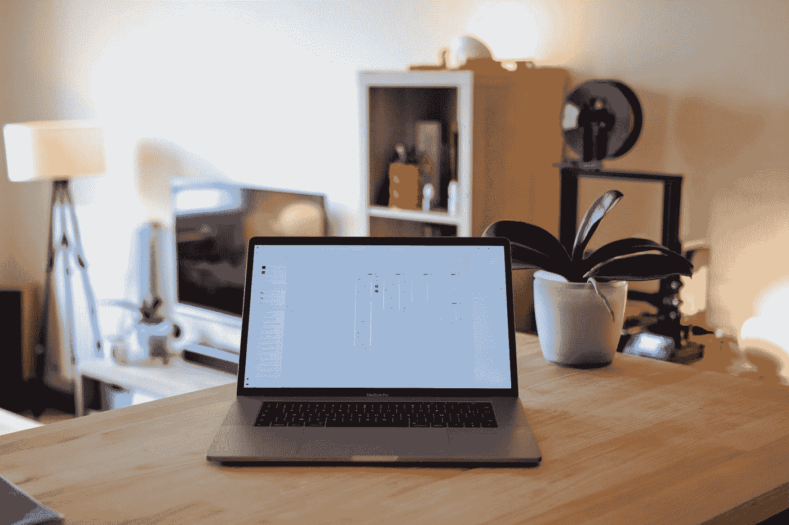
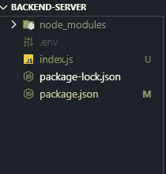
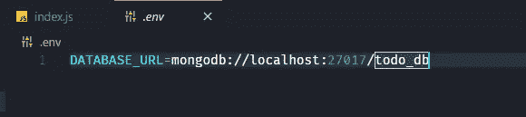
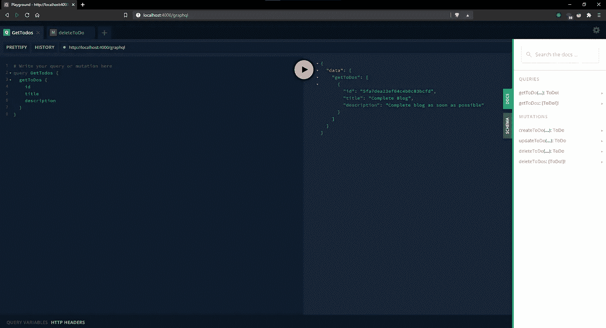

# 使用 GraphQL 和 Node.js 构建一个 ToDo 应用程序

> 原文：<https://javascript.plainenglish.io/build-a-todo-app-using-graphql-and-node-js-59d16feef60f?source=collection_archive---------1----------------------->

## 第 1 部分:实现后端服务

让我们使用 GraphQL 和 Node.js 构建一个 ToDo MERN 应用程序，在这一部分，我们将实现一个后端服务。

Photo by [Elise Bouet](https://unsplash.com/@elisebouet?utm_source=medium&utm_medium=referral) on [Unsplash](https://unsplash.com?utm_source=medium&utm_medium=referral)

## 介绍

在本文中，我们将使用 GraphQL 创建一个后端服务，即 Apollo 服务器和 MongoDB 数据库。

我们将使用`MongoDB`数据库，所以请确保您将它安装在本地，或者您可以使用 MongoDB 的免费[云](https://www.mongodb.com/cloud/atlas)服务。

通过创建此应用程序，您将了解到

*   如何设计 GraphQL 模式？
*   如何设计查询和变异？
*   如何使用 GraphQL API 构建 CRUD app？

## 初始设置

使用`npm`创建一个新项目

`npm init -y`

该命令将在`package.json`中设置默认值

创建项目后，安装必要的依赖项

`npm i apollo-server mongoose graphql dotenv`

## 创建初始文件

在项目的根目录下创建一个名为`server.js`的新文件。

不要忘记添加`.env`文件。

Root Directory Structure

在这个文件中，我们正在设置我们的服务器。目前，我们使用虚拟数据进行测试。

这里，我们定义了 GraphQL 模式和解析器。

每个 GraphQL 服务器都使用一个**模式**来定义客户端可以查询的数据结构。

**解析器**告诉 GraphQL 服务器获取与特定类型相关的数据。

注意:目前我们使用一个**虚拟模式。**

Apollo Server running for testing

让我们运行并检查，运行这个文件`node server.js`

## 设置数据库

这里`process.env.DATABASE_URL`在`.env`文件中保存实际的数据库服务器地址。

.env

## 设计猫鼬模型

Mongoose Model

## 为 ToDo 设计 GraphQL 架构

GraphQL schema

A `type`定义了数据库中每个待办事项的可查询字段，而`input`定义了数据的输入结构。

`Mutation`类型定义写操作的入口点。

GraphQL 支持开箱即用的标量类型:`ID`、`String`、`Boolean`、`Int`和`Float`。

查询和变异接受标量和自定义类型的参数。

## 创建解析器

Resolvers

解析器将接受来自客户端的参数。

## 运行应用程序

使用`node server.js`运行应用程序

正如你在这里看到的。在 IDE 中为您创建的文档。

GraphQL Server running

GraphQL ToDo app

## 代号:[https://github.com/pprathameshmore/todo-graphql-mern-app](https://github.com/pprathameshmore/todo-graphql-mern-app)