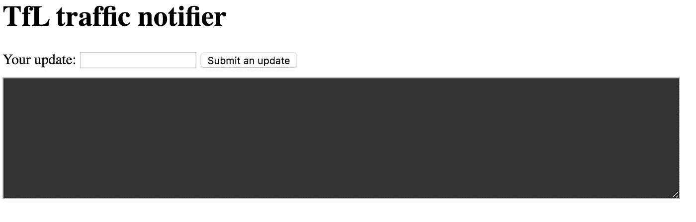
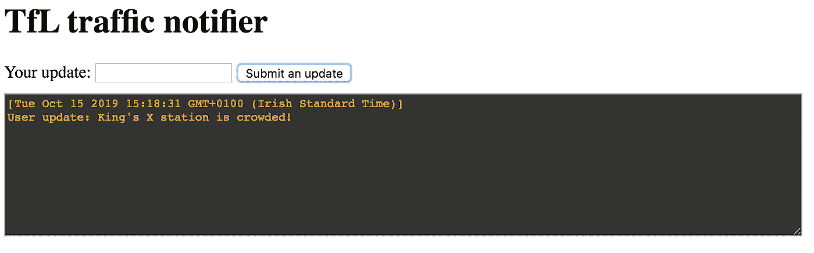
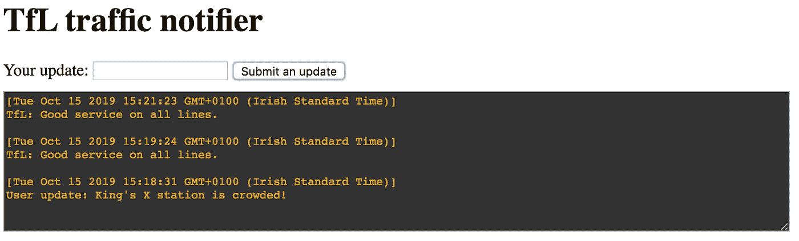

# 用 TensorFlow.js，Ably 和 HTML 搭建一个交通预警 App

> 原文：<https://javascript.plainenglish.io/build-a-traffic-alert-app-with-just-one-html-ably-tensorflow-741c40582672?source=collection_archive---------2----------------------->


在这篇博文中，我们将展示 Ably 和 Tensorflow.js 的强大功能。这是一个演示，在生产中你可能不会这样做，但你可以感受到 Ably 是多么强大，以及你如何通过几行代码使用深度学习模型。

# 什么是干练？

巧妙地提供 API 来轻松处理大量实时发布/订阅。在 Ably 中，您可以从 Realtime、REST、MQTT 或 SSE 库中进行选择，这些库在大多数流行的语言和框架中实现。关于 Ably 的更多信息，你可以访问他们的[网页](https://www.ably.io/)。

如果你想跟随这个演示并建立你自己的，你必须注册一个免费的 Ably 账户，并在这里得到一个 API 密匙。

# 我们开始吧！

首先，我们需要 html 中的所有基本组件。我们将从这个文件作为框架开始:

```
<html>
  <body>
    <h1>TfL traffic notifier</h1>
    <p></p>
<div>
    Your update: <input type="text" id="message-text" value=""> <button id="send-message">Submit an update</button>
    </div>
    <textarea id="result" rows="10" style="width: 60%; margin-top: 10px; font-family: courier, courier new; background-color: #333; color: orange" disabled=""></textarea>
    </div>
  </body>
</html>
```

很简单很基础。我们更感兴趣的是功能，而不是图形设计。我们有一个供用户输入的输入框和一个提交更新的按钮。下面的黑色文本区域是所有用户的消息。



# 巧妙地实时使用

我们将使用 Ably Realtime WebSocket 连接为更新后的表单用户发布和订阅一个通道。(确保您有 API 密钥)将它放在`</body>`之后和`</html>`之前:

```
<!-- Include the latest Ably Library  -->
  <script src="[https://cdn.ably.io/lib/ably.min-1.js](https://cdn.ably.io/lib/ably.min-1.js)"></script><!-- Instance the Ably library  -->
  <script type="text/javascript">// Set up Ably's channel
    var realtime = new Ably.Realtime(<your API key>; // put your API key here
    var channel = realtime.channels.get("my_channel");// Helper function for getting the timestamp
    function get_current_time(){
        return '[' + Date().toLocaleString() + ']\n';
    }// Getting the update from users
    channel.subscribe(function(msg) {
        document.getElementById("result").innerHTML = (get_current_time() + "User update: " + msg.data + "\n\n") + document.getElementById("result").innerHTML;
    });
    document.getElementById("send-message").addEventListener("click", function(){
        let input_text = document.getElementById("message-text").value;
        if (input_text != ""){
                        channel.publish("update", input_text);
                        document.getElementById("message-text").value = ""
}
    })
  </script>
```

在这里我们:

1.  包括 Ably 库
2.  巧妙地连接到(记得用您的 API 密钥替换)
3.  订阅我的频道，如果有更新，将其添加到文本中
4.  当用户输入更新并点击按钮时，它将发布到 my_channel

现在，试试我们的应用程序。在输入框中放一些东西，然后点击按钮。



你可以看到更新出现，你也可以为多个用户做一个实验。在另一个窗口或选项卡中打开 html 文件，然后重复发布更新。您可以看到“其他用户”也将收到更新。

我还想指出，像我们这样使用 API 密钥在生产代码中不是一个好的做法，因为它会将您的密钥暴露给公众。为了进一步了解如何正确地做到这一点，请参考 [Ably 的文档](https://www.ably.io/documentation/core-features/authentication#token-authentication)。

# TfL 信息枢纽

现在我们将添加 TfL 更新。Ably [Hub](https://www.ably.io/hub) 提供免费、开源的数据流供任何人使用(不同的许可限制可能适用于不同的数据源)。如果你有捐赠的来源，请联系 Ably 的团队。

使用 Ably Hub 与使用 Ably Realtime 非常相似，您也可以参考本页中的[以获取特定于 TfL 数据的文档。添加新频道:](https://www.ably.io/hub/products/10#documentation)

```
var tfl_channel = realtime.channels.get("[product:ably-tfl/tube]tube:disruptions");
```

这将在任何线路出现中断时通知我们。如果没有，我们将得到一个空列表。然后，我们可以检查我们的更新，看看它是否包含有关中断线路的信息:

```
// Getting the update form TfL streamer
    tfl_channel.subscribe(function(msg) {
        if (msg.data.length == 0) {
            document.getElementById("result").innerHTML = (get_current_time() + "TfL: Good service on all lines." + "\n\n") + document.getElementById("result").innerHTML;
        }else{
            msg.data.forEach(function(each_issue){
                document.getElementById("result").innerHTML = (get_current_time() + each_issue.description + "\n\n") + document.getElementById("result").innerHTML;
            })
        }
    });
```



# 有毒检测器— Tensorflow.js

到目前为止所有用户无论说什么都可以更新，这是不好的。我们能阻止人们向我们的频道发布有害更新吗？让我们尝试使用 AI 并检测有毒评论并阻止它们。这里我们将使用一个预先训练好的模型，这非常简单，只需添加 Tensorflow.js 和模型:

```
<!-- Include tf model -->
  <script src="[https://cdn.jsdelivr.net/npm/@tensorflow/tfjs](https://cdn.jsdelivr.net/npm/@tensorflow/tfjs)"></script>
  <script src="[https://cdn.jsdelivr.net/npm/@tensorflow-models/toxicity](https://cdn.jsdelivr.net/npm/@tensorflow-models/toxicity)"></script>
```

并更新发布功能:

```
// When the user send an update, check if it is a toxic comment, publish if it is not.
    document.getElementById("send-message").addEventListener("click", function(){
        let input_text = document.getElementById("message-text").value;
        let threshold = 0.9;
        var all_prediction = false;
        if (input_text != ""){
            toxicity.load(threshold).then(function(model){
                model.classify(input_text).then(function(predictions){
                    predictions.forEach(function(each_prediction){
                        let results = each_prediction.results
                        if (results[0].match){
                            all_prediction = true;
                            return 0;
                        }
                    });
                    if (all_prediction){
                        alert("Please be nice.")
                    }else{
                        channel.publish("update", input_text);
                        document.getElementById("message-text").value = ""
                    }
                });
            });
        }
    })
```

在这里，我们将阈值设置为 0.9，因此如果我们的模型非常确信它包含任何形式的有毒文本，它将阻止发布，而是提醒用户要友好。


试一试，你会发现我们的信息速度大大降低。Ably 是一个快速的 API，因为它使用 WebSocket，更新几乎是即时的。然而，通过人工智能模型进行预测需要一点时间，并且在性能方面并不理想。也许我们不应该在前端做所有的事情！

我希望你玩得开心！要查看完整的 html 文件，请参考 GitHub 上的[文件](https://github.com/Cheukting/ably-tensorflow-demo/blob/master/ably%2Btensorflow_example.html)