# 用纯 JavaScript 构建一个 8 字谜游戏

> 原文：<https://javascript.plainenglish.io/build-an-8-puzzle-game-with-pure-javascript-efe424bc252a?source=collection_archive---------0----------------------->

## 通过有趣的项目提高您的 JavaScript 技能

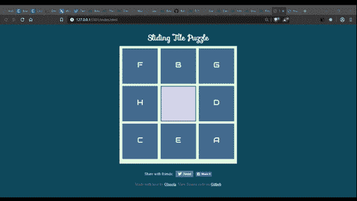

What we will be creating!

*本帖最早出现在我的* [*个人博客*](https://medium.com/javascript-in-plain-english/understanding-javascript-execution-context-call-stack-and-stack-overflow-157b7b358e88)

嘿哟！在这篇文章中，我们将用基本的网页设计技巧来创建一个游戏。你需要的只是 HTML、CSS 和 JavaScript 的基础知识。我们正在做的游戏是流行的 8 字谜游戏。

它由 9 块瓷砖组成，其中 8 块填满了内容，最后一块是空的。要解决这个难题，玩家必须重新排列瓷砖。

打开您最喜欢的文本编辑器，我正在使用 VSCode，并创建以下文件:

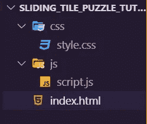

Project folder structure

现在我们用一个无序列表创建一个 div 容器，在`index.html`中有 9 个列表元素:

现在，让我们添加一些样式。首先，我通过使用`*`选择页面上的每个元素来移除默认填充和边距。
我还把主体做成一个 flex 容器，这样我们就可以使用 flexbox 来设计页面的样式。容器 div 的高度和宽度为 500px，有一个很好的背景，与主体的背景相匹配。

这条线`margin: 10px auto`；居中对齐容器 div，在顶部和底部给它 10px 的边距，在左侧和右侧给它“自动”(相等)的边距。

`/css/style.css`

```
* {
    padding: 0;
    margin: 0;
    box-sizing: border-box;
}body {
    display: flex;
    background-color: #114B5F;
    text-align: center;
    flex-direction: column;
    padding-top: 2%;}#container {
    width: 500px;
    height: 500px;
    background: #E4FDE1;
    margin: 10px auto;
}
```

在你最喜欢的浏览器中预览`index.html`，你应该也有这个:

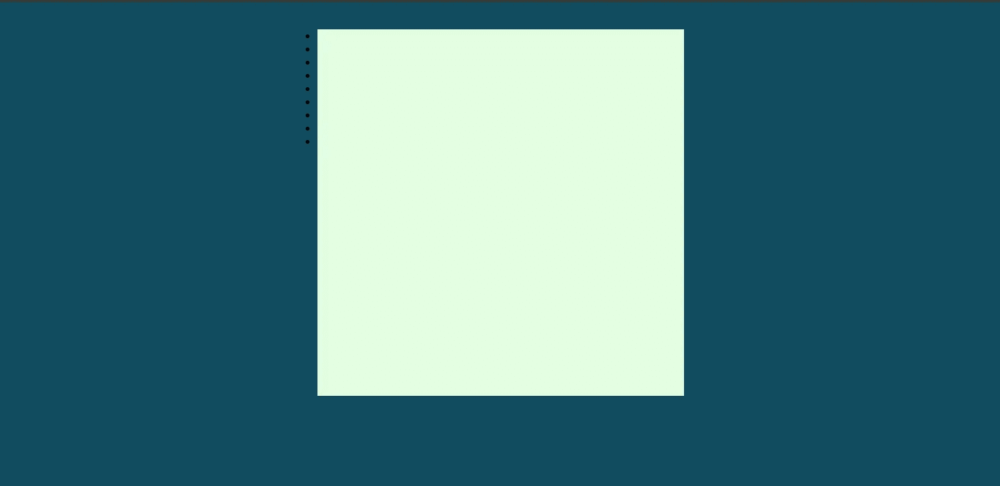

现在，让我们来设计列表项的样式。我将使`ul`也成为一个 flex 容器，并且均匀地分隔列表项:

**注意** : *一些用户报告说* `*flexbox*` *在 FireFox 和 edge 浏览器上对齐不一致，我建议在 Google Chrome 浏览器中查看这个项目或为您的特定浏览器找到一个修复程序。*

`/css/style.css`

```
* {
    padding: 0;
    margin: 0;
    box-sizing: border-box;
}body {
    display: flex;
    background-color: #114B5F;
    text-align: center;
    flex-direction: column;
    padding-top: 2%;}#container {
    width: 500px;
    height: 500px;
    background: #E4FDE1;
    margin: 10px auto;
}ul {
    display: flex;
    flex-wrap: wrap;
    list-style-type: none;
    justify-content: space-evenly;
    font-family: 'Audiowide';
    color: #E4FDE1;
}
ul li {
    background: #456990;
    width: 30%;
    height: 150px;
    border: 1px solid #028090;
    margin-top: 10px;
    text-align: center;
    font-size: 2rem;
    padding-top: 3rem;
}
```

再预览一下`index.html`，你应该有这样的东西:

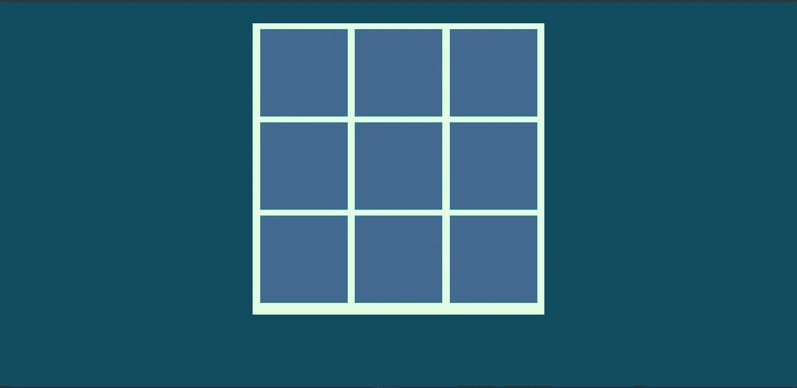

很好。

在 8 块滑动拼图中，第 9 块拼图应该是空的，所以我们将创建一个类来设计空拼图的样式。在此之前，让我们给出列表项的内容，更新`index.html`以包含以下内容(我已经包含了`Audiowide` 字体的链接)；

`/index.html`

```
<!DOCTYPE html>
<html lang="en"><head>
    <meta charset="UTF-8">
    <meta name="viewport" content="width=device-width, initial-scale=1.0">
    <meta http-equiv="X-UA-Compatible" content="ie=edge">
    <link rel="stylesheet" href="css/style.css">
    <link href='[https://fonts.googleapis.com/css?family=Audiowide'](https://fonts.googleapis.com/css?family=Audiowide') rel='stylesheet'>
    <title>Sliding Tile Puzzle</title>
</head><body>
    <div id="container">
        <ul>
            <li>A</li>
            <li>B</li>
            <li>C</li>
            <li>D</li>
            <li>E</li>
            <li>F</li>
            <li>G</li>
            <li>H</li>
            <li class="empty"></li>
        </ul>
    </div></body>
<script src="js/script.js"></script></html>
```

将以下内容添加到样式表中，以设置`empty` 图块的样式:

`/css/style.css`

```
...
.empty {
    background: #DAD4EF;
    border: 2px solid #114B5F;
}
...
```

再次预览:

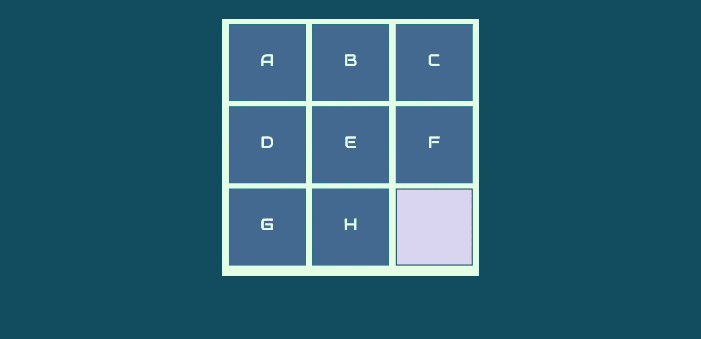

让我们在容器前添加一个漂亮的标题:

```
...
<body>
    <h1>Sliding Tile Puzzle</h1>
    <div id="container">
        <ul>
            <li>A</li>
            <li>B</li>
...
```

以下是标题的样式:

`/css/style.css`

```
h1 {
    color: #E4FDE1;
    font-family: 'Sofia';
    text-align: center;

}
```

我在标题部分包含了一个指向`Sofia` 字体的链接:

`/index.html`

```
...
<link href='[https://fonts.googleapis.com/css?family=Sofia'](https://fonts.googleapis.com/css?family=Sofia') rel='stylesheet'><link href='[https://fonts.googleapis.com/css?family=Audiowide'](https://fonts.googleapis.com/css?family=Audiowide') rel='stylesheet'>
    <title>Sliding Tile Puzzle</title>
...
```

再次预览网页，您应该看到:


Boomshakala！游戏的设计已经完成，现在让我们用 JavaScript 赋予它生命吧！

# 用 JavaScript 实现功能

要玩这个游戏，玩家必须将方块拖放到可用的空方块中。我们将使用 [HTML 拖放 API](https://developer.mozilla.org/en-US/docs/Web/API/HTML_Drag_and_Drop_API) 。

这个 api 让我们把一些元素**做成可拖动的**和一些**做成可放下的**，为此我们必须在脚本文件中定义拖放事件处理程序。打开`script.js`，填入以下内容:

`/js/script.js`

```
const dragstart_handler = ev => {
    console.log("dragstart")
    ev.dataTransfer.setData("text/plain", ev.target.id)
    ev.dataTransfer.dropEffect = "move";
}
```

`dragstart_handler`处理用户开始拖动时发出的事件`ev` 。因为我们将在拖动时传输数据，所以我们获取附加到元素的数据，并将其添加到`dataTransfer` 对象，该对象用于保存在拖放操作中被拖动的数据。

用以下内容更新 script . js:
`/js/script.js/`

```
...
const dragover_handler = ev => {
    console.log("dragOver");
    ev.preventDefault();
}const drop_handler = ev => {
    console.log("drag")
    ev.preventDefault();
    // Get the id of the target and add the moved element to the target's DOM
    const data = ev.dataTransfer.getData("text/plain");
    ev.target.innerText = document.getElementById(data).innerText;
}const dragend_handler = ev => {
  console.log("dragEnd");
  // Remove all of the drag data
  ev.dataTransfer.clearData();
}
```

`dragover_handler`事件处理程序是一个简单的函数，我们用它执行的唯一重要操作是调用`preventDefault()`来阻止对该事件的额外事件处理。我们记录该事件，以便我们可以跟踪它是何时触发的。

在`drop_handler`事件处理程序中，我们获取存储在`dataTransfer` 对象中的`data` ，然后将它“转移”到我们要放入的元素:

`ev.target.innerText = document.getElementById(data).innerText`

在`dragend_handler`中，当拖动事件结束时，我们清除存储在`dataTransfer`中的数据。

现在，我们需要更新`index.html`文件，我们将使空磁贴(‘H’磁贴)之前的列表项可拖动，并使空磁贴可放下。

`/index.html`

```
...
<ul>
            <li>A</li>
            <li>B</li>
            <li>C</li>
            <li>D</li>
            <li>E</li>
            <li>F</li>
            <li>G</li> <li id="li8" draggable="true" ondragstart="dragstart_handler(event)" ondragend="dragend_handler(event)">H</li> <li id="li9" class="empty" ondrop="drop_handler(event);" ondragover="dragover_handler(event);"></li> </ul>
...
```

我给了两个列表项 id，因为在我们的事件处理程序中，我们必须通过它们的 id 来获取它们的内容(参见`dragstart_handler`中的`ev.dataTransfer.setData(“text/plain”, ev.target.id)`)。

“H”磁贴被制作成`draggable`，我还将它的`ondragstart`和`ondragend`属性设置为相关的事件处理程序。
空磁贴变成了`droppable`，它现在拥有了`ondrop` 和`ondragover` 事件处理的属性。

预览网页，将“H”标题拖放到空白标题上:

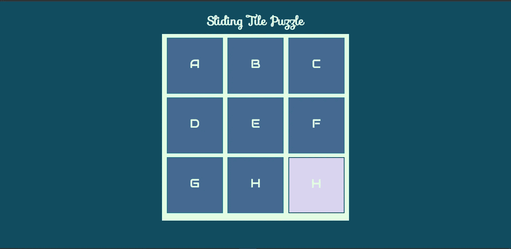

拖放功能可以工作，但是有一个问题。删除“H”图块的内容后，我们现在有两个包含“H”的图块。在删除操作之后，我们需要清空第一个图块。稍后，我们将在拖放操作后更改图块的样式。

要在拖放操作后清空源切片，请按如下方式更新脚本文件:

`/js/script.js`

```
...
const drop_handler = ev => {
    console.log("drag")
    ev.preventDefault(); // Get the id of the target and add the moved element to the target's DOM    
const data = ev.dataTransfer.getData("text/plain"); ev.target.innerText = document.getElementById(data).innerText; document.getElementById(data).innerText = "";
}
...
```

# 将所有功能转移到 JavaScript

这些图块当前包含 html 文件中定义的内容，我们将删除这些内容并用 JavaScript 填充它们。按如下方式更新`index.html` 文件:

`/index.html`

```
...
<ul>
            <li></li>
            <li></li>
            <li></li>
            <li></li>
            <li></li>
            <li></li>
            <li></li>
            <li></li>
            <li></li>
        </ul>
...
```

在`script.js`中键入以下内容:

`js/script.js`

首先，我使用`querySelectorAll`将所有的`li` 项放入一个`node list`(类似于数组的东西)中。`letters`数组有一个字母列表，最后一项是空字符串，这是用于空图块的。

在`setId`函数中，我通过对每个列表项调用`setAttribute()`函数来为它们设置 id，id 由前缀`li`和 for 循环的索引组成。

在`fillGrid`函数中，我遍历所有的`li`项，同时跟踪它们的索引`i`，我用来自`letters`数组的一个元素填充每个`list item`，用索引`i`访问它。

如果你预览网页，你已经像我们之前一样填充了瓦片，但是现在我们是通过 JavaScript 来完成的。酷:)(还不用担心空磁贴的显示)

## 随机化瓷砖

瓷砖是用字母 A-H 的内容填充的，使用当前的脚本，我们将始终拥有相同的瓷砖配置。我们想要的是瓷砖应该被洗牌，这样我们总是得到一个随机的配置，然后必须重新排列来解决这个难题。

## 填写前先打乱字母排列

我们怎样才能写一个函数来洗牌呢？该函数的算法如下
—遍历数组
—对于循环中的每个索引 I，选择另一个随机索引 j
—交换索引 I 和 j 处的元素

停下来。！！在看到我的实现之前，尝试实现这个算法。

`js/script.js`

你有没有想到类似的东西？

注意，在洗牌之前，我在洗牌函数中对数组做了一个`copy`，这确保了我们不会改变(又名`mutate`)传入的数组，而是返回一个新的洗牌后的数组。

现在，更新`fillGrid`函数，在填充瓷砖之前首先洗牌:

`js/script.js`

现在，当您刷新页面时，每次都会获得一个新的磁贴配置！

## 设置可拖放和可拖动的图块

现在，我们将编写一个函数，它将接受一个列表中的`li`项，找到内容为空的项，并使其可被丢弃。

我们还将编写一个函数，使页面上的所有磁贴都可以拖动，我们稍后将更改该函数，以便只有空磁贴的顶部、底部、左侧和右侧的磁贴才可以拖动。

在这些函数之前，我们将创建一个`setUp`函数，从这里我们将进行所有的函数调用。将我们目前拥有的所有函数调用转移到`setUp`函数中。

`js/script.js`

注意，我已经创建了一个`state` 对象来保存游戏的状态。更新`index.html`文件，以便当主体加载时，调用`setUp` 函数:

`/index.html`

```
...
<body onload="setUp()">
    <h1>Sliding Tile Puzzle</h1>
...
```

如果您预览页面，您会注意到您可以将磁贴拖放到空磁贴上，但是当您这样做时，磁贴会被填满，但它仍然是空磁贴，并且是您可以拖放磁贴的唯一磁贴。

我们现在将更新应用程序，这样，当一个空瓷砖从源瓷砖下降，它会变得“填满”,不再下降。请记住，我们使用了`setAttribute(key, value)`函数来设置属性，我们将使用相同的函数来删除属性，我们将把要删除的属性的值设置为一个空字符串。然后，我们将使源图块可丢弃并为空:

`/js/script.js`

现在测试应用程序，你会发现每次你拖放一个瓷砖，源成为一个空瓷砖和目的地成为充满！。您还会注意到，您可以拖放与空图块不相邻的图块，稍后我们将解决这个问题。

## 获取游戏状态和维度

每当玩家拖放一个方块时，方块的排列就会改变，我们希望在`state`对象中跟踪这种变化。让我们创建一个获取状态的函数。我们还将创建一个函数，将瓷砖的可视化表示存储为数组的数组。按如下方式更新`script`文件:

`/js/script.js`

`getDimension`函数遍历内容(长度为 9 的字母数组)三次，每次它将三个内容切片并放入一个数组中，这给了我们一个包含 3 个数组的数组。第一个数组代表游戏的第一行，第二个数组代表第二行，第三个数组代表第三行。

这意味着我们现在有了以两种格式存储的游戏状态:`state.content`以线性顺序存储瓷砖(1D 数组)；`state.dimension`将图块存储在 2D 数组中作为其视觉表示。

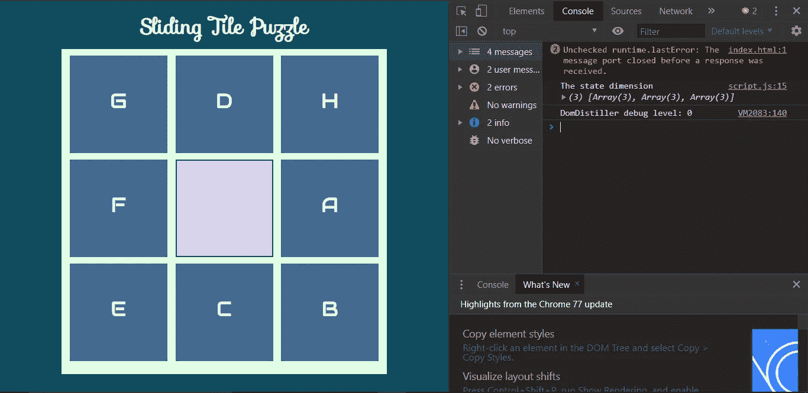

state.content vs state.dimension

在`setUp`函数中，我注销了`getDimension`函数的输出，你会看到它在一个漂亮的 2D 数组中存储了游戏的视觉表现。请注意，我在`setDroppable`函数中添加了一个新行来存储处于 app 状态的**空图块**的索引，`state.emptyCellIndex = i`；这里存储的索引是来自`li`项的 1D 线性数组的索引。

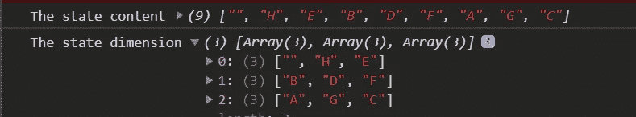

## 获取空单元格

我们需要得到一个空的单元格，这样我们就可以只拖动其相邻的图块。现在我们可以拖动任何瓷砖到空瓷砖，见下图。在每张图片中，只有虚线块(红色)应该是可拖动的:

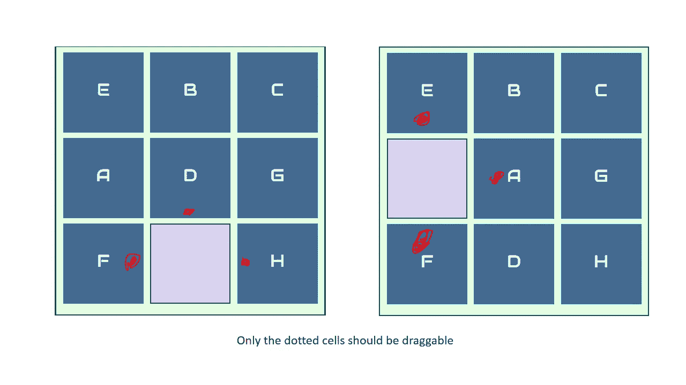

我们将创建一个`getEmptyCell`函数，从`state.dimension`返回空单元格的 2D 位置。我们已经将空单元的索引存储在存储空单元的 1D 索引的`state.emptyCellIndex`中。

## 如何从 1D 指数中获得 2D 头寸

我们将做一些数学运算，以便根据 1D 指数计算空单元格的 2D 位置。游戏的 2D 表示有 3 行 3 列；它总共由 9 块瓷砖组成。 `state.emptyCellIndex`包含空单元的线性索引，由于数组的索引从 0 开始，所以空数组的实际单元号为`state.emptyCellIndex+1`。

为了得到它所在的行，我们将单元格数除以 3(一行中的单元格数)。我们取结果的`ceil` ，这是空值所在的行号。

获取空单元格所在的列是相当棘手的；我们将`emptyCellRow`数字乘以 3，从结果中减去`emptyCellNumber`，然后从 3 中减去总结果。

在`getState`函数之后创建一个`getEmptyCell`函数:

`/js/script.js`

## 仅使与空单元格相邻的图块可拖动

既然我们已经有了一个获取空单元格位置的方法，我们可以只拖动它周围的相邻单元格。空单元格的上方、下方、左侧或右侧可以有一个可拖动的单元格。空单元有时可能不具有所有 4 个相邻边:

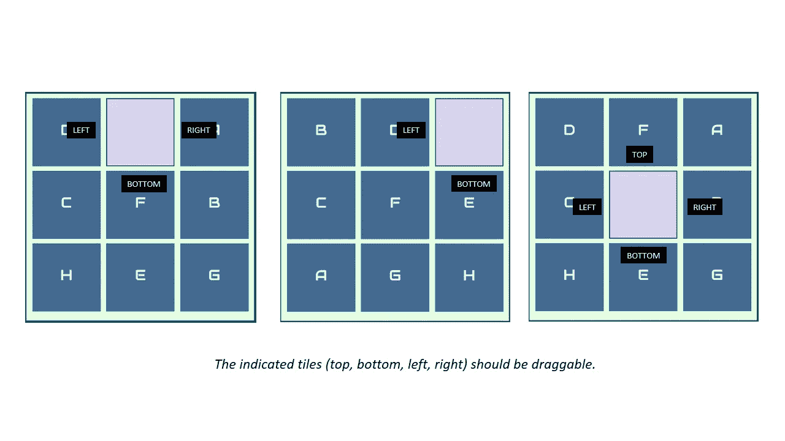

我们如何获得与空瓷砖相邻的瓷砖的指数？让我们举个例子:

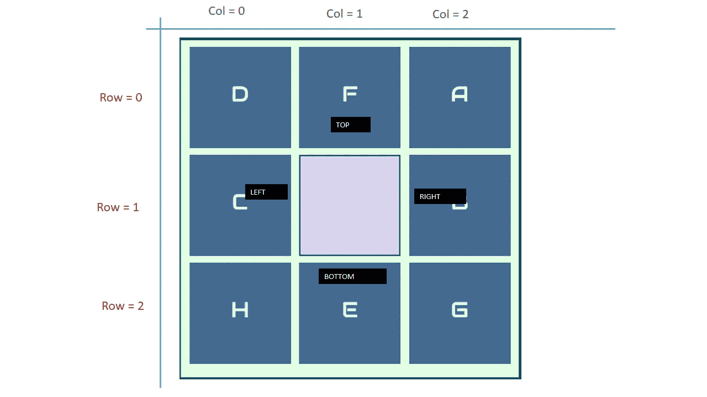

在上面的示例中，空图块位于第 1 行第 1 列。它左边和右边的图块都在同一行 1 上。左边的图块在第 0 列(空图块的行— 1)。右边的图块在第 2 列(空图块行+ 1)。类似地，顶部和底部瓦片与空瓦片在同一列 1 上，但是分别在行 0 和行 2 上。
让我们更新一下`setDraggable`功能:

现在，我们得到相邻的瓷砖，并只使这些瓷砖可拖动。
测试游戏，您会注意到只有与空方块相邻的方块可以拖动。如果你对游戏进行了足够的测试，你将会注意到，一些在空方块相邻时已经可以拖动的方块，在空文件填满后仍然可以拖动。

我们如何解决这个问题？**简单的**:我们需要在每次完成拖拽的时候更新应用状态和维度。按如下方式更新`script`文件:

`js/script.js`

还有一个微妙的问题与我们刚刚解决的问题类似。所有我们在空的时候设置为可丢弃的瓷砖仍然是可丢弃的，即使它们被填满，我们现在将创建一个函数(名为`removeDroppable`)来使瓷砖一旦被填满就不可丢弃。

我们将在`dragend_handler`函数中调用这个函数。在`setDroppable`函数后创建一个`removeDroppable`函数，并在`dragend_handler`函数中调用，如下所示:

`/js/script.js`

## 直到最后一步

游戏几乎完成了，我们现在必须检查用户是否按照正确的顺序排列了方块。在此之前，我们需要考虑 8-puzzle tile 的一个重要性质:**并不是所有的构型都是可解的**。

因为我们是在随机化瓷砖，所以有可能得到一个不可解的配置。我们如何判断给定的谜题实例是否是可解的？

**只有在配置**中*反转*的数量为偶数时，给定的 8 字谜实例才是可解的。

什么是倒置？当一对瓦片处于本应处于正确配置的`reverse` 顺序时，就会发生反转。例如，给定以下配置:

```
[
 ["A", "B", "C"],
 ["D", "", "E"],
 ["H", "F",  "G"]
]
```

构型(H，F)和(H，G)有两个逆，由于逆的个数是两个(偶数)，这个构型将是可解的。为了知道一个给定的构型是否可解，我们计算了反演的次数。我们如何做到这一点？

**简单的**:我们挑选每一个元素，并与它后面的其他元素进行比较，如果第一个元素‘大于’第二个元素，那么我们就遇到了反演。打开`script.js`文件，在`fillGrid`函数之前创建一个`inSolvable`函数，我们还将更新`fillGrid`函数，以便仅在生成的配置可解的情况下填充图块:

`js/script.js`

现在我们确信配置将总是可解的！

# 检查正确的解决方案

我们现在必须检查玩家何时解决了这个难题。我们将创建一个`isCorrect`函数，它将接受`state.content`和`letters`数组，将它们转换成一个字符串，然后比较这两个字符串以检查它们是否相等。在`isSolvable`功能后创建功能:

`js/script.js`

```
...
const isCorrect = (solution, content) => {
    if(JSON.stringify(solution) == JSON.stringify(content)) return true;
    return false;
}
...
```

我们什么时候检查解决方案？在每个拖动事件结束时，我们必须更新`dragend_handler`函数:

尝试游戏，当排列正确时，消息被记录到控制台。我们不希望我们的游戏玩家检查控制台，以了解他们何时解决了难题。我们将创建一个模型，当谜题被解决时会弹出，我将移动得快一点，代码很容易理解:

`index.html`

```
...
<body onload="setUp()">
    <h1>Sliding Tile Puzzle</h1>
    <div id="modal" class="hide">
        <div id="header"><button id="closeBtn" onclick="hideModal()">x</button></div>
        <h1 id="message">You won!</h1>
    </div>
    <div id="container">
...
```

`css/style.css`

`js/script.js`

立即尝试游戏:

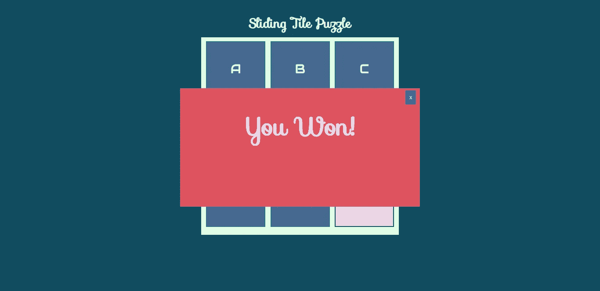

## 恭喜你！！！


哇！这是一个漫长的旅程，我希望你已经学到了一些新的东西，并在构建 8 益智游戏时获得了乐趣。完整的代码在 github [这里](https://github.com/Olusamimaths/8-Puzzle-Game-Js-Tutorial-Files)。

如果你觉得这篇文章有帮助，请分享它，你也可以在 Twitter[@ sola the code](https://twitter.com/solathecoder)上关注我，获取更多精彩的技术文章。

直到我们再次相见，编码快乐！

## **简明英语团队的笔记**

你知道我们有四份出版物和一个 YouTube 频道吗？你可以在我们的主页 [**plainenglish.io**](https://plainenglish.io/) 找到所有这些内容——关注我们的出版物并 [**订阅我们的 YouTube 频道**](https://www.youtube.com/channel/UCtipWUghju290NWcn8jhyAw) **来表达你的爱吧！**