# 结合使用 React 和 Node 构建一个令人惊叹的应用程序

> 原文：<https://javascript.plainenglish.io/build-an-amazing-application-using-react-and-nodejs-together-fad13ab7b49c?source=collection_archive---------0----------------------->

## 了解如何在 Node.js 中创建 Rest API，在 React 中访问它，并在 Redux 中存储结果

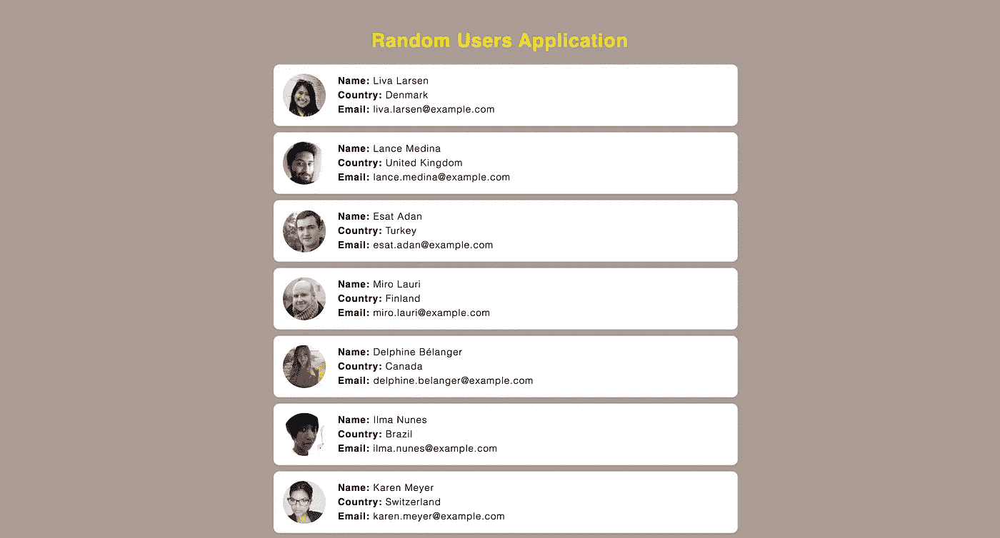

在本文中，我们将看到如何一起使用 React + Node 来创建一个令人惊叹的应用程序。

在这个应用程序中，我们将使用[https://randomuser.me/](https://randomuser.me/)API 在每次刷新时显示十个随机用户。

我们将从我们在上一篇文章[中创建的 React Starter 代码开始](https://medium.com/javascript-in-plain-english/webpack-and-babel-setup-with-react-from-scratch-bef0fe2ae3e7)

因此，首先，从[https://github.com/myogeshchavan97/react_starter](https://github.com/myogeshchavan97/react_starter)克隆存储库代码

一旦项目被克隆，转到该项目并通过运行以下命令安装所有的依赖项

```
npm install
```

我们将使用`Express.js`创建一个新的服务器

使用以下工具安装`express`包

```
npm install express@4.17.1
```

使用安装`nodemon`包

```
npm install nodemon@2.0.2
```

当我们在节点 js 文件中做任何更改时，我们使用`nodemon`来自动重启服务器。

创建一个新的`server`文件夹，并在`server/index.js`中添加以下代码

```
// Section 1
const express = require('express');// Section 2
const app = express();// Section 3
app.get('/', (req, res) => { 
 res.send("<h1>Home page</h1>");
});// Section 4
app.listen(3000, () => {
 console.log('server started on port 3000');
});
```

让我们理解这里发生了什么

1.在第 1 节中，我们添加了快递包导入
2。在第 2 节中，我们调用 express 函数来初始化应用程序
3。在第 3 节中，当我们访问应用程序
4 时，我们通过将 h1 标签添加到响应对象来发送回 HTML 内容。在第 4 节中，我们将在端口`3000`上启动 express js 服务器

现在，您的文件夹结构将如下所示

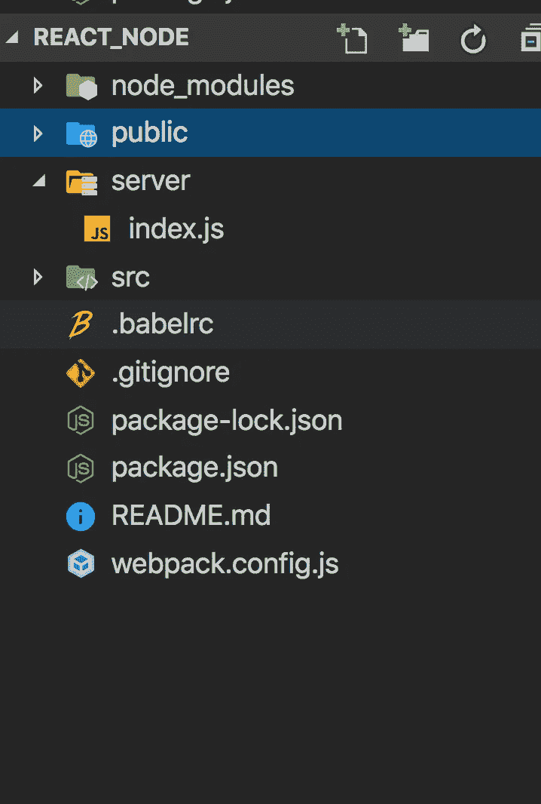

将启动服务器脚本添加到`package.json`的`scripts`部分，如下所示

```
"start-server": "nodemon server/index.js"
```

现在，你的`package.json`将看起来像这样

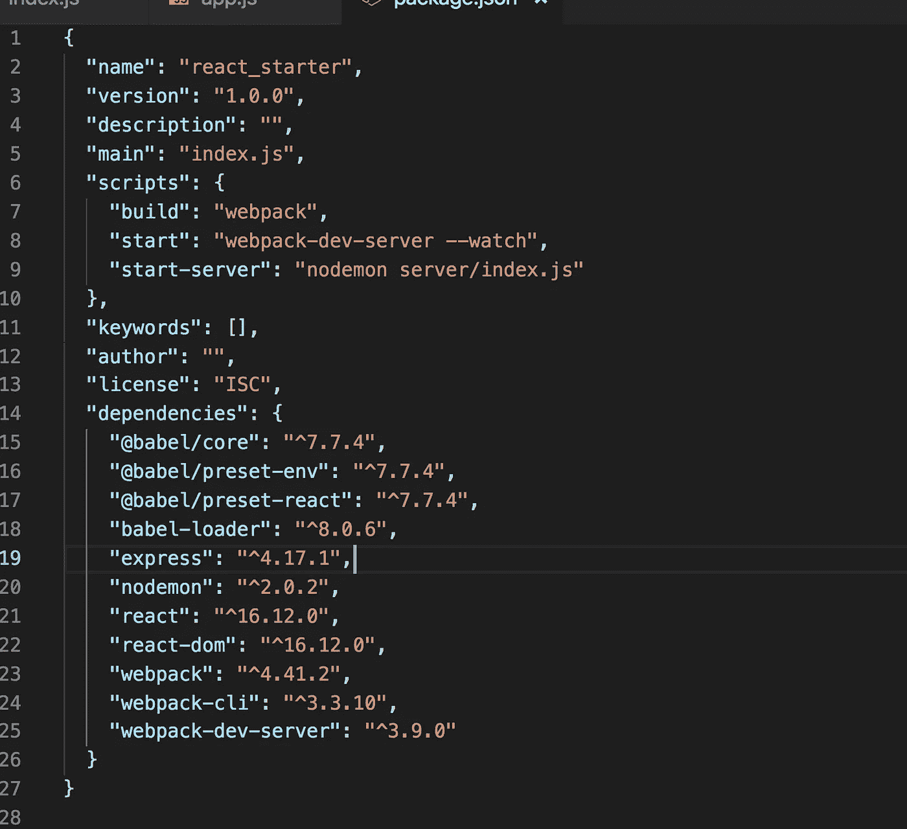

现在，通过从终端执行以下命令来启动`express`服务器

```
npm run start-server
```

现在，通过导航到 [http://localhost:3000/](http://localhost:3000/) 来访问应用程序

现在，您可以看到如下所示的输出

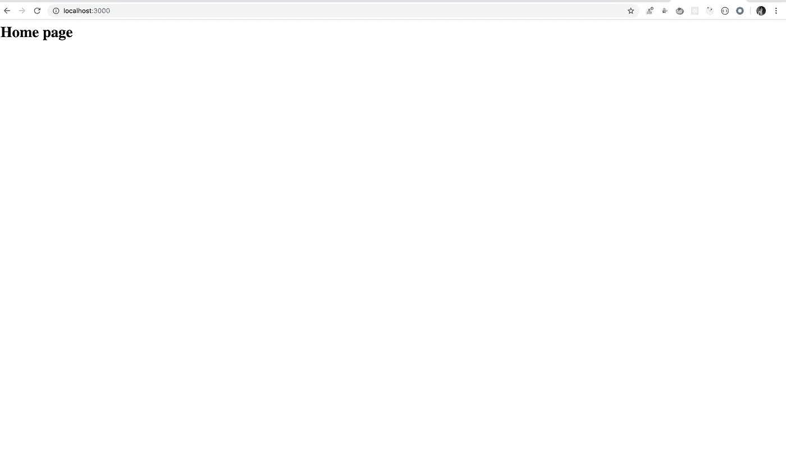

现在，我们将使用`axios`从[https://randomuser.me/](https://randomuser.me/)API 中随机获取用户

因此，使用以下方法安装`axios`包

```
npm install axios@0.19.0
```

在`server/index.js`中增加`axios`的导入语句为

```
const axios = require('axios');
```

并添加以下代码来获取列表并将其发送回来作为响应

```
app.get('/users', (req, res) => {
 axios.get('[https://randomuser.me/api/?page=1&results=10](https://randomuser.me/api/?page=1&results=10)')
  .then(response => {
    res.send(response.data);
  });
});
```

现在你的`index.js`将看起来像这样

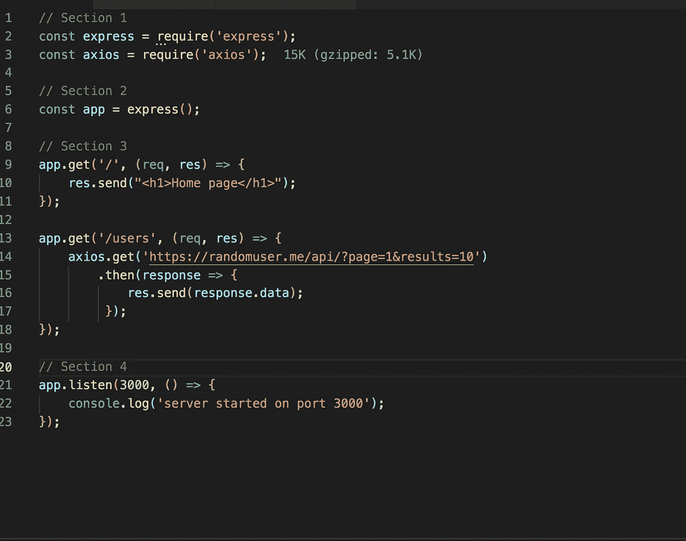

您可能已经注意到，当您在`index.js`中保存上述代码时，`express`服务器会自动重启。
如果没有自动重启，可以再次执行`npm run start-server`

现在导航到[http://localhost:3000/users](http://localhost:3000/users)，您将看到来自 API 的 JSON 响应，如下所示

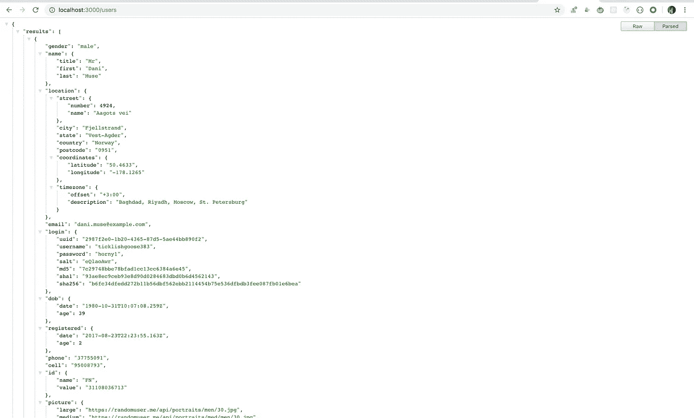

如果你想以上述格式化的方式查看 JSON 响应，你可以从[这里](https://chrome.google.com/webstore/detail/json-formatter/bcjindcccaagfpapjjmafapmmgkkhgoa?hl=en)安装 chrome 的`JSON Formatter`扩展

现在，我们将了解如何在 react 代码中使用 Node.js API。

在`src/app.js`文件中添加`axios`导入为

```
import axios from 'axios';
```

并在文件中添加以下代码。

```
componentDidMount() {
 axios.get('[http://localhost:3000/users](http://localhost:3000/users)')
  .then(response => {
    console.log(response.data);
  })
}
```

现在，您的`app.js`文件将如下所示

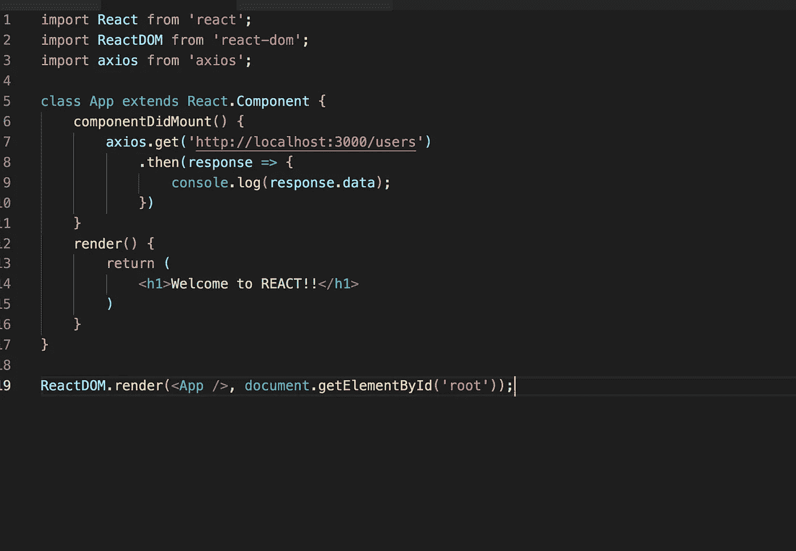

现在，打开另一个终端，使用

```
npm run start
```

如果你正在使用 Visual Studio 代码，你可以从 VS 代码的`terminal -> New Terminal`菜单中打开一个终端

如果您现在通过导航到 [http://localhost:8080/](http://localhost:8080/) 并打开控制台来访问应用程序，您将在控制台中看到如下所示的错误

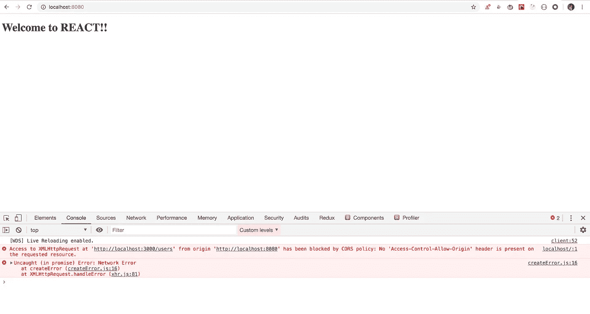

这是因为浏览器不允许访问在另一个端口上运行的应用程序的数据，因为我们在端口 8080 上运行 react 应用程序，在端口 3000 上运行 Node.js 应用程序。

这是出于安全原因和跨域策略。

所以要解决这个问题，我们需要安装`cors` npm 包并在我们的`server/index.js`文件中使用它，这样 Node.js 服务器将允许任何应用程序访问它的 API。

> *不要担心，我们将在本文后面的*中看到如何在不使用 cors 的情况下使用 node . js*API*

因此，现在，通过运行以下命令来安装`cors`包

```
npm install cors@2.8.5
```

安装完成后，转到`server/index.js`并将导入添加为

```
const cors = require('cors');
```

并将其添加为 express 中间件，使用

```
app.use(cors());
```

现在你的`index.js`将看起来像这样

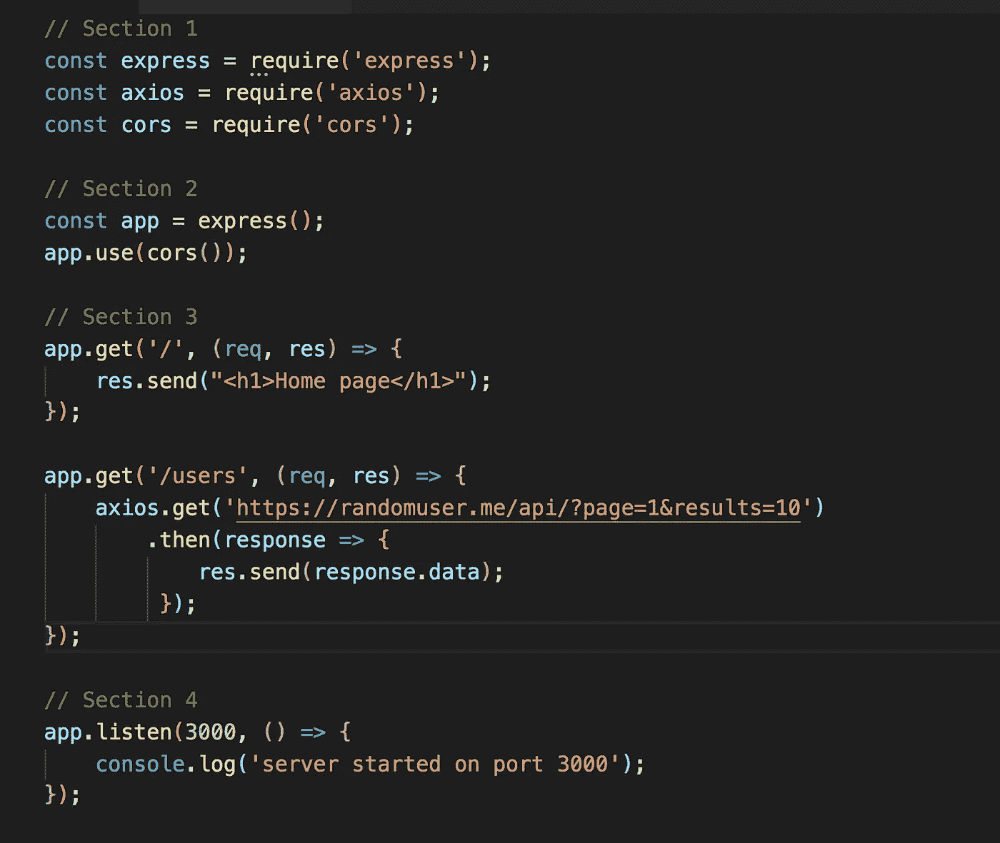

现在使用以下命令停止并重启 Node.js 服务器和 react 应用服务器

```
npm run start-server
npm run start
```

现在，如果您使用 [http://localhost:8080/](http://localhost:8080/) 访问 react 应用程序，

您将在控制台中看到 Node.js API 结果，如下所示

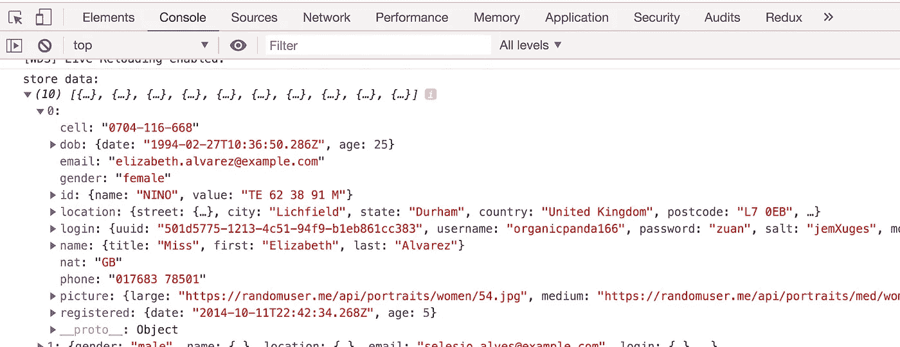

> 哇，我们已经从 react 应用程序访问了我们的 Node.js API。

现在我们将看到如何使用 redux 将 API JSON 数据存储在 store 中，并以一种漂亮的格式在 UI 上显示用户数据
,让我们深入了解一下

停止 react 应用服务器，并从终端运行以下命令来安装 redux

```
npm install redux@4.0.4
```

现在，在`src`文件夹中创建`actions`和`reducers`文件夹，并在这两个文件夹中创建`users.js`文件

现在，您的文件夹结构将如下所示

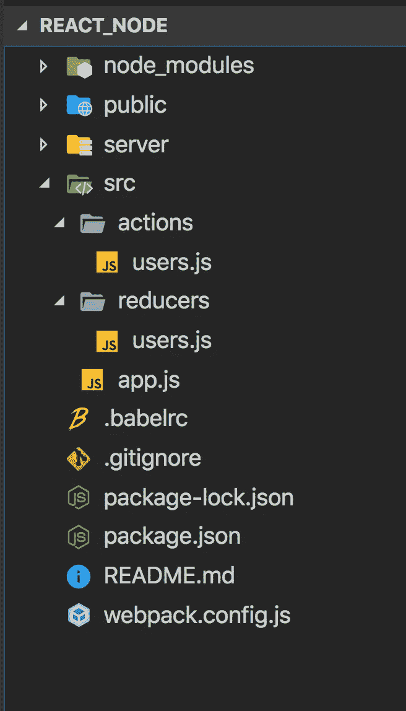

在`actions/users.js`文件中添加以下动作

```
export const addUsers = (users) => {
 return {
  type: 'ADD_USERS',
  users
 };
};
```

并在`reducers/users.js`中添加以下代码

```
const usersReducer = (state = [], action) => {
 switch(action.type) {
  case 'ADD_USERS':
   return [...state, ...action.users];
 }
};export default usersReducer;
```

创建一个`store`文件夹并添加创建一个新文件`store.js`并在其中添加以下内容

```
import { createStore } from 'redux';
import usersReducer from '../reducers/users';const store = createStore(usersReducer);store.subscribe(() => {
 console.log('store data:', store.getState());
});export default store;
```

这里，我们添加了`store.subscribe`方法，当我们调度任何动作时，它将被触发，我们将能够使用`store.getState`方法查看更新的商店数据

现在打开`src/app.js`,将商店和用户操作文件的导入添加为

```
import store from './store/store';
import { addUsers } from './actions/users';
```

现在我们将分派`addUsers`动作，并将来自`then`块中`axios`调用结果的数据发送给用户

```
axios.get('[http://localhost:3000/users](http://localhost:3000/users)')
 .then(response => {
  console.log(response.data);
  store.dispatch(addUsers(response.data.results));
})
```

现在你的`src/app.js`将看起来像这样

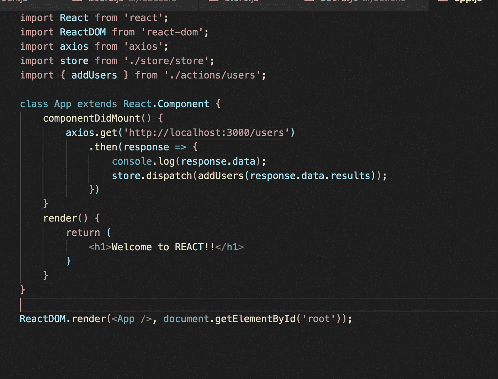

现在使用以下命令启动 react 应用程序

```
npm run start
```

您将看到用户被添加到商店中，如下所示

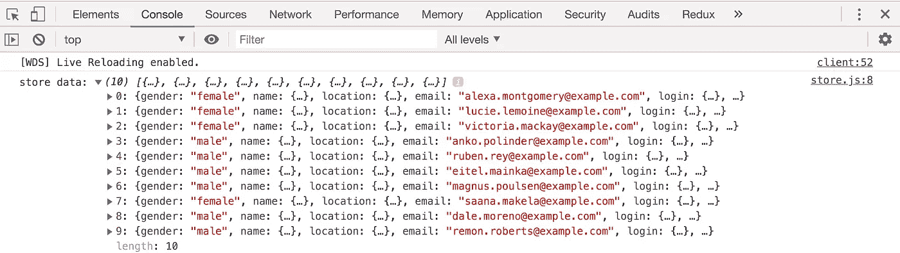

恭喜，我们已经在 redux 商店中添加了用户数据。现在我们将看看如何在 UI 上显示数据。

为此，我们将安装`react-redux`包，它将允许我们访问不同组件中的商店数据。

使用以下命令安装 npm 软件包

```
npm install react-redux@7.1.3
```

`react-redux`库提供了`Provider`组件，我们在其中传递 redux 存储和`connect`方法，使用它们我们可以访问任何组件中的存储数据

在`src`文件夹中创建一个名为`components`的新文件夹，并在其中创建一个新文件`Header.js`。在其中增加以下内容

```
import React from 'react';const Header = () => {
 return <h1>Random Users Application</h1>;
};export default Header;
```

现在将`src/app.js`中的`Header`组件导入为

```
import Header from './components/Header';
```

并将呈现方法更改为

```
render() {
 return (
  <div>
   <Header />
  </div>
 )
}
```

将`src/app.js`中`react-redux`的进口增加为

```
import { Provider } from 'react-redux';
```

并将`reactDOM.render`方法从

```
ReactDOM.render(<App />, document.getElementById('root'));
```

到

```
ReactDOM.render(
 <Provider store={store}>
  <App />
 </Provider>,
document.getElementById('root'));
```

在这里，我们将 store prop 添加到`Provider`组件，分配我们的 redux store，并在其中添加 App 组件。所以现在可以在 App 组件中包含的任何组件中使用`react-redux`的`connect`方法来访问 Redux store 数据。

在`components`文件夹中创建一个`User.js`文件，并在其中添加以下内容

```
import React from 'react';const User = ({ name, location, email, picture }) => {
 return (
  <div>
   <div>
    
   </div>
   <div><strong>Name:</strong> {name.first} {name.last}</div>
   <div><strong>Country:</strong> {location.country}</div>
   <div><strong>Email:</strong> {email}</div>
  </div>
 );
};export default User;
```

现在在`components`文件夹中创建一个`UsersList.js`文件，并在其中添加以下内容

```
import React from 'react';
import { connect } from 'react-redux';
import User from './User';const UsersList = (props) => {
 return (
  <div>
   { props.users && props.users.map((user) => <User key={user.login.uuid} {...user} /> ) }
  </div>
 );
};const mapStateToProps = (state) => {
 return {
   users: state
 };
};export default connect(mapStateToProps)(UsersList);
```

这里，当我们调用 connect 方法并向其传递 mapStateToProps 时，`mapStateToProps`方法自动获取状态参数中的 redux store 数据，并从`mapStateToProps`返回组件需要的任何数据。这里我们返回带有`users`数据的对象。

现在`UsersList`组件将获得这个对象作为我们可以使用`props.users`访问的道具，我们使用 map 方法将单个用户传递给`User`组件。

但不是添加单独的道具，比如

```
<User name={[user.name](http://user.name)} location={user.location} email={email.location} />
```

我们正在传播用户对象，并将其作为`{ ...user }`传递，这更方便，是一种广泛使用的传递道具的方式。

如果您看到 JSON 响应结构，它看起来像这样


所以我们使用 ES6 析构语法来访问`User.js`文件中的这些属性

```
const User = ({ name, location, email, picture }) => {
```

现在，如果您运行 react 应用程序，您将看到页面上显示的结果


现在，我们将在我们的应用程序中添加 CSS，这样应用程序将看起来很好

为了在应用程序中添加 CSS 支持，我们需要安装两个 npm 包。

1.css-loader :这将允许解析 javascript 文件
2 中的 css 导入语句。样式加载器:这将获取我们所有的 CSS 代码，并将其添加到最终呈现的 HTML 页面的样式标签中

执行以下命令来安装这些软件包

```
npm install style-loader@1.0.1 css-loader@3.3.0
```

现在，我们将通知`webpack`使用这些包来使用 CSS。
因此打开`webpack.config.js`并在规则数组中添加以下代码

```
{
 use: ['style-loader', 'css-loader'],
 test: /\.css/
}
```

现在你的`webpack.config.js`将看起来像这样

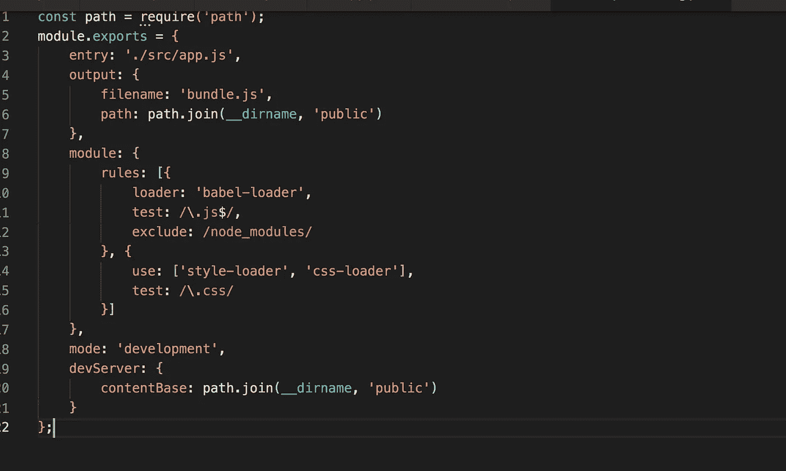

在`src`文件夹中新建一个 CSS 文件夹，并在其中添加文件`styles.css`，内容如下

```
* {
 box-sizing: border-box;
}body {
 font-family: "Lato", "Helvetica", Helvetica, sans-serif;
 background: #aa9a96;
 color: #fff;
 letter-spacing: 1px;
 font-weight: 100;
}.main-section {
 width: 60%;
 margin: auto;
}.header {
 color: #f7df1e;
 text-align: center;
}.user-list {
 width: 80%;
 margin: auto;
}.random-user {
 width: 100%;
 line-height: 1.5;
 color: #000;
 box-sizing: inherit;
 position: relative;
 background: #fff;
 box-shadow: 0 1px 2px 0 rgba(34,36,38,.15);
 margin: 10px;
 padding: 15px;
 border-radius: 10px;
 border: 1px solid rgba(34,36,38,.15);
}.user-image {
 float: left;
 margin-right: 20px;
}.user-image img {
 width: 100%;
 height: 100%;
 border-radius: 50%;
}@media screen and (max-width: 768px) {
 body {
  font-size: 14px;
 } .main-section {
  width: 90%;
 } .user-image {
  width: 100%;
  text-align: center;
 } .user-image img {
  width: 150px;
  height: auto;
 }.random-user {
  text-align: left;
  word-break: break-word;
  padding: 10px;
 }
}
```

在`src/app.js`里面添加导入的 CSS 文件为

```
import './css/styles.css';
```

现在我们将在组件文件中使用这些类

1.  将 header 类添加到`Header.js`的 h1 标签中

```
 <h1 className="header">Random Users Application</h1>;
```

2.将类`random-user`和`user-image`添加到`User.js`中，这样代码看起来会像这样

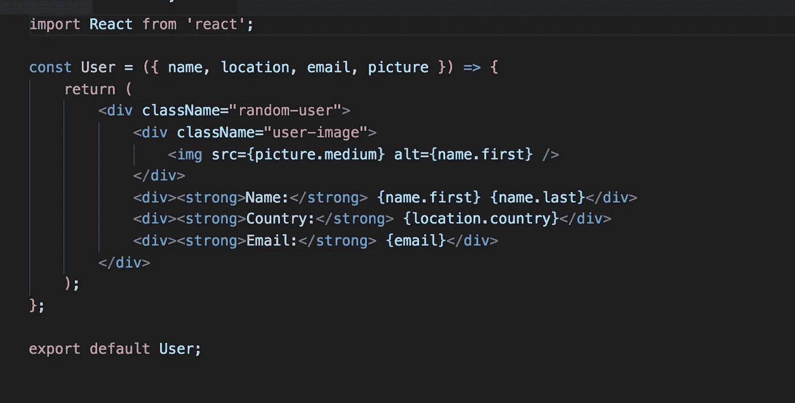

3.将类`user-list`添加到`UsersList.js`内的主 div 中，如下所示

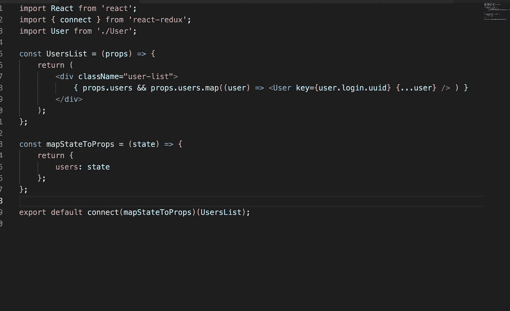

现在，在`src/App.js`文件中呈现`UsersList`组件

```
import React from 'react';
import ReactDOM from 'react-dom';
import axios from 'axios';
import store from './store/store';
import { addUsers } from './actions/users';
import { Provider } from 'react-redux';
import Header from './components/Header';
import UsersList from './components/UsersList';
import './css/styles.css';

class App extends React.Component {
    componentDidMount() {
        axios.get('/users')
            .then(response => {
                console.log(response.data);
                store.dispatch(addUsers(response.data.results));
            })
    }
    render() {
        return (
            <div className="main-section">
                <Header />
                **<UsersList />**
            </div>
        )
    }
}

ReactDOM.render(
    <Provider store={store}>
        <App />
    </Provider>,
document.getElementById('root'));
```

现在使用以下命令重新启动应用程序

```
npm run start
```

最终的应用程序现在看起来会好得多


现在，我们将看看如何移除`cors`的使用，并移除运行两个独立命令的需要

```
npm run start // to run react applicationnpm run start-server // to start nodejs server
```

打开`server/index.js`并删除`cors`的导入及其使用，并为`path`添加一个导入

```
const path = require('path');
```

此外，在第 2 节中添加以下语句

```
app.use(express.static(path.join(__dirname, '..', 'public')));
```

这里，我们告诉 express 从我们有`index.html`的`public`目录提供所有文件

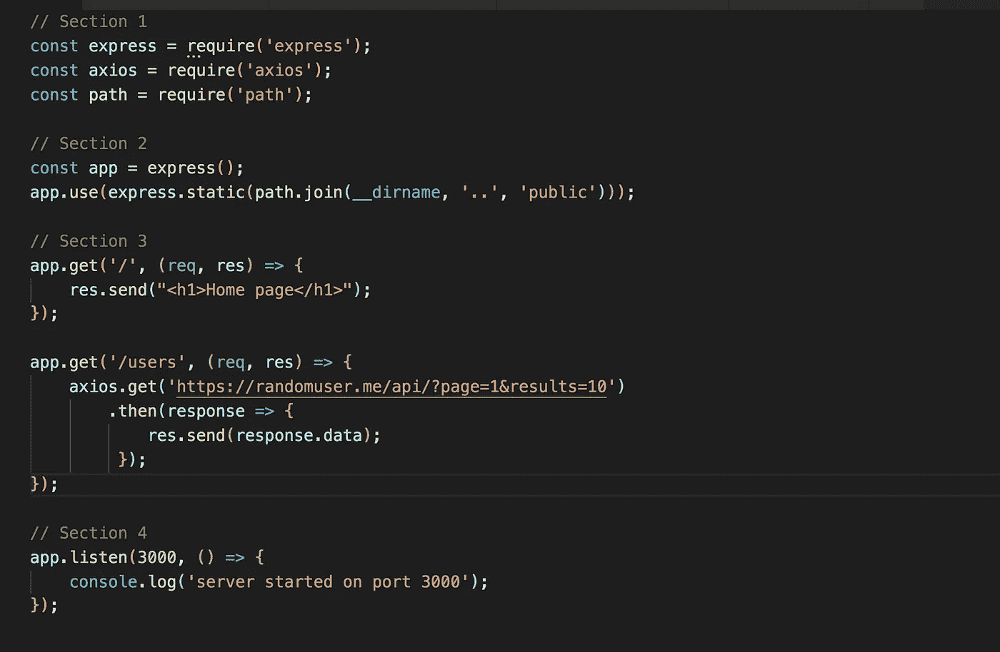

现在打开`src/app.js`并更换

```
axios.get('http://localhost:3000/users')
```

到

```
axios.get('/users')
```

现在执行以下命令

```
npm run build
```

只有当您对 react 代码进行任何更改时，才需要执行该命令。

这将运行`webpack`命令，并在`public`目录中创建一个`bundle.js`。现在，将`bundle.js`脚本包含在`public/index.html`文件中。

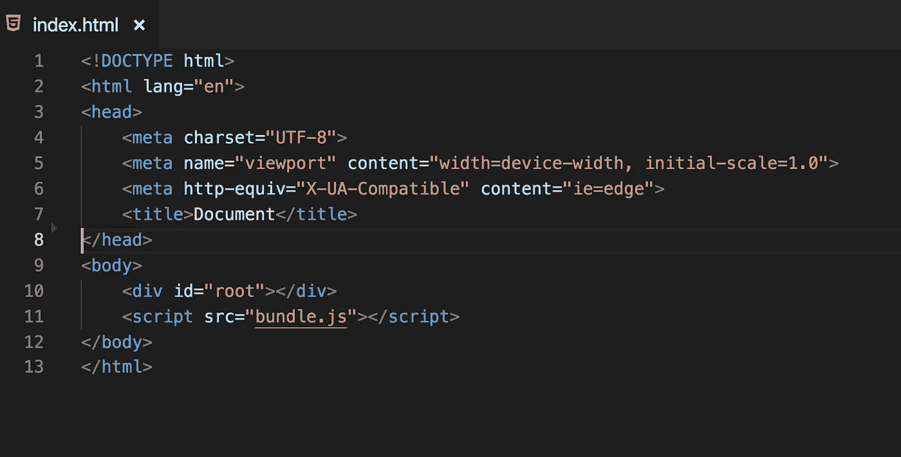

所以现在当我们加载`index.html`时，我们所有的 react 代码也将被加载，这些代码在`bundle.js`中

使用以下命令启动应用程序

```
npm run start-server
```

您无需使用`cors`即可访问我们的应用程序

**完整源代码**:[https://github.com/myogeshchavan97/react_node](https://github.com/myogeshchavan97/react_node)

**这篇文章就讲到这里。希望你今天学到了新东西。**

为了优化这款应用并将其部署到 Heroku，请点击这里查看下一篇文章

[](https://medium.com/javascript-in-plain-english/how-to-optimize-react-app-for-production-and-deploy-it-to-heroku-498fbf222de) [## 如何针对生产优化 React App 并将其部署到 Heroku

### 了解如何让您的 React 应用程序更快

medium.com](https://medium.com/javascript-in-plain-english/how-to-optimize-react-app-for-production-and-deploy-it-to-heroku-498fbf222de) 

**别忘了直接在你的收件箱** [**这里**](https://yogeshchavan.dev) **订阅我的每周时事通讯，里面有惊人的技巧、诀窍和文章。**