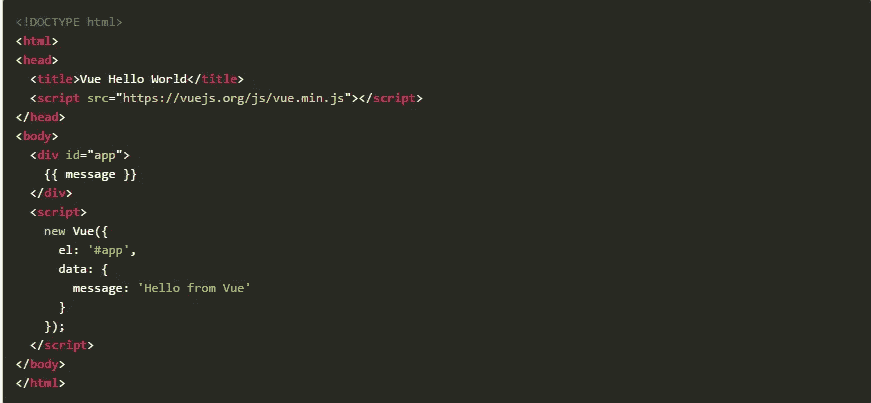
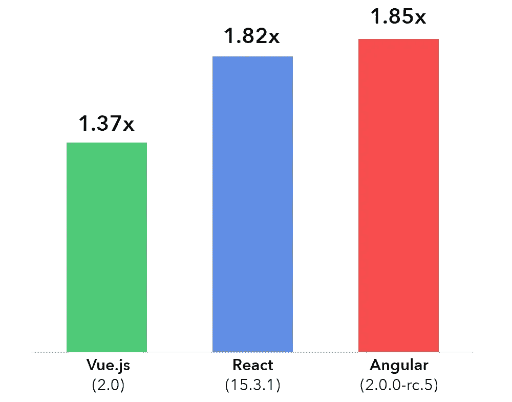
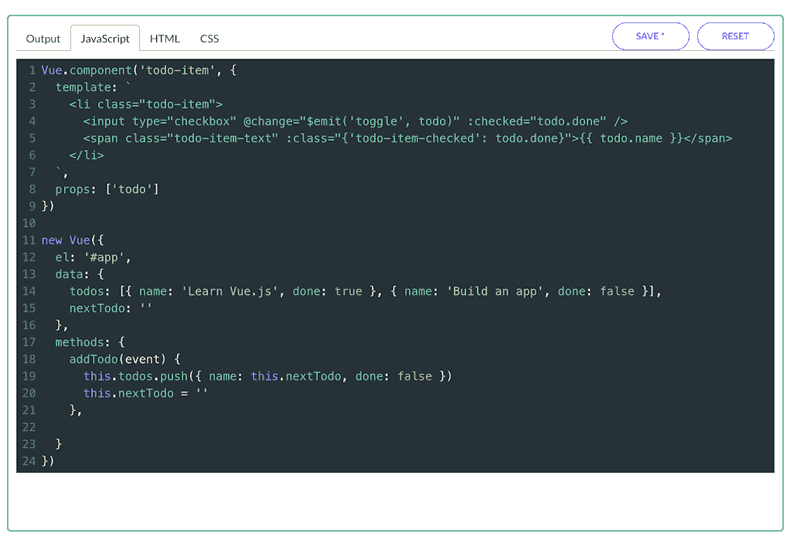
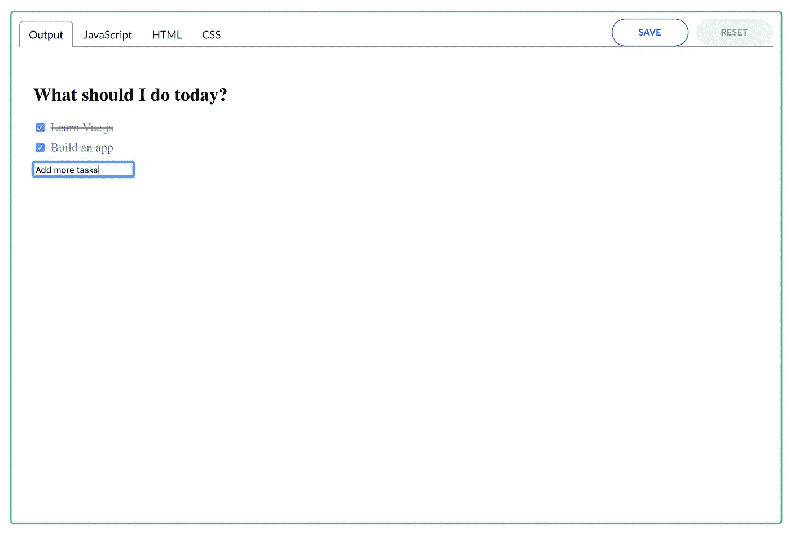
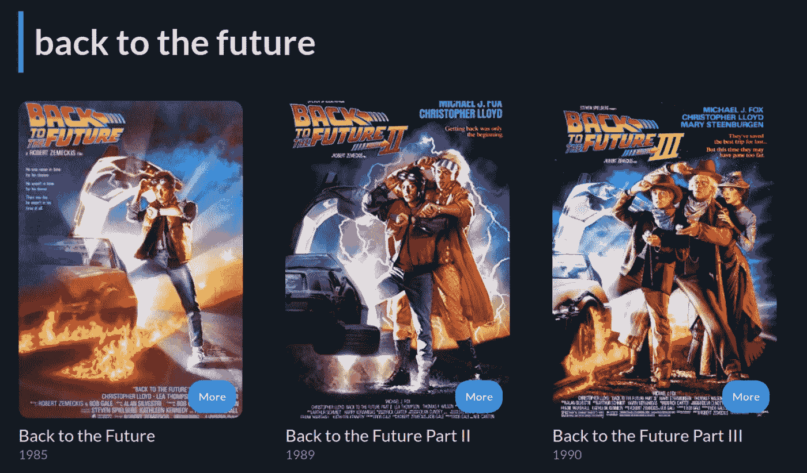

# 使用 Vue.js 从头开始构建应用程序

> 原文：<https://javascript.plainenglish.io/build-an-app-from-scratch-with-vue-js-a9d57317d4cb?source=collection_archive---------4----------------------->

## 为什么使用 Vue 以及如何开始使用它来免费构建您的第一个应用程序

*原载于* [*Educative.io*](https://www.educative.io)

很难跟上所有新的 JavaScript 库和框架。反应，角，烬，奥雷利亚，微光…你从哪里开始？

理想情况下，JavaScript 开发人员会想把它们都学会。但是每种选择都有自己的先决条件，以便立即投入使用。有些框架适合特定类型的工作。我们的时间很宝贵！

*跳过阅读和* [*使用此* ***免费*** *课程*](https://www.educative.io/courses/learn-vuejs-from-scratch) *使用 Vue.js 构建电影搜索 app。这将是你投资组合的一个很好的补充。*

有什么选择是不需要很快的学习曲线，并且可以在几个小时内学会的？

# 输入… Vue.js

Vue 是谷歌创意实验室前工程师尤雨溪的创意。Evan 的工作需要大量的 UI 原型，他很快意识到需要一个具有双向数据绑定的框架(在 Angular 中可以看到)——但是要有一个更易接近的 API 和接口。

2016 年 2 月，在他的 Patreon 活动在开发者社区获得大量关注后，Evan 开始全职从事 Vue 的工作。Vue 团队已经发展到 25 人，贡献者社区也在不断扩大。

Vue 没有得到任何像谷歌或脸书这样的主要科技公司的支持或资金支持(不像 React 和 Angular)。如果用 Github 星级来衡量的话，Vue.js 以 128，158 颗星的人气高居榜首。

Vue 正迅速成为入门级开发人员、小型团队以及那些预算紧张或时间紧迫的人员的首选。Vue 目前在中国非常受欢迎，正在走向西方。全部或部分使用 Vue 的公司包括阿里巴巴、Behance、Grammarly 和 Adobe。

Vue 持续火爆的背后是什么？

# Vue 对于初学者和初级开发人员来说是一个很好的框架

React 是目前世界上使用最广泛的 JavaScript 框架，但是它的学习曲线很陡。尽管 React 享有巨大的开发者社区、支持和库，但入场费(你的时间)很高。

但是对于我们这些刚进入 web 开发世界的人来说，或者受到小团队或低预算的限制，谁有那个时间呢？

**Vue 是为初学者量身定做的**。看过 HTML、CSS 和 JavaScript 的人会对指南、属性名和设置过程非常熟悉。模板是用 HTML 编写的，这意味着你不需要知道任何其他编程语言来阅读它们。

Vue.js 是进步的。使用 Vue 时，您不需要一头扎进去，您可以增量地采用它。核心库只关注视图层，这使得它很容易与现有的库和项目集成。另外，Vue API 非常简单，允许非常快速的开发。

Vue 是 React 和 Angular 之间的一个很好的妥协——它有一个**虚拟 DOM**(React 的一个流行特性)，但提供了**自定义指令**和**双向数据绑定**，就像 Angular 一样。

虽然 React 这样的库需要了解 JSX、ES2016 或更具体形式的 JavaScript，但 Vue 只是使用了**纯 JavaScript** 。你可以编写一个应用程序，在很短的时间内直接从你的浏览器上运行它。Vue 允许 JSX(实际上是学习 React 的一个要求)，所以 React 老手可以很容易地跳到 Vue。

Vue 使用易于理解和记忆的声明性语法来创建和处理事件。与 React 基于组件的视图引擎相反，Vue 是作为 HTML 的附加标记实现的——基本上是绑定到数据模型的模板模型。

# Vue 是轻量级和快速的

所有 web 开发人员都在有限的网络带宽下工作。在当今的移动浏览世界中，所有的网页都需要小而快。

事实证明，最新版本的 Vue (2.0)比最新版本的 React 和 Angular 占用的内存更少，运行速度更快。

通过更快的渲染管道，Vue 允许您构建更复杂的 web 应用程序。与其花宝贵的时间优化代码，不如花更多的时间开发用户想要的特性和功能。

# 文档很容易理解

很多文档很糟糕——部分是因为开发人员讨厌这样做，部分是因为许多开发人员离产品太近，无法客观地描述产品。

令人欣慰的是，Vue 拥有易于理解的文档，并以多个用例为特色。Vue 团队一直在以一种易于理解的方式编写技术概念方面做得非常好。

# 现在就开始用 Vue 构建一个应用吧。

这个**免费**互动课程[从头开始学习 Vue.js:构建&测试电影应用](https://www.educative.io/courses/learn-vuejs-from-scratch)，是 Vue 的完美入门。该课程由 Thomas Lombart 创建，他是一名经验丰富的软件开发人员，擅长创建以用户为中心的应用程序。

在开始的课程中，您将使用基础知识(数据绑定、指令、组件)来构建一个小型的待办事项列表应用程序。从这里开始，将你在 HTML 和 JavaScript 方面的技能应用到 Vue.js，并学习构建一个出色的电影搜索应用程序。

您将学习使用 VueCli，这是一个漂亮的 Vue 工具，可以帮助您使用 GUI 管理 Vue 项目。您将在构建您的应用程序时探索单元测试的过程——许多开发人员并不特别喜欢这一过程，但本课程使它变得超级简单和易于理解。你也可以看看这篇关于[如何在 Jest](https://blog.educative.io/vue-js-component-jest/) 中编写你的第一个 Vue.js 组件单元测试的文章——测试 JavaScript 框架最流行的框架之一。

在课程结束时，您将拥有一个完全用 Vue 构建并连接到 OMDb API 的电影搜索应用程序。

This will scroll, and you can add more movies.

顺便说一下，这个电影搜索应用程序是你投资组合的完美补充。学生和初学者程序员，如果你想要一份好工作，作品集是必须的！我们建议定制应用程序，添加新功能，并完全使其成为您自己的。

在本课程结束时，您将了解 Vue.js 对于初学者、对于缺少时间或资金的小型开发团队来说是一个多么优秀的解决方案。

[从头开始学习 Vue.js:构建&今天在 Educative 上测试一款电影应用](https://www.educative.io/courses/learn-vuejs-from-scratch)。掌握当今流行的 JavaScript 框架之一，组装您的第一个应用程序，并立即将您的技能投入工作！