# 用简单的步骤构建一个自动完成的 Web 组件

> 原文：<https://javascript.plainenglish.io/build-an-autocomplete-web-component-in-simple-steps-c4956dd097cd?source=collection_archive---------2----------------------->

## 对任何 css 框架都有效

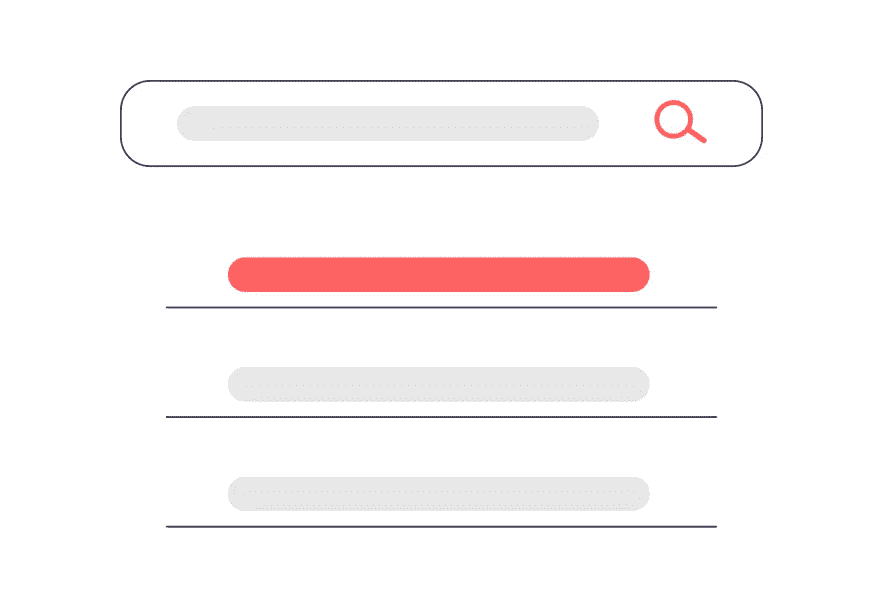

Illustration from [https://undraw.co/](https://undraw.co/)

这篇小文章将向您展示如何构建一个简单的 autocomplete 组件，它使用一组元素值[{}，{}，..].您可以轻松地将其与任何 css 框架(如 bootstrap 4)集成，并且可以修改它以满足您的需求。

我们将使用 [LitElement](https://lit-element.polymer-project.org/) 来构建 Web 组件。LitElement 是*遵循* [*Web 组件标准*](https://developer.mozilla.org/en-US/docs/Web/Web_Components) *规范的简单实现。*

首先，什么是自动完成元素？自动完成或单词完成是一种软件功能，它可以完成单词或字符串，而无需完整键入它们。在我们的例子中，我们将构建一个 Web 组件，它将根据我们传递给它的数组自动完成我们输入的内容。

澄清了这一点，我们开始吧。

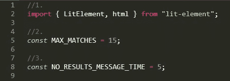

1.导入 LitElement 基类和 html helper 函数。

2.与输入的文本相匹配的建议的最大显示数量。

3.当对引入的文本没有建议时，将显示消息“没有结果”的时间。

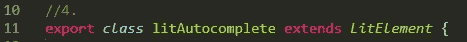

4.为您的元素创建一个扩展 LitElement
基类的类。

5.使用静态属性字段或装饰器声明元素的属性。我们在此定义的任何属性的变化都会导致受影响部分的新渲染。它们还用于将属性从父元素传递给子元素，在我们的例子中，就是我们的 autocomplete 组件。

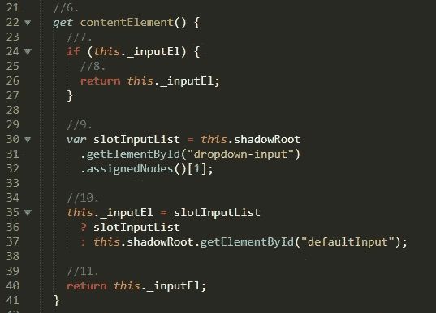

6.inputEl 元素 getter。

7.检查*输入*元素是否存在。

8.如果存在就返回。

9.否则，使用 HTML *dropdonw-input* 元素创建变量 *slotInputList* 。

10.如果 slotInputList 变量具有下拉输入内容，则用该内容创建 *inputEl* 变量，否则获取 *defaultInput* HTML 元素，并对其赋值。

11.返回输入变量。

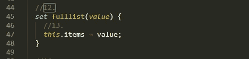

12.当我们调用组件时，我们将属性“ *fulllist* ”中的元素列表的内容传递给它属性和特性的区别在于属性是用 DOM 表示的，而特性不是。

13.当这种情况发生时，我们把它分配给可变项。

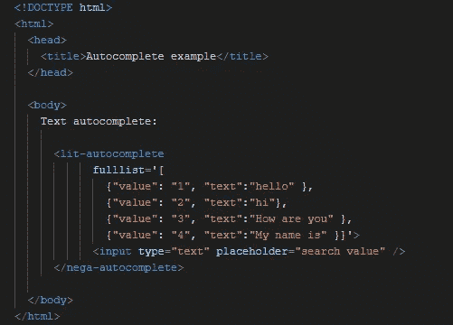

index.html file

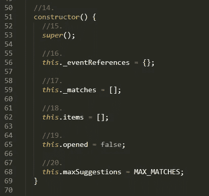

14.litElement 构造函数，这里我们初始化我们的变量。

15.调用 LitElement 类的 super 方法。

16.保留对断开连接的绑定事件处理程序的引用

17.与我们要搜索的内容相对应的匹配列表。

18.包含所有项目的列表:
[ {"value": "1 "，" text":"hello" }，
{"value": "2 "，" text":"hi"}，
{"value": "3 "，" text ":"你好" }，
{"value": "4 "，" text ":"我叫" }]

19.匹配列表已打开？

20.我们将显示的与我们输入的文本相对应的项目数。所有物品的清单

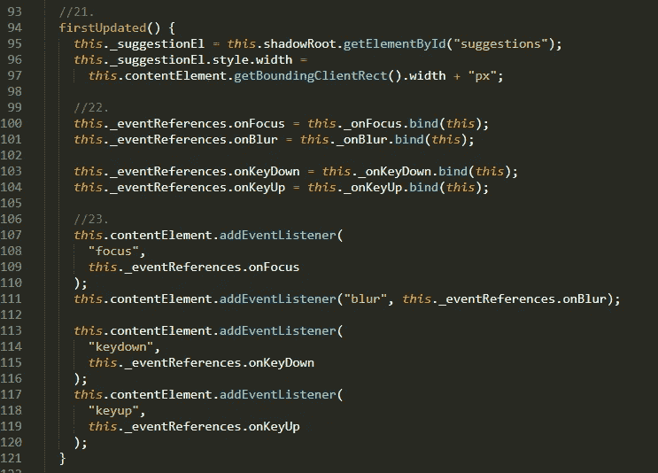

21.在元素的 DOM 第一次更新之后，在调用“ *updated* ”方法之前调用。

22.将键盘事件绑定到我们的事件引用对象。在这个对象中，我们将保存 autocomplete 组件的所有键盘事件。

23.为以前的事件添加侦听器。

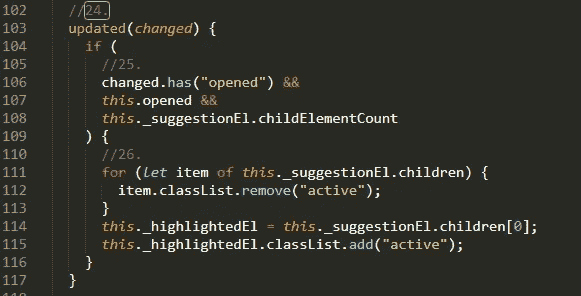

24.当元素的 DOM 已经更新和呈现时调用。
我们实现它是为了在更新后执行一些任务。

25.如果我们有一个建议列表，那么我们将执行步骤 26。

26.当显示建议列表时，如果有建议，我们添加“*活动的*类来突出显示建议列表中的第一个元素。之前，我们移除了先前迭代的任何其他"*活动的*"类。

27.当从文档的 DOM 中删除一个组件时，调用 *disconnectedCallback* 方法。

28.没有要删除的事件。

29.删除事件侦听器。

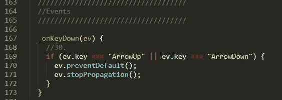

30.告诉用户代理，如果事件没有得到显式处理，它的默认操作就不应该像通常那样被执行。在这种情况下，阻止 up 和 down 正常工作。事件接口的 *stopPropagation* ()方法防止在捕获和冒泡阶段进一步传播当前事件。

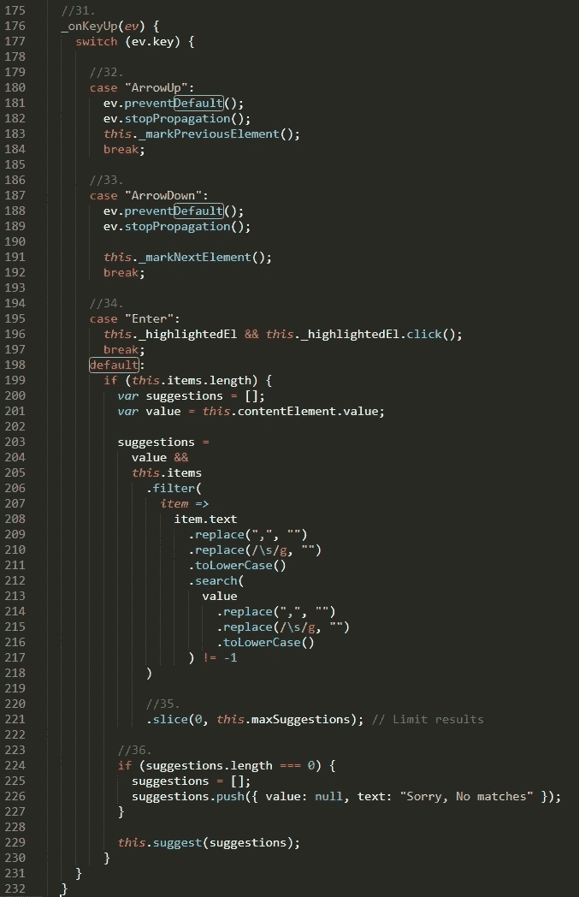

31.当按下一个键时调用。

32.突出显示建议列表的前一个元素。

33.突出显示建议列表中的以下元素。

34.当按下的键是“*时，输入*键。在任何其他情况下(默认情况)，如果我们已经向组件传递了一个元素列表，那么我们将使用 ES6 过滤方法在该列表中查找字符串类型。在这里，您可以改进这个搜索功能，以某种方式查找字符串。

35.限制建议结果列表。

36.如果找不到匹配项，则显示一条指示不匹配的内嵌消息。

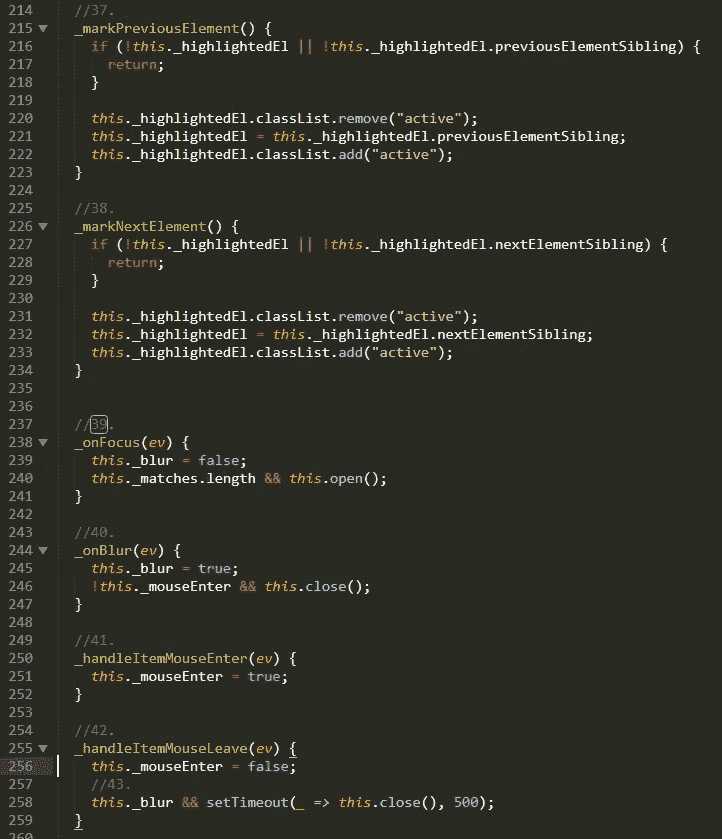

37.突出显示列表中的前一个元素，添加“*活动的*类。

38.突出显示列表中的下一个元素。

39.当 *onFocus* 事件被触发时，该方法被调用。在这种情况下，如果我们有建议，我们打开建议列表。

40.当 *onBlur* 事件被触发时，这个方法被调用。在这种情况下，我们关闭建议列表。

41.处理鼠标*焦点*事件。

42–43.如果*_ handleitemcmouseleave*被调用，那么我们在等待 500 毫秒后关闭建议列表

44.显示建议列表。

45.隐藏建议列表。

46.建议自动完成项目。

47.该方法在选择一个项目时关闭建议列表，并将“ *selected-autocomplete* ”事件传播给订阅的任何人。

48.我们将通知订阅值-文本已被选中。

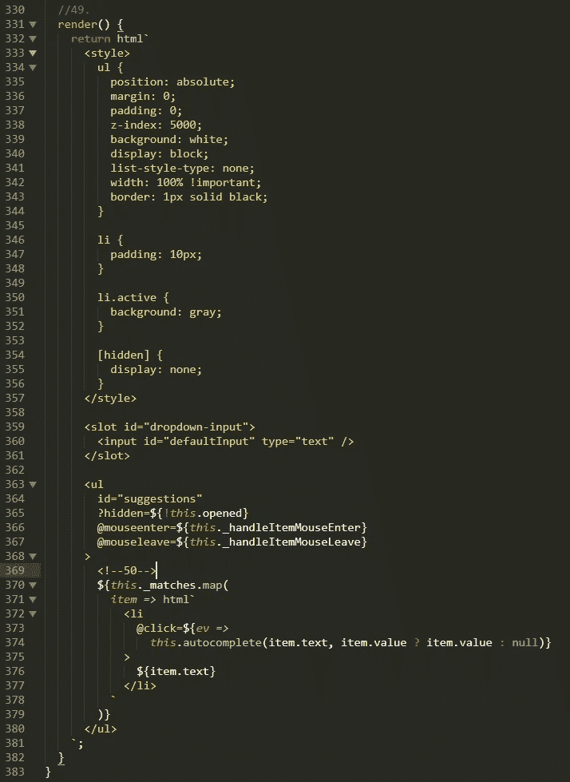

49.使用 lit-html 呈现元素模板。我们必须为任何扩展 LitElement 基类的组件实现 render 方法。这是我们将要在页面上绘制的 html 代码。我们可以定义组件的样式。

50.我们显示匹配列表，并将 autocomplete 方法设置为 click 操作。

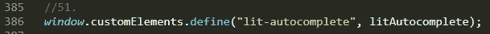

51.web 文档上定制元素的控制器是 *CustomElementRegistry* 对象。这个对象允许我们在页面上注册一个定制元素，即 lit-autocomplete 组件。

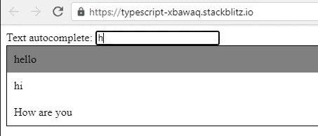

在这个屏幕截图中，我们可以看到我们的自动完成是如何工作的。当我们写字母“ *h，*”时，我们显示出与字母“ *h.* ”的所有巧合

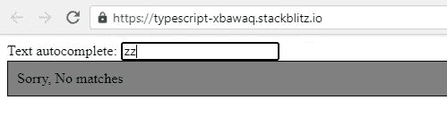

如果未找到匹配，则显示消息“*无匹配*”。

# 结论

这篇文章展示了如何创建一个自动完成组件。现在，您可以在项目中任意多次重用该组件。因为它只是一个基础版本，所以请随意复制和改进它。

我们创建的组件的[演示和代码](https://stackblitz.com/edit/typescript-xbawaq?file=autocomplete.js)。

如果你喜欢这篇文章，考虑通过我的[个人资料](https://kesk.medium.com/membership)订阅 Medium。谢谢大家！