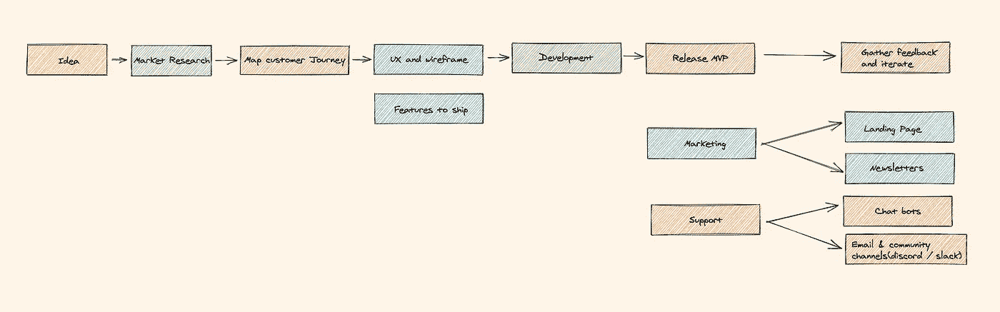
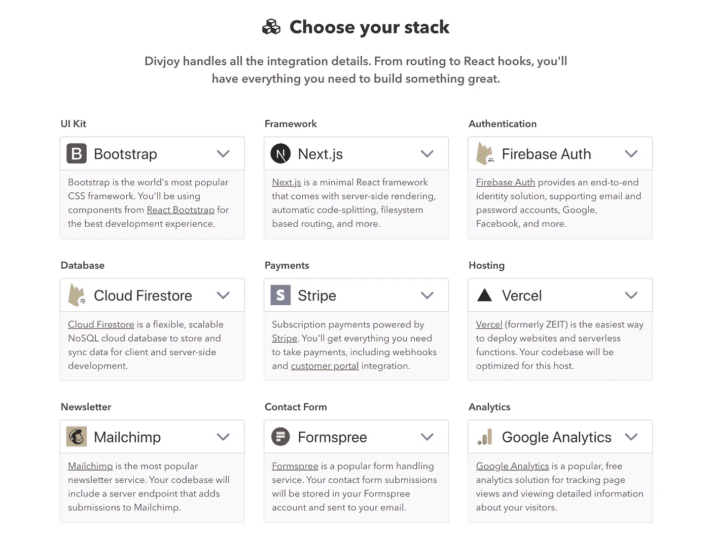
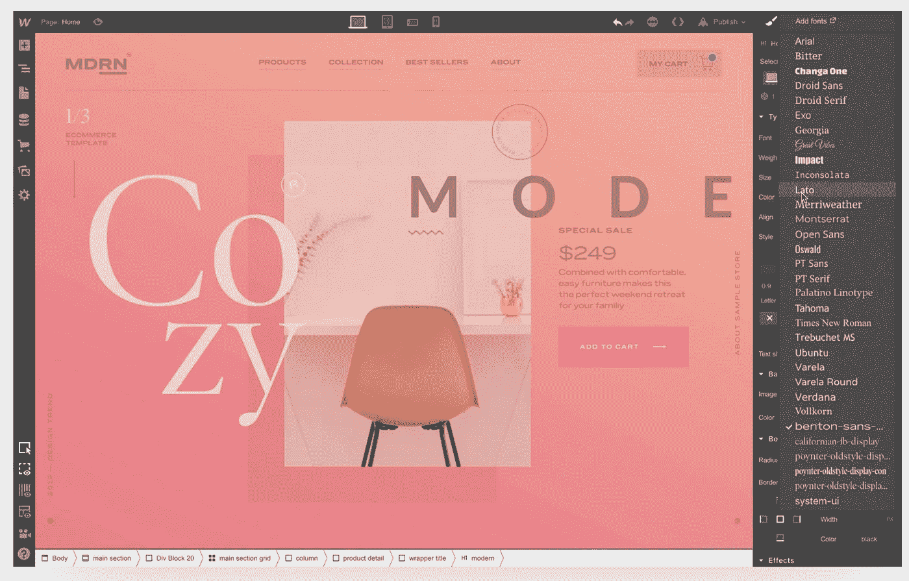
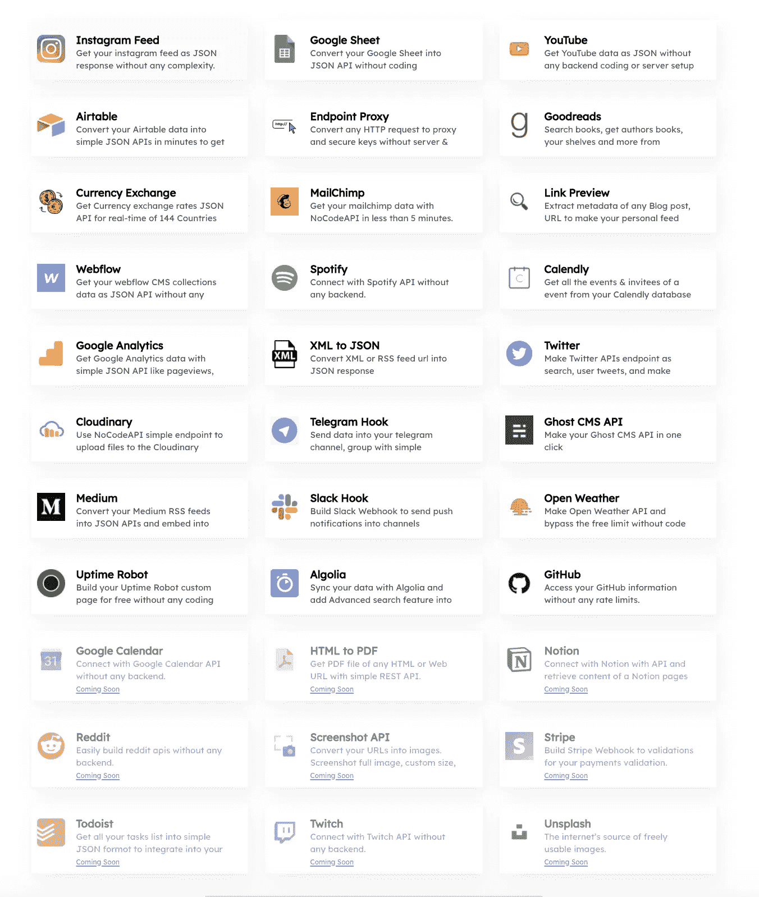
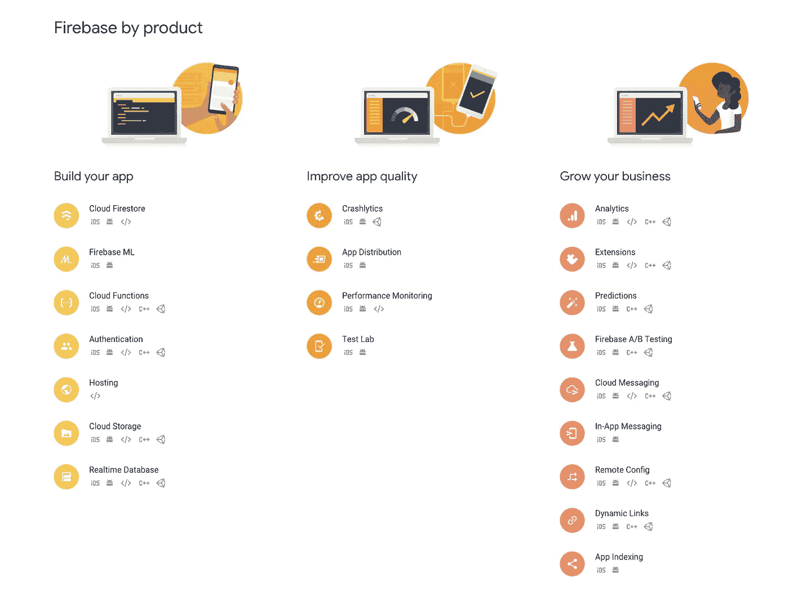
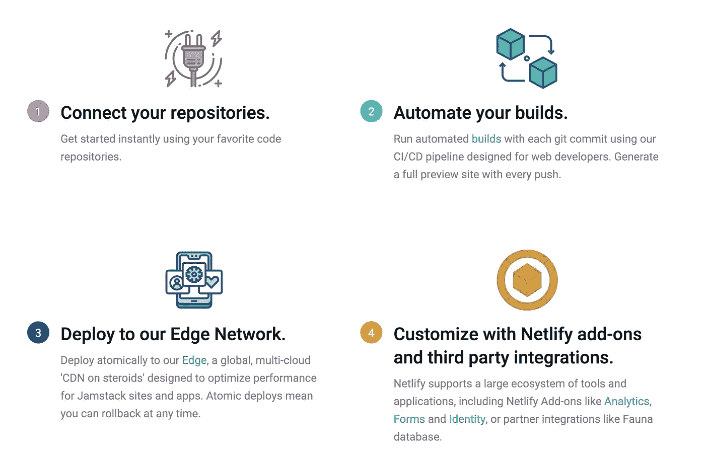
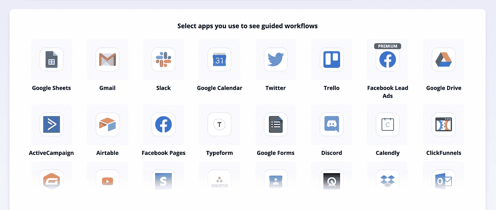
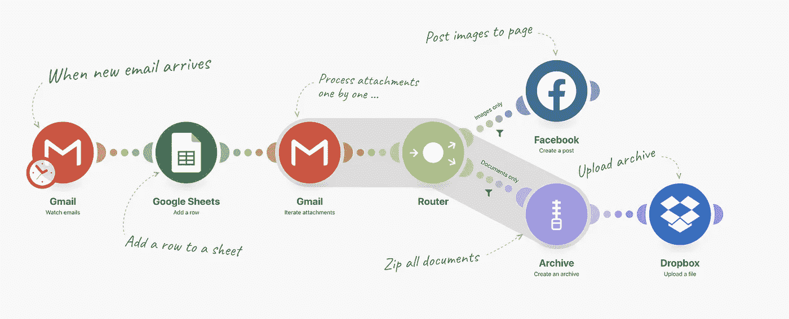

# 通过选择正确的技术组合，在一周内构建一个 MVP

> 原文：<https://javascript.plainenglish.io/build-an-mvp-in-a-week-by-picking-the-right-technology-stack-aec0443aeab5?source=collection_archive---------6----------------------->

## 少花钱💰，出货更快🚀

平均一个人每天有超过 50，000 个想法，你有没有想到一个你认为有潜力产生收入的想法？你总是有第二个想法，我希望这能在几天内完成，这样我就可以在 [Producthunt](https://www.producthunt.com/) 上发布它，并快速评估它，而不是在这上面浪费大量的精力和金钱。

Image from [undraw](http://undraw.co)

本文将揭示如何选择正确的 MVP 堆栈，以便利用所有可能的低代码/无代码工具快速进入市场。
让我们来看看为了发布 MVP，创意需要经历的可能的生命周期。

Idea lifecycle to MVP

# 什么是 MVP(最小可行产品)？

MVP 是你的产品的基本版本，它只有帮助解决现实世界问题的必要特性，而不是运行在一个应用程序应有的所有特性之后。
该产品随后会根据客户反馈进行改进，并在年变得更加成熟。

# MVP 有什么用途？

*   预算是一个关键因素，每当我们计划建立一些应用程序，你不知道你的想法是否真的会工作
*   缩短上市时间
*   用很少的预算快速测试你的想法
*   如果事情出了差错，你能够及早发现它们，而不是构建完整的产品然后评估它。

对于上面的生命周期图，花费的主要时间浪费在构建东西上。让我们来看看如何通过选择正确的 MVP 堆栈来降低成本。🏆

# 前端工具

开发人员使用不同分辨率检查响应行为，添加自定义 CSS 使其响应，从头开始一个新项目的日子已经一去不复返了。那么你可以使用什么非代码工具呢？

除了选择帮助你完成工作的 UI 工具包库，比如
- [语义 UI](https://semantic-ui.com/)
- [脉轮 UI](https://chakra-ui.com/)
- [材质 UI](https://material-ui.com/)
- [引导](https://getbootstrap.com/)
之外，你还可以通过下面提到的一些工具升级你的游戏。

## [Divjoy](https://divjoy.com)

这是一个 React 代码库生成器，它将帮助您使用拖放功能在几分钟内设置好所有布局样板文件。哦，我有没有提到你也可以选择你喜欢的堆栈？

Image from [Divjoy](http://divjoy.com)

这将处理所有的样板代码，从前端到后端，营销，分析，支付集成，等等。

## [**ui bakery**](https://uibakery.io/)

在几分钟内以可视化方式创建成熟的应用程序。无需编码，只需从商店中拖放您想要的东西，就大功告成了。你还期望什么？

Image from [UIBakery](https://uibakery.io/)

## [Webflow](http://webflow.com)

使用 webflow 构建您的登录页面网站将比以往任何时候都更快，无需代码，并且使用此工具可以做更多事情。这是 WordPress 的超级高级版本，可以节省你的时间。

Image from [webflow](http://webflow.com)

## 奖金💰

现在我们有了很多登陆页面和网站的选择，是时候为网站添加一些插图了。

Image from [unDraw](http://undraw.co)

 [## unDraw -任何想法的开源插图

### 创建更好的设计网站，产品和应用程序。浏览查找…

undraw.co](https://undraw.co/)  [## 腮红:每个人的插图

### 腮红可以很容易地在你的设计中添加免费的插图。玩艺术家制作的完全可定制的图形…

腮红.设计](https://blush.design/) 

# 后端工具

随着大量工具进入市场，不再需要使用像 MySQL 这样的数据库，因为它需要花费大量时间来设置、创建表格和部署。相反，有一些其他的工具，你可以用来作为后端，摆脱设置。

## [气动工作台](https://airtable.com/)

Airtable 混合了数据库和电子表格，提供了更好的组织数据的方法。在一个 airtable 库中，您可以有多个表，保持一种有点类似于数据库的关系。

它提供了现成的 REST API，可以用来创建、读取、更新和删除记录，而无需编写任何代码。

Image from A[irtable](http://airtable.com)

**功能:**

*   设置后端不需要代码
*   如果需要，可以轻松地手动更新值
*   免费计划足以满足基本需求
*   节省时间，专注于最重要的事情

## [无代码 API](http://nocodeapi.com)

如果您在 MVP 中的使用案例是现成的应用集成，即第三方应用集成，您可以使用此工具。

Image from [NocodeAPI](http://nocodeapi.com)

**功能:**

*   无需一行代码即可轻松设置 REST API
*   一种在访问数据时保护令牌的机制
*   无服务器，不用担心托管
*   轻松将第三方 API 与您的项目连接起来

## [燃烧基地](https://firebase.google.com/)

它提供了从身份验证、托管、云功能等多方面的一体化解决方案，是一种支持数据库上实时事件的后端一体化解决方案。它的大部分服务都是免费的，并且在你的 MVP 预算之内。

Image from [firebase](http://firebase.com)

**功能:**

*   实时数据库
*   电子邮件、Github、脸书和谷歌认证。
*   托管服务
*   云功能，无需为您的后端设置服务器
*   文件存储器

# 托管平台

市场上有很多托管服务，但其中一些非常出色。每个人都希望自动部署到生产环境中，以避免部署过程中的任何人为错误。

## [Netlify](http://netlify.com)

这是一个非常著名的托管服务，它可以帮助您编写代码库，并在没有您参与的情况下提取您的源代码来为您生成构建过程。

Image from [Netlify](http://netlify.com)

**特色:**

*   可定制的 CI/CD 工作流
*   购买您的域名
*   从一个存储库中部署多个站点
*   加快您的开发流程
*   自动预览您的公关或分支机构
*   内置分析

# 工作流自动化工具

在您的应用中处理不同的事件时，有时您需要将事件推送到其他应用/服务，以便您知道应用部署后发生了什么。无论是发送一封电子邮件，slack post，还是任何其他事件，编写自定义代码都会消耗大量时间，使用下面提到的一些工具将帮助您在几分钟内实现应用程序集成。

## [扎皮尔](http://zapier.com)

Zapier 是一款自动化应用程序，可帮助您将数以千计的应用程序连接到业务工作流程中，从而简化您的工作。它有助于为应用程序中发生的任何事件设置自定义触发器，并传输数据以将应用程序集成到 zapier 内部，这被称为 Zap。

这是一个完全无代码的平台，可以帮助您将您的应用程序与许多其他第三方应用程序连接起来，从而节省时间并帮助您更加专注于您的业务。

Image from [zapier](http://zapier.com)

## [积分仪](https://www.integromat.com/)

所有手动处理的日常流程都可以通过 Integromat 实现自动化。与 Zapier 类似，这些工具也支持大量的应用程序和服务，帮助您节省时间。

Image from [Integromat](https://www.integromat.com/)

这些是你可以考虑用来节省时间的一些工具。我希望这篇文章能帮助你建立一个快速原型。快乐学习！💻 😀

# 如果你喜欢读这篇文章，你可能也会喜欢我的其他作品:

*   [🏆2020 年提升 React 应用性能的 10 个技巧和诀窍](https://medium.com/better-programming/10-tips-and-tricks-to-boost-your-react-apps-performance-in-2020-9388159f6ebf)
*   [用 React 挂钩替换生命周期方法](https://medium.com/javascript-in-plain-english/lifecycle-methods-substitute-with-react-hooks-b173073052a)
*   [提升 JavaScript 和反应技能的技巧](https://medium.com/better-programming/tips-to-level-up-your-javascript-and-react-skills-62bfbbb9b4d)