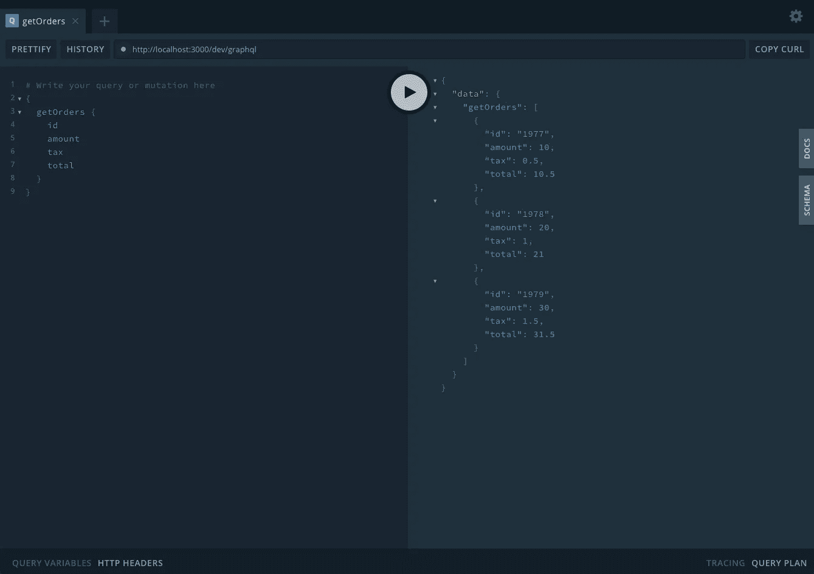
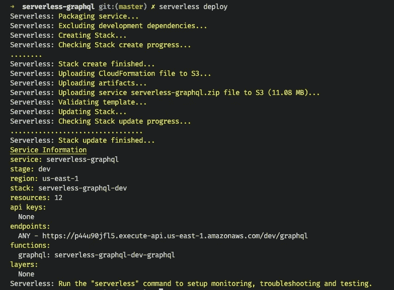
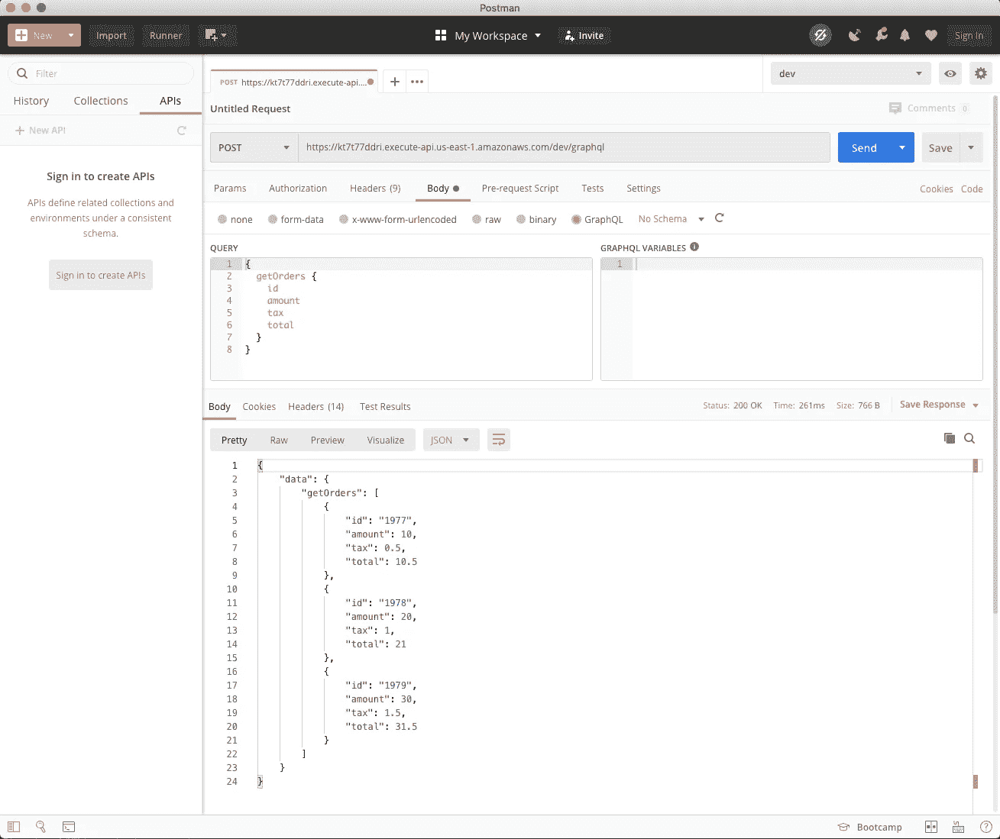

# 使用无服务器为 AWS 构建和部署一个 GraphQL API

> 原文：<https://javascript.plainenglish.io/build-and-deploy-a-graphql-api-to-aws-with-serverless-635c1345d432?source=collection_archive---------8----------------------->

## 如何在几分钟内构建一个 GraphQL API 并将其部署到 AWS 上


Photo by [Daniel Abadia](https://unsplash.com/@pixeldan?utm_source=medium&utm_medium=referral) on [Unsplash](https://unsplash.com?utm_source=medium&utm_medium=referral)

# 介绍

功能即服务(FaaS)在过去几年变得非常流行，因为它很简单。只需几行代码，我们就可以启动并运行应用程序，而不必担心基础设施。此外，您只需为消耗的资源付费，这样可以降低成本。这使得 FaaS 成为您可能只需要定期运行一小段时间的任何功能的完美候选。例如，我们公司每天早上都用它来生成销售报告。

在本文中，我将向您展示如何使用[无服务器](https://serverless.com/)快速构建 GraphQL API 并部署到 AWS。

您可以在这里找到本教程的代码:

[](https://github.com/kluu1/serverless-orders-api) [## kluu1/无服务器-订单-api

### 如何在几分钟内使用无服务器构建和部署 graph QL API—kluu1/无服务器订单 API

github.com](https://github.com/kluu1/serverless-orders-api) 

# 先决条件

*   有权访问 IAM 和 Lambda 的 AWS 帐户
*   [安装在您机器上的无服务器](https://serverless.com/framework/docs/getting-started/)
*   [Node.js](https://nodejs.org/) v8.x 或更高版本
*   git v 2 . 14 . 1 或更高版本

# 创建 GraphQL 服务器

我们将从使用 [Apollo GraphQL](https://www.apollographql.com/) 创建 GraphQL 服务器开始。让我们创建一个新的项目目录并安装一些包。

```
mkdir serverless-orders-api && cd serverless-orders-api
git init
npm init -y
npm install apollo-server-lambda
npm install -D serverless-offline
```

我们正在安装`serverless-offline`作为开发依赖，以帮助我们在本地开发和测试我们的应用程序。

## 设置 GraphQL 处理程序

在您喜欢的源代码编辑器中打开项目，并修改`handler.js`文件，使其看起来像下面的代码。我们将解析器和模式导入到这个文件中，以创建一个新的 Apollo 服务器。然后我们将其导出为 GraphQL 处理程序。

/handler.js

## 设置模式

模式文件定义了数据的外观和类型。它还公开了我们可用的查询，在本例中只是 *getOrders* 。在项目根目录下名为`graphql`的新文件夹中创建`schema.js`文件。

/graphql/schema.js

## 设置解析器

Resolvers 提供了关于如何处理 GraphQL 查询和返回数据的说明。在`graphql`文件夹中创建`resolvers.js`。

/graphql/resolver.js

这是您通常会调用某个数据库来获取数据的地方。然后你会按摩数据返回它。为了使本教程简单，我们只是返回一些静态数据。

## 安装 severless.yml 文件

修改`serverless.yml`文件，如下所示。注意，我们添加了`serverless-offline`插件，这样我们可以在部署到 AWS 之前在本地测试我们的应用程序。

/serverless.yml

# 本地测试

现在我们已经准备好了所有的部分，让我们在本地测试我们的 GraphQL API 服务器。从终端，在项目根目录下运行以下命令。

```
serverless offline
```

在您的浏览器中访问[http://localhost:3000/dev/graph QL](http://localhost:3000/dev/graphql)并测试我们的查询。



Testing our getOrders query locally

# 部署到 AWS

要部署到 AWS，您需要有一个能够访问 IAM 和 Lambda 的 AWS 帐户。如果您在设置 AWS 凭证方面需要帮助，请参见此[文档](https://serverless.com/framework/docs/providers/aws/guide/credentials/)。

部署到 AWS 就像运行一个命令`serverless deploy`一样简单。在幕后，无服务器框架完成了设置基础设施的所有繁重工作。

```
serverless deploy
```

如果一切顺利，您将看到类似于下图的输出。



Example of a successful deployment

让我们在 Postman 中测试新创建的 AWS 端点。



Testing our deployed application

如果您需要从 AWS 中删除应用程序，只需运行`serverless remove`，无服务器框架将为您删除并清理所有内容。

# 摘要

在本文中，我们介绍了如何使用无服务器设置 GraphQL API。我们讲述了如何在本地开发和测试我们的应用程序。我们还见证了使用无服务器部署到 AWS 是多么容易。如果您想了解更多关于 Severless 及其功能的信息，我强烈推荐您通读他们的文档。

[](https://serverless.com/framework/docs/) [## 无服务器框架文档

### 无服务器框架可以帮助你用更少的开销和成本构建无服务器应用。它提供了强大的…

serverless.com](https://serverless.com/framework/docs/) 

希望你喜欢这篇文章，对你有帮助！干杯！🍻

我在业余时间写这些文章是为了消遣。如果你喜欢这篇文章，请在下面留下你的喜欢和评论！可以关注我上 [*中*](https://medium.com/@this.kevinluu) *和* [*推特*](https://twitter.com/kluu_10) *。感谢支持！*

## **用简单英语写的 JavaScript 的注释:**

我们总是有兴趣帮助推广高质量的内容。如果你有一篇文章想用简单的英语提交给 JavaScript，用你的中级用户名发邮件到[submissions@javascriptinplainenglish.com](mailto:submissions@javascriptinplainenglish.com)给我们，我们会把你添加为作者。